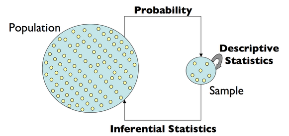
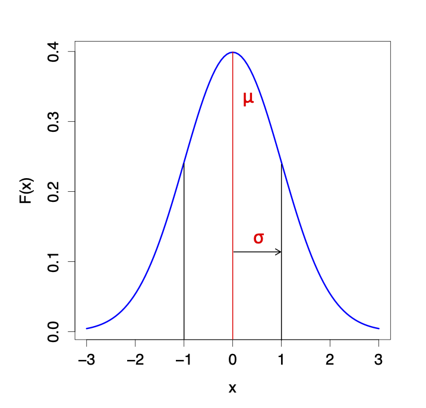
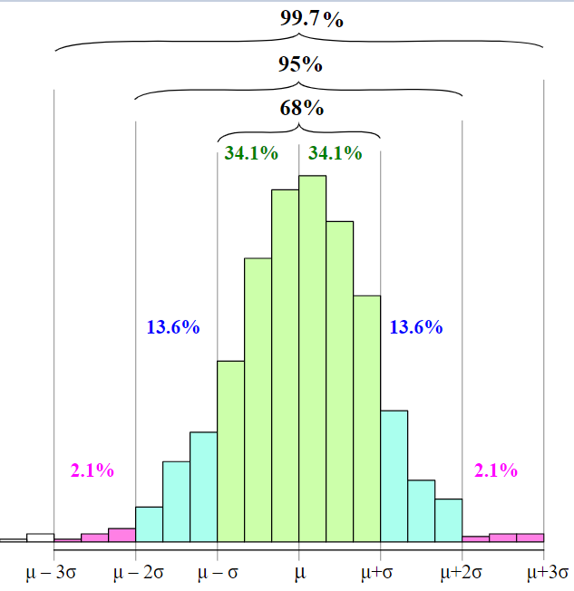
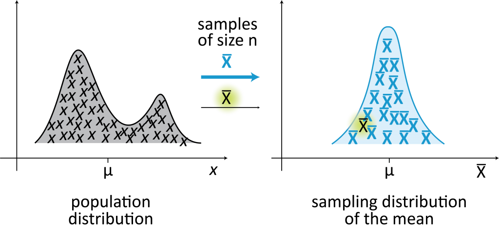
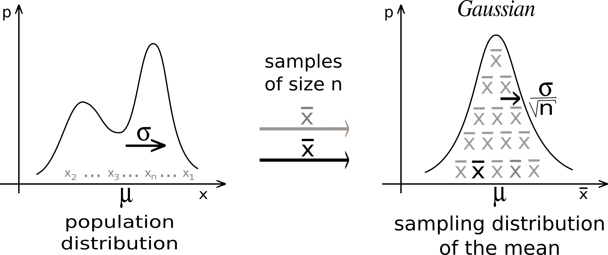
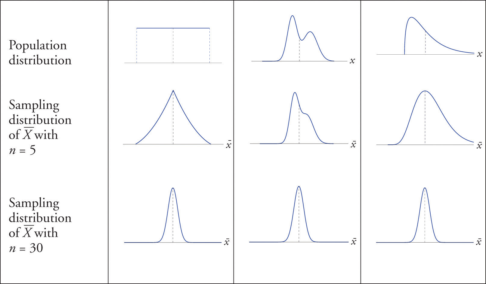

```{r, echo = FALSE}
knitr::opts_chunk$set(tidy = FALSE, tidy.opts=list(width.cutoff=80), fig.retina=3)
ggplot2::theme_set(ggplot2::theme_bw(base_size = 20))
ggplot2::update_geom_defaults("point", list(size = 3))
```

```{r xaringan-themer, include=FALSE, warning=FALSE}
library(xaringanthemer)
style_mono_accent(
  base_color = "#197aa0",
  header_font_google = google_font("Noto Sans"),
  text_font_google   = google_font("Nanum Gothic"),
  code_font_google   = google_font("Inconsolata"),
  base_font_size = "24px", 
  header_h1_font_size = "2rem",
  title_slide_background_image = "https://raw.githubusercontent.com/STAT540-UBC/stat540-ubc.github.io/main/images/stat540-logo-s.png",
  title_slide_background_size = "15%",
  title_slide_background_position = "95% 85%",
  link_color = "rgb(104, 27, 148)",
  link_decoration = "underline",
  extra_css = list(
    ".has-continuation" = list(
      "display" = "block !important"
    )
  )
)
```

```{css, echo = FALSE}
pre {
  white-space: pre-wrap;
}
.remark-code {
  background: #f8f8f8;
}
.remark-inline-code {
  background: "white";
}
.remark-code {
  font-size: 22px;
}
.huge .remark-code { /*Change made here*/
  font-size: 200% !important;
}
.tiny .remark-code { /*Change made here*/
  font-size: 60% !important;
}
.smaller .remark-code { /*Change made here*/
  font-size: 90% !important;
}
.smaller2 .remark-code { /*Change made here*/
  font-size: 80% !important;
}
.smaller3 .remark-code { /*Change made here*/
  font-size: 70% !important;
}
```


<style>
div.blue { background-color:#e8f2f6; border-radius: 5px; padding: 20px;}
</style>

#  Preview of next 6 lectures

* **Lecture 4: Review of Probability and Statistics**

* Lecture 5: Statistical Inference - two group comparisons 

* Lecture 6: Statistical Inference - linear regression and ANOVA

* Lecture 7: Statistical Inference - multiple linear regression 

* Lecture 8: Statistical Inference - continuous regression + limma

* Lecture 9: Statistical Inference - multiple testing

---

#  Outline for today

* Intro: philosophy, goals, and central concepts

* Review: Random Variables, Probability Distributions, Sampling Distribution, Estimation, Inference, CLT, Hypothesis Testing

<div class = "blue">
Learning objectives: 
  <ol>1. be familiar with the terminology</ol>
  <ol>2. have a clear understanding of the concepts</ol>
</div>
---

class: middle
# <center> What is Statistics?

  
---

#  Statistics 

* The field of statistics concerns the science of **collecting, analyzing/modeling, interpreting** data and **communicating uncertainty** about the results
  - Data science and machine learning have facilitated application to 'big data'
  
* Statistical and computational methods should not be used as generic "recipes" to follow $\rightarrow$ non-robust science

* We aim for:
  - rigorous understanding to perform routine statistical analysis
  
  - solid foundation to follow up on specific topics
---


#  Statistical Inference


A framework for generating conclusions about a population from a sample of noisy data

```{r, fig.align="center", echo = FALSE, out.width=650}

```

* Language of **probability** enables us to discuss *uncertainty* and make *predictions*
* **Statistical inference** enables us to make *conclusions* about the data
* We need both to learn from data

---

#  Review: terminology & basic concepts

* Random variables and their distributions

* Models, parameters, and their estimators

* Central Limit Theorem (CLT)

* Hypothesis Testing

---

#  Variables

<div class = "blue">
<b>Variable:</b> an element, feature, or factor that is liable to vary or change
</div>

* In statistical terminology, a **variable** is an unknown quantity that we'd like to study

* Most research questions can be formulated as 
>What's the relationship between two or more variables?  
---

#  Random variables

<div class = "blue">
<b>Random Variable (RV):</b> A variable whose value results from the measurement of a quantity that is subject to variation (e.g. the <i>outcome</i> an experiment)
</div>

  - Examples: a coin flip, a dice throw, the expression level of gene X
  
  - An RV has a *probability distribution*
  
---
  
#  Distributions of Random Variables (RVs)

<div class = "blue">
<b>Probability:</b> A number assigned to an outcome/event that describes the extent to which it is likely to occur
</div>

  - Must satisfy certain rules (e.g. be between 0 and 1)
  
  - Represents the (long-term) *frequency* of an event
  
--

<div class = "blue">
<b>Probability distribution:</b> A mathematical function that maps outcomes/events to probabilities
</div>  
  
---

#  Example experiment: Two coin tosses

```{r global_options, include=FALSE}
knitr::opts_chunk$set(out.width=60)
```

.pull-left[

* **Experiment:** Toss two coins

* **Sample space:** set of all possible outcomes <small> ${\normalsize S=\{TT, HT, TH, HH\}}$ </small>

* **Random Variable of interest:** number of heads


]
.pull-right[

|       | Outcome  | Number of Heads |
| :---: |:---------:| :-----------:| 
| TT    | `r knitr::include_graphics(c("img/tails.png", "img/tails.png"))` | 0 |
| HT    | `r knitr::include_graphics(c("img/heads.png", "img/tails.png"))` | 1 |
| TH    | `r knitr::include_graphics(c("img/tails.png", "img/heads.png"))` | 1 |
| HH    | `r knitr::include_graphics(c("img/heads.png", "img/heads.png"))` | 2 |

]

---

#  Assigning probability to outcomes


.pull-left[

* Let:

  * $\omega=$ an outcome 

  * $X(\omega)=$ number of heads in $\omega$ (RV)
  
* Each possible outcome is associated with a probability

* **Event:** A set of outcomes that satisfy some condition

* Each realization of the RV corresponds to an **event** (e.g. $X(\omega)=1$ corresponds to the outcomes $TH$ and $HT$ )

]

.pull-right[

|       | $\omega$  | $X(\omega)$ | Probability |
| :---: |:---------:| :-----------:| :---------: |
| TT    | `r knitr::include_graphics(c("img/tails.png", "img/tails.png"))` | 0 | 0.25 |
| HT    | `r knitr::include_graphics(c("img/heads.png", "img/tails.png"))` | 1 | 0.25 |
| TH    | `r knitr::include_graphics(c("img/tails.png", "img/heads.png"))` | 1 | 0.25 |
| HH    | `r knitr::include_graphics(c("img/heads.png", "img/heads.png"))` | 2 | 0.25 |
]

---

#  Assigning probability to events

The probability distribution of the Random Variable $X$ tells us how likely each event (number of heads) is to occur in the experiment


| Event | $x$ | $P(X=x)$ |
| :-----------:| :-----------:| :---------: |
| `r knitr::include_graphics(c("img/tails.png", "img/tails.png"))` | 0 | 0.25 |
| `r knitr::include_graphics(c("img/heads.png", "img/tails.png"))` <big>, `r knitr::include_graphics(c("img/tails.png", "img/heads.png"))` | 1 | 0.50 |
| `r knitr::include_graphics(c("img/heads.png", "img/heads.png"))` | 2 | 0.25 |


Note on notation: $P(X=x)$ can also be written as $P_X(x)$

---

#  Two types of random variables

* A **discrete** RV has a countable number of possible values
  
  - e.g. throwing dice, genotype measured on a SNP chip

* A **continuous** RV takes on values in an interval of numbers

  - e.g. blood glucose level, height of individuals

---

# Discrete or Continuous? 

* Select a **clap** reaction if you think the example is **discrete** `r knitr::include_graphics(c("img/zoom_clap.png"))`

* Select a **thumbs up** reaction if you think the example is **continuous** `r knitr::include_graphics(c("img/zoom_thumb.png"))`

---

#  Standard Gaussian (Normal) distribution 


.pull-left[
* probability density function (pdf):
$$f(x|\mu,\sigma^2) = \frac{1}{\sqrt{2\pi}\sigma}e^{-\frac{(x-\mu)^2}{2\sigma^2}}$$

* **Parameters**: quantities that summarize a population
  * Mean $=\mu$
  * Standard Deviation $=\sigma$

* For convenience, we write $N(\mu, \sigma^2)$

* When $\mu=0$ and $\sigma=1$, this is the *Standard* Normal distribution $N(0,1)$
]

.pull-right[
```{r, out.width=425, echo = FALSE, fig.align="center"}

```
]

---

#  Gaussian (Normal) distribution 

```{r, out.width=610, echo = FALSE, fig.align="center"}
knitr::include_graphics("img/normal2.png")
```

$$\text{pdf: }f(x|\mu,\sigma^2) = \phi(x) = \frac{1}{\sqrt{2\pi}\sigma}e^{-\frac{(x-\mu)^2}{2\sigma^2}}$$

---

#  Density $\rightarrow$ probability requires integration

```{r, include=FALSE}
knitr::opts_chunk$set(out.width=NULL)
```

```{r echo=FALSE, fig.width=8, fig.height=5, fig.align='center'}
library(ggplot2)
theme_set(theme_bw())
x_lower <- -3
x_upper <- 3
max_height <- max(dnorm(x_lower:x_upper))
ggplot(data.frame(x = c(x_lower, x_upper)), aes(x = x)) + xlim(x_lower, x_upper) + 
  ylim(0, max_height) +
  geom_area(stat = "function", fun = dnorm, fill = "blue", alpha = 0.25, xlim = c(-1, 1)) +
  stat_function(fun = dnorm) + 
  xlab("x") + 
  ylab(bquote(phi(x))) +
  theme(plot.title = element_text(hjust = 0.5), 
        axis.title.x = element_text(face="bold", colour="blue", size = 24),
        axis.title.y = element_text(face="bold", colour="blue", size = 24)) +
  geom_vline(xintercept = -1, linetype="dashed", colour="blue") +
  geom_vline(xintercept = 1, linetype="dashed", colour="blue")
```

---

#  Empirical Rule for Normal Distributions


```{r, out.width="450", echo = FALSE, fig.align="center"}

```

<small><small><a href="https://commons.wikimedia.org/wiki/File:Empirical_rule_histogram.svg" style="color:grey;">Image source: By Melikamp - Own work, CC BY-SA 4.0</a>

---

#  Statistical Inference

* The **parameter space** is the set of all possible values of a parameter

* One major goal: to "figure out" (i.e. estimate) the **parameter values**
  - i.e. *"fit the model to the data"*
  
* The model is a representation that (we hope) approximates the data and (more importantly) the population that the data were sampled from 

* We can then use this model for:
  - hypothesis testing
  - prediction 
  - simulation
 
---

#  Statistical Inference

```{r, echo = FALSE, fig.align="center", out.width="700"}

```

---

#  IID

* A requirement (assumption) in many settings is that the data are **IID:** **I**ndependent and **I**dentically **D**istributed

--

* **Identically Distributed**: a set of observations (events) are from the same population 

  - i.e. they have the same underlying probability distribution
  - e.g. a t-test assumes that under the null, all observations come from the same normal distribution

--

* **Independent**: Events $A$ and $B$ are independent if and only if $P(A,B) = P(A)P(B)$ 

  - i.e. the joint probability is the product of the individual event probabilities
  - The above statement is for two events, but the same definition applies for any number of events

---

#  Violations of independence

* Experimental design is in part about trying to avoid unwanted dependence

* Example of design with violation of independence assumption: 

> Height measurements of individuals sampled from *related* females in a particular family are **not** independent 

---

#  Recall: parameters of the normal distribution 
.pull-left[
```{r, out.width=625, echo = FALSE, fig.align="center", out.width="650"}
knitr::include_graphics("img/normal2.png")
```

]

.pull-right[
$$f(x|\mu,\sigma^2) = \frac{1}{\sqrt{2\pi}\sigma}e^{-\frac{(x-\mu)^2}{2\sigma^2}}$$
* Mean $=\mu$

* Standard Deviation $=\sigma$

* For convenience, we write $N(\mu, \sigma^2)$

* Population parameters are unknown

]

---

#  Parameter estimation

<big>

* **Estimator**: A function (or rule) used to estimate a parameter of interest

* **Estimate**: A particular realization (value) of an estimator

---

#  Estimators for normally distributed data

* If we are given a sample of $n$ observations from a normally distributed population, how do we estimate the parameter values $\mu$ and $\sigma$?

* Recall $\mu$ is the mean and $\sigma$ the standard deviation of the distribution

--

$$\hat{\mu} = \bar{x} = \frac{x_1 + x_2 + ... + x_n}{n} =  \frac{1}{n} \sum_{i=1}^n x_i$$

$$\hat{\sigma} = s = \sqrt{\frac{\sum_{i=1}^n(x_i - \bar{x})^2}{n-1}}$$


---

#  Estimators vs Parameters 

|   | Estimators | Parameters |  
| ---- | :---------: | :----------: |
| Summarize | Sample | Population (ground truth) |
| Value | Computed from data | Unknown<sup>`*`</sup> |
| Notation | $\hat{\theta}$ | $\theta$ |

<sup>`*`</sup>almost always

---

#  Normal **Mean**: Estimator vs Parameter

|   | Estimator | Parameter |  
| ---- | :---------: | :----------: |
| Summarizes |  Sample/data | Population (ground truth) |
| Value | $\bar{x}=\frac{1}{n} \sum_{i=1}^n x_i$ | Unknown<sup>`*`</sup> |
| Notation | $\hat{\mu}$ | $\mu$ |

<sup>`*`</sup>almost always

---

#  Normal **Standard Deviation**: Estimator vs Parameter

|   | Estimator | Parameter |  
| ---- | :---------: | :----------: |
| Summarizes |  Sample/data | Population (ground truth) |
| Value | $s=\sqrt{\frac{\sum_{i=1}^n(x_i - \bar{x})^2}{n-1}}$ | Unknown<sup>`*`</sup> |
| Notation | $\hat{\sigma}$ | $\sigma$ |

<sup>`*`</sup>almost always

---

# Estimator for normally distributed data

* Let's say we collected a **sample** from a population we assume to be normal 

* We estimate the mean $\large \hat{\mu}=\bar{x}$

* How good is the estimate?

* The answer depends on:

--

  - sample size
  
  - variability of the population 

---

# Sampling distribution

* **Statistic**: any quantity computed from values in a sample 

* Any function (or statistic) of a sample (data) is a random variable

* Thus, any statistic (because it is random) has its own probability distribution function $\rightarrow$ specifically, we call this the **sampling distribution**

* Example: the sampling distribution of the mean

---

# Sampling distribution of the mean

The sample mean $\large \bar{x}$ is a RV, so it has a probability or sampling distribution

```{r, out.width=625, echo = FALSE, fig.align="center", out.width="750"}

```

<small><small><a href="http://www.incertitudes.fr/book.pdf" style="color:grey;">Image source: incertitudes.fr/book.pdf</a>

---

# Central Limit Theorem (CLT)

By the *Central Limit Theorem (CLT)*, we know that the sampling distribution of the mean (of $n$ observations) is Normal:
* with mean $\mu_{\bar{X}} = \mu$ and standard deviation $\sigma_{\bar{X}} = \frac{\sigma}{\sqrt{n}}$

```{r, out.width=625, echo = FALSE, fig.align="center", out.width="725"}

```

<small><small><a href="http://www.incertitudes.fr/book.pdf" style="color:grey;">Image source: incertitudes.fr/book.pdf</a>

---

# <center> ⚠️ Standard deviation vs standard error ⚠️

<big>

* The sampling distribution of the mean of $n$ observations (by CLT): $$\bar{X} \sim N(\mu, \frac{\sigma^2}{n})$$

--

* The *standard error* of the mean is $\frac{\sigma}{\sqrt{n}}$

--

* The *standard deviation* of $X$ is $\sigma$

---

class: middle

## Estimation of parameters of the sampling distribution of the mean

Just as we estimated $\mu$ and $\sigma$ before, we can estimate $\mu_{\bar{X}}$ and $\sigma_{\bar{X}}$

  - $\hat{\mu}_{\bar{X}} = \hat{\mu} = \bar{x}$
  
  - $\hat{\sigma}_{\bar{X}} = \frac{\hat{\sigma}}{\sqrt{n}} = \frac{s}{\sqrt{n}}$

---

# Standard error of the mean

$$\large\hat{\sigma}_{\bar{X}} = \frac{\hat{\sigma}}{\sqrt{n}} = \frac{s}{\sqrt{n}}$$
* The standard error (SE) of the mean reflects uncertainty about our estimate of the population mean $\large\hat{\mu}$

* For the distributional assumptions to hold, the CLT assumes a 'large enough' sample: 

  - when the sample size is ~30 or more, the normal distribution is a good approximation for the sampling distribution of the mean
  
  - for smaller samples, the SE $\large\frac{s}{\sqrt{n}}$ is an underestimate 
  
---

# CLT applies to any population... 

.pull-left[
**...regardless of distribution**

Let $\normalsize X_1, X_2, ..., X_n$ be a random sample from a population with a non-normal distribution. If the sample size $\normalsize n$ is sufficiently large, then the sampling distribution of the mean will be approximately normal: $\normalsize \bar{X} \sim N(\mu, \frac{\sigma^2}{n})$
]

.pull-right[
```{r, echo = FALSE, fig.align="center", out.width="575"}

```
<small><small><a href="https://saylordotorg.github.io/text_introductory-statistics/s10-02-the-sampling-distribution-of-t.html" style="color:grey;">Image source: saylordotorg.github.io/text_introductory-statistics</a>
]


---

# Illustration (n = 3)
<small>

.pull-left[
```{r, fig.height=6, fig.width=6, fig.align="center", echo=FALSE}
library(ggplot2)
theme_set(theme_bw())
p<- ggplot(data.frame(x = c(0, 1)), aes(x = x)) +
  geom_line(stat = "function", fun = dbeta, 
            args = list(shape1=0.5, shape2=0.5),
            color = "blue", cex=2) + 
  ggtitle("Distribution of X")+
  theme(text = element_text(size=20))
p
```
]

.pull-right[
```{r, fig.height=6, fig.width=6, fig.align="center", echo=FALSE, warning = FALSE, message=FALSE}
n <- 3
set.seed(20200111) # set seed for reproducibility
x_bar <- colMeans(replicate(100, rbeta(n, 0.5, 0.5)))
ggplot(data.frame(x = x_bar), aes(x = x)) +
  geom_histogram(aes(y = ..density..), bins=20) +
  geom_line(stat = "function", fun = dnorm, args = list(mean=0.5, sd=sqrt(0.125/n)), color = "pink", cex=2, linetype="dashed") + xlim(0,1) + ggtitle(bquote("Sampling Distribution of "~bar(X)))+
  theme(text = element_text(size=20))+ xlab(bquote(bar(x)))
```
]

On right: dashed pink line is $N(\mu, \sigma^2/n)$
---

# Illustration (n = 10)
<small>

.pull-left[
```{r, fig.height=6, fig.width=6, fig.align="center", echo=FALSE}
p
```
]

.pull-right[
```{r, fig.height=6, fig.width=6, fig.align="center",echo=FALSE, warning = FALSE, message=FALSE}
n <- 10
set.seed(20200111) # set seed for reproducibility
x_bar <- colMeans(replicate(100, rbeta(n, 0.5, 0.5)))
ggplot(data.frame(x = x_bar), aes(x = x)) +
  geom_histogram(aes(y = ..density..), bins=25) +
  geom_line(stat = "function", fun = dnorm, args = list(mean=0.5, sd=sqrt(0.125/n)), color = "pink", cex=2, linetype="dashed") + xlim(0,1)+ ggtitle(bquote("Sampling Distribution of "~bar(X)))+
  theme(text = element_text(size=20))+ xlab(bquote(bar(x)))
```
]

On right: dashed pink line is $N(\mu, \sigma^2/n)$

---

# Illustration (n = 30)
<small>

.pull-left[
```{r, fig.height=6, fig.width=6, fig.align="center", echo=FALSE}
p
```
]

.pull-right[
```{r, fig.height=6, fig.width=6, fig.align="center", echo=FALSE, warning = FALSE, message=FALSE}
n <- 30
set.seed(20200111) # set seed for reproducibility
x_bar <- colMeans(replicate(100, rbeta(n, 0.5, 0.5)))
ggplot(data.frame(x = x_bar), aes(x = x)) +
  geom_histogram(aes(y = ..density..), bins=35) +
  geom_line(stat = "function", fun = dnorm, args = list(mean=0.5, sd=sqrt(0.125/n)), color = "pink", cex=2, linetype="dashed") + xlim(0,1)+ ggtitle(bquote("Sampling Distribution of "~bar(X)))+
  theme(text = element_text(size=20))
```
]


On right: dashed pink line is $N(\mu, \sigma^2/n)$

---

# Illustration (n = 100)
<small>

.pull-left[
```{r, fig.height=6, fig.width=6, fig.align="center", echo=FALSE}
p
```
]

.pull-right[
```{r, fig.height=6, fig.width=6, fig.align="center", echo=FALSE, warning = FALSE, message=FALSE}
n <- 100
set.seed(20200111) # set seed for reproducibility
x_bar <- colMeans(replicate(100, rbeta(n, 0.5, 0.5)))
ggplot(data.frame(x = x_bar), aes(x = x)) +
  geom_histogram(aes(y = ..density..), bins=50) +
  geom_line(stat = "function", fun = dnorm, args = list(mean=0.5, sd=sqrt(0.125/n)), color = "pink", cex=2, linetype="dashed") + xlim(0,1) + ggtitle(bquote("Sampling Distribution of "~bar(X)))+
  theme(text = element_text(size=20))+ xlab(bquote(bar(x)))
```
]


On right: dashed pink line is $N(\mu, \sigma^2/n)$

---

# Hypothesis Testing


* **Hypothesis:** A *testable (falsifiable)* idea for explaining a phenomenon

* **Statistical hypothesis:** A hypothesis that is testable on the basis of observing a process that is modeled via a set of random variables

* **Hypothesis Testing:** A formal procedure for determining whether to *accept* or *reject* a statistical hypothesis 

* Requires comparing two hypotheses:
  
  - $H_0$: null hypothesis
  
  - $H_A$ or $H_1$: alternative hypothesis

---

# Hypothesis Testing: Motivating Example


* The expression level of gene $\normalsize g$ is measured in $\normalsize n$ patients with disease (e.g. cancer), and $\normalsize m$ healthy (control) individuals:
  - $\normalsize z_1, z_2, ..., z_n$ and $\normalsize y_1, y_2, ..., y_m$

--

* Is gene $\normalsize g$ differentially expressed in cancer vs healthy samples?
  - $\normalsize H_0: \mu_Z = \mu_Y$
  - $\normalsize H_A: \mu_Z \neq \mu_Y$

* In this setting, hypothesis testing allows us to determine whether observed differences between groups in our data are *significant*


---

# Steps in Hypothesis Testing

<big> 

1. Formulate your hypothesis as a statistical hypothesis

2. Define a test statistic $t$ (RV) that corresponds to the question. You typically know the expected distribution of the test statistic *under the null*

3. Compute the p-value associated with the observed test statistic under the null distribution $\normalsize p(t | H_0)$

---

# Motivating example (cancer vs healthy gene expression)

```{r, echo=FALSE, fig.height=4.5, fig.width=4.5, show=TRUE}
library(ggplot2)
theme_set(theme_bw())
set.seed(78)
n <- 4
delta <- 1
p1 <- ggplot(data.frame(y=c(rnorm(n), rnorm(n,mean=delta)),
                        Group=c(rep("healthy", n), rep("cancer", n))),
             aes(x=Group, y=y, color = Group)) +
  geom_jitter(size=4) +
  theme(legend.position = "none") +
  theme(text = element_text(size=20)) +
  ylim(-2.75,2.75)+
    ylab("")+
  ggtitle("m=n=4")
  
set.seed(87)
p1
```

---


# Motivating example (cancer vs healthy gene expression)

```{r, echo=FALSE, fig.height=4.5, fig.width=9, show=TRUE, messsge=FALSE, warning=FALSE}
library(ggplot2)
theme_set(theme_bw())
suppressPackageStartupMessages(library(cowplot))
set.seed(78)
n <- 8
delta <- 1
p2 <- ggplot(data.frame(y=c(rnorm(n), rnorm(n,mean=delta)),
                        Group=c(rep("healthy", n), rep("cancer", n))),
             aes(x=Group, y=y, color = Group)) +
  geom_jitter(size=4) +
  theme(legend.position = "none") +
  theme(text = element_text(size=20))+
  ylim(-2.75,2.75)+
    ylab("")+
  ggtitle("m=n=8")
  
set.seed(87)
plot_grid(p1, p2, nrow=1)
```

---

# Motivating example (cancer vs healthy gene expression)

```{r, echo=FALSE, fig.height=4.5, fig.width=13.5, show=TRUE, messsge=FALSE, warning=FALSE}
library(ggplot2)
theme_set(theme_bw())
suppressPackageStartupMessages(library(cowplot))
set.seed(78)
n <- 20
delta <- 1
p3 <- ggplot(data.frame(y=c(rnorm(n), rnorm(n,mean=delta)),
                        Group=c(rep("healthy", n), rep("cancer", n))),
             aes(x=Group, y=y, color = Group)) +
  geom_jitter(size=4) +
  theme(legend.position = "none") +
  theme(text = element_text(size=20))+
  ylab("")+
  ylim(-2.75,2.75)+
  ggtitle("m=n=20")
set.seed(87)  
plot_grid(p1, p2, p3, nrow=1)
```

--

* Is there a **significant** difference between the two means?

--

* All three samples drawn from **iid** Normal distributions with equal variance and $\mu_Z-\mu_Y=1$

---

# Is there a **significant** difference between the two means?

```{r, echo=FALSE, fig.height=4.5, fig.width=13.5, show=TRUE, messsge=FALSE, warning=FALSE}
library(ggplot2)
theme_set(theme_bw())
suppressPackageStartupMessages(library(cowplot))
set.seed(78)
n <- 4
delta <- 1
p1 <- ggplot(data.frame(x = c(-2, 3)), aes(x = x)) +
  geom_line(stat = "function", fun = dnorm, args = list(mean=0, sd=sqrt(1/n)), color = "#F8766D", cex=2) +
  geom_line(stat = "function", fun = dnorm, args = list(mean=1, sd=sqrt(1/n)), color = "#00BFC4", cex=2) +
  theme(legend.position = "none") +
  theme(text = element_text(size=20)) + 
  geom_vline(xintercept=c(0,1), linetype="dashed", color="grey")+
  ggtitle(expression(paste("n=4, ", sigma[X], "=1")))+ ylab("")+ xlab(bquote(bar(X)))
n <- 8
delta <- 1
p2 <- ggplot(data.frame(x = c(-2, 3)), aes(x = x)) +
  geom_line(stat = "function", fun = dnorm, args = list(mean=0, sd=sqrt(1/n)), color = "#F8766D", cex=2) +
  geom_line(stat = "function", fun = dnorm, args = list(mean=1, sd=sqrt(1/n)), color = "#00BFC4", cex=2) +
  theme(legend.position = "none") +
  theme(text = element_text(size=20))+ 
  geom_vline(xintercept=c(0,1), linetype="dashed", color="grey")+
  ggtitle(expression(paste("n=8, ", sigma[X], "=1")))+ ylab("")+ xlab(bquote(bar(X)))
n <- 20
delta <- 1
p3 <- ggplot(data.frame(x = c(-2, 3)), aes(x = x)) +
  geom_line(stat = "function", fun = dnorm, args = list(mean=0, sd=sqrt(1/n)), color = "#F8766D", cex=2) +
  geom_line(stat = "function", fun = dnorm, args = list(mean=1, sd=sqrt(1/n)), color = "#00BFC4", cex=2) +
  theme(legend.position = "none") +
  theme(text = element_text(size=20))+ 
  geom_vline(xintercept=c(0,1), linetype="dashed", color="grey")+
  ggtitle(expression(paste("n=20, ", sigma[X], "=1")))+ 
  ylab("") + xlab(bquote(bar(X)))
n <- 4
delta <- 1
p4 <- ggplot(data.frame(x = c(-2, 3)), aes(x = x)) +
  geom_line(stat = "function", fun = dnorm, args = list(mean=0, sd=sqrt(3/n)), color = "#F8766D", cex=2) +
  geom_line(stat = "function", fun = dnorm, args = list(mean=1, sd=sqrt(3/n)), color = "#00BFC4", cex=2) +
  theme(legend.position = "none") +
  theme(text = element_text(size=20)) + 
  geom_vline(xintercept=c(0,1), linetype="dashed", color="grey") +
  ggtitle(expression(paste("n=4, ", sigma[X], "=3")))+ ylab("")+ xlab(bquote(bar(X)))
n <- 8
delta <- 1
p5 <- ggplot(data.frame(x = c(-2, 3)), aes(x = x)) +
  geom_line(stat = "function", fun = dnorm, args = list(mean=0, sd=sqrt(3/n)), color = "#F8766D", cex=2) +
  geom_line(stat = "function", fun = dnorm, args = list(mean=1, sd=sqrt(3/n)), color = "#00BFC4", cex=2) +
  theme(legend.position = "none") +
  theme(text = element_text(size=20))+ 
  geom_vline(xintercept=c(0,1), linetype="dashed", color="grey")+
  ggtitle(expression(paste("n=8, ", sigma[X], "=3")))+ ylab("")+ xlab(bquote(bar(X)))
n <- 20
delta <- 1
p6 <- ggplot(data.frame(x = c(-2, 3)), aes(x = x)) +
  geom_line(stat = "function", fun = dnorm, args = list(mean=0, sd=sqrt(3/n)), color = "#F8766D", cex=2) +
  geom_line(stat = "function", fun = dnorm, args = list(mean=1, sd=sqrt(3/n)), color = "#00BFC4", cex=2) +
  theme(legend.position = "none") +
  theme(text = element_text(size=20))+ 
  geom_vline(xintercept=c(0,1), linetype="dashed", color="grey")+
  ggtitle(expression(paste("n=20, ", sigma[X], "=3")))+ ylab("")+ xlab(bquote(bar(X)))
set.seed(87)  
plot_grid(p1, p2, p3, p4, p5, p6, nrow=2)
```

--

Mean difference needs to be put into context of the *spread (standard deviation)* and *sample size*. This shouldn't be surprising when we recall the formula for the **sampling distribution of the mean:** $\normalsize \bar{X} \sim N(\mu, \frac{\sigma^2}{n})$

---

# 2 sample t-statistic

* **2-sample t-statistic:** measures difference in means, adjusted for spread/standard deviation:

$$\normalsize t=\frac{\bar{z}-\bar{y}}{SE_{\bar{z}-\bar{y}}}$$
    e.g. for $z_1, z_2, ..., z_n$ expression measurements in healthy samples and $y_1, y_2, ..., y_m$ cancer samples

* From the theory, we know the distribution of our test statistic, if we are willing to make some assumptions


---

# 2 sample t-test

* If we assume:

  - $\bar{Z}$ and $\bar{Y}$ are normally distributed
  
  - $Z$ and $Y$ have equal variance

* Then the standard error estimate for the difference in means is:

$$SE_{\bar{z}-\bar{y}} = s_p \sqrt{\frac{1}{n} + \frac{1}{m}} \text{ , where  } s_p^2 = \frac{s^2_z + s^2_y}{(n-1) + (m-1)}$$
  
* And our t-statistic follows a t distribution with m+n-2 degrees of freedom $$t \sim t_{n+m-2}$$

* (Alternative formulations for unequal variance setting)

---

# t distribution

.pull-left[
```{r, out.width=625, echo = FALSE, fig.align="center", out.width="600"}
knitr::include_graphics("img/tdist.png")
```
]

.pull-right[
*  statistic value tells us how extreme our observed data is relative to the null 

* obtain **p-value** by computing area to the left and/or right of the t statistic (one-sided vs two-sided)

]

---

# Summary

* Random variables are variables that have a probability distribution 

* Any statistic of sampled data is a RV, and hence has an associated probability distribution

* The CLT gives us the sampling distribution of the mean 

* Hypothesis testing gives us a framework to assess a statistical hypothesis under the null
