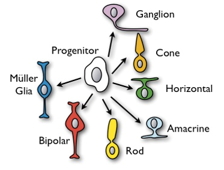

```{r, echo = FALSE}
knitr::opts_chunk$set(tidy = FALSE, tidy.opts=list(width.cutoff=80), fig.retina=3)
ggplot2::theme_set(ggplot2::theme_bw(base_size = 20))
ggplot2::update_geom_defaults("point", list(size = 3))
```

```{r xaringan-themer, include=FALSE, warning=FALSE}
library(xaringanthemer)
style_mono_accent(
  base_color = "#197aa0",
  header_font_google = google_font("Noto Sans"),
  text_font_google   = google_font("Nanum Gothic"),
  code_font_google   = google_font("Inconsolata"),
  base_font_size = "24px", 
  header_h1_font_size = "2rem",
  header_h2_font_size = "1.66rem",
  header_h3_font_size = "1.33rem",
  title_slide_background_image = "https://raw.githubusercontent.com/STAT540-UBC/stat540-ubc.github.io/main/images/stat540-logo-s.png",
  title_slide_background_size = "15%",
  title_slide_background_position = "95% 85%",
  link_color = "rgb(104, 27, 148)",
  link_decoration = "underline",
  extra_css = list(
    ".has-continuation" = list(
      "display" = "block !important"
    )
  )
)
```

```{css, echo = FALSE}
pre {
  white-space: pre-wrap;
}
.remark-code {
  background: #f8f8f8;
}
.remark-inline-code {
  background: "white";
}
.remark-code {
  font-size: 22px;
}
.huge .remark-code { /*Change made here*/
  font-size: 200% !important;
}
.tiny .remark-code { /*Change made here*/
  font-size: 60% !important;
}
.smaller .remark-code { /*Change made here*/
  font-size: 90% !important;
}
.smaller2 .remark-code { /*Change made here*/
  font-size: 80% !important;
}
.smaller3 .remark-code { /*Change made here*/
  font-size: 70% !important;
}
```

<style>
div.blue { background-color:#e8f2f6; border-radius: 5px; padding: 20px;}
</style>


# Reminders

* Intro assignment due **today**

* Project groups posted to Discussion board last week 

* Initial project proposals due this **Friday** (Jan 28)

* Reminder that (free online) resources for review of statistical concepts are listed in the [syllabus](https://stat540-ubc.github.io/syllabus.html#prerequisites-and-resources) 

---

#  Central dogma of statistics


```{r, fig.align="center", echo = FALSE, out.width=650}
knitr::include_graphics("img/statInference.png")
```
<center><small><a href="https://www.gs.washington.edu/academics/courses/akey/56008/lecture/lecture1.pdf" style="color:grey;">Image source: Josh Akey's Lecture notes</a></small></center>

<br>We want to understand a **population** (e.g. all individuals with a certain disease) but we can only study a <font color=red>**random sample**</font> from it

---

#  Hypothesis Testing in Genomics


```{r, fig.align="center", echo = FALSE, out.width=600}
knitr::include_graphics("img/paperRef.PNG")
```

[Akimoto et al. (2006)](https://doi.org/10.1073/pnas.0508214103)

.pull-left[
- Retina presents a model system for investigating **regulatory networks** underlying neuronal differentiation

- **Nrl** transcription factor is known to be important for Rod development
]
.pull-right[
```{r, fig.align="center", echo = FALSE, out.width=275}

```
]

--

- **What happens if you delete Nrl?**

---

#  Why a Hypothesis Test?

From the [Akimoto et al. (2006) paper](https://doi.org/10.1073/pnas.0508214103): 
>"we hypothesized that Nrl is the ideal transcription factor to gain insights into gene expression changes ..."

<div class = "blue">
<b>Biological question:</b> Is the expression level of gene <ii>A</i> affected by knockout of the <i>Nrl</i> gene?
</div>

--

We can use **statistical inference** to answer this biological question!


---

#  Statistical inference


**Statistical inference**:

We observe and study a **random sample** to make conclusions about a population (e.g. gene expression measurements from a random sample of mice)


.pull-left[
**Experimental design**:
* 5 developmental stages (E16, P2, P6, P10, 4Weeks)
* 2 genotypes: Wild type (WT), Nrl Knockout (NrlKO)
* 3-4 replicates for each combination
]
.pull-right[
```{r, fig.align="right", echo = FALSE, out.width=340}
knitr::include_graphics("img/NrlKOmouse.png")
```
]
---


# Reading in / exploring the data

* Data obtained from the [Gene Expression Omnibus (GEO)](https://www.ncbi.nlm.nih.gov/geo/) repository

  * Load directly into R session using [`GEOquery` package](https://www.bioconductor.org/packages/release/bioc/html/GEOquery.html)

```{r, fig.align="center", echo = FALSE, out.width=340}
knitr::include_graphics("https://www.ncbi.nlm.nih.gov/geo/img/geo_main.gif")
```

* Practice with this in Seminars 4 and 5 (Seminar 5 uses the exact same data set!)

* Review lecture 3 (exploratory data analysis) for general principles


---

# Two example genes: Irs4 and Nrl

<div class = "blue">
<b>Biological question:</b> Are these genes truly different in NrlKO compared to WT?
</div>

--

We can't answer this question in general; we can *only* study these genes in collected data (**gene expression values from a random sample of mice**):


```{r, include=FALSE}
library(dplyr)
library(GEOquery)
library(gridExtra)
library(tidyverse)

eset <- getGEO("GSE4051", getGPL = FALSE)[[1]]

# recode time points
pData(eset) <- pData(eset) %>%
  mutate(sample_id = geo_accession) %>%
  mutate(dev_stage =  case_when(
    grepl("E16", title) ~ "E16",
    grepl("P2", title) ~ "P2",
    grepl("P6", title) ~ "P6",
    grepl("P10", title) ~ "P10",
    grepl("4 weeks", title) ~ "4_weeks"
  )) %>%
  mutate(genotype = case_when(
    grepl("Nrl-ko", title) ~ "NrlKO",
    grepl("wt", title) ~ "WT"
  ))

pData(eset) <- pData(eset) %>%
  mutate(dev_stage = fct_relevel(dev_stage, "E16", "P2", "P6", "P10", "4_weeks")) %>%
  mutate(genotype = as.factor(genotype))


toLongerMeta <- function(expset) {
    stopifnot(class(expset) == "ExpressionSet")
    
    expressionMatrix <- lonExpressionressionMatrix <- exprs(expset) %>% 
    as.data.frame() %>%
    rownames_to_column("gene") %>%
    pivot_longer(cols = !gene, 
                 values_to = "Expression",
                 names_to = "sample_id") %>%
    left_join(pData(expset) %>% select(sample_id, dev_stage, genotype),
            by = "sample_id")
  return(expressionMatrix)
}

twoGenes <- toLongerMeta(eset) %>% 
  filter(gene %in% c("1422248_at", "1450946_at")) %>%
  mutate(gene = ifelse(gene == "1422248_at", "Irs4", "Nrl")) 
```

.smaller[
```{r}
twoGenes
```
]

---

# Visualizing Irs4 and Nrl genes in our sample

```{r echo=FALSE, fig.height=4.5, fig.width = 11, fig.align="center"}
#irs4
irsDat <- filter(twoGenes, gene == "Irs4")

#nrl
nrlDat <- filter(twoGenes, gene == "Nrl")

irsLim <- ggplot(irsDat, aes(y = Expression, x = genotype, 
                             colour = genotype)) + 
             geom_jitter(alpha = 0.8, width = 0.2) +
             labs(title = "Irs4 gene") +
             theme(legend.position = "none")
             

nrlLim <- ggplot(nrlDat, aes(y = Expression, x = genotype, 
                             colour = genotype)) + 
             geom_jitter(alpha = 0.8, width = 0.2) +
             labs(title = "Nrl gene") +
             theme(legend.position = "none") 

grid.arrange(irsLim + ylim(5, 13), nrlLim + ylim(5, 13), ncol = 2)
```


---

#  Statistical Hypothesis

** Experimental design:** (ignoring developmental time for now)
  - 2 conditions: WT *vs* NrlKO
  - we observe the expression of many genes in a random sample of mice from each condition

** Biological hypothesis:** for *some* genes, the expression levels are different between conditions

** Statistical hypotheses:** (for each gene $g=1,...,G$)
  - H<sub>0</sub> (null hypothesis): the expression level of gene $g$ is the *same* in both conditions
  -  H<sub>A</sub> (alternative hypothesis): the expression level of gene $g$ is *different* between conditions
---


# Notation 

Random variables and estimates (we can observe):

$Y_i$ : expression of gene $g$ in the WT sample $i$

$Z_i$: expression of gene $g$ in NrlKO sample $i$ 

$Y_1, Y_2,..., Y_{n_Y}$ : a **random sample** of size $n_Y$ WT mice 

$Z_1, Z_2,..., Z_{n_Z}$ : a **random sample** of size $n_Z$ NrlKO mice 

$\bar{Y}=\frac{\sum_{i=1}^{n_Y}Y_i}{n_Y}$: sample mean of gene $g$ expression from WT mice

$\bar{Z}=\frac{\sum_{i=1}^{n_Z}Z_i}{n_Z}$: sample mean of gene $g$ expression from NrlKO mice


---

# Notation 

Population parameters (unknown/unobservable):

$\mu_Y = E[Y]$ : the (population) expected expression of gene $g$ in WT mice

$\mu_Z = E[Z]$ : the (population) expected expression of gene $g$ in NrlKO mice

---

# Is there enough evidence to reject H<sub>0</sub>? </font>

## $H_0: \mu_Y = \mu_Z$

```{r echo=FALSE, fig.height=4.8, fig.width = 11, warning = FALSE, fig.align='center'}


grid.arrange(irsLim + ylim(5, 13), nrlLim + ylim(5, 13), ncol = 2)

```

**Statistical Inference**: random samples are used to learn about the population 

---

# What we observe: sample averages: $\bar{Y}$ vs $\bar{Z}$

.pull-left[
```{r, warning = FALSE, message = FALSE}
meanExp <- twoGenes %>%
  group_by(gene, genotype) %>%
  summarize(meanExpr = mean(Expression)) %>%
  spread(genotype, meanExpr) %>% 
  mutate(diffExp = NrlKO - WT)
meanExp
```
]


.pull-right[
This code uses [tidy data wrangling functions](https://www.rstudio.com/wp-content/uploads/2015/02/data-wrangling-cheatsheet.pdf) to calculate:

* the mean expression of each gene per genotype group
* the difference in mean expression of each gene in Nrl KO vs WT groups
]

---


## Is the difference between $\bar{Y}$ and $\bar{Z}$ enough to reject H<sub>0</sub>?

``` {r echo=FALSE,fig.height=4.2, fig.width=10, fig.align="center"}
irsMean <-   irsLim +
             stat_summary(geom = 'point',
                          fun = 'mean',
                          color = 'black',
                          fill = 'black',
                          shape = 17,
                          size = 2) +
             stat_summary(aes(label=paste("mean = ",round(..y..,2))), 
                          fun = mean, 
                          geom="text",
                          color = 'black',
                          size=5, 
                          vjust = 3)

nrlMean <-   nrlLim +
             stat_summary(geom = 'point',
                          fun = 'mean',
                          color = 'black',
                          fill = 'black',
                          shape = 17,
                          size = 2) +
             stat_summary(aes(label=paste("mean = ",round(..y..,2))),
                          fun = mean, 
                          geom="text",
                          color = 'black',
                          size=5, 
                          vjust = 3)
                          
grid.arrange(irsMean + ylim(5, 13), nrlMean + ylim(5, 13), ncol = 2)
```


- The sample means, $\bar{Y}$ vs $\bar{Z}$, by themselves are not enough to make conclusions about the population

- What is a "large" difference? "large" relative to what?
---

## What can we use to interpret the size of the mean difference?


``` {r echo=FALSE,fig.height=4.5, fig.width=10, fig.align="center"}

set.seed(20210117)
artDat <- data.frame("Expression" = pmax(c(rnorm(30, mean = 5.25, sd = 3), rnorm(30, mean = 11.5, sd = 3)), 0), 
                     "genotype" = factor(c(rep("NrlKO", times = 30), rep("WT" , times = 30))))
levels(artDat$genotype) <- rev(levels(artDat$genotype))

artMean <- ggplot(artDat, aes(y = Expression, x = genotype, colour = genotype)) + 
             geom_jitter(alpha = 0.8, width = 0.2) +
             labs(title = "Artificial gene") +
             theme(legend.position = "none") +
             stat_summary(geom = 'point',
                          fun = 'mean',
                          color = 'black',
                          fill = 'black',
                          shape = 17,
                          size = 2) +
             stat_summary(aes(label=paste("mean = ",round(..y..,2))),
                          fun = mean, 
                          geom="text",
                          color = 'black',
                          size=5, 
                          vjust = 3)

# Combine plots together
grid.arrange(nrlMean + ylim(0, 16), 
             artMean + ylim(0, 16), nrow = 1)
```

## $$\frac{\bar{Y}-\bar{Z}}{??}$$

---

## What can we use to interpret the size of the mean difference?

.pull-left[
"Large" relative to the **observed variation:**
]
.pull-right[
## $\frac{\bar{Y}-\bar{Z}}{\sqrt{Var(\bar{Y}-\bar{Z})}}$
]

``` {r echo=FALSE, fig.height=4, fig.width=10, fig.align = "center"}
# Combine plots together
grid.arrange(nrlMean + ylim(0, 16), 
             artMean + ylim(0, 16), nrow = 1)
```
---

# Quantifying observed variation

* Recall that if $Var(Y_i)=\sigma_Y^2$, then $Var(\bar{Y})=\frac{\sigma_Y^2}{n_Y}$

* Assume that the random variables within each group are *independent and identically distributed* (iid), and that the groups are independent. More specifically, that
  1. $Y_1, Y_2,..., Y_{n_Y}$ are iid, 
  2. $Z_1, Z_2,..., Z_{n_Z}$ are iid, and
  3. $Y_i, Z_j$ are independent. Then, it follows that
$$ Var(\bar{Z}-\bar{Y})=\frac{\sigma_Z^2}{n_Z}+\frac{\sigma_Y^2}{n_Y}$$
* If we also assume equal population variances:</big> $\sigma_Z^2=\sigma_Y^2=\sigma^2$, then
$$Var(\bar{Z}-\bar{Y})=\frac{\sigma_Z^2}{n_Z}+\frac{\sigma_Y^2}{n_Y}=\sigma^2\left[\frac{1}{n_Z}+\frac{1}{n_Y}\right]$$

---

class: middle

# But how can we calculate population variance $\sigma$ if it is **unknown**?

---


## ...using the sample variances (combined, somehow)!

.pull-left[
``` {r, warning = FALSE, message = FALSE}
twoGenes %>%
  group_by(gene, genotype) %>%
  summarize(groupVar = var(Expression))
```
]
.pull-right[
```{r echo=FALSE, fig.height=3.7, fig.width = 7.5, fig.align="center"}
grid.arrange(irsMean  + ylim(5, 13), nrlMean + ylim(5, 13), ncol = 2)
```

For example, for Nrl in WT:

$$\hat{\sigma}_Y^2 = S_Y^2=\frac{1}{n_Y}\sum_{i=1}^{n_Y}(Y_i-\bar{Y})^2=1.22$$
]
---

# Combining sample variances 

Plug these sample variances into your chosen formula for the variance of the difference of sample means:

* Assuming **equal** variance of Y's and Z's

$$\hat{Var}(\bar{Z_n}-\bar{Y_n})=\hat{\sigma}_{\text{pooled}}^2\left[\frac{1}{n_Y}+\frac{1}{n_Z}\right]$$
$$\hat{\sigma}_{\text{pooled}}^2=S_Y^2\frac{n_Y-1}{n_Y+n_Z-2}+S_Z^2\frac{n_z-1}{n_Y+n_Z-2}$$


* Assuming **unequal** variance of Y's and Z's (Welch's t-test)
$$\hat{Var}(\bar{Z_n}-\bar{Y_n})=\hat{\sigma}_{\bar{Z}_n-\bar{Y}_n}^2=\frac{S_Y^2}{n_Y}+\frac{S_Z^2}{n_Z}$$

> Recall: the 'hat' (^) is used to distinguish an 'estimate' from a 'parameter'

---


```{r, include=FALSE}
theVars <- twoGenes %>%
  group_by(gene, genotype) %>%
  summarize(groupVar = var(Expression))

## compute estimated variance of zbar - ybar
(nY <- with(twoGenes, sum(genotype == "WT" & gene == "Nrl")))
(nZ <- with(twoGenes, sum(genotype == "NrlKO" & gene == "Nrl")))

## assuming unequal true variance
(s2DiffWelch <- theVars %>% 
    mutate(s2Welch = groupVar / ifelse(genotype == "WT", nY, nZ)) %>%
    group_by(gene) %>%
    summarize(s2Welch = sum(s2Welch)))
meanExp$s2DiffWelch <- s2DiffWelch$s2Welch


## assuming equal true variance
(s2Pooled <- theVars %>% 
    mutate(s2Pool = groupVar * ifelse(genotype == "WT", 
                                       (nY - 1) / (nY + nZ - 2),
                                       (nZ - 1) / (nY + nZ - 2))) %>%
  group_by(gene) %>%
  summarize(s2Pool = sum(s2Pool)))

(meanExp$s2Diff <- s2Pooled$s2Pool * (1/nY + 1/nZ))

(meanExp <- meanExp %>% 
    mutate(tWelch = diffExp / sqrt(s2DiffWelch)) %>%
    mutate(t = diffExp / sqrt(s2Diff)))


# check that equal to t.test function

by(twoGenes, twoGenes$gene, function(theDat) {
  theDat$genotype <- factor(theDat$genotype, rev(levels(theDat$genotype)))
  t.test(Expression ~ genotype, theDat, var.equal = TRUE)
})

by(twoGenes, twoGenes$gene, function(theDat) {
  theDat$genotype <- factor(theDat$genotype, rev(levels(theDat$genotype)))
  t.test(Expression ~ genotype, theDat, var.equal = FALSE)
})
```


# Test Statistic

$T=\frac{\bar{Z}_n-\bar{Y}_n}{\sqrt{\hat{Var}(\bar{Z_n}-\bar{Y_n})}}$

```{r}
meanExp %>% 
    mutate(t = diffExp / sqrt(s2Diff)) %>%
    mutate(tWelch = diffExp / sqrt(s2DiffWelch))
```

Can we now say whether the observed differences are 'big'?

--

The difference is about half a standard deviation for Irs4 and ~17 standard deviations for Nrl

---

# What to do with this statistic?

* The test statistic T is a **random variable** because it's based on our **random sample**

* We need a measure of its **uncertainty** to determine how big T is:

  * If we were to repeat the experiment many times, what's the probability of observing a value of T **as extreme** as the one we observed?

--

* We need a probability distribution!

* However, this is unknown to us so we need to **make more assumptions**

---

# Null distribution assumptions

* If we know how our statistic behaves when the *null hypothesis is true*, then we can evaluate how extreme our observed data is

  * The **null distribution** is the probability distribution of T under H<sub>0</sub>

* Let's assume that $Y_i$ and $Z_i$ follow (unknown) probability distributions called $F$ and $G$:  
$$(Y_i \sim F, \text{ and } Z_i \sim G)$$

* Depending on the assumptions we make about $F$ and $G$, theory tells us specific **null distributions** for our test statistic


---

## Willing to assume that F and G are normal distributions?

.pull-left[
**2-sample *t*-test:**
 <center> (equal variances)
$$T\sim t_{n_Y+n_Z-2}$$
]
.pull-right[
**Welch's 2-sample *t*-test:**
<center> (unequal variances)
$$T\sim t_{<something\,ugly>}$$
]

--

## Unwilling to assume that F and G are normal distributions? But you feel that n<sub>Y</sub> and n<sub>Z</sub> are large enough?

Then the t-distributions above (or even a normal distribution) are decent approximations

---

# Student's *t*-distribution

Summary: $T=\frac{\bar{Z}_n-\bar{Y}_n}{\sqrt{\hat{Var}(\bar{Z_n}-\bar{Y_n})}}$ is a **random variable**, and under certain assumptions, we can prove that T follows a *t*-distribution


```{r, fig.align="center", echo = FALSE, out.width=400}
knitr::include_graphics("img/tdist.png")
```


Recall that the *t*-distribution has one parameter: df = degrees of freedom

---

#  Hypothesis testing: Step 1

### 1. Formulate your hypothesis as a statistical hypothesis

In our example:

$$H_0: \mu_Y = \mu_Z \text{ vs } H_A: \mu_Y \neq \mu_Z$$

---

# Hypothesis testing: Step 2

### 2a. Define a <font color=red>test statistic</font>

In our example: 2-sample *t*-test

### 2b. Compute the <font color=red>observed value</font> for the test statistic

For our two example genes:

``` {r}
twoGenes %>% 
  group_by(gene) %>%
  summarize(t = t.test(Expression ~ genotype,
                            var.equal=TRUE)$statistic)
```

---

# Hypothesis testing: Step 3

### 3. Compute the probability of seeing a test statistic at least as extreme as that observed, under the null <font color=red>sampling distribution</font> (this is the definition of the <font color=red>p-value</font>) 

For our two example genes:

``` {r}
twoGenes %>% 
  group_by(gene) %>%
  summarize(pvalue = t.test(Expression ~ genotype,
                            var.equal=TRUE)$p.value)
```

---

# In other words, assuming that H<sub>0</sub> is true: 

For Irs4, the probability of seeing a test statistic as extreme as that observed $(t = -0.53)$ is pretty high $(p = 0.6)$.

But for Nrl, the probability of seeing a test statistic as extreme as that observed $(t = -16.8)$ is extremely low $(p=6.76 \times 10^{-19})$


```{r echo=FALSE, fig.height=4.75, fig.width=11, warning = FALSE, fig.align='center'}

# function modified from webr package to plot tail area of t-test
plot.test=function(x,...){
     lim <- 4
     if (abs(x$statistic) > 4){
       lim <- abs(x$statistic)
     }

     tests=c("Welch Two Sample t-test"," Two Sample t-test")
     if(!(x$method %in% tests)) {
          cat("Currently, ",x$method," is not supported")
          return(invisible(0))
     }
     (degf=x[[2]])
     statName=tolower(attr(x$statistic,"names"))
     statName
     alpha=1-attr(x$conf.int,"conf.level")
     
     alternative<-x$alternative
     (newalpha=alpha)
     if(alternative=="two.sided") newalpha=alpha/2

     qF=function(...){
          eval(parse(text=paste0("q",statName,"(...)")))
     }
     dF=function(...){

               eval(parse(text=paste0("d",statName,"(...)")))
     }
     x0 <- seq(-lim,lim,length=1000)
     if(x[[1]]>lim) {
       x0=c(x0,x[[1]])
     } else if(x[[1]] < -lim) {
       x0=c(x[[1]],x0)
     }
     x0
     y0=dF(x0,df=degf)
     y0
     
     x1=seq(min(lim+1, qF(p=1-x$p.value/2,df=degf)),lim,length=50)
     y1=dF(x1,df=degf)
     x2=seq(-lim,max(-lim - 1, qF(p=x$p.value/2, df=degf)),length=50)
     y2=dF(x2,df=degf)
     
     data=data.frame(x=x0,y=y0)
     data
     data1=data.frame(x=x1,y1=y1)
     data2=data.frame(x=x2,y1=y2)
     x
     label=paste0(sprintf("%9s",attr(x$statistic,"names"))," = ",
                   sprintf("%.03f",x$statistic))
     if(length(degf)==2) {
          label=c(label,paste0("num df=",degf[1],", denom df=",degf[2]))
     } else {
          label=c(label,paste0(sprintf("%9s","df")," = ",sprintf("%.0f",degf)))
     }

     if(x[[3]]>=0.00001) {
          label=c(label,paste0(sprintf("%9s","p")," = ",sprintf("%.5f",x[[3]])))
     } else {
          label=c(label,paste0(sprintf("%9s","p")," < 0.00001"))
     }
     label=stringr::str_pad(label,19,side="left")

     label=stringr::str_c(label,collapse="\n")
     label
     p2<-ggplot(data,aes_string(x="x",y="y"))+geom_line()
     if(alternative!="less")  p2<-p2+geom_area(data=data1,aes(x1,y1),fill="red",alpha=0.5)
     if(alternative!="greater")  p2<-p2+ geom_area(data=data2,aes(x2,y2),fill="red",alpha=0.5)
     p2
     if(abs(x$statistic)>lim) {
          hjust=1
     } else if(x$statistic>0) {
          hjust=-0.1
     } else hjust=0.1
     
     ypoint=dF(x$statistic,df=degf)
     ypoint
     xpoint=qF(p=1-newalpha,df=degf)
     xpoint2=qF(p=newalpha,df=degf)
    
     p2<-p2+geom_vline(xintercept=x[[1]], color="blue", linetype="dashed")
     p2<-p2+ annotate(geom="label",x=Inf,y=Inf,label=label,vjust=1.1,hjust=1.1)

     p2<-p2+labs(title=x$method,x=paste0(statName," statistic"),y="Probability Density")+theme(plot.title=element_text(hjust=0.5))

     p2
}


tres <- by(twoGenes, twoGenes$gene, function(theDat) {
  theDat$genotype <- factor(theDat$genotype, rev(levels(theDat$genotype)))
  t.test(Expression ~ genotype, theDat, var.equal = TRUE)
})


p1 <- plot.test(tres[[1]]) + ggtitle("Irs4") +
  theme(axis.title=element_text(size=20),
        plot.title = element_text(size = 30),
        legend.text=element_text(size=18))
p2 <- plot.test(tres[[2]]) + ggtitle("Nrl")+
  theme(axis.title=element_text(size=20),
        plot.title = element_text(size = 30),
        legend.text=element_text(size=18))

grid.arrange(p1, p2, nrow=1)

```


---

# Hypothesis Testing: Step 4

### 4. Make a decision about significance of results, based on a pre-specified value (alpha, significance level)


The significance level $\alpha$ is often set at 0.05. However, this value is arbitrary and may depend on the study.


.pull-left[
**Irs4**

Using $\alpha=0.05$, since the p-value for the Irs4 test is greater than 0.05, we conclude that there is <font color=red> not enough evidence </font> in the data to claim that Irs4 has differential expression in WT compared to NrlKO models. 

We do not reject H<sub>0</sub>!
]

.pull-right[
**Nrl**

Using $\alpha=0.05$, since the p-value for the Nrl test is much less than 0.05, we conclude that there is <font color=red>significant evidence </font> in the data to claim that Nrl has differential expression in WT compared to NrlKO models. 

We reject H<sub>0</sub>!
]

---

# `t.test` function in R

.pull-left[
Assuming equal variances
.smaller2[
```{r, linewidth=50}
twoGenes %>% filter(gene == "Nrl") %>%
  t.test(Expression ~ genotype, 
         var.equal=TRUE, data = .)
```
]]

.pull-right[
Assuming equal variances
.smaller2[
```{r, linewidth=50}
twoGenes %>% filter(gene == "Nrl") %>%
  t.test(Expression ~ genotype, 
         var.equal=FALSE, data = .)
```
]]

Check out `?t.test` for more options, including how to specify one-sided tests

---


# What is a p-value?

Likelihood of obtaining a test statistic at least <font color=green> as extreme as the one observed</font>, given that the null hypothesis is true (we are making a *conditional probability* statement)

# What is a p-value <font color=red>NOT</font>?

- Not the probability that the <font color=red>null hypothesis is true</font>

- Not the probability that the <font color=red>finding is a “fluke”</font>

- Not the probability of <font color=red>falsely rejecting the null</font>

- Does not <font color=red>indicate the size or importance</font> of observed effects

---


# "Genome-wide" testing of differential expression

- In genomics, we often perform thousands of statistical tests (e.g., a *t*-test per gene)

- The distribution of p-values across all tests provides good diagnostics/insights

- Is it mostly uniform (flat)? If not, is the departure from uniform expected based on biological knowledge?

- We will revisit these topics in greater detail in later lectures

---

# Different kinds of *t*-tests:


- One sample *or* **two samples**

- One-sided *or* **two sided**

- Paired *or* **unpaired**

- Equal variance *or* unequal variance

---


# Types of Errors in Hypothesis Testing

```{r, fig.align="center", echo = FALSE, out.width=675}
knitr::include_graphics("img/hypError.png")
```

<br>
$$ \alpha = P(\text{Type I Error}), \text{   } \beta = P(\text{Type II Error}), \text{   Power} = 1- \beta$$ 
---

# $H_0$: "*Innocent until proven guilty*"


* The default state is $H_0 \rightarrow$ we only reject if we have enough evidence

* If $H_0$: Innocent and $H_A$: Guilty, then

    * Type I Error $(\alpha)$: Wrongfully convict innocent (*False Positive*)
    
    * Type II Error $(\beta)$: Fail to convict criminal (*False Negative*)

---

# What are alternatives to the *t*-test?


<div class = "blue">
What if you don't wish to assume the underlying data is normally distributed <b>AND</b> you aren't sure your samples are large enough to invoke CLT? </div>

* First, one could use the t test statistic but use a **bootstrap approach** to compute its p-value; we'll revisit this topic later

* Alternatively, there are *non-parametric* tests that are available:

  - **Wilcoxon rank sum test**, aka Mann Whitney, uses ranks to test differences in population means

  - **Kolmogorov-Smirnov test** uses the empirical CDF to test differences in population cumulative distributions

---


# Wilcoxon rank sum test


Rank all data, **ignoring the grouping** variable

**Test statistic** = sum of the ranks for one group (optionally, subtract the minimum possible which is $\frac{n_Y(n_Y+1)}{2}$)

(Alternative but equivalent formulation based on the number of $y_i, z_i$ pairs for which $y_i \geq z_i$)

The null distribution of such statistics can be worked out or approximated

---

# `wilcox.test` function in R

.smaller[
```{r, linewidth=80}
wilcox.test(Expression ~ genotype, 
            data = twoGenes  %>% filter(gene == "Irs4"))

wilcox.test(Expression ~ genotype, 
            data = twoGenes  %>% filter(gene == "Nrl"))
```
]

---

# Kolmogorov-Smirnov test (two sample)

**Null hypothesis**: F = G, i.e. the distributions are the same

Estimate each CDF with the empirical CDF (ECDF)

$$\hat{F}(x)=\frac{1}{n}\sum_{i=1}^n{I[x_i\leq{x}]}$$

**Test statistic** is the maximum of the absolute difference between the ECDFs

$$max|\hat{F}(x)-\hat{G}(x)|$$

Null distribution does not depend on F, G (!)
<br>(I'm suppressing detail here)

---

# Kolmogorov-Smirnov test (two sample)

```{r, echo = FALSE, fig.width = 14, fig.height = 7, fig.align='center'}
# create ECDF of data
sample1 <- twoGenes %>%
               filter(gene == "Nrl", genotype == "WT") %>%
               pull(Expression)
sample2 <- twoGenes %>% 
               filter(gene == "Nrl", genotype == "NrlKO") %>%
               pull(Expression)
cdf1 <- ecdf(sample1)
cdf2 <- ecdf(sample2)
# find min and max statistics to draw line between points of greatest distance

minMax <- seq(min(sample1, sample2), max(sample1, sample2), length.out=length(sample1)) 
x0 <- minMax[which( abs(cdf1(minMax) - cdf2(minMax)) == max(abs(cdf1(minMax) - cdf2(minMax))) )] 
y0 <- cdf1(x0) 
y1 <- cdf2(x0) 


# png(file = "c:/temp/ks.png", width = 1024, height = 768, type="cairo-png")
p1 <- twoGenes %>% 
  filter(gene == "Nrl") %>%
ggplot(aes(x = Expression, group = genotype, color = genotype))+
  stat_ecdf(size=1) +
    theme(legend.position ="top") +
    xlab("Expression") +
    ylab("ECDF") +
    #geom_line(size=1) +
    geom_segment(aes(x = x0[1], y = y0[1], xend = x0[1], yend = y1[1]),
        linetype = "dashed", color = "red") +
    geom_point(aes(x = x0[1] , y= y0[1]), color="red", size=8) +
    geom_point(aes(x = x0[1] , y= y1[1]), color="red", size=8) +
    theme(legend.title=element_blank()) + 
  ggtitle("Nrl")


# create ECDF of data
sample1 <- twoGenes %>%
               filter(gene == "Irs4", genotype == "WT") %>%
               pull(Expression)
sample2 <- twoGenes %>% 
               filter(gene == "Irs4", genotype == "NrlKO") %>%
               pull(Expression)
cdf1 <- ecdf(sample1)
cdf2 <- ecdf(sample2)
# find min and max statistics to draw line between points of greatest distance

minMax <- seq(min(sample1, sample2), max(sample1, sample2), length.out=length(sample1)) 
x02 <- minMax[which( abs(cdf1(minMax) - cdf2(minMax)) == max(abs(cdf1(minMax) - cdf2(minMax))) )] 
y02 <- cdf1(x02) 
y12 <- cdf2(x02) 


# png(file = "c:/temp/ks.png", width = 1024, height = 768, type="cairo-png")
p2 <- twoGenes %>% 
  filter(gene == "Irs4") %>%
ggplot(aes(x = Expression, group = genotype, color = genotype))+
  stat_ecdf(size=1) +
    theme(legend.position ="top") +
    xlab("Expression") +
    ylab("ECDF") +
    #geom_line(size=1) +
    geom_segment(aes(x = x02[1], y = y02[1], xend = x02[1], yend = y12[1]),
        linetype = "dashed", color = "red") +
    geom_point(aes(x = x02[1] , y= y02[1]), color="red", size=8) +
    geom_point(aes(x = x02[1] , y= y12[1]), color="red", size=8) +
    theme(legend.title=element_blank()) + 
  ggtitle("Irs4")

grid.arrange(p1, p2, nrow=1)
```

---

# `ks.test` function in R

.smaller2[
```{r, linewidth=80}
Nrlgene <- twoGenes %>% filter(gene == "Nrl")
ks.test(Nrlgene$Expression[Nrlgene$genotype == "WT"],
        Nrlgene$Expression[Nrlgene$genotype == "NrlKO"])


Irs4gene <- twoGenes %>% filter(gene == "Irs4")
ks.test(Irs4gene$Expression[Irs4gene$genotype == "WT"],
        Irs4gene$Expression[Irs4gene$genotype == "NrlKO"])
```
]

---


# Discussion and questions


* What if you are unsure whether your sample size is large enough? 

  * Outliers with small samples could be problematic

* Which test result should one report ... the 2-sample *t*-test, the Wilcoxon, or the KS?

* Treat p-values as one type of evidence that you should incorporate with others

* It is worrisome when methods that are equally appropriate and defensible give very different answers

