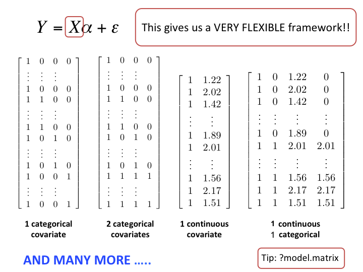

```{r, echo = FALSE}
knitr::opts_chunk$set(tidy = FALSE, tidy.opts=list(width.cutoff=80), fig.retina=3)
ggplot2::theme_set(ggplot2::theme_bw(base_size = 20))
ggplot2::update_geom_defaults("point", list(size = 3))

library(knitr)
hook_output = knit_hooks$get('output')
knit_hooks$set(output = function(x, options) {
  # this hook is used only when the linewidth option is not NULL
  if (!is.null(n <- options$linewidth)) {
    x = knitr:::split_lines(x)
    # any lines wider than n should be wrapped
    if (any(nchar(x) > n)) x = strwrap(x, width = n)
    x = paste(x, collapse = '\n')
  }
  
  lines <- options$output.lines
   if (is.null(lines)) {
     return(hook_output(x, options))  # pass to default hook
   }
   x <- unlist(strsplit(x, "\n"))
   if (length(lines)==1) {        # first n lines
     if (length(x) > lines) {
       # truncate the output
       x <- c(head(x, lines))
     }
   } else {
     x <- c(x[lines])
   }
   # paste these lines together
   x <- paste(c(x, ""), collapse = "\n")

  hook_output(x, options)
})

set.seed(47)
```

```{r xaringan-themer, include=FALSE, warning=FALSE}
library(xaringanthemer)
style_mono_accent(
  base_color = "#197aa0",
  header_font_google = google_font("Noto Sans"),
  text_font_google   = google_font("Nanum Gothic"),
  code_font_google   = google_font("Inconsolata"),
  base_font_size = "24px", 
  header_h1_font_size = "2rem",
  header_h2_font_size = "1.66rem",
  header_h3_font_size = "1.33rem",
  title_slide_background_image = "https://raw.githubusercontent.com/STAT540-UBC/stat540-ubc.github.io/main/images/stat540-logo-s.png",
  title_slide_background_size = "15%",
  title_slide_background_position = "95% 85%",
  link_color = "rgb(104, 27, 148)",
  link_decoration = "underline",
  extra_css = list(
    ".has-continuation" = list(
      "display" = "block !important"
    )
  )
)
```

```{css, echo = FALSE}
pre {
  white-space: pre-wrap;
}
.remark-code {
  background: #f8f8f8;
}
.remark-inline-code {
  background: "white";
}
.remark-code {
  font-size: 22px;
}
.huge .remark-code { /*Change made here*/
  font-size: 200% !important;
}
.tiny .remark-code { /*Change made here*/
  font-size: 60% !important;
}
.smaller .remark-code { /*Change made here*/
  font-size: 90% !important;
}
.smaller2 .remark-code { /*Change made here*/
  font-size: 80% !important;
}
.smaller3 .remark-code { /*Change made here*/
  font-size: 70% !important;
}
```

<style>
div.blue { background-color:#e8f2f6; border-radius: 5px; padding: 20px;}
</style>

## Recap: Are these genes different in NrlKO vs WT?

H<sub>0</sub>: the expression level of gene $g$ is the same in both conditions

Is there **enough** evidence in the data to reject H<sub>0</sub>?


```{r, include=FALSE}
library(dplyr)
library(GEOquery)
library(gridExtra)
library(tidyverse)

eset <- getGEO("GSE4051", getGPL = FALSE)[[1]]

# recode time points
pData(eset) <- pData(eset) %>%
  mutate(sample_id = geo_accession) %>%
  mutate(dev_stage =  case_when(
    grepl("E16", title) ~ "E16",
    grepl("P2", title) ~ "P2",
    grepl("P6", title) ~ "P6",
    grepl("P10", title) ~ "P10",
    grepl("4 weeks", title) ~ "4_weeks"
  )) %>%
  mutate(genotype = case_when(
    grepl("Nrl-ko", title) ~ "NrlKO",
    grepl("wt", title) ~ "WT"
  ))

pData(eset) <- pData(eset) %>%
  mutate(dev_stage = fct_relevel(dev_stage, "E16", "P2", "P6", "P10", "4_weeks")) %>%
  mutate(genotype = as.factor(genotype)) %>%
  mutate(genotype = fct_relevel(genotype, "WT", "NrlKO"))

toLongerMeta <- function(expset) {
    stopifnot(class(expset) == "ExpressionSet")
    
    expressionMatrix <- lonExpressionressionMatrix <- exprs(expset) %>% 
    as.data.frame() %>%
    rownames_to_column("gene") %>%
    pivot_longer(cols = !gene, 
                 values_to = "expression",
                 names_to = "sample_id") %>%
    left_join(pData(expset) %>% select(sample_id, dev_stage, genotype),
            by = "sample_id")
  return(expressionMatrix)
}

twoGenes <- toLongerMeta(eset) %>% 
  filter(gene %in% c("1422248_at", "1450946_at")) %>%
  mutate(gene = ifelse(gene == "1422248_at", "Irs4", "Nrl")) 
```

```{r echo=FALSE, fig.height=4.2, fig.width = 11, fig.align="center"}
irsLim <- twoGenes %>%
  filter(gene == "Irs4") %>%
  ggplot(aes(y = expression, x = genotype, 
                             colour = genotype)) + 
             geom_jitter(alpha = 0.8, width = 0.2) +
             labs(title = "Irs4 gene") +
             ylim(5, 13) +
             theme(legend.position = "none")
             

nrlLim <- twoGenes %>%
  filter(gene == "Nrl") %>%
  ggplot(aes(y = expression, x = genotype, 
                             colour = genotype)) + 
             geom_jitter(alpha = 0.8, width = 0.2) +
             labs(title = "Nrl gene") +
             ylim(5, 13) +
             theme(legend.position = "none") 

grid.arrange(irsLim, nrlLim, ncol = 2)
```

---

## **Statistics**: learn about a population from a random sample

.pull-left[
<center>**Population** (Unknown)
$$Y \sim F, \,\, Z \sim G$$
$$E[Y] = \mu_Y, \,\, E[Z] = \mu_Z$$
$$Var[Y] = {\sigma}_Y^2,\,\, Var[Z] = {\sigma}_Z^2$$
$$H_0: \mu_Y = \mu_Z$$

$$H_A: \mu_Y \neq \mu_Z$$

]
.pull-right[
<center> **Sample** (Observed, with randomness)

$$(Y_1, Y_2, ..., Y_{n_Y}) \text{ and } (Z_1, Z_2, ..., Z_{n_Z})$$
$\hat{\mu}_Y = \bar{Y} = \frac{\sum_{i=1}^{n_Y} Y_i}{n_Y}$

$\hat{\sigma}_Y^2 = S_Y^2=\frac{1}{n_Y}\sum_{i=1}^{n_Y}(Y_i-\bar{Y})^2$

(with similar quantities for $Z:$ $\bar{Z}$ and $S^2_Z)$

$T = \frac{\bar{Y}-\bar{Z}}{\sqrt{\hat{Var}(\bar{Y}-\bar{Z}))}}$

$\bar{Y}, \bar{Z}, S^2_Y, S^2_Z$ and $T$ are examples of **statistics** computed from the sample
]

---

# Summary: Hypothesis testing

1. Formulate scientific hypothesis as a **statistical hypothesis** $(H_0 \text{ vs } H_A)$

2. Define a **test statistic** to test $H_0$ and compute its **observed value**. For example:

  - 2-sample *t*-test
  - Welch *t*-test (unequal variance)
  - Wilcoxon rank-sum test
  - Kolmogorov-Smirnov test

3. Compute the probability of seeing a test statistic as extreme as that observed, under the **null sampling distribution** (p-value) 
4. Make a decision about the **significance** of the results, based on a pre-specified significance level ( $\alpha$ )
---

# We can run these tests in R 

Example: use the `t.test` function to test $H_0$ using a classical 2-sample *t*-test with equal variance.
.smaller[
``` {r}
filter(twoGenes, gene == "Irs4") %>%
  t.test(expression ~ genotype, data = ., var.equal = TRUE)
```
]
---

# Which test should I use??

* How to decide which test to carry out (e.g. t-test, Wilcoxon, KS)?

* Are assumptions met for each one?

  * If so, parametric tests (e.g. t-test) tend to have slightly higher power (ability to reject H<sub>0</sub> when H<sub>0</sub> is false)
  
  * But if assumptions are potentially violated, non-parametric tests (Wilcoxon, KS) are a safer choice (albeit conservative)


---

# Today's Learning Objectives

1. Compare means of different groups (2 or more) using a **linear regression model**

  - Understand how 'indicator' variables represent the levels of a qualitative explanatory variable

2. Write a linear model using matrix notation

  - understand which matrix is built by R
  
3. Distinguish between **single** and **joint** hypothesis tests

  - e.g. $t$-tests vs $F$-tests
  
---

# 3 ways to test $H_0: \mu_1 = \mu_2$

**2-sample t-test (with equal variance)**
.smaller[
```{r, eval=FALSE, echo = TRUE}
filter(twoGenes, gene == "Irs4") %>%
  t.test(expression ~ genotype, data = ., var.equal = TRUE)
```
]

**(One-way) Analysis of Variance (ANOVA)**
.smaller[
```{r, eval=FALSE, echo = TRUE}
filter(twoGenes, gene == "Irs4") %>%
  aov(expression ~ genotype, data = .) %>%
  summary()
```
]

**Linear regression model**
.smaller[
```{r, eval=FALSE, echo = TRUE}
filter(twoGenes, gene == "Irs4") %>%
  lm(expression ~ genotype, data = .) %>%
  summary()
```
]

---

# All three methods give the same result!<sup>*</sup>

.pull-left[
.smaller[
**2-sample t-test (equal variance)**

```{r, eval=TRUE, echo = FALSE, tidy=TRUE, linewidth=44, highlight.output = 5}
(irs4.ttest <- filter(twoGenes, gene == "Irs4") %>%
  t.test(expression ~ genotype, data = ., var.equal = TRUE))
```

<small>
<sup>*</sup>Note differences in sign between t-test & linear regression: pay attention to which group is 'reference'
</small>
]]

.pull-right[
.smaller[
**(One-way) Analysis of Variance (ANOVA)**
```{r, eval=TRUE, echo = FALSE, tidy=TRUE, linewidth=44, highlight.output=2}
(irs4.aov <- filter(twoGenes, gene == "Irs4") %>%
  aov(expression ~ genotype, data = .) %>%
  summary())
```
**Linear regression model**
```{r, eval=TRUE, echo = FALSE, linewidth=52, output.lines=c(9:12), highlight.output=4}
(irs4.lm <- filter(twoGenes, gene == "Irs4") %>%
  lm(expression ~ genotype, data = .) %>%
  summary())
```
]]


---
# These are not coincidences!

.pull-left[
.smaller[
**2-sample t-test (equal variance)**

```{r, eval=TRUE, echo = FALSE, tidy=TRUE, linewidth=44}
list("t statistic" = irs4.ttest$statistic, 
     "p-value" = irs4.ttest$p.value,
     "mean difference" = as.numeric(-diff(irs4.ttest$estimate)),
     "(t statistic)^2" = irs4.ttest$statistic^2)
```
]]

.pull-right[
.smaller[
**(One-way) Analysis of Variance (ANOVA)**
```{r, eval=TRUE, echo = FALSE, tidy=TRUE, linewidth=44}
list("F statistic" = irs4.aov[[1]]$`F value`[1], 
     "p-value" = irs4.aov[[1]]$`Pr(>F)`[1])
```
**Linear regression model**
```{r, eval=TRUE, echo = FALSE, linewidth=52}
list("t statistic" = irs4.lm$coeff[2,3],
     "p-value" = irs4.lm$coeff[2,4],
     "coefficient estimate" = irs4.lm$coeff[2,1])
```
]]

---

## *t*-test vs linear regression: why the same results?

.smaller[
``` {r}
list("t statistic" = irs4.ttest$statistic, 
     "p-value" = irs4.ttest$p.value)
```


```{r}
list("t statistic" = irs4.lm$coeff[2,3],
     "p-value" = irs4.lm$coeff[2,4])
```
]

---

## *t*-test vs linear regression: where's the *line*?

```{r echo=FALSE, fig.width=10, fig.height= 4, fig.align="center"}
grid.arrange(irsLim, nrlLim, ncol = 2)
```

--

Note that the $x$-axis in these plots is not numerical, thus a line in this space does not have any mathematical meaning. 

<div class = "blue">
Why can we run a t-test with a <font color = "red">linear</font> regression model?
</div>
---

# From *t*-test to linear regression


Let's change the notation to give a common framework to all methods

$$Y \sim G; \; E[Y] = \mu_Y$$
 <center> **↓** </center>

$$Y = \mu_Y + \varepsilon_Y; \; \varepsilon_Y \sim G; \; E[\varepsilon_Y] = 0$$ 

--

### Why is this equivalent?

$$E[Y] = E[\mu_Y + \varepsilon_Y] = \mu_Y + E[\varepsilon_Y] = \mu_Y$$
We are just rewriting $Y$ here

---

# From *t*-test to linear regression


Let's change the notation to give a common framework to all methods

$$Y \sim G; \; E[Y] = \mu_Y$$
 <center> **↓** </center>

$$Y = \mu_Y + \varepsilon_Y; \; \varepsilon_Y \sim G; \; E[\varepsilon_Y] = 0$$ 


### We can use indices to accommodate multiple groups, i.e., 

<font size=5> $$Y_{ij} = \mu_j + \varepsilon_{ij};\; \; \varepsilon_{ij} \sim G_j; \; \;E[\varepsilon_{ij}] = 0;$$ </font>
<br>
where $j = \textrm{\{WT, NrlKO}\}$ (or $j=\textrm{\{1, 2}\}$ ) identifies the groups; 
and $i=1, \ldots, n_j$ identifies the observations within each group
<br>

--

 > For example: $Y_{11}$ is the first observation in group 1 or WT
 
---

# This is called the **cell-means model**

The goal is to test $H_0 : \mu_1 = \mu_2$

using data from the model

$$Y_{ij} = \mu_j + \varepsilon_{ij};\; \; \varepsilon_{ij} \sim G; \; \;E[\varepsilon_{ij}] = 0;$$
<br>
where $j$ indexes groups (e.g. WT vs NrlKO) and $i$ indexes samples within group
<br>

> We assume a common distribution $G$ for all groups (equal variance assumption)

--

### Note that the population means are given by $E[Y_{ij}] = \mu_j$, i.e., the model is written with a <font color = "red">cell-means</font> $(\mu_j)$ parametrization

--

Why the name? 'Cell' here refers to a cell of a table - e.g. make a table of means by group, and $\mu_j$ represents the population value for each cell $j$ in the table

---

## Recall: sample mean estimator of population mean 

Note that for each group, the **population** mean is given by 
 $$E[Y_{ij}] = \mu_j,$$ 

* A natural *estimator* of the population mean is the <font color = "red">**sample**</font> mean

* Classical hypothesis testing methods use the group sample means as estimators

* See, for example, the `t.test` function in R:

```{r}
irs4.ttest$estimate
```

---

## However, the `lm` function reports other estimates; <font color = "red">why?</font>  

```{r, echo = FALSE}
options(pillar.sigfig = 5)
```

```{r}
irs4.ttest$estimate
irs4.lm$coefficients[,1]
```

--

<big>
<center> **↓**
<br>
.pull-left[
`(Intercept)` estimate from `lm` is the **sample mean** of WT group 
]
.pull-right[
but `genotypeNrlKO` estimate from `lm` is **not** the sample mean of the NrlKO group. What is it then?
]
---

## Parameterization: how to write the model?

- By default, the `lm` function does not use the cell-means parameterization 

- The goal is to *compare* the means, not to study each in isolation

Let's reformulate from <font color=red>**cell-means**</font> $(\mu_j)$:  $$Y_{ij} = \mu_j + \varepsilon_{ij};\; \; \varepsilon_{ij} \sim G; \; \;E[\varepsilon_{ij}] = 0;$$

**<center>↓</center>**

to <font color = "red">**reference-treatment effect**</font> $(\theta,\tau_j)$: $$Y_{ij} = \theta+\tau_j + \varepsilon_{ij};\; \; \tau_1=0, \; \; \varepsilon_{ij} \sim G; \; \;E[\varepsilon_{ij}] = 0;$$

--

* Note that for each group, the population mean is given by $E[Y_{ij}] = \theta+\tau_j=\mu_j,$
and $\tau_2=\mu_2-\mu_1=E[Y_{i2}] -E[Y_{i1}]$ *compares* the means

* $\tau_1$ must be set to zero, since group 1 is the *reference* group
---


## Relation between parameterizations

```{r, fig.align="center", echo = FALSE, out.width=800}
knitr::include_graphics("img/param_2.png")
```

---

## `lm` output

* the sample mean of the **reference** group (WT): $\hat\theta$ 
*  **treatment effect**: $\hat\tau_2$
  * i.e., difference between the sample means of both groups
 
For gene Irs4:

```{r, tidy = FALSE, echo = FALSE, results = 'hide'}
(irs4.means <- twoGenes %>%
   filter(gene == "Irs4") %>% 
   group_by(genotype) %>%
   summarize(meanExpr = mean(expression)))
```
.smaller2[ 
```{r,tidy=TRUE, tidy.opts=list(width.cutoff=50)}
irs4.lm$coefficients[,1]

irs4.means$meanExpr[irs4.means$genotype == "WT"]

irs4.means$meanExpr[irs4.means$genotype == "NrlKO"] -irs4.means$meanExpr[irs4.means$genotype == "WT"]
```
]

---

## `lm` output

* the sample mean of the **reference** group (WT): $\hat\theta$ 
*  **treatment effect**: $\hat\tau_2$
  * i.e., difference between the sample means of both groups
 
For gene Nrl:

```{r, tidy = FALSE, echo = FALSE, results = 'hide'}
(nrl.means <- twoGenes %>%
   filter(gene == "Nrl") %>% 
   group_by(genotype) %>%
   summarize(meanExpr = mean(expression)))

(nrl.lm <- filter(twoGenes, gene == "Nrl") %>%
     lm(expression ~ genotype, data = .) %>%
     summary())
```
.smaller2[ 
```{r,tidy=TRUE, tidy.opts=list(width.cutoff=50)}
nrl.lm$coefficients[,1]

nrl.means$meanExpr[nrl.means$genotype == "WT"]

nrl.means$meanExpr[nrl.means$genotype == "NrlKO"] -nrl.means$meanExpr[nrl.means$genotype == "WT"]
```
]

---

## We still haven't answered our question ... where's the line?? 

<Big> 
$$Y_{ij} = \theta+\tau_j + \varepsilon_{ij};\; \; \tau_1=0, \; \; \varepsilon_{ij} \sim G; \; \;E[\varepsilon_{ij}] = 0;$$

```{r echo=FALSE, fig.width=10, fig.height= 5, fig.align="center"}
grid.arrange(irsLim, nrlLim, ncol = 2)
```

---

# Indicator variables

<big>

Let's re-write our model using **indicator** (aka 'dummy') variables:

$$Y_{ij} = \theta+\tau_j + \varepsilon_{ij}\;\; \text{where} \; \; \tau_1=0; \; \; \varepsilon_{ij} \sim G; \; \;E[\varepsilon_{ij}] = 0;$$
**<center>↓</center>**

$$Y_{ij} = \theta+\tau_2 x_{ij} + \varepsilon_{ij} \;\; \text{where} \; \; x_{ij}=\bigg\{\begin{array}{l} 
1\text{ if } j=2\\
0 \text{ otherwise}\\
\end{array}$$

--

> Note that $Y_{i1} = \theta + \varepsilon_{i1}$, because $x_{i1}=0$ 
> and $Y_{i2} = \theta + \tau_2+ \varepsilon_{i2}$, because $x_{i2}=1$ (for all $i$)

The second form is written as a *linear* ( $y=a + bx +\varepsilon$ ) regression model, with a special (**indicator**) explanatory variable $x_{ij}$
---


  
### Using indicator variables to model our categorical variable `genotype` <br> we can perform a  <font color = "red">2-sample *t*-test</font> with a linear model

$$Y_{ij} = \theta+\tau_2 x_{ij} + \varepsilon_{ij}\;\text{where}\; \; x_{ij}=\bigg\{\begin{array}{l}
1 \text{ if } j=2\\
0 \text{ if } j=1\\
\end{array}$$

- Recall that $\tau_2 = \mu_2 - \mu_1$

- The *t*-test in the linear model is carried out on $H_0: \tau_2 = 0$, where $\tau_2$ is the difference in population means (here NrlKO - WT)

.smaller[
.pull-left[
``` {r}
list("t statistic"=irs4.ttest$stat,
     "p-value"=irs4.ttest$p.value)
```
]
.pull-right[
```{r}
list("t statistic"=irs4.lm$coeff[2,3],
     "p-value"=irs4.lm$coeff[2,4])
```
]
]

---

## Beyond 2-group comparisons

```{r,echo=FALSE, out.width="700", fig.align="center"}
knitr::include_graphics("img/more_2_groups.png")
```

---

### Indicator variables can be used to model one *or more* categorical variables, each with 2 *or more* levels!

**2-sample *t*-test** using a linear model

$$Y_{ij} = \theta+\tau_2 x_{ij} + \varepsilon_{ij}\;\; \text{where} \; \; x_{ij}=\bigg\{\begin{array}{l}
1 \text{ if } j=2\\
0 \text{ if } j=1\\
\end{array}$$

**1-way ANOVA with many levels** $^{*}$ using a linear model - e.g for 3 groups:
$$Y_{ij} = \theta+\tau_2 x_{ij2} + \tau_3 x_{ij3} +\varepsilon_{ij}\;\; \text{where} \; x_{ij2}=\bigg\{\begin{array}{l}
1\text{ if } j=2\\
0 \text{ otherwise}\\
\end{array}\; \text{ and } \; x_{ij3}=\bigg\{\begin{array}{l}
1\text{ if } j=3\\
0 \text{ otherwise}\\
\end{array}$$

<div class = "blue">
This is why R can estimate all of them with <tt>lm()</tt>
</div>

<small>
$^{*}$ in general; yet *another* parameterization can be used to present ANOVA 

---

### **t-test**
  > Special case of <font color = "red">ANOVA</font>, but with ANOVA you can compare **more than two groups** and **more than one factor**.
  
    
### **ANOVA**

  > Special case of <font color = "red">linear regression</font>, but with linear regression you can include **quantitative variables** in the model. 
  
  
### **Linear regression**

  > Provides a unifying framework to model the association between a response and **many quantitative and qualitative variables**. 

**In R:** all three can be computed using the `lm()` function. 
---

# Linear models using matrix notation

```{r,echo=FALSE, out.width="700", fig.align="center"}
knitr::include_graphics("img/linear_form.png")
```

### It will become handy to write our model using matrix notation

---

## Let's form a design matrix $(X)$ for a 3-group comparison

$$Y_{ij} = \theta+\tau_2  x_{ij2} + \tau_3 x_{ij3} +\varepsilon_{ij}$$
<div style= "float:right; position: relative; top: -25px;">
```{r,echo=FALSE, out.width="600", fig.align="right"}
knitr::include_graphics("img/model_matrix_I.png")
```
</div>

First column in $X$ for reference treatment parameterization is all 1s

Second & third columns contain $x_{ij2}$ and $x_{ij3}$:

* $x_{i12}=x_{i13}=0$ for the reference group

* $x_{i22}=1$ for the 2nd group 

* $x_{i33}=1$ for the 3rd group


---

<div style= "top: -15px;">
```{r,echo=FALSE,out.width="700", fig.align="center"}
knitr::include_graphics("img/model_matrix_II.png")
```
</div>

 <font color = "red"> $Y_{i1}= 1 \times \theta + 0 \times \tau_2 + 0 \times \tau_3 + \varepsilon_{i1} =\theta + \varepsilon_{i1}$

 <font color = "blue"> $Y_{i2}= 1 \times \theta + 1 \times \tau_2 + 0 \times \tau_3 + \varepsilon_{i2}=\theta + \tau_2+\varepsilon_{i2}$

 <font color = "green"> $Y_{i3}= 1 \times \theta + 0 \times \tau_2 + 1 \times \tau_3 + \varepsilon_{i3}=\theta + \tau_3+\varepsilon_{i3}$

<font color = "black">
$$\; Y_{ij} = \theta +\tau_2  x_{ij2} + \tau_3  x_{ij3} + \varepsilon_{ij}$$

---


```{r,echo=FALSE, fig.align="center", out.width=650}
knitr::include_graphics("img/rf_tx_matrix.png")
```

The model is still written with a reference-treatment parameterization (difference of means)

$E[Y_{i1}]=\theta$
<br>

$E[Y_{i2}]=\theta+\tau_2 \; \rightarrow \tau_2=E[Y_{i2}]-E[Y_{i1}]=\mu_2-\mu_1$
<br>

$E[Y_{i3}]=\theta+\tau_3 \; \rightarrow \tau_3=E[Y_{i3}]-E[Y_{i1}]=\mu_3-\mu_1$

---


### Linear regression can include *quantitative* & *qualitative* covariates 


```{r,echo=FALSE, out.width="625", fig.align="center"}

```

Here we mean **linear** in the parameters $\boldsymbol{\alpha}$; $X$ can contain $x^2$, $log(x)$, etc

---

# How it works in practice using `lm()` in R

<big>
$$Y = X\alpha + \varepsilon$$ 
<center> **↓**
<br>

```
lm(y ~ x, data = yourData)
```

</center>
.pull-left[
**`y ~ x`:**  formula
<br>**`y`:** numeric
<br>**`x`:** numeric and/or factor
]

.pull-right[
**`yourData`:** `data.frame` (or `tibble`) in which `x` and `y` are to be found 
]
<br>
</big>
By default, R uses the reference-treatment parametrization but you can control that!
---

# Special `factor` class in R 

<big>
$Y=X\alpha+\varepsilon$
<small>

- Mathematically, $X$ is a numeric matrix

- If your data contains categorical variables (e.g., `genotype`), you need to set them as **factors**

  * especially important if your categorical variables are encoded numerically!!
  
  * `lm` will automatically treat character variables as factors)

- R creates appropriate indicator variables for factors!

```{r}
str(twoGenes$genotype)
```
---

## Under the hood, R creates a numeric $X$

.pull-left[
.smaller[
```{r,tidy=TRUE, tidy.opts=list(width.cutoff=45)}
mm <- model.matrix( ~ genotype, 
                    data = twoGenes) 
# show first 3 and last 3 rows of model.matrix
head(mm, 3); tail(mm, 3)
```
]
]

.pull-right[
.smaller[
```{r,tidy=TRUE, tidy.opts=list(width.cutoff=45)}
# show first 3 and last 3 values of genotype
twoGenes %>% 
  slice(c(1:3, (n()-3):n())) %>%
  pull(genotype)
```
]
]

---

## Beyond 2-group comparisons in our case study:

<div class="blue">
Is the expression of gene X the same at all developmental stages?
</div>

--

$$H_0 : \mu_{E16} = \mu_{P2} = \mu_{P6} = \mu_{P10} = \mu_{4W}$$

--

Let's look at another two genes for some variety

<center>
```{r, include=FALSE}
twoGenes <- toLongerMeta(eset) %>% 
  filter(gene %in% c("1440645_at", "1443184_at")) %>%
  mutate(gene = ifelse(gene == "1440645_at", "BB114814", "Cdc14a")) 
```

```{r, echo=FALSE, fig.width=12.5, fig.height=4, fig.align="center"}
hitLim <- twoGenes %>% filter(gene == "BB114814") %>%
  ggplot(aes(x = dev_stage, y = expression)) + 
             geom_jitter(width = 0.2, alpha = 0.5) +
             labs(title = "BB114814") +
             theme(legend.position = "none") +
             ylim(5, 10) +
             xlab("") +
             stat_summary(aes(group=1), fun=mean, geom="line", colour="red")

boreLim <- twoGenes %>% filter(gene == "Cdc14a") %>%
  ggplot(aes(x = dev_stage, y = expression)) + 
             geom_jitter(width = 0.2, alpha = 0.5) +
             labs(title = "Cdc14a") +
             theme(legend.position = "none") +
             ylim(5, 10) +
             xlab("") +
             stat_summary(aes(group=1), fun=mean, geom="line", colour="red")

grid.arrange(boreLim, hitLim, nrow = 1)
```


<small>
Note: 4W = 4_weeks

---

### The sample means: $\hat\mu_{E16}, \; \hat\mu_{P2}, \; \hat\mu_{P6}, \; \hat\mu_{P10}, \; \hat\mu_{4W}$

.pull-left[
.small[
``` {r, message=FALSE}
twoGenes %>% 
  group_by(gene, dev_stage) %>%
  summarize(meanExpr = mean(expression)) %>%
  pivot_wider(values_from = meanExpr, names_from = gene)
```
]
]

.pull-right[
```{r, echo=FALSE, fig.height= 7.5, fig.align="center", fig.width=6}
grid.arrange(boreLim, hitLim, nrow = 2)
```
]

---

## BB114814 gene with notable time effect

``` {r}
twoGenes %>% filter(gene == "BB114814") %>%
  group_by(dev_stage) %>%
  summarize(cellMeans = mean(expression)) %>%
  mutate(timeEffect = cellMeans - cellMeans[1])
```

"Effect" here means compared to reference/baseline (E16)

---

## BB114814 gene with notable time effect

.pull-left[
``` {r, echo = FALSE}
(BB.means <- twoGenes %>% filter(gene == "BB114814") %>%
  group_by(dev_stage) %>%
  summarize(cellMeans = mean(expression)) %>%
  mutate(timeEffect = cellMeans - cellMeans[1]))
```
]
.pull-right[
```{r, echo=FALSE, fig.height= 6, fig.align="center", fig.width=8, warning=FALSE}
twoGenes %>% filter(gene == "BB114814") %>%
  ggplot(aes(x = dev_stage, y = expression)) + 
             geom_jitter(width = 0, alpha = 0.15, size = 2) +
             labs(title = "BB114814") +
             theme(legend.position = "none") +
             ylim(5, 10) +
             xlab("") +
             stat_summary(aes(group=1), fun=mean, geom="line", colour="red") +
  geom_text(aes(x="4_weeks", y = BB.means$cellMeans[1]), 
            label = expression(paste(hat(mu)["E16"], "=", hat(theta))), 
            size = 7, nudge_x = -0.1, colour = "blue") +
  geom_text(aes(x="4_weeks", y = BB.means$cellMeans[5]), 
            label = expression(paste(hat(mu)["4W"])), 
            size = 7, nudge_x = -0.2, colour = "blue") +
  geom_segment(aes(x="4_weeks", y=BB.means$cellMeans[1], 
                   xend="4_weeks", yend=BB.means$cellMeans[5]), 
               arrow=arrow(ends="both", length=unit(0.1, "inches"))) +
  geom_text(aes(x="4_weeks", y = (BB.means$cellMeans[1]+BB.means$cellMeans[5])/2), 
            label = expression(paste(hat(tau)["4W"])), 
            size = 7, nudge_x = 0.2, colour = "blue") 
  
```
]

--

Can you guess the size of the $X$ matrix?
> How many indicator variables do we need?

---

## Gene BB114814 with notable time effect

We need 4 indicator variables to estimate and test 4 time differences (between 5 time points):
> $x_{P2}$: P2 vs E16 <br>
> $x_{P6}$: P6 vs E16 <br>
> $x_{P10}$: P10 vs E16 <br>
> $x_{4W}$: 4W vs E16

--

Mathematically:

$$Y_{ij}=\theta+\tau_{P2} x_{ijP2}+\tau_{P6} x_{ijP6}+\tau_{P10} x_{ijP10}+\tau_{4W} x_{ij4W}+\varepsilon_{ij}$$

**Notation**: $x_{ijk}$: 

- $i$ indexes for the observation/sample within group
- $j$ indexes the group (here: level of `dev_stage`)
- $k$ is the name of the indicator variable

---

## Under the hood, R creates a numeric $X$

.smaller2[
```{r,tidy=TRUE, tidy.opts=list(width.cutoff=60), results="show"}
model.matrix( ~ dev_stage, data = twoGenes) %>% head(19)
```
]

---

### Hypothesis tests in `lm` output

.smaller2[
```{r, echo=FALSE, highlight.output = c(2), output.lines = c(2,4:8)}
BB.means
```

```{r, highlight.output = c(2)}
twoGenes %>% filter(gene == "BB114814") %>%
  lm(expression ~ dev_stage, data = .) %>%
  summary() %>% .$coef
```

]

.pull-left[
<font size=5>
$H_0: \theta=0$ or $H_0: \mu_{E16}=0$

**Estimate**: $\hat\theta=\hat\mu_{E16}=\bar{Y}_{\cdot E16}$
]

.pull-right[
> we are not usually interested in testing this hypothesis: baseline mean = 0
]

---

### Hypothesis tests in `lm` output

.smaller2[
```{r, echo=FALSE, highlight.output = c(3), output.lines = c(2,4:8)}
BB.means
```

```{r, highlight.output = c(3)}
twoGenes %>% filter(gene == "BB114814") %>%
  lm(expression ~ dev_stage, data = .) %>%
  summary() %>% .$coef
```

]

.pull-left[
<font size=5>
$H_0: \tau_{P2}=0$ or $H_0: \mu_{P2}=\mu_{E16}$

**Estimate**: $\hat{\tau}_{P2}=\hat{\mu}_{P2}-\hat{\mu}_{E16}=\bar{Y}_{\cdot P2}-\bar{Y}_{\cdot E16}$
]
.pull-right[
> we *are* usually interested in testing this hypothesis: change from E16 to 2 days old = 0
]
---

### Hypothesis tests in `lm` output

.smaller2[
```{r, echo=FALSE, highlight.output = c(6), output.lines = c(2,4:8)}
BB.means
```

```{r, highlight.output = c(6)}
twoGenes %>% filter(gene == "BB114814") %>%
  lm(expression ~ dev_stage, data = .) %>%
  summary() %>% .$coef
```

]

.pull-left[
<font size=5>
$H_0: \tau_{4W}=0$ or $H_0: \mu_{4W}=\mu_{E16}$

**Estimate**: $\hat\tau_{4W}=\hat\mu_{4W}-\hat\mu_{E16}=\bar{Y}_{\cdot 4W}-\bar{Y}_{\cdot E16}$
]

.pull-right[
> we *are* usually interested in testing this hypothesis: change from E16 to 4 weeks old = 0
]
---

# Notice the standard error estimates

```{r, echo = FALSE}
twoGenes %>% filter(gene == "BB114814") %>%
  lm(expression ~ dev_stage, data = .) %>%
  summary() %>% .$coef
```


All data points are used to estimate the variance of the error term for the indicator variables

---

## Two types of null hypotheses: single vs joint

<big>
  <font size = 5>$$Y = X \alpha + \varepsilon$$</font>
    $$\alpha = (\theta, \tau_{P2}, \tau_{P6}, \tau_{P10}, \tau_{4W})$$
      
<small>
.pull-left[
$H_0: \tau_j = 0$
vs
$H_0: \tau_j \neq 0$

**for each *j* individually**
          
          
For example: Is gene A differentially expressed 2 days after birth (compared to embryonic day 16)?

&nbsp;&nbsp;&nbsp;&nbsp;&nbsp; $H_0: \tau_{P2}=0$

<div class="blue">
This can be tested with a <b>t-test</b>
</div>
]
    
.pull-right[
$H_0: \tau_j = 0$
        vs
$H_0: \tau_j \neq 0$

**for all *j* at the same time**
        
For example: Is gene A significantly affected by time? In other words, is gene A differentially expressed at *any* time point?
        
&nbsp;&nbsp;&nbsp;&nbsp;&nbsp;  $H_0: \tau_{P2}=\tau_{P6}=\tau_{P10}=\tau_{4W}=0$

<div class="blue">
How do we test this null hypothesis??
</div>
]

---

## *F*-test and overall significance of one or more coefficients

- the *t*-test in linear regression allows us to test single hypotheses:
      $$H_0 : \tau_j = 0$$
      $$H_A : \tau_j \neq 0$$
- but we often like to test multiple hypotheses *simultaneously*: 
      $$H_0 : \tau_{P2} = \tau_{P6} = \tau_{P10} = \tau_{4W}=0\textrm{ [AND statement]}$$
      $$H_A : \tau_j \neq 0 \textrm{ for some j [OR statement]}$$
- the ***F*-test** allows us to test such compound tests

   * more on this type of test next week
---

## $H_0: \tau_j = 0$ vs $H_0: \tau_j \neq 0$ for each $j$ **individually**

.smaller[
```{r, echo = FALSE, highlight.output = c(12:15)}
twoGenes %>% filter(gene == "BB114814") %>%
  lm(expression ~ dev_stage, data = .) %>%
  summary()
```
]
    
---

## $H_0: \tau_j = 0$ vs $H_0: \tau_j \neq 0$ for all $j$ **together**

.smaller[
```{r, echo = FALSE, highlight.output = c(21)}
twoGenes %>% filter(gene == "BB114814") %>%
  lm(expression ~ dev_stage, data = .) %>%
  summary()
```
]
    
---
    

## To conclude

1. We can use different parametrizations to write statistical models
 *  **cell-means** $(\mu_j)$:  $Y_{ij} = \mu_j + \varepsilon_{ij}\;\; \text{where} \; \varepsilon_{ij} \sim G; \; \;E[\varepsilon_{ij}] = 0;$

 * **reference-treatment effect** $(\theta,\tau_j)$: (used by default by `lm`)
$$Y_{ij} = \theta+\tau_j + \varepsilon_{ij}\;\; \text{where} \; \tau_1=0, \; \; \varepsilon_{ij} \sim G; \; \;E[\varepsilon_{ij}] = 0;$$
2. We can compare group means  (2 or more) using a linear model

  - **indicator variables** (e.g., $x_{ijP2}$) to model the levels of a qualitative explanatory variables
  $$Y_{ij}=\theta+\tau_{P2} x_{ijP2}+\tau_{P6} x_{ijP6}+\tau_{P10} x_{ijP10}+\tau_{4W} x_{ij4W}+\varepsilon_{ij}$$
  - qualitative variables need to be set as "factors" in the data $\rightarrow$ R creates the indicator variables

---
class:middle

3\. We can write a **linear model** using matrix notation: 

$$Y = X \alpha + \varepsilon$$

4\. Linear models can include **quantitative & qualitative covariates** 

```{r,echo=FALSE, out.width="350", fig.align="center"}

```

5\. We use different tests to distinguish between **single** and **joint** hypotheses:
  - e.g. $t$-tests vs $F$-tests
  