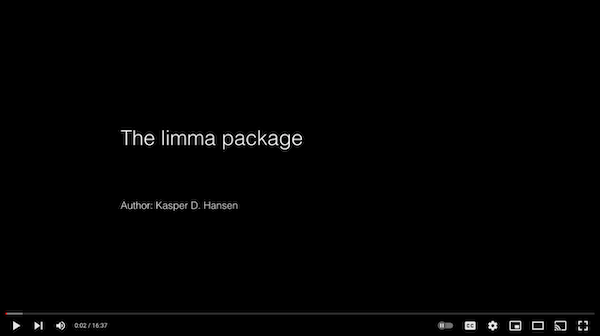

# Lecture 8 Pre-reading:

* [Section 18.3: Least Squares Estimates](http://rafalab.dfci.harvard.edu/dsbook/linear-models.html#lse) in "Introduction to Data Science" by Rafael Irizarry
* [This 2.5 minute video clip introducing limma](https://www.youtube.com/embed/ZRet1oeGiUU?&end=150) from [Kasper Hansen's course "Bioconductor for Genomic Data Science"](https://kasperdanielhansen.github.io/genbioconductor/):

