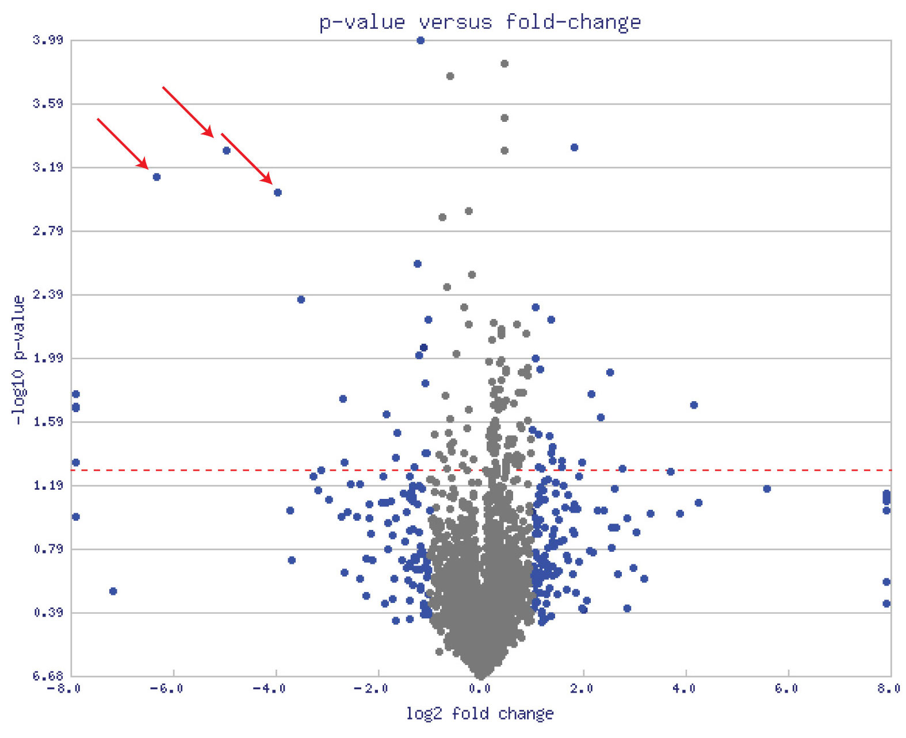
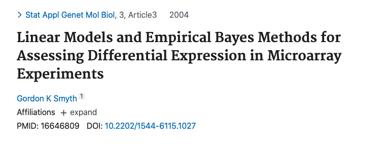
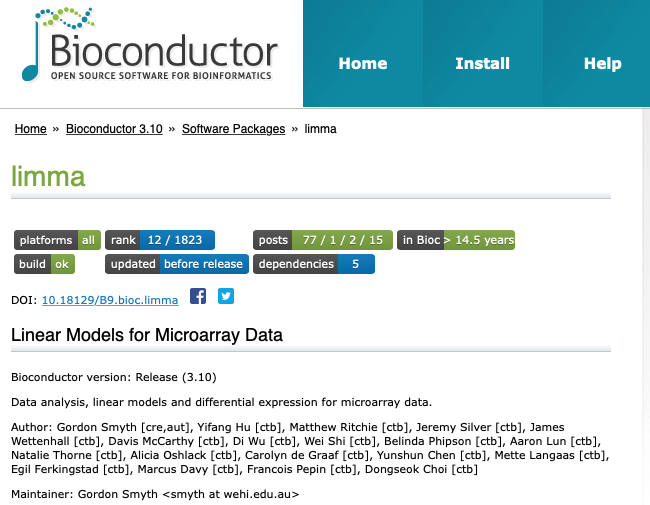

```{r, echo = FALSE}
knitr::opts_chunk$set(tidy = FALSE, tidy.opts=list(width.cutoff=80), fig.retina=3)
ggplot2::theme_set(ggplot2::theme_bw(base_size = 20))
ggplot2::update_geom_defaults("point", list(size = 3))

library(knitr)
hook_output = knit_hooks$get('output')
knit_hooks$set(output = function(x, options) {
  # this hook is used only when the linewidth option is not NULL
  if (!is.null(n <- options$linewidth)) {
    x = knitr:::split_lines(x)
    # any lines wider than n should be wrapped
    if (any(nchar(x) > n)) x = strwrap(x, width = n)
    x = paste(x, collapse = '\n')
  }
  
  lines <- options$output.lines
   if (is.null(lines)) {
     return(hook_output(x, options))  # pass to default hook
   }
   x <- unlist(strsplit(x, "\n"))
   if (length(lines)==1) {        # first n lines
     if (length(x) > lines) {
       # truncate the output
       x <- c(head(x, lines))
     }
   } else {
     x <- c(x[lines])
   }
   # paste these lines together
   x <- paste(c(x, ""), collapse = "\n")

  hook_output(x, options)
})

set.seed(47)
```

```{r xaringan-themer, include=FALSE, warning=FALSE}
library(xaringanthemer)
style_mono_accent(
  base_color = "#197aa0",
  header_font_google = google_font("Noto Sans"),
  text_font_google   = google_font("Nanum Gothic"),
  code_font_google   = google_font("Inconsolata"),
  base_font_size = "24px", 
  header_h1_font_size = "2rem",
  header_h2_font_size = "1.66rem",
  header_h3_font_size = "1.33rem",
  title_slide_background_image = "https://raw.githubusercontent.com/STAT540-UBC/stat540-ubc.github.io/main/images/stat540-logo-s.png",
  title_slide_background_size = "15%",
  title_slide_background_position = "95% 85%",
  link_color = "rgb(104, 27, 148)",
  link_decoration = "underline",
  extra_css = list(
    ".has-continuation" = list(
      "display" = "block !important"
    )
  )
)
```

```{css, echo = FALSE}
pre {
  white-space: pre-wrap;
}
.remark-code {
  background: #f8f8f8;
}
.remark-inline-code {
  background: "white";
}
.remark-code {
  font-size: 22px;
}
.huge .remark-code { /*Change made here*/
  font-size: 200% !important;
}
.tiny .remark-code { /*Change made here*/
  font-size: 60% !important;
}
.smaller .remark-code { /*Change made here*/
  font-size: 90% !important;
}
.smaller2 .remark-code { /*Change made here*/
  font-size: 80% !important;
}
.smaller3 .remark-code { /*Change made here*/
  font-size: 70% !important;
}
```

<style>
div.blue { background-color:#e8f2f6; border-radius: 5px; padding: 20px;}
</style>

# Summary so far


* ***t*** **-tests** can be used to test the equality of 2 population means

* **ANOVA** can be used to test the equality of more than 2 population means

* **Linear regression** provides a general framework for modeling the relationship between a response variable and different types of explanatory variables

  * *t*-tests can be used to test the significance of *individual* coefficients
  
  * *F*-tests can be used to test the simultaneous significance of *multiple* coefficients (e.g. multiple levels of a single categorical factor, or multiple factors at once)
  
  - *F*-tests are used to compare nested models (**overall** effects or **goodness of fit**)
  
- Next up: continuous explanatory variables! Multiple genes!
  
---

# Learning objectives for today

* Understand how linear regression represents continuous variables

  * Be familiar with the intuition behind how the regression line is estimated (Ordinary Least Squares)

  * Interpret parameters in a multiple linear regression model with continuous and factor variables
  
* Explain the motivation behind specialized methods regression models in high-dimensional settings
  * e.g. Empirical Bayes techniques in `limma`

---

## What if we treat age as a continuous variable?

```{r, include=FALSE}
library(GEOquery)
library(gridExtra)
library(tidyverse)
library(broom)
library(latex2exp)
library(limma)

eset <- getGEO("GSE4051", getGPL= FALSE)[[1]]

# recode time points
pData(eset) <- pData(eset) %>%
  mutate(sample_id = geo_accession) %>%
  mutate(dev_stage =  case_when(
    grepl("E16", title) ~ "E16",
    grepl("P2", title) ~ "P2",
    grepl("P6", title) ~ "P6",
    grepl("P10", title) ~ "P10",
    grepl("4 weeks", title) ~ "4W"
  )) %>%
  mutate(genotype = case_when(
    grepl("Nrl-ko", title) ~ "NrlKO",
    grepl("wt", title) ~ "WT"
  ))

pData(eset) <- pData(eset) %>%
  mutate(dev_stage = fct_relevel(dev_stage, "E16", "P2", "P6", "P10", "4W")) %>%
  mutate(genotype = as.factor(genotype)) %>%
  mutate(genotype = fct_relevel(genotype, "WT", "NrlKO")) %>%
  mutate(age = ifelse(dev_stage == "E16", -4,
                            ifelse(dev_stage == "P2", 2, 
                                   ifelse(dev_stage == "P6", 6, 
                                          ifelse(dev_stage == "P10", 10, 28)))))

toLongerMeta <- function(expset) {
    stopifnot(class(expset) == "ExpressionSet")
    
    expressionMatrix <- lonExpressionressionMatrix <- exprs(expset) %>% 
    as.data.frame() %>%
    rownames_to_column("gene") %>%
    pivot_longer(cols = !gene, 
                 values_to = "expression",
                 names_to = "sample_id") %>%
    left_join(pData(expset) %>% select(sample_id, dev_stage, age, genotype),
            by = "sample_id")
  return(expressionMatrix)
}

twoGenes <- toLongerMeta(eset) %>% 
  filter(gene %in% c("1456341_a_at", "1441811_x_at")) %>%
  mutate(gene = ifelse(gene == "1456341_a_at", "Klf9", "Tmem176a")) 
```


```{r, echo=FALSE, fig.width=14, fig.height=3.25, fig.align="center", warning=FALSE, message = FALSE}
boreLimC <- ggplot(filter(twoGenes, gene == "Klf9"), 
                  aes(x = age, y = expression)) + 
             geom_point(alpha = 0.7) +
             labs(title = "Klf9") +
             theme(legend.position = "none") +
             ylim(5, 11) +
             xlab("age (days)") 

hitLimC <- ggplot(filter(twoGenes, gene == "Tmem176a"), 
                 aes(x = age, y = expression)) + 
             geom_point(alpha = 0.7) +
             labs(title = "Tmem176a") +
             ylim(5, 11) +
             ylab("") +
             xlab("age (days)") 
```

```{r, echo=FALSE, fig.width=14, fig.height=7, fig.align="center", warning=FALSE, message = FALSE}
boreLim <- ggplot(filter(twoGenes, gene == "Klf9"), 
                  aes(x = dev_stage, y = expression)) + 
             geom_jitter(width = 0, alpha = 0.7) +
             theme(legend.position = "none") +
             labs(title = "Klf9") +
             ylim(5, 11) +
             xlab("Developmental Stage")

hitLim <- ggplot(filter(twoGenes, gene == "Tmem176a"), 
                 aes(x = dev_stage, y = expression)) + 
             geom_jitter(width=0, alpha = 0.7) +
             labs(title = "Tmem176a") +
             ylim(5, 11) +
             ylab("") +
             xlab("Developmental Stage") 

grid.arrange(boreLim + stat_summary(aes(group=1), fun =mean, geom="line", colour="grey"), 
             hitLim + stat_summary(aes(group=1), fun =mean, geom="line", colour="grey"), 
             boreLimC + stat_summary(aes(group=1), fun =mean, geom="line", colour="grey"), 
             hitLimC + stat_summary(aes(group=1), fun =mean, geom="line", colour="grey"), nrow = 2)
```

---

# Linear model with age as continuous covariate

```{r, echo=FALSE, fig.width=14, fig.height=4.5, fig.align="center", warning=FALSE, message = FALSE}
grid.arrange(boreLimC + stat_summary(aes(group=1), fun =mean, geom="line", colour="grey"), 
             hitLimC + stat_summary(aes(group=1), fun =mean, geom="line", colour="grey"), nrow = 1)
```

* Linear looks reasonable for gene Tmem176a, but not so much for Klf9

* For now, assume linear is reasonable

---

# Simple Linear Regression (Matrix form)

$$\large \mathbf{Y = X \boldsymbol\alpha + \boldsymbol\varepsilon}$$

For 1 continuous/quantitative covariate:

$$\mathbf{Y} = \begin{bmatrix}
  y_{1} \\
  y_{2} \\
  \vdots \\
  y_{n} \\
\end{bmatrix}, \hspace{1em}
\mathbf{X} = \begin{bmatrix}
  1 & x_{1} \\
  1 & x_{2} \\
  \vdots & \vdots \\
  1 & x_{n} \\
\end{bmatrix}, \hspace{1em}
\boldsymbol\alpha = \begin{bmatrix}
  \alpha_{0} \\
  \alpha_{1} \\
\end{bmatrix}, \hspace{1em}
\boldsymbol\varepsilon=\begin{bmatrix}
  \varepsilon_{1} \\
  \varepsilon_{2} \\
  \vdots \\
  \varepsilon_{n} \\
\end{bmatrix}$$

* $\alpha_0=$ the **intercept** (expected value of $y$ when $x$ is equal to zero)

* $\alpha_1=$ the **slope** (expected change in $y$ for every one-unit increase in $x$)

---

# Simple Linear Regression (Matrix form)

$$\large \mathbf{Y = X \boldsymbol\alpha + \boldsymbol\varepsilon}$$

Remember / convince yourself that the matrix algebra yields simple linear equations:
$$\begin{bmatrix}
  y_{1} \\
  y_{2} \\
  \vdots \\
  y_{n} \\
\end{bmatrix}=\begin{bmatrix}
  1 & x_{1} \\
  1 & x_{2} \\
  \vdots & \vdots \\
  1 & x_{n} \\
\end{bmatrix}\begin{bmatrix}
  \alpha_{0} \\
  \alpha_{1} \\
\end{bmatrix}+\begin{bmatrix}
  \varepsilon_{1} \\
  \varepsilon_{2} \\
  \vdots \\
  \varepsilon_{n} \\
\end{bmatrix}=\begin{bmatrix}
  1*\alpha_0 + x_{1}\alpha_{1} \\
  1*\alpha_0 + x_{2}\alpha_{1} \\
   \vdots \\
  1*\alpha_0 + x_{n}\alpha_{1} \\
\end{bmatrix}+\begin{bmatrix}
  \varepsilon_{1} \\
  \varepsilon_{2} \\
  \vdots \\
  \varepsilon_{n} \\
\end{bmatrix}$$

$$=\begin{bmatrix}
  \alpha_0 + x_{1}\alpha_{1} + \varepsilon_{1} \\
  \alpha_0 + x_{2}\alpha_{1} + \varepsilon_{2}\\
   \vdots \\
  \alpha_0 + x_{n}\alpha_{1} + \varepsilon_{n} \\
\end{bmatrix}$$
$$\Rightarrow y_i = \alpha_0 + x_i\alpha_1 + \varepsilon_i$$
---

# SLR with continuous age covariate

.pull-left[
```{r, echo=FALSE, fig.width=7, fig.height=5, warning=FALSE, message = FALSE}
hitLimC
```
]


<br>
Interpretation of **intercept**:
.smaller2[
```{r, highlight.output=2}
filter(twoGenes, gene == "Tmem176a") %>%
lm(expression ~ age, data = .) %>%
  summary() %>% .$coeff
```
]

$H_0: \alpha_0 = 0$
tests the null hypothesis that the intercept is zero - usually, not of interest


---

# SLR with continuous age covariate

.pull-left[
```{r, echo=FALSE, fig.width=7, fig.height=5, warning=FALSE, message = FALSE}
hitLimC
```
]

<br>
Interpretation of **slope**:
.smaller2[
```{r, highlight.output=3}
filter(twoGenes, gene == "Tmem176a") %>%
lm(expression ~ age, data = .) %>%
  summary() %>% .$coeff
```
]

$H_0: \alpha_1 = 0$
tests the null hypothesis that there is no association between gene expression and age - usually of interest


---

# How do we estimate the intercept and slope? 

Is there an **optimal** line?


```{r, output.lines=c(9:18), highlight.output=c(3,4)}
filter(twoGenes, gene == "Tmem176a") %>%
lm(expression ~ age, data = .) %>%
  summary()
```


---

# Which one is the *best* line?

```{r, echo=FALSE, fig.width=8, fig.height=6, fig.align="center", warning=FALSE, message = FALSE}
set.seed(12)
int <- summary(lm(expression ~ age, 
                  data=filter(twoGenes, gene == "Tmem176a")))$coef[1,1]
slp <- summary(lm(expression ~ age, 
                  data=filter(twoGenes, gene == "Tmem176a")))$coef[2,1]

hitLimC +
  geom_abline(intercept = int + rnorm(1, sd=0.5), 
              slope = slp + rnorm(1,sd=2e-2), colour = "red", cex=1) +
  geom_abline(intercept = int + rnorm(1, sd=0.5), 
              slope = slp + rnorm(1,sd=2e-2), colour = "green", cex=1) +
  geom_abline(intercept = int + rnorm(1, sd=0.5), 
              slope = slp + rnorm(1,sd=2e-2), colour = "purple", cex=1) +
  geom_abline(intercept = int + rnorm(1, sd=0.5), 
              slope = slp + rnorm(1,sd=2e-2), colour = "orange", cex=1) +
  geom_abline(intercept = int, 
              slope = slp, colour = "blue", cex=1)
```

---

# Ordinary Least Squares

.pull-left[
```{r, echo=FALSE, fig.width=7, fig.height=6, fig.align="center", warning=FALSE, message = FALSE}
d=twoGenes %>% filter(gene == "Tmem176a")
fit <- lm(expression ~ age, data=d)

d$predicted <- predict(fit)   # Save the predicted values
d$residuals <- residuals(fit) # Save the residual values

hitLimC +
   geom_abline(intercept = int, slope = slp, colour = "blue", 
               cex=1, linetype = 2) +
  geom_segment(data=d[7,], aes(xend = age, yend = predicted), colour="red", cex=1.1, 
               arrow = arrow(ends="both", length = unit(0.1, "in"), type = "open")) +
  annotate("text", label="Residual", x=-1.75,y=d[7,]$expression-0.4, colour = "red", cex=8)
  
```
]


.pull-right[
* **Ordinary Least Squares (OLS)** regression: parameter estimates minimize the sum of squared errors

* **Error**: vertical $(y)$ distance between the true regression line (unobserved) and the real observation 

* **Residual**: vertical $(y)$ distance between the fitted regression line and the real observation (estimated error)
]

---

# OLS interactive demo

Visual representation of the squared errors in OLS: [http://setosa.io/ev/ordinary-least-squares-regression/](http://setosa.io/ev/ordinary-least-squares-regression/)

Visit the link and take a few minutes to explore the first two plots:

1. In the first plot, drag individual points around and observe how the line changes

2. In the second plot, adjust the slope and intercept dials and observe how the second plot changes 
  - note: you can reset to default values by refreshing the page

<div class="blue">
In general, what happens to the total area of the squares when you modify the slope and intercept from the default values?
</div>
  
---

## OLS Estimator for Simple Linear Regression (1 covariate)

* Mathematically: $\varepsilon_i$ represents the error 
$$y_i = \alpha_0 + \alpha_1x_i + \varepsilon_i,  i = 1, ..., n$$

* We want to find the line (i.e. an intercept and slope) such that the sum of squared errors is minimized
$$S(\alpha_0, \alpha_1)= \sum_{i=1}^n (y_i - \alpha_0 - \alpha_1 x_i)^2$$
    
    * $\varepsilon_i=y_i - \alpha_0 - \alpha_1 x_i$ is the error 
    
    * $S(\alpha_0, \alpha_1)$ is called an *objective function*
    
* How to obtain estimates $(\hat{\alpha}_0, \hat{\alpha}_1)$ ? Let's look at a more general case

---

## OLS for Multiple Linear Regression (p covariates)

* Mathematically:  
$$S(\alpha_0, \alpha_1, \alpha_2, ..., \alpha_p) = \sum_{i=1}^n (y_i - \alpha_0 - \alpha_1 x_{1i} - \alpha_2 x_{2i} - ... - \alpha_p x_{pi})^2$$
$$=(\mathbf{y}-\mathbf{X}\boldsymbol\alpha)^T(\mathbf{y}-\mathbf{X}\boldsymbol\alpha)$$

* We need to find values of $\boldsymbol\alpha=(\alpha_0, \alpha_1, ..., \alpha_p)$ that minimize the sum of squares $S$

--

* To do so, take partial derviatives with respect to each coefficient, set to zero, and solve the system of equations:

$$\frac{\partial S}{\partial\alpha_0}=\begin{bmatrix}
  \frac{\partial S}{\partial\alpha_0} \\
  \frac{\partial S}{\partial\alpha_1} \\
  \vdots\\
  \frac{\partial S}{\partial\alpha_p} \\
\end{bmatrix}=\begin{bmatrix}
  0 \\
  0 \\
  \vdots\\
  0 \\
\end{bmatrix}$$

---

# Properties of OLS regression 

**Regression model**: $\mathbf{Y = X \boldsymbol\alpha + \boldsymbol\varepsilon}$

**OLS estimator**: $\hat{\boldsymbol\alpha} =(\mathbf{X}^T\mathbf{X})^{-1}\mathbf{X}^T\mathbf{y}$

**Fitted/predicted values**: $\hat{\mathbf{y}} = \mathbf{X} \hat{\boldsymbol\alpha}$

$$= \mathbf{X} (\mathbf{X}^T\mathbf{X})^{-1}\mathbf{X}^T\mathbf{y} = \mathbf{H}\mathbf{y}$$ 
where $\mathbf{H}=\mathbf{X} (\mathbf{X}^T\mathbf{X})^{-1}\mathbf{X}^T$ is called the "hat matrix"

--

**Additional assumptions** (required for results on the next few slides):
1. $\boldsymbol\varepsilon$ have mean zero

2. $\boldsymbol\varepsilon$ are iid (implies constant variance)

Further, if $\boldsymbol\varepsilon$ are iid **Normal**, then OLS estimator is also MLE (Maximum Likelihood Estimator)

---

# Properties of OLS regression (cont'd)


**Residuals**: (note NOT the same as errors $\boldsymbol\varepsilon$) $$\hat{\boldsymbol\varepsilon} = \mathbf{y} - \hat{\mathbf{y}} = \mathbf{y} -  \mathbf{X} \hat{\boldsymbol\alpha}$$ 

**Estimated error variance**: $$\hat{\sigma}^2 =  \frac{1}{n-p} \hat{\boldsymbol\varepsilon}^T \hat{\boldsymbol\varepsilon}$$

**Estimated covariance matrix of** $\hat{\boldsymbol\alpha}$: $$\hat{Var}(\hat{\boldsymbol\alpha}) = \hat{\sigma}^2(\mathbf{X}^T\mathbf{X})^{-1}$$

**Estimated standard errors for estimated regression coefficients**: 
$\hat{se}(\hat{\alpha}_j)$, obtained by taking the square root of the diagonal elements of $\hat{Var}(\hat{\boldsymbol\alpha})$

---

# Inference in Regression (normal iid errors)

<big>

How to test $H_0: \alpha_j = 0$?

With a ***t*-test**! 

Under $H_0$, 

$$\frac{\hat{\alpha}_j}{\hat{se}(\hat{\alpha}_j)} \sim t_{n-p}$$

So a *p*-value is obtained by computing a tail probability for the observed value of $\hat{\alpha}_j$ from a $t_{n-p}$ distribution

---

## Inference - what if we don't assume Normal errors?

--
<big>

How to test $H_0: \alpha_j = 0$?

Assuming large enough sample size, with a ***t*-test**! 

Under $H_0$, <font color="red"> asymptotically (by CLT)</font>

$$\frac{\hat{\alpha}_j}{\hat{se}(\hat{\alpha}_j)} \sim t_{n-p}$$

So <font color="red">with a large enough sample size</font> a *p*-value for this hypothesis test is obtained by computing a tail probability for the observed value of $\hat{\alpha}_j$ from a $t_{n-p}$ distribution

---

# Diagnostics: `plot(lm(y~x))`

.left-column[
Do our assumptions hold?
* Constant variance
* iid errors
* Normality of errors
]

```{r, echo=FALSE, fig.width=10, fig.height=7, fig.align="center", warning=FALSE, message = FALSE}
par(mfrow=c(2,2))
plot(lm(expression ~ age, data = filter(twoGenes, gene == "Tmem176a")),  ask=FALSE)
```

---

# **Linear** regression 

* The nature of the regression function $y=f(x|\boldsymbol\alpha)$ is one of the defining characteristics of a regression model

* $f$ is not linear in $\boldsymbol\alpha \Rightarrow$ **nonlinear model**

  * For example, consider nonlinear parametric regression: $$ y_i = \frac{1}{1 + e^{\alpha_0 + \alpha_1 x_i}} + \varepsilon$$
    

* $f$ is linear in $\boldsymbol\alpha \Rightarrow$ **linear model** 
  * We just examined simple linear regression (a linear model): $y_i = \alpha_0 + \alpha_1x_i + \varepsilon_i$

  * What we could do instead: polynomial regression (also a linear model) $$y_i = \alpha_0 + \alpha_1x_i + \alpha_2x_i^2 + \varepsilon_i$$


---

## Polynomial regression 

```{r, echo=FALSE}
## and this as our example gene
oneGene <- toLongerMeta(eset) %>% 
  filter(gene %in% c("1427275_at")) %>%
  mutate(gene = "Smc4")
```

.smaller[
```{r}
quadfit <- lm(expression ~ age + I(age^2), data = oneGene)
summary(quadfit)
```
]

---

## Polynomial regression 

```{r, echo=FALSE, fig.width=8, fig.height=5.5, fig.align="center", warning=FALSE, message = FALSE}

boreLimC <- ggplot(oneGene, 
                  aes(x = age, y = expression)) + 
             geom_point(alpha = 0.7) +
             labs(title = "Smc4") +
             theme(legend.position = "none") +
             ylim(6, 11) +
             xlab("age (days)") + 
             stat_smooth(method="lm", se=FALSE, fill=NA,
                formula=y ~ poly(x, 2),colour="blue")

boreLimC
```
Note that **this is still a linear model**, because it is linear in the $\alpha_j$ 

---

## Putting it all together (continuous + categorical variables)
```{r, echo=FALSE, fig.width=9, fig.height=5.5, fig.align="center", warning=FALSE, message = FALSE}
p1 <- ggplot(filter(twoGenes, gene=="Tmem176a"), 
                  aes(x = age, y = expression, colour=genotype)) + 
             geom_point(alpha = 0.7) +
             labs(title = "Tmem176a") +
             ylim(5, 10) +
             xlab("age (days)") + 
             stat_smooth(method="lm", se=FALSE)
p1 
```

---

## Interaction between continuous and categorical variables

<big>

```{r}
lm(expression ~ age*genotype, data = filter(twoGenes, gene=="Tmem176a")) %>% 
  summary() %>% .$coeff
```

`(Intercept)`: Intercept of WT line

`age`: slope of WT (reference) line

`genotypeNrlKO`: difference in intercepts (KO vs WT)

`age:genotypeNrlKO`: difference in slopes (KO vs WT)

---

# Reminder about the Intercept

```{r, echo=FALSE, fig.width=9, fig.height=5.5, fig.align="center", warning=FALSE, message = FALSE}
p1 + geom_vline(xintercept = 0, linetype = 2, colour = "red")
```

Intercept terms refer to the estimates when the continuous covariate is equal to zero. Note that this is not usually very interesting on its own. 

---

## Interaction between continuous and categorical variables


$$\Large y_{ij} = \alpha_{0} + \tau_{KO}x_{ij, KO} + \tau_{Age} x_{ij, Age} + \tau_{KO:Age} x_{ij, KO}x_{ij, Age}$$

where
* $j \in \{ WT, NrlKO\}$, $i = 1,2,...,n_j$
* $x_{ij, KO}$ is the indicator variable for WT vs KO ( $x_{ij, KO}=1$ for $j=NrlKO$ and 0 for $j=WT$ ) 
* $x_{ij, Age}$ is the continuous age covariate

Interpretation of parameters:
* $\alpha_0$ is the expected expression in WT for age = 0
* The "intercept" for the knockouts is: $\alpha_0 + \tau_{KO}$
* $\tau_{Age}$ is the expected increase in expression in WT for every 1 day increase in age 
* The slope for the knockouts is: $\tau_{Age} + \tau_{KO:Age}$

---

# Nested models

As always, you can assess the relevance of several terms at once - such as everything involving genotype - with an ***F*-test**:

```{r}
anova(lm(expression ~ age*genotype, data = filter(twoGenes, gene=="Klf9")),
      lm(expression ~ age, data = filter(twoGenes, gene=="Klf9")))
```

We don't have evidence that genotype affects the intercept or the slope

---

# *F*-tests in regression

| Model | Example | # params (df) | RSS |
| ----- | ------- | ------------- | ---- |
| Reduced | expression ~ age | $p_{Red}=2$ | $RSS_{Red}$ |
| Full | expression ~ age * genotype | $p_{Full}=4$ | $RSS_{Full}$|

**Full:**
$y_{ij} = \alpha_{0} + \tau_{KO}x_{ij, KO} + \tau_{Age} x_{ij, Age} + \tau_{KO:Age} x_{ij, KO}x_{ij, Age}$

**Reduced:**
$y_{ij} = \alpha_{0} + \tau_{Age} x_{ij, Age}$

Under $H_0:$ the reduced model explains the same amount variation in the outcome as the full,

$$F = \frac{\frac{RSS_{Red}-RSS_{Full}}{p_{Full}-p_{Red}}}{\frac{RSS_{Full}}{n-p_{Full}}} \sim \text{  } F_{p_{Fill}-p_{Red},\text{ } n-{p_{Full}}}$$
A significant *F*-test means we reject the null; we have evidence that the full model explains significantly more variation in the outcome than the reduced.

---
# Linear regression summary

* linear model framework is extremely general 

* one extreme (simple): two-sample common variance *t*-test

* another extreme (flexible): a polynomial, potentially different for each level of some factor

    * dichotomous variable? 👍
    
    * categorical variable? 👍
    
    * quantitative variable? 👍
    
    * various combinations of the above? 👍
    
* Don't be afraid to build models with more than 1 covariate

---

# What about the other 45 thousand probesets??

```{r, echo=TRUE}
eset
```

---

# Linear regression of many genes


$$\Large \mathbf{Y}_g = \mathbf{X}_g \boldsymbol\alpha_g + \boldsymbol\varepsilon_g$$
<big>

* The g in the subscript reminds us that we'll be fitting a model like this *for each gene g* that we have measured for all samples

* Most of the time, the design matrices $\mathbf{X}_g$ are, in fact, the same for all $g$. This means we can just use $\mathbf{X}$

* Note this means the residual degrees of freedom are also the same for all $g$ 
$$d_g = d = n - \text{dimension of } \boldsymbol\alpha = n-p$$

---

# Linear regression of many genes (cont'd)

* Data model: $\large\mathbf{Y}_g = \mathbf{X} \boldsymbol\alpha_g + \boldsymbol\varepsilon_g$

* Unknown error variance: $\large Var(\boldsymbol\varepsilon_g) = \sigma^2_g$

* Estimated error variance: $\large\hat{\sigma}^2_g = s^2_g = \frac{1}{n-p}\hat{\boldsymbol\varepsilon_g}^T\hat{\boldsymbol\varepsilon_g}$

* Estimated variance of parameter estimates: $\large\hat{Var}(\hat{\boldsymbol\alpha_g}) =  s^2_g (\mathbf{X}^T\mathbf{X})^{-1} =  s^2_g \mathbf{V}$

  * $\bf{V}$ is the "unscaled covariance" matrix, and is the same for all genes! 

  * Estimated standard errors for estimated regression coefficients: 
$\large\hat{se}(\hat{\alpha}_{jg})$
    - obtained by taking the square root of the $j^{th}$ diagonal element of $\hat{Var}(\hat{\boldsymbol\alpha}_g)$, which is $s_g\sqrt{v_{jj}}$

---

class: middle 
## So far, nothing is new - these are the "regular" *t* statistics for gene *g* and parameter *j*:

$$t_{gj} = \frac{\hat{\alpha}_{gj}}{s_g \sqrt{v_{jj}}} \sim t_{d} \text{ under } H_0$$

But there are *so* many of them!! 😲

---

## Observed (i.e. empirical) issues with the "standard" *t*-test <br> approach for assessing differential expression 

```{r,echo=FALSE,out.width="600", fig.align="center"}

```

---

## Observed (i.e. empirical) issues with the "standard" *t*-test approach for assessing differential expression 

<big>
<center>
<div class = "blue">
Some genes with very <b>small p-values</b> (i.e. large -log10 p-values) are not <b>biologically meaningful</b> (small effect size, e.g. fold change)
</div>

---

## How do we end up with small p-values but subtle effects?

<big>

$$\large t_{gj} = \frac{\hat{\alpha}_{gj}}{\hat{se}(\hat{\alpha}_{gj})} = \frac{\hat{\alpha}_{gj}}{s_g \sqrt{v_{jj}}} \sim t_d \text{ under } H_0$$
--

* Small variance estimate $s_g$ leads to large *t* statistic $\rightarrow$ small *p*-value

--

* Recall: estimates of sample variance from small sample sizes tend to under-estimate the true variance!

--

* This has led to the development of specialized methodology for assessing genome-wide differential expression 

---

# Empirical Bayesian techniques: `limma`

.pull-left[
```{r,echo=FALSE,out.width="600", fig.align="center"}

```

[Smyth 2004](http://www.statsci.org/smyth/pubs/ebayes.pdf)
]
.pull-right[
```{r,echo=FALSE,out.width="500", fig.align="center"}

```
]

---

# Why use `limma` instead of regular *t*-tests?

.center[]

* **Borrows information** from all genes to get a better estimate of the variance (especially in smaller sample size settings)

--

* Efficiently fits many regression models **without replicating unnecessary calculations**!

--

* Arranges output in a convenient way to ease further analysis, visualization, and interpretation

---

# How does Empirical Bayes work?

<big>

.pull-left[
* **Empirical**: observed

* **Bayesian**: incorporate 'prior' information

* Intuition: estimate prior information from data; *shrink* (nudge) all estimates toward the consensus
]


.pull-right[
**Shrinkage = borrowing information across all genes**
```{r,echo=FALSE,out.width="450", fig.align="center"}

```
]

---

# Genome-wide OLS fits


* Gene by gene:

  * `lm(y ~ x, data = gene)` for each gene
  
  * For example, using `dplyr::group_modify` and `broom::tidy`
 
--

* All genes at once, using `limma`: 

  * `lmFit(myDat, desMat)`
  
  * `myDat` contains expression values for all genes
  
  * `desMat` is a specially formatted design matrix (more on this later)
  
  * Or, even better, `lmFit(eset, desMat)` where `eset` is an [`ExpressionSet`](https://kasperdanielhansen.github.io/genbioconductor/html/ExpressionSet.html) object
  
---

class: middle

##'Industrial scale' model fitting is good, because computations involving just the design matrix $\mathbf{X}$ are not repeated 30K unnecessarily: 

* **OLS estimator**: $$\hat{\boldsymbol\alpha} =(\mathbf{X}^T\mathbf{X})^{-1}\mathbf{X}^T\mathbf{y}$$

* **Fitted/predicted values**: $$\hat{\mathbf{y}} = \mathbf{X} (\mathbf{X}^T\mathbf{X})^{-1}\mathbf{X}^T\mathbf{y} = \mathbf{H}\mathbf{y}$$ 

---

## OLS of first 2000 genes, using `lm` gene by gene

.pull-left[
.smaller3[
```{r, echo = FALSE}
allGenes <- toLongerMeta(eset) 
```
```{r}
allGenes %>% head(10)
```
]]

.pull-right[
.smaller3[
```{r}
system.time(lmfits <- allGenes %>%
    filter(gene %in% unique(allGenes$gene)[1:2000]) %>%
    group_by(gene) %>% 
    group_modify(~ tidy(lm(expression ~ age + genotype, 
                           data = .x))) %>%
    select(gene, term, estimate) %>%
    pivot_wider(names_from = term, values_from = estimate)) 
lmfits %>% head() %>% as.data.frame()
```
]]

---

## OLS of **all** genes at once, using `limma`:

.smaller[
```{r}
system.time( limmafits <- 
  lmFit(eset, model.matrix(~ age + genotype, data = pData(eset))))
limmafits$coefficients %>% head()
```
]

--

So far, no shrinkage.

---

class: middle 

# How can we better estimate the SE?

<big> 
$$\large t_{gj} = \frac{\hat{\alpha}_{gj}}{\hat{se}(\hat{\alpha}_{gj})} = \frac{\hat{\alpha}_{gj}}{s_g \sqrt{v_{jj}}} \sim t_d \text{ under } H_0$$
<font colour="blue">
<center> Under-estimated variance leads to overly large t statistic, which leads to artificially small p-value
</font>

---

# Modeling in `limma` 

limma assumes that for each gene $g$

$$\hat{\alpha}_{gj} \,|\,\alpha_{gj}, \sigma_g^2 \sim N(\alpha_{gj}, \sigma_g^2 v_{jj})$$
$$s^2_g \,|\, \sigma_g^2 \sim \frac{\sigma_g^2}{d}\chi^2_d$$ 
which are the same as the usual assumptions about ordinary $t$-statistics:


$$\large t_{gj} = \frac{\hat{\alpha}_{gj}}{\hat{se}(\hat{\alpha}_{gj})} = \frac{\hat{\alpha}_{gj}}{s_g \sqrt{v_{jj}}} \sim t_d \text{ under } H_0$$

So far, nothing new...

---

# Modeling in `limma` - shrinkage

* limma imposes a hierarchical model, which describes how the gene-wise $\alpha_{gj}$'s and $\sigma^2_g$'s vary **across the genes**

  * We are no longer considering genes in isolation

* this is done by assuming a **prior distribution** for those quantities

* Prior distribution for **gene-specific variances** $\sigma^2_g$: an inverse Chi-square with mean $s_0^2$ and $d_0$ degrees of freedom:

$$\frac{1}{\sigma^2_g} \sim \frac{1}{d_0s_0^2} \chi^2_{d_0}$$
--

* this should feel a bit funny compared to previous lectures - $\sigma^2_g$ is no longer a **fixed** quantity! (i.e. this is **Bayesian**)

---

## How does this help us better estimate the variance?

* The **posterior distribution** is an updated version of the observed likelihood based on incorporating the prior information

* The posterior mean for gene-specific variance:

$$\tilde{s}^2_g = \frac{d_0s_0^2 + ds^2_g}{d_0 + d}$$

--

* How to think about it: a weighted mean of the prior (indirect evidence) and the observed (direct evidence) gene-specific variances:

$$\tilde{s}^2_g = \frac{d_0}{d_0 + d}s_0^2 + \frac{d}{d_0 + d}s^2_g$$
--

* More simply: "shrinking" the observed gene-specific variance towards the "typical" variance implied by the prior

---

# Moderated *t* statistic


* plug in this posterior mean estimate to obtain a 'moderated' *t* statistic:


$$\large \tilde{t}_{gj} = \frac{\hat{\alpha}_{gj}}{\tilde{s}_g \sqrt{v_{jj}}}$$
* Under limma's assumptions, we know the null distribution for the moderated *t*-statistic under $H_0$:
$$\tilde{t}_{gj} \sim t_{d_0+d}$$

* parameters from the prior $d_0$ and $s_0^2$ are estimated from the data

--

<div style= "float:right;position: relative;">
```{r,echo=FALSE,out.width="200"}
knitr::include_graphics("img/hybrid.jpg")
```
</div>

* This is how limma is a **hybrid** of frequentist (*t*-statistic) and Bayesian (hierarchical model) approaches

---

## Side-by-side comparison of key quantities and results

<big>
<center>

|  | OLS  | limma |
| ---- | :----------------: | :-----: |
| Estimated gene-wise <br>residual variance: | ${s}_g^2 =  \frac{1}{n-p} \hat{\boldsymbol\varepsilon}^T \hat{\boldsymbol\varepsilon}$ | $\tilde{s}^2_g = \frac{d_0s_0^2 + ds^2_g}{d_0 + d}$ |
| *t*-statistic for <br> $H_0: \alpha_{gj} = 0$:| ${t}_{gj} = \frac{\hat{\alpha}_{gj}}{s_g \sqrt{v_{jj}}}$ | $\tilde{t}_{gj} = \frac{\hat{\alpha}_{gj}}{\tilde{s}_g \sqrt{v_{jj}}}$ |
| distribution of the <br>*t*-statistic under $H_0$: | ${t}_{gj} \sim t_{d}$ | $\tilde{t}_{gj} \sim t_{d_0+d}$ |

<sup>*</sup>Not shown: estimation formulas for prior parameters $d_0$ and $s_0^2$

---

# Moderated vs traditional tests

<big>

* **moderated variances** will be *"shrunk" toward the typical gene-wise variance*, relative to to raw sample residual variances

--

* **degrees of freedom** for null distribution *increase* relative to default $(d \text{ vs } d_0 + d)$
  * $\rightarrow$ makes it closer to a standard normal 
  * $\rightarrow$ makes tail probabilities (p-values) smaller 
  * $\rightarrow$ easier to reject the null

--

* overall, when all is well, limma will deliver statistical results that are **more stable** and **more powerful**


---

# Preview: `limma` workflow

```{r,echo=FALSE,out.width="700", fig.align="center"}
knitr::include_graphics("img/limma_flow.png")
```
