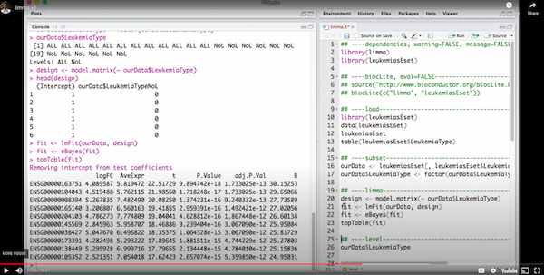

# Lecture 9 Pre-reading/watching:

* [This 14 minute screencast demonstrating design matrix construction and limma in action](https://www.youtube.com/embed/ZRet1oeGiUU?&start=150) (a continuation from last lecture's material) from Kasper Hansen's course ["Bioconductor for Genomic Data Science"](https://kasperdanielhansen.github.io/genbioconductor/):

* Sections 7-9 in Chapter 6 (Hypothesis Testing) in ["Modern Statistics for Modern Biology"](http://web.stanford.edu/class/bios221/book/) by Susan Holmes and Wolfgang Huber:

  * [6.7: Multiple testing](https://www.huber.embl.de/msmb/06-chap.html#multiple-testing)
  * [6.8: The family wise error rate](https://www.huber.embl.de/msmb/06-chap.html#sec-testing-FWER)
  * [6.9: The false discovery rate](https://www.huber.embl.de/msmb/06-chap.html#the-false-discovery-rate)

