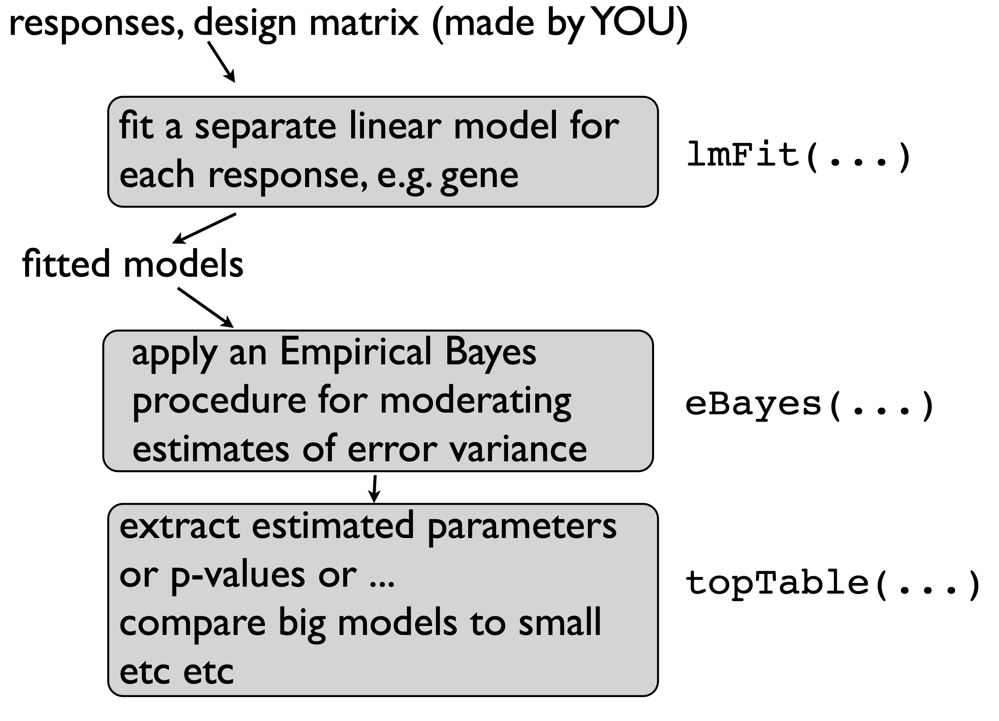
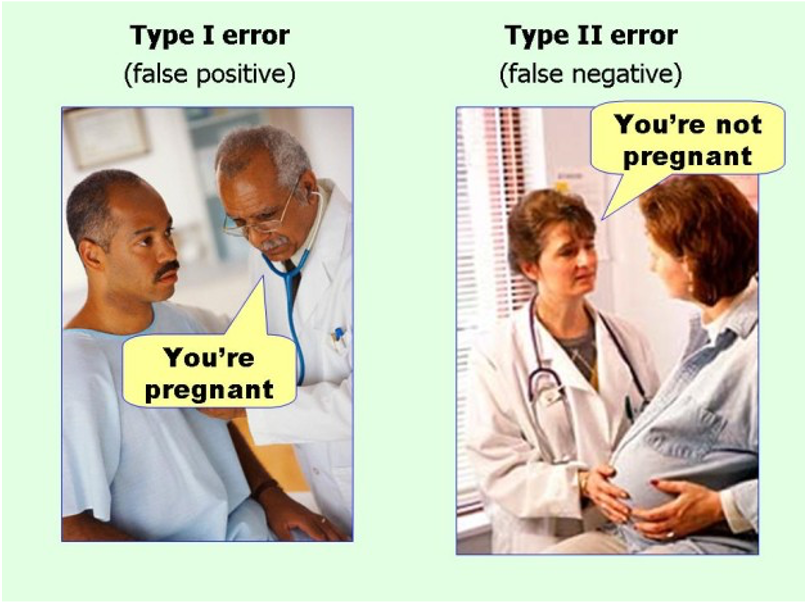
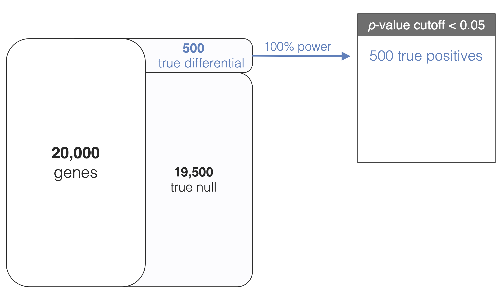
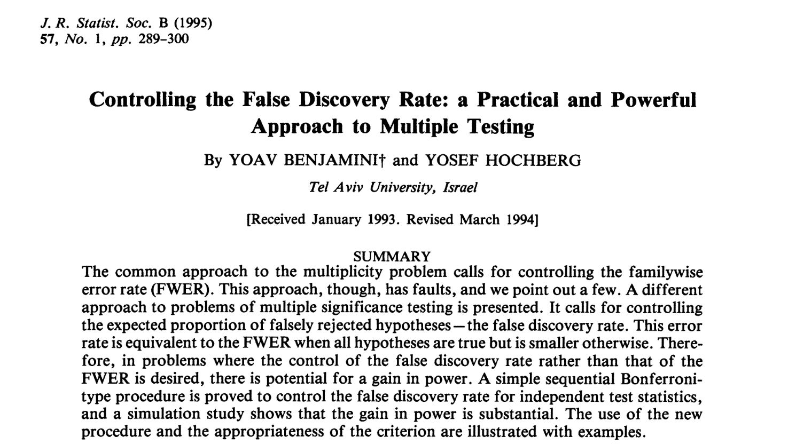

```{r, echo = FALSE}
knitr::opts_chunk$set(tidy = FALSE, tidy.opts=list(width.cutoff=80), fig.retina=3)
ggplot2::theme_set(ggplot2::theme_bw(base_size = 20))
ggplot2::update_geom_defaults("point", list(size = 3))

library(knitr)
hook_output = knit_hooks$get('output')
knit_hooks$set(output = function(x, options) {
  # this hook is used only when the linewidth option is not NULL
  if (!is.null(n <- options$linewidth)) {
    x = knitr:::split_lines(x)
    # any lines wider than n should be wrapped
    if (any(nchar(x) > n)) x = strwrap(x, width = n)
    x = paste(x, collapse = '\n')
  }
  
  lines <- options$output.lines
   if (is.null(lines)) {
     return(hook_output(x, options))  # pass to default hook
   }
   x <- unlist(strsplit(x, "\n"))
   if (length(lines)==1) {        # first n lines
     if (length(x) > lines) {
       # truncate the output
       x <- c(head(x, lines))
     }
   } else {
     x <- c(x[lines])
   }
   # paste these lines together
   x <- paste(c(x, ""), collapse = "\n")

  hook_output(x, options)
})

set.seed(47)
```

```{r xaringan-themer, include=FALSE, warning=FALSE}
library(xaringanthemer)
style_mono_accent(
  base_color = "#197aa0",
  header_font_google = google_font("Noto Sans"),
  text_font_google   = google_font("Nanum Gothic"),
  code_font_google   = google_font("Inconsolata"),
  base_font_size = "24px", 
  header_h1_font_size = "2rem",
  header_h2_font_size = "1.66rem",
  header_h3_font_size = "1.33rem",
  title_slide_background_image = "https://raw.githubusercontent.com/STAT540-UBC/stat540-ubc.github.io/main/images/stat540-logo-s.png",
  title_slide_background_size = "15%",
  title_slide_background_position = "95% 85%",
  link_color = "rgb(104, 27, 148)",
  link_decoration = "underline",
  extra_css = list(
    ".has-continuation" = list(
      "display" = "block !important"
    )
  )
)
```

```{css, echo = FALSE}
pre {
  white-space: pre-wrap;
}
.remark-code {
  background: #f8f8f8;
}
.remark-inline-code {
  background: "white";
}
.remark-code {
  font-size: 22px;
}
.huge .remark-code { /*Change made here*/
  font-size: 200% !important;
}
.tiny .remark-code { /*Change made here*/
  font-size: 60% !important;
}
.smaller .remark-code { /*Change made here*/
  font-size: 90% !important;
}
.smaller2 .remark-code { /*Change made here*/
  font-size: 80% !important;
}
.smaller3 .remark-code { /*Change made here*/
  font-size: 70% !important;
}
```

<style>
div.blue { background-color:#e8f2f6; border-radius: 5px; padding: 20px;}
</style>

# Announcements 

<big>

* **Midterm survey**: Link posted in [Discussion repo](https://github.com/STAT540-UBC-2022/Discussion/issues)
  
  * Help us improve your learning experience!
  
  * Please fill out before Feb 14 at 11:59pm

* **Projects**: feedback from your project mentors is posted on your initial project proposals (see the issue in your team's repository) 

  * finalized proposals due Friday

---

# Learning objectives

<big>

* How to use `limma` to perform genome-wide differential expression testing on microarray data

* Understand the key differences between `limma` and `lm`

* Explain why multiple testing increases the number of errors we make by chance

* Be able to adjust for multiple comparisons by controlling the False Discovery Rate 
  * e.g. using Benjamini-Hochberg or Storey's q-value

---

# Recall: The hybrid estimator in `limma`


 $$\tilde{s}^2_g = \frac{d_0s_0^2 + ds^2_g}{d_0 + d}$$

* recall that $(s_0, d_0)$ are the *prior* parameters for $\sigma^2_g$ (random variable):

$$\frac{1}{\sigma^2_g} \sim \frac{1}{d_0s_0^2} \chi^2_{d_0}$$
--

* the prior parameters incorporate information from all genes which allows us to **shrink/nudge the gene-specific variances toward a common consensus**

  * they are estimated from the data - the formulas for $(s_0, d_0)$ and their derivations are beyond the scope of the course, but `limma` takes care of the details for us

  * note that $(s_0, d_0)$ **do not depend on** $g$ 

---

# Preview: `limma` workflow

```{r,echo=FALSE,out.width="700", fig.align="center"}

```

---

# Functions that make your life easier

| Function | Description |
| -------- | ----------- |
| `model.matrix` | Takes in your data frame and makes a design matrix |
| `limma::lmFit` | Fits the linear model to each gene separately – replace gene with "feature" depending on your data ('industrial scale' `lm`) |
| `limma::makeContrasts` | Create the contrast matrix C that you desire |
| `limma::contrast.fit` | Apply a contrast to your estimates |
| `limma::eBayes` | Use output of linear regression to compute moderated *t* statistics |
| `limma::topTable` | Query your results; sort your p-values; sort genes; Adjust for multiple comparisons |
| `limma::decideTests` | Identify which genes are significantly differentially expressed for each contrast |

---

# Getting help

```{r,echo=FALSE,out.width="900", fig.align="center"}
knitr::include_graphics("img/limma_help.png")
```

* [Bioconductor homepage for limma](https://bioconductor.org/packages/release/bioc/html/limma.html)
* Bring up help pages for specific functions in RStudio, e.g. `?limma::topTable`

---

# `limma` step one: `lmFit`

.pull-left[
$$\mathbf{Y}_g = \mathbf{X} \boldsymbol\alpha_g + \boldsymbol\varepsilon_g,$$
* Within each gene observations are iid / constant variance

* `lmFit()` carries out multiple linear regression on each gene

* Usage: `lmFit(myDat, desMat)` 

  * `myDat` is a data.frame or matrix with features in rows and samples in columns  (*G* genes by *N* samples), or [`ExpressionSet`](https://bioconductor.org/packages/devel/workflows/vignettes/maEndToEnd/inst/doc/MA-Workflow.html#42_Bioconductor_ExpressionSets) object
  
  * `desMat` is a design matrix (output of `model.matrix(y ~ x)`; *N* samples by $p$ parameters)
]


.pull-right[
```{r echo=FALSE, out.width = 1000, fig.align='left'}
knitr::include_graphics("https://www.researchgate.net/publication/304005588/figure/fig1/AS:669094365892634@1536535936985/Structure-of-Bioconductors-ExpressionSet-class.png")
```
Bioconductor's ExpressionSet class
]

---

# Let's run `limma` for the interactive model with age (continuous) and genotype (factor)

$$\Large y_{ig} = \theta + \tau_{KO}x_{ig,KO} + \tau_{Age}x_{ig,Age} + \tau_{KO:Age}x_{ig,KO}x_{ig,Age}$$
* $i$ indexes mouse, $g$ indexes genes

* $x_{ig,KO}$ is the indicator variable for the NrlKO group

* $x_{ig,Age}$ is the continuous age variable 

---

# Interactive model with age and genotype

```{r, include=FALSE}
library(GEOquery)
library(gridExtra)
library(tidyverse)
library(broom)
library(latex2exp)
library(limma)

eset <- getGEO("GSE4051", getGPL= FALSE)[[1]]

# recode time points
pData(eset) <- pData(eset) %>%
  mutate(sample_id = geo_accession) %>%
  mutate(dev_stage =  case_when(
    grepl("E16", title) ~ "E16",
    grepl("P2", title) ~ "P2",
    grepl("P6", title) ~ "P6",
    grepl("P10", title) ~ "P10",
    grepl("4 weeks", title) ~ "4W"
  )) %>%
  mutate(genotype = case_when(
    grepl("Nrl-ko", title) ~ "NrlKO",
    grepl("wt", title) ~ "WT"
  ))

pData(eset) <- pData(eset) %>%
  mutate(dev_stage = fct_relevel(dev_stage, "E16", "P2", "P6", "P10", "4W")) %>%
  mutate(genotype = as.factor(genotype)) %>%
  mutate(genotype = fct_relevel(genotype, "WT", "NrlKO")) %>%
  mutate(age = ifelse(dev_stage == "E16", -4,
                        ifelse(dev_stage == "P2", 2, 
                                ifelse(dev_stage == "P6", 6, 
                                      ifelse(dev_stage == "P10", 10, 28))))) %>%
  select(sample_id, dev_stage, genotype, age)

toLongerMeta <- function(expset) {
    stopifnot(class(expset) == "ExpressionSet")
    
    expressionMatrix <- lonExpressionressionMatrix <- exprs(expset) %>% 
    as.data.frame() %>%
    rownames_to_column("gene") %>%
    pivot_longer(cols = !gene, 
                 values_to = "expression",
                 names_to = "sample_id") %>%
    left_join(pData(expset) %>% select(sample_id, dev_stage, age, genotype),
            by = "sample_id")
  return(expressionMatrix)
}

twoGenes <- toLongerMeta(eset) %>% 
  filter(gene %in% c("1456341_a_at", "1441811_x_at")) %>%
  mutate(gene = ifelse(gene == "1456341_a_at", "Klf9", "Tmem176a")) 
```

Example gene (but we want to fit this model on all genes):

```{r, echo=FALSE, fig.width=10, fig.height=5, fig.align="center", warning=FALSE, message = FALSE}
hitLimC <- ggplot(filter(twoGenes, gene == "Tmem176a"), 
                 aes(x = age, y = expression, colour = genotype)) + 
             geom_point(alpha = 0.7) +
             geom_smooth(method = "lm", se = FALSE) +
             labs(title = "Tmem176a") +
             ylim(5, 11) +
             ylab("") +
             xlab("age (days)") 
hitLimC
```
---

## Arranging input for `lmFit`: Bioconductor way

```{r}
eset
```

---

## Arranging input for `lmFit`: Separate expression & metadata


.smaller[
```{r}
myDat <- assayData(eset)$exprs
myDat[1:5,1:5]
```


```{r}
myMeta <- pData(eset)
myMeta[1:5,]
```
]

---

## Formulating input for `lmFit`: Design Matrix

.pull-left[
Bioconductor way:
.smaller[
```{r, linewidth=50}
desMat <- model.matrix(~ genotype*age, 
                       data = pData(eset))
```

Equivalently, if using the separate way: 
```
desMat <- model.matrix(~ genotype*age, 
                       data = myMeta)
```
]]

.pull-right[
.tiny[
```{r}
desMat 
```
]]

---

# Computation is fast

<big>

.smaller[
```{r}
system.time(gFit <- lmFit(eset, 
                          model.matrix(~ genotype*age, data = pData(eset))))
```
]

* Equivalently, using the 'separate' way: 
```
gFit <- lmFit(myDat, 
              model.matrix(~ genotype*age, data = myMeta))
```

* Using `lmFit` to fit an interactive model on 45K probesets takes a fraction of a second

--

* The time-intensive parts of an analysis lie in selecting the model and covariates, choosing how to parameterize it, and interpreting the output

---

# Output of `lmFit`


.pull-left[
.smaller[
```{r}
summary(gFit)
```
]
]

.pull-right[
.smaller[
```{r}
nrow(eset)
nrow(eset)*4
```
]

]

---

# Output of `lmFit`

.pull-left[
.smaller[
```{r}
summary(gFit)
```
]
]

.pull-right[

.smaller[
```{r}
nrow(eset)
nrow(eset)*4
```
]

* OK... but where are the shrunken variable estimates?? How do I pull out p-values??

* Actually, we haven't carried out the empirical Bayesian computation yet -- need to run `eBayes()`!
]

---

# Moderated *t*-tests using `eBayes`

<div style= "float:left; position: relative; top: -40px;">
.smaller3[
```{r}
summary(gFit)
```
]
</div>

<div style= "float:right; position: relative; top: -40px;">
.smaller3[
```{r, highlight.output=c(14:24)}
summary(ebFit <- eBayes(gFit))
```
]
</div>

---

# Components of the empirical Bayes estimators

<center>

| math  | plain english  | `limma` | numerical result | also in `lm`? |
| :---: | :------------: | :-----: | :-----: | :---: |
| $s_g^2$ | gene-specific residual variance | `gFit$sigma^2` | 45K numbers | $\checkmark$ |
| $d$ | residual degrees of freedom $(n-p)$ | `gFit$df.residual` | $39-4=35^*$ | $\checkmark$ |
| $s_0^2$ | mean of inverse $\chi^2$ prior for $s_g^2$ | `ebFit$s2.prior` | `r signif(ebFit$s2.prior,2)` | |
| $d_0$ | degrees of freedom for the prior | `ebFit$df.prior` | `r signif(ebFit$df.prior,3)` | |
| $\tilde{s}_g^2$ | posterior mean of $s_g^2$ (i.e. moderated residual variance) | `ebFit$s2.post` |  45K numbers | |

<small><small>
$^*$ limma can handle more complicated models where this is not the same for each gene, so this is actually a vector of 45K copies of the number 35

---

### `topTable()` will help us extract relevant output in a convenient format!

<small><small>
<pre>
topTable(fit, coef=NULL, number=10, genelist=fit$genes, adjust.method="BH",
         sort.by="B", resort.by=NULL, p.value=1, lfc=0, confint=FALSE)
</pre>

<table summary="R argblock">
<tr valign="top"><td><code>fit</code></td>
<td>
<p>list containing a linear model fit produced by <code>lmFit</code>, <code>lm.series</code>, <code>gls.series</code> or <code>mrlm</code>.
For <code>topTable</code>, <code>fit</code> should be an object of class <code>MArrayLM</code> as produced by <code>lmFit</code> and <code>eBayes</code>.</p>
</td></tr>
<tr valign="top"><td><code>coef</code></td>
<td>
<p>column number or column name specifying which coefficient or contrast of the linear model is of interest. For <code>topTable</code>, can also be a vector of column subscripts, in which case the gene ranking is by F-statistic for that set of contrasts.</p>
</td></tr>
<tr valign="top"><td><code>number</code></td>
<td>
<p>maximum number of genes to list</p>
</td></tr>
<tr valign="top"><td><code>adjust.method</code></td>
<td>
<p>method used to adjust the p-values for multiple testing.  Options, in increasing conservatism, include <code>"none"</code>, <code>"BH"</code>, <code>"BY"</code> and <code>"holm"</code>.
See <code><a href="../../stats/html/p.adjust.html">p.adjust</a></code> for the complete list of options. A <code>NULL</code> value will result in the default adjustment method, which is <code>"BH"</code>.</p>
</td></tr>
<tr valign="top"><td><code>sort.by</code></td>
<td>
<p>character string specifying statistic to rank genes by.
Possible values for <code>topTable</code> and <code>toptable</code> are <code>"logFC"</code>, <code>"AveExpr"</code>, <code>"t"</code>, <code>"P"</code>, <code>"p"</code>, <code>"B"</code> or <code>"none"</code>.
(Permitted synonyms are <code>"M"</code> for <code>"logFC"</code>, <code>"A"</code> or <code>"Amean"</code> for <code>"AveExpr"</code>, <code>"T"</code> for <code>"t"</code> and <code>"p"</code> for <code>"P"</code>.)
Possibilities for <code>topTableF</code> are <code>"F"</code> or <code>"none"</code>.
Possibilities for <code>topTreat</code> are as for <code>topTable</code> except for <code>"B"</code>.</p>
</td></tr>
</table>

... (truncated - see `?topTable` for full listing)
---

# Summary of `topTable` function

* `coef` is the argument where you specify the coefficient(s) you want to test for equality with zero (default is NULL; must be specified)

* `number` lets you control size of hit list (default is 10)

* `p.value` lets you specify a minimum adjusted p-value cutoff (default is 1)

* `lfc` lets you specify a minimum observed effect size - log2 fold change (default is 0)

* `sort.by` and `resort.by` give control over the ordering (default is by "B": log-odds that the gene is differentially expressed)

* `adjust.method` specifies how/if to adjust p-values for multiple testing (default is BH)

---

## `topTable` in action: `genotypeNrlKO` 


.smaller[
```{r}
topTable(ebFit, coef = "genotypeNrlKO")
```
]

* `topTable(ebFit, coef = 2)` is equivalent here, but much less informative!!

* What is the null hypothesis here? 

--

  * $H_0: \tau_{KO}=0$; this finds genes where the KO differs from WT *when age is zero*

---

## Plotting the top 6 probes for `genotypeNrlKO` 


```{r, echo=FALSE, fig.width=14, fig.height=7, fig.align="center", warning=FALSE, message = FALSE}

# top 6
keep <- topTable(ebFit, coef = "genotypeNrlKO")[1:6,]

topSixGenotype <- toLongerMeta(eset) %>% 
  filter(gene %in% rownames(keep)) %>%
  mutate(gene = factor(gene, levels = rownames(keep)))

ggplot(topSixGenotype, 
       aes( x = age, y = expression, color = genotype)) + 
             geom_point(shape = 1) +
             xlab("age (days)") +
             facet_wrap( ~ gene) + 
             stat_smooth(method="lm", se=FALSE, cex=0.5)

```

---


## `topTable` in action: `age` 


.smaller[
```{r}
topTable(ebFit, coef = "age")
```
]

* `topTable(ebFit, coef = 3)` is equivalent here, but much less informative!!

* What is the null hypothesis here?

--

  * $H_0: \tau_{Age}=0$; this finds genes where age significantly affects gene expression *for WT*

---

## Plotting the top 6 genes for `age`


```{r, echo=FALSE, fig.width=14, fig.height=7, fig.align="center", warning=FALSE, message = FALSE}

# top 6
keep <- topTable(ebFit, coef = "age")[1:6,]

topSixAge <- toLongerMeta(eset) %>% 
  filter(gene %in% rownames(keep)) %>%
  mutate(gene = factor(gene, levels = rownames(keep)))

ggplot(topSixAge, 
       aes( x = age, y = expression, color = genotype)) + 
             geom_point(shape = 1) +
             xlab("age (days)") +
             facet_wrap( ~ gene) + 
             stat_smooth(method="lm", se=FALSE, cex=0.5)

```

---

## `topTable` in action: `genotypeNrlKO:age` 


.smaller[
```{r}
topTable(ebFit, coef = "genotypeNrlKO:age")
```
]

* `topTable(ebFit, coef = 4)` is equivalent here, but much less informative!!

* What is the null hypothesis here?

--

  * $H_0: \tau_{KO:Age}=0$; this finds genes where the effect of age is significantly different in each genotype

---

## Plotting the top 6 genes for `genotypeNrlKO:age` 


```{r, echo=FALSE, fig.width=14, fig.height=7, fig.align="center", warning=FALSE, message = FALSE}

# top 6
keep <- topTable(ebFit, coef = "genotypeNrlKO:age")[1:6,]

topSixItx <- toLongerMeta(eset) %>% 
  filter(gene %in% rownames(keep)) %>%
  mutate(gene = factor(gene, levels = rownames(keep)))

ggplot(topSixItx, aes( x = age, y = expression, color = genotype)) + 
             geom_point(shape = 1) +
             xlab("age (days)") +
             facet_wrap( ~ gene) + 
             stat_smooth(method="lm", se=FALSE, cex=0.5)

```

---

## `topTable` in action: any effect of genotype

.smaller2[
```{r}
topTable(ebFit, coef = c("genotypeNrlKO", "genotypeNrlKO:age")) %>% as_tibble()
```
]

* `topTable(ebFit, coef = c(2,4))` is equivalent here, but much less informative!!

* What is the null hypothesis here?

--

  * $H_0: \tau_{KO} = \tau_{KO:Age}=0$; this finds genes where any (additive and/or interaction) effect of genotype is significant

---

## Plotting the top 6 genes for any effect of genotype


```{r, echo=FALSE, fig.width=14, fig.height=7, fig.align="center", warning=FALSE, message = FALSE}

# top 6
keep <- topTable(ebFit, coef = c("genotypeNrlKO", "genotypeNrlKO:age"))[1:6,]

topSixGenotypeMarginal <- toLongerMeta(eset) %>% 
  filter(gene %in% rownames(keep)) %>%
  mutate(gene = factor(gene, levels = rownames(keep)))

ggplot(topSixGenotypeMarginal, aes( x = age, y = expression, color = genotype)) + 
             geom_point(shape = 1) +
             xlab("age (days)") +
             facet_wrap( ~ gene) + 
             stat_smooth(method="lm", se=FALSE, cex=0.5)

```

---

# Comparison of $s_g^2$ and $\tilde{s}_g^2$ (shrinkage!)

.left-column[
Fill in the blank:

For **large** variances, limma \_\_\_\_\_\_\_\_\_ the estimates.

  (a) INCREASES
  
  (b) DECREASES
]

.right-column[
```{r echo=FALSE, fig.width=6.5, fig.height=5, fig.align="center", warning=FALSE, message = FALSE}

df <- data.frame(limma=ebFit$s2.post, lm=gFit$sigma^2)
shrinkplot <- df %>% ggplot(aes(y=limma, x = lm)) +
  geom_point(alpha=0.2) +
  geom_abline(intercept=0, slope=1, color="red") +
  ggtitle("Ests of gene-specific variance")
shrinkplot
```
]

---

# Comparison of $s_g^2$ and $\tilde{s}_g^2$ (shrinkage!)

.left-column[
Fill in the blank:

For **small** variances, limma \_\_\_\_\_\_\_\_\_ the estimates.

  (a) INCREASES
  
  (b) DECREASES
]

.right-column[
```{r echo=FALSE, fig.width=6.5, fig.height=5, fig.align="center", warning=FALSE, message = FALSE}

df <- data.frame(limma=ebFit$s2.post, lm=gFit$sigma^2)
shrinkplot +
  scale_x_log10() +
  scale_y_log10() 
```
This plot is on the log-scale to 'zoom in' on the low range
]

---

# Comparison of interaction coefficient p-values

```{r echo=FALSE, fig.width=6, fig.height=5, fig.align="center", warning=FALSE, message = FALSE}

allDat <- toLongerMeta(eset)
library(broom)

# this takes a while - let's save the results 
# so we don't have to run each time we knit
if (file.exists("data/lmpvals.rds")){
  lm_all <- readRDS("data/lmpvals.rds")
}else{
  lm_all <- allDat %>%
    group_by(gene) %>%
    do(tidy(lm(expression ~ genotype*age, .))) %>% 
    filter(term=="genotypeNrlKO:age") %>%
    pull(p.value)
  saveRDS(lm_all, "data/lmpvals.rds")
}

df <- data.frame(limma=topTable(ebFit, coef = "genotypeNrlKO:age", 
                                number=Inf, sort.by = "none")$P.Value,
                 lm=lm_all)

df %>% ggplot(aes(y=limma, x = lm)) +
  geom_point(alpha = 0.1) +
  geom_abline(intercept = 0, slope = 1, color="red") +
  ggtitle("p-value for genotypeNrlKO:age") 
```

* `r sum(df$limma > df$lm)` genes where limma p-value is *larger* than lm
* `r sum(df$limma < df$lm)` genes where limma p-value is *smaller* than lm

---

class: middle 

# <center> Multiple testing

---

# Recall the two types of errors

```{r, fig.align="center", echo = FALSE, out.width=650}

```

---

# Error rates

```{r, fig.align="center", echo = FALSE, out.width=675}
knitr::include_graphics("img/hypError.png")
```

<br>
$$\alpha = P(\text{Type I Error}), \text{   } \beta = P(\text{Type II Error}), \text{   Power} = 1- \beta$$ 

---

# Type I Error rate for $m$ tests

.pull-left[
* $P(\text{incorrect decision} | H_0) = \alpha$

  * let $\alpha=0.05$

* $P(\text{correct decision} | H_0) = 1-\alpha = 0.95$

]


---

# Type I Error rate for $m$ tests

.pull-left[
* $P(\text{incorrect decision} | H_0) = \alpha$

  * let $\alpha=0.05$

* $P(\text{correct decision} | H_0) = 1-\alpha = 0.95$


* $P(\text{correct decision on }m\text{ tests} | H_0) =$ $$(1-\alpha)^m = 0.95^m$$

* $P(\text{at least one error on }m\text{ tests} | H_0) =$ $$1 - (1-\alpha)^m =$$ $$1-0.95^m = \alpha_{FWER}$$

]

.pull-right[
```{r, fig.width=6, fig.height=5, echo=FALSE, fig.align="center"}
df <- data.frame(m = seq(1,200)) %>%
  mutate(y = 1-0.95^m)
df %>% ggplot(aes(x=m, y=y)) +
  geom_line(size = 1.5, alpha = 0.7, colour = "dodgerblue") +
  xlab("m (number of tests)") +
  ylab(expression(paste(1-0.95^m, " (FWER)")))
```
]

---

# Multiple comparisons in genomics

<div style= "float:left;position: relative; top: -30px;">
```{r, out.width="850", fig.align="left", echo=FALSE, include=TRUE}
knitr::include_graphics("img/mc1.png")
```
</div>

---

# Multiple comparisons in genomics


<div style= "float:left;position: relative; top: -30px;">
```{r, out.width="850", fig.align="left", echo=FALSE, include=TRUE}
knitr::include_graphics("img/mc2.png")
```
</div>

---

# Multiple comparisons in genomics

<div style= "float:left;position: relative; top: -30px;">
```{r, out.width="860", fig.align="left", echo=FALSE, include=TRUE}

```
</div>

---

# Multiple comparisons in genomics


<div style= "float:left;position: relative; top: -30px;">
```{r, out.width="885", fig.align="left", echo=FALSE, include=TRUE}
knitr::include_graphics("img/mc4.png")
```
</div>

---

# Multiple comparisons in genomics


<div style= "float:left;position: relative; top: -30px;">
```{r, out.width="900", fig.align="left", echo=FALSE, include=TRUE}
knitr::include_graphics("img/mc5.png")
```
</div>

---

# Family-Wise Error Rate (FWER)

* **FWER** is the probability of making at least one error when testing $m$ tests

--

* **Control the FWER**: limit the probability of making at least one incorrect decision

* One example: the **Bonferroni** correction for $\alpha=0.05$:

  $$\text{If } P(\text{at least one error on }m \text{ tests}) \lt \alpha$$
  
  $$\Rightarrow P(\text{at least one error on }m \text{ tests}) \lt \sum_{i=1}^m P(\text{error on test }i)$$
  
  $$\sum_{i=1}^m P(\text{error on test }i) = m\alpha_{Bon}$$
  
  $$\alpha_{Bon} = \frac{\alpha}{m} = \frac{0.05}{m}$$
  
---
  
# Bonferroni correction: controlling the FWER
  
Can think of controlling the probability of at least one false positive in two ways:
  
1. **Adjust the p-values; keep same $\alpha$:** 
    
    $$p_{Bon,i}=mp_i$$
    
    $$\text{ (to be more precise: } \, p_{Bon,i}=min(mp_i, 1))$$ 
    
    $$\text{Then, threshold } p_{Bon,i} \text{ at } \alpha$$

2. **Adjust the $\alpha$ threshold; keep same p-values:**
    
    $$\alpha_{Bon}=\frac{\alpha}{m}$$ 

    $$\text{Then, threshold } p_i \text{ at } \alpha_{Bon}$$
    
    
---

## Can we do better?

* Bonferroni correction is very **conservative** (i.e. controls the FWER even lower than $\alpha$ in many settings)

* Several other options are better

* For example, the Holm procedure: multiplier for p-value correction is not the same for all genes; more powerful

$$p_{Holm, 1} = mp_1$$

$$p_{Holm,2} = (m-1)p_2$$
$$p_{Holm,3} = (m-2)p_3$$
$$\vdots$$
$$\Rightarrow FWER \le \alpha$$
---

## How practical is the FWER in high-throughput biology?

<big>

* Why do we care so much about making one single error?? 

--

* One easy way to ensure no Type I errors: reject no hypotheses! 😃 

  * However, then our power is zero... 😭

--

<div class = "blue">
Being overly strict about Type I error leads to greater Type II error (loss of power)
</div>

---

class: middle

# <center> Radical idea: it's OK to make multiple errors, as long as you also have some true positives!

---

# Enter: the False Discovery Rate (FDR)


.pull-left[
```{r, out.width="850", fig.align="center", echo=FALSE, include=TRUE}

```
]

.pull-right[
<big>

Benjamini Y, Hochberg Y. "**Controlling the False Discovery Rate: a Practical and Powerful Approach to Multiple Testing.**" *Journal of the Royal Statistical Society: Series B (Methodological)*. 1995 Jan;57(1): 289-300.

Over 80K citations!!
]


---

# False Discovery Rate

```{r, out.width="800", fig.align="center", echo=FALSE, include=TRUE}
knitr::include_graphics("img/fdrtable.png")
```

FDR is designed to control the expected proportion of false positives (V) among all hypotheses where the null has been rejected (R)

--

$$FDR = E \Big[ \frac{V}{R} \Big]$$ 


---

# FDR vs FPR vs FWER

<big>

* **False Discovery Rate (FDR)** is the rate that significant features $(R)$ are truly null

$$FDR = E \Big[ \frac{V}{R} \Big]$$ 

* **False Positive Rate (FPR)** is the rate that truly null features $(m_0)$ are called significant

$$FPR =  E\Big[\frac{V}{m_0}\Big]$$

* **Family-Wise Error Rate (FWER)** is the probability that the number of truly null features rejected $(V)$ is at least 1

$$\text{FWER } = P(V\ge1) $$
---

# Benjamini-Hochberg FDR (BH procedure)

<big>

* Proposed the idea of controlling FDR instead of FWER

* Proposed a procedure for doing so 

  * note that we know $R$, but we don't know $V$

* Procedure: control FDR at level $q$

  1. order the raw p-values $p_1 \le p_2 \le ...\le p_m$
  
  2. find test with highest rank $j$ such that $p_j < \frac{jq}{m}$
  
  3. declare all smaller ranks up to $j$ significant

---

# Controlling FDR at level $q = 0.05$ 

| Rank $(j)$ | P-value |
| :---: | --- |
| 1 | 0.0008 |
| 2 | 0.009 |
| 3 | 0.127 |
| 4 | 0.205 | 
| 5 | 0.396 |
| 6 | 0.450 |
| 7 | 0.641 |
| 8 | 0.781 |
| 9 | 0.900 |
| 10 | 0.993 |

---

# Controlling FDR at level $q = 0.05$ 

| Rank $(j)$ | P-value | (j/m)*q |
| :---: | --- | --- |
| 1 | 0.0008 | 0.005 |
| 2 | 0.009 | 0.010 |
| 3 | 0.127 | 0.015 |
| 4 | 0.205 | 0.020 |
| 5 | 0.396 | 0.025 |
| 6 | 0.450 | 0.030 |
| 7 | 0.641 | 0.035 |
| 8 | 0.781 | 0.040 |
| 9 | 0.900 | 0.045 |
| 10 | 0.993 | 0.050 |

---

# Controlling FDR at level $q = 0.05$ 

| Rank $(j)$ | P-value | (j/m)*q | Reject $H_0$? |
| :---: | --- | --- | :---: |
| 1 | 0.0008 | 0.005 | $\checkmark$ |
| 2 | 0.009 | 0.010 | $\checkmark$ |
| 3 | 0.127 | 0.015 | |
| 4 | 0.205 | 0.020 | |
| 5 | 0.396 | 0.025 | |
| 6 | 0.450 | 0.030 | |
| 7 | 0.641 | 0.035 | |
| 8 | 0.781 | 0.040 |  |
| 9 | 0.900 | 0.045 |  |
| 10 | 0.993 | 0.050 | $\text{ }$ |

---

# Controlling FDR at level $q = 0.05$ 

| Rank $(j)$ | P-value | (j/m)*q | Reject $H_0$? | $FWER_{Bon} < 0.05$? |
| :---: | --- | --- | :---: | :---: |
| 1 | 0.0008 | 0.005 | $\checkmark$ | $\checkmark$ |
| 2 | 0.009 | 0.010 | $\checkmark$ | |
| 3 | 0.127 | 0.015 | | |
| 4 | 0.205 | 0.020 | | |
| 5 | 0.396 | 0.025 | | |
| 6 | 0.450 | 0.030 | | |
| 7 | 0.641 | 0.035 | | |
| 8 | 0.781 | 0.040 | | |
| 9 | 0.900 | 0.045 | | |
| 10 | 0.993 | 0.050 | | $\text{ }$ |

Where $\alpha_{Bon}=0.05/10=0.005$

---

# BH FDR values given in `limma` by default

.smaller[
```{r}
topTable(ebFit, coef = "genotypeNrlKO")
```
]

--

Or, obtain them yourself for any vector of p-values `p` with `p.adjust(p, method="BH")`

---

# Other ways to control FDR

* BH is just one (the first) method to control FDR

* Since the publication of the BH method, other methods have been proposed

* One of the most popular is Storey's q-value

```{r, out.width="500", fig.align="center", echo=FALSE, include=TRUE}
knitr::include_graphics("img/qval.png")
```

* `qvalue` package implementation: provides adjusted p-values

---

# Storey's q-value vs BH (Conceptual)

<big>

* Just like BH, is focused on the proportion of discoveries that are false positives 

* *Conceptual* difference between BH and Storey's q-value is: 

  * BH **controls** the FDR 
  
  * q-values give an unbiased **estimate** of the FDR (will control the FDR *on average*)
  

---

# Storey's q-value vs BH (Mathematical)


* Mathematically, the difference between the two is in how $m_0$ is estimated 

  * Or equivalently, how $\pi_0=\frac{m_0}{m}$ is estimated (since $m$ is known)
  
  * $\pi_0$ represents the overall proportion of tests that are truly null
  
* q-value: 

$$\hat{q}(p_i) = \min_i \Big( \frac{\hat{\pi}_0m}{rank(p_i)}p_i,  \, 1\Big)$$

* q-value and BH-adjusted p-values are equivalent when $\pi_0=1$

$$\hat{p}_{BH}(p_i) = \min_i \Big(\frac{m}{rank(p_i)}p_i, \, 1\Big)$$

(BH conservatively assumes that $\pi_0=1$)

---

# BH vs q-value in our example

| Rank $(j)$ | P-value | $\hat{p}_{BH}(p_i)$ | $\hat{q}(p_i)$ |
| :---: | --- | --- | :---: |
| 1 | 0.0008 | 0.045 | 0.045 |
| 2 | 0.009 | 0.045 | 0.045 |
| 3 | 0.127 | 0.423 | 0.423 |
| 4 | 0.205 | 0.513 | 0.513 |
| 5 | 0.396 | 0.750 | 0.750 |
| 6 | 0.450 | 0.750 | 0.750 |
| 7 | 0.641 | 0.916 | 0.916 |
| 8 | 0.781 | 0.976 | 0.976 |
| 9 | 0.900 | 0.993 | 0.993 |
| 10 | 0.993 | 0.993 | 0.993 |

---

# FDR control is an active area of research

.pull-left[
```{r, out.width="600", fig.align="center", echo=FALSE, include=TRUE, fig.show='hold'}
knitr::include_graphics("img/practicalguide.png")
```
[Korthauer*, Kimes* et al. 2019](https://genomebiology.biomedcentral.com/articles/10.1186/s13059-019-1716-1) 
]


.pull-right[
```{r, out.width="400", fig.align="center", echo=FALSE, include=TRUE, fig.show='hold'}
knitr::include_graphics(c("img/practicalguidefig.png"))
```
]

---

# Compounding issues of multiple comparisons

* What if you're not only testing 20K genes, but also multiple tests per gene (e.g. multiple contrasts, such as several two-group comparisons)?

* Classical procedures for adjustment: 
    * Tukey multiple comparison procedure
    * Scheffe multiple comparison procedure
    * Bonferroni or Holm FWER correction
  
* In our setting, we can also apply BH to all p-values globally

  * `limma::decideTests(pvals, method="global")` for a matrix of p-values or `eBayes` output (e.g. rows = genes, columns = contrasts)
  
  * p-values are combined, adjusted globally, then separated back out and sorted


---

# Assumptions about p-values

<div class = "blue">
Implicit assumption for all multiple testing correction methods:  p-value distribution is "well-behaved"
</div>

--

What does this mean? 

Primarily, that the distribution of p-values *under the null* is **uniform** (i.e. flat)
  
```{r, fig.align="center", echo=FALSE, fig.width=6, fig.height=4}
set.seed(23)
pval <- replicate(2000, t.test(rnorm(100))$p.value)
hist(pval, breaks=30) 
```

---

# p-value distributions

Spike of small p-values indicates non-null tests:

```{r, fig.align="center", echo=FALSE, fig.width=6, fig.height=4}
set.seed(22)
pval <- replicate(1000, t.test(rnorm(100))$p.value)
pval <- c(pval, replicate(200, t.test(rnorm(100,0.2))$p.value))
hist(pval, breaks=30) 
```

Great primer on how things can go wrong: [http://varianceexplained.org/statistics/interpreting-pvalue-histogram/](http://varianceexplained.org/statistics/interpreting-pvalue-histogram/)

---

# What if p-values are *poorly behaved*?

* FDR estimates can be invalid (assumptions are violated)

* Possible solution: nonparametric test

* Alternative: estimate sampling distribution or p-values "empirically" using resampling techniques 

  * **Bootstrap**: estimate sampling distribution of a statistic of interest (e.g. mean expression in each group) by taking repeated random samples *with replacement* from your dataset and recomputing. Use these to estimate confidence intervals without assuming data follows a particular distribution

  * **Permutation**: construct a simulated version of your dataset that satisfies the null hypothesis and compute statistic (e.g. shuffle group labels for a two-group comparison); repeat many times and use permutation statistics as your sampling distribution rather than a t, Normal, F, $\chi^2$, etc

* Downsides: often computationally intensive for genomics; not optimal for small sample sizes
