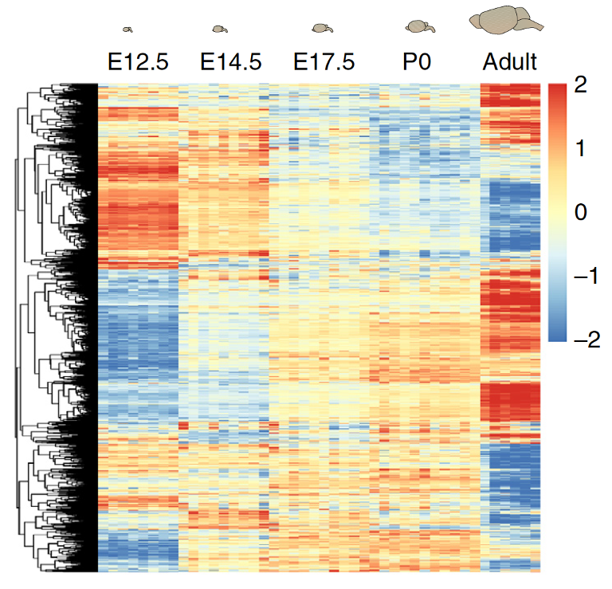

```{r setup, include=FALSE}
library(tidyverse)
library(data.table)
library(patchwork)

source("Setup.R")
fig.dir <- "../Fig/RNA/"
dir.create(fig.dir, showWarnings=FALSE)
setup.env(fig.dir)
dir.create("./data", showWarnings=FALSE)
theme_set(theme_classic() + theme(title = element_text(size=10)))
```

## Why do we want to study/improve statistical methods for RNA-seq?

\large

* Blood, sweat, and tear of biostatistics 

* Almost all high-throughput data in biology is based on sequencing

* High-dimeionsional, $p \gg n$

* Key statistical concepts: quantification, normalization, multiple hypothesis testing

## Additional resources

\large

* Companion notes for this lecture with greater detail can be found [here](https://github.com/STAT540-UBC/resources/blob/main/rnaseqdiffex-examples/examples-RNAseq.md)

* For all of the specific methods we discuss, refer to the Bioconductor pages (vignettes, reference manuals) for the most current and thorough details on implementation

* When you want to know specific functions in `R` (e.g., `lm`):

```{r eval = F, echo = T, size="large"}
help(lm)
```

## A CHD8 RNA-seq experiment (a working example)

\normalsize

- [Gompers et al. (Nature Neuroscience 2017)](https://www.ncbi.nlm.nih.gov/pmc/articles/PMC6008102/) analyzed 26 Chd8 mutant and 18 WT mice

  - Tested for differential expression across ~12K genes accounting for sex, developmental stage and sequencing batch

:::::: {.columns}
::: {.column width=.4}


:::
::: {.column width=.35}



\small

Figures from Gompers et al. (2017) paper

\normalsize

:::
::::::

## `SummarizedExperiment` as a handy container for RNA seq data

```{r include = F, message = F, warning = F}
## load libraries 
library(tidyverse)
library(limma)
library(DESeq2)
library(edgeR)
library(pheatmap)
library(qvalue)
library(GGally)
library(UpSetR)
library(TxDb.Mmusculus.UCSC.mm10.knownGene)
library(org.Mm.eg.db)
library(gridExtra)
theme_update(panel.grid.major = element_blank(), panel.grid.minor = element_blank())
```

```{r read_data, include = F, message = F, warning = F}
## read in corrected metadata file
meta <- read.csv("data/nn.4592-S4.fixed.csv") %>%
    mutate(Sample = Sample.ID) %>%
    column_to_rownames(var = "Sample.ID") %>%
    dplyr::select(-Number) %>%
    dplyr::rename(DPC = `Stage..DPC.`, # rename variables
                  Sex = `Sex..1.male.`, # for convenience
                  Group = `Group..1.WT.`, #
                  SeqRun = `SeqRun`,
                  MappedReads = `Mapped.Reads`,
                  FeatureCounts = `Feature.Counts`) %>%
    mutate(Sex = factor(Sex, labels = c("M", "F")),       # Recode factor levels 
           Group = factor(Group, labels = c("WT", "Mu")), # 
           SeqRun = factor(SeqRun),
           DPC = factor(DPC)) %>%
    as.data.frame()

## read in count matrix
counts <-
    read.table("data/Gompers_NN_CountMatrix.txt", 
               header = TRUE, row.names = 1) %>% 
    filter(rowSums(.) > 0) %>%
    as.matrix()
```

:::::: {.columns}
::: {.column width=.65}

\includegraphics[width=\linewidth]{img/summarizedexperiment.png}

:::
::: {.column width=.35}

[`SummarizedExperiment`](https://bioconductor.org/packages/release/bioc/vignettes/SummarizedExperiment/inst/doc/SummarizedExperiment.html): A special object format that is designed to contain data & metadata

:::
::::::

## When `SummarizedExperiment` can be useful...?

:::::: {.columns}
::: {.column width=.62}

\includegraphics[width=\linewidth]{img/summarizedexperiment.png}

:::
::: {.column width=.38}

[`SummarizedExperiment`](https://bioconductor.org/packages/release/bioc/vignettes/SummarizedExperiment/inst/doc/SummarizedExperiment.html): A special object format that is designed to contain data & metadata

$${}$$

* Subset rows

* Subset cols

* Storage

* Multiple assays

:::
::::::

## RNA-seq count data along with the metadata (Gompers _et al._)

**Count data**: What are the rows and columns?

```{r echo = T, size="small"}
counts[1:3, 1:5]
```

**Metadata**: What are the rows and columns?

```{r echo = T, size="small"}
meta[1:3, 1:5]
```

## Package count and meta data into `SummarizedExperiment`

\large

* What are the assays (main data)?

* What type of metadata do we have? Rows? Columns?

```{r echo = T, size="large"}
## place data into SummarizedExperiment object
sumexp <-
    SummarizedExperiment(
    assays = SimpleList(counts = counts), 
    colData = DataFrame(meta)
    )
```

\vfill

```{r echo = T}
sumexp
```

## Package count and meta data into `SummarizedExperiment`

**Count data**

```{r echo = T, size="small"}
assays(sumexp)$counts[1:3, 1:5]
```

**Metadata**

```{r echo = T, size="small"}
colData(sumexp)[1:3, 1:5]
```

## An example: Why did we create `Summarizedexperiment`? 

```{r echo = T}
dim(sumexp)
```

```{r echo = T}
male.only <- sumexp[,sumexp$Sex == "M"]
dim(male.only)
```

:::::: {.columns}
::: {.column width=.5}

```{r echo = T}
dim(colData(male.only))
```

:::
::: {.column width=.5}

```{r echo = T}
dim(assays(male.only)$count)
```

:::
::::::

## We can treat this object seamlessly as another data matrix

```{r echo = T}
rownames(sumexp) %>% sample(size=10)
```

```{r echo = T}
colnames(sumexp) %>% head
```


## Now we have **count** data^[Note that only RPKM values were provided in [GEO](https://www.ncbi.nlm.nih.gov/geo/query/acc.cgi?acc=GSE99331); raw counts obtained directly from authors]

* In the Nrl microarray experiment we worked with **continuous** microarray values

* Now we will work with the raw RNA-seq **counts** (discrete)

* These counts represent the number of reads mapping to each feature (gene or transcript) - here we have gene counts

* Seminar 6 explored how to obtain read counts from alignment (BAM or SAM) files


## What do we do now? What have we learned so far?

\large

\begin{itemize}
	\item<2-> Lecture 3: Exploratory data analysis
	\item<3-> Lecture 8: Regression analysis via `limma`
	\item<4> Lecture 9: Multiple hypothesis testing
\end{itemize}

\vfill

\normalsize

\only<4>{
We will apply all these statistical methods to RNA-seq analysis.
}

## Today's lecture 

\large

* Exploratory Data Analysis of RNA-seq data

* Data normalization

* Statistical Inference of gene-by-gene analysis

* Multiple hypothesis testing to summarize the results

## ${}$

\Huge

Feel free to interrupt me anytime

\normalsize


# Exploratory Data Analysis of RNA-seq data

## What do we know about the study beforehand?

\large

* Experimental design variables: 
  * **Group** (Genotype: Chd8 mutant vs WT) 
  * **Sex** (M vs F, 2 level factor)^[Note that sex was mislabeled for some samples in the GEO entry (we are using a corrected version obtained from the authors)]
  * **DPC** (days post conception, 5 level factor)
  * **Batch** (sequencing run)

## Sample-sample correlation matrix to learn about variation

\large

```{r echo = T}
R <- cor(log1p(cpm(assays(sumexp)$counts)),
         method="spearman")
```

* Why do we need to take `log1p` $\log(x + 1)$?

```{r}
corr <-
    data.frame(R, row.names = colnames(sumexp)) %>% 
    as.matrix()
```

## Sample-sample correlations reveal batch effects

```{r fig.width=5, fig.height=3.2}
.annot <- as.data.frame(colData(sumexp)) %>%
    dplyr::select(-`Sample`, -`FeatureCounts`)

pheatmap::pheatmap(corr,
                   annotation_row = .annot,
                   cluster_cols = F,
                   cluster_rows = F,
                   border_color = NA,
                   fontsize = 5,
                   show_rownames = F,
                   show_colnames = F,
                   width=5,
                   height = 3.2)
```

## What did we find in EDA?

\large

* **Batch** and **DPC** are major sources of variation 

* **Batch** and **DPC** are confounded 

* One sample is a potential minor outlier


## Goal: Differential expression analysis on Chd8 data

\large

* Main variable of interest: **Group** (Genotype: Chd8 mutant vs WT)

* We'd like to fit a model for each gene so we can test for Group effect, and adjust for:
  * **Sex** (M vs F, 2 level factor)
  * **DPC** (days post conception, 5 level factor)

  
## Goal: Differential expression analysis on Chd8 data

Using what we learned in previous lectures, we can formulate this model as:

:::::: {.columns}
::: {.column width=.4}

a gene expression for a sample $i$

\large

\begin{eqnarray*}
  Y_{i} &=& \theta \\
  \onslide<2->{ &+& {\color{magenta} \tau_{\textsf{Mut}} }\, X_{i,\textsf{Mut}} \\ }
  \onslide<3->{ &+& {\color{orange} \tau_{F} } \, X_{i,\textsf{F}} \\ }
  \onslide<4->{
        &+& { \color{teal} \tau_{D14.5} } \, X_{i,D14.5} \\
        &+& { \color{teal} \tau_{D17.5} } \, X_{i,D17.5} + \\
        &+& { \color{teal} \tau_{D21} } \, X_{i,D21} + \\
        &+& { \color{teal} \tau_{D77} } \, X_{i,D77} \\
  }
  \onslide<5>{ &+& {\color{cyan} \epsilon_i } }
\end{eqnarray*}

:::
::: {.column width=.5}

$${}$$

\normalsize

\begin{itemize}
\item<1-> Baseline expression
\item<2-> $X_{i,\textsf{Mut}}$: 1 if $i$ is mutant; otherwise, 0.
\item<3-> $X_{i,\textsf{F}}$: 1 if $i$ is female; otherwise, 0.
\item<4-> $X_{i, D}$: 1 if and only if i's DPC $= D$
\item<4-> where $D \in \{\textsf{D14.5, D17.5, D21, D77}\}$
\item<5> $\epsilon$: error, not explained by the previous terms
\end{itemize}

:::
::::::


## Differential expression analysis on Chd8 data

\large

\begin{itemize}
\item<2-> $p=7$ parameters to estimate in our model: $\theta, \tau_{Mut}, \tau_{F}, \tau_{D14.5}, \tau_{D17.5}, \tau_{D21}, \textsf{ and } \tau_{D77}$

\item<3-> $n=44$ samples total, so our model has $n-p=44-7=37$ degrees of freedom

\item<4->  What is the null hypothesis for the test of differential expression between Chd8 Mut and WT using our model?

\end{itemize}

\vfill

\onslide<5->{Recall that since this is an additive model, the parameters represent \textbf{\color{magenta} main effects} (not conditional)}

\onslide<6>{
$H_{0}: \, \tau_{\textsf{Mut}} = 0\quad, H_{1}: \, \tau_{\textsf{Mut}} \neq 0$
}

## Design matrix in R

\large

```{r modelmatrix, echo = T}
modm <- model.matrix(~ Sex + Group + DPC, data = colData(sumexp))
```

\vfill

```{r echo = F, size="small"}
head(modm)
```

## Are we ready to fit the model?


Might start with the `limma` approach on the raw counts, but... 

. . . 

**Not so fast** - we have to consider additional sources of variation!


# Data normalization

## Library size (sequencing depth)

\vfill

\normalsize 

:::::: {.columns}
::: {.column width=.55}

```{r fig.height=3, fig.width=3}
hist(colSums(assays(sumexp)$counts)/1e6, 20, main = NULL, 
     xlab = "library size (million total counts)")
```

:::
::: {.column width=.45}

:::{.block}

### Library size

Total number of read counts per sample

:::

Ideally this would be the same for all samples, but it isn't

\onslide<2>{
\includegraphics[width=.8\linewidth]{img/clusterdensity.png}
}

:::
::::::

\vfill

Number of reads per sample depends on factors like how many samples were multiplexed and how evenly, cluster density, RNA quality, etc. 

## Why does library size matter?

:::::: {.columns}
::: {.column width=.4}

**Read depth variation** is a potential source of **confounding**!

$${}$$

* We typically want to compare gene counts **between** samples

:::
::: {.column width=.6}

\includegraphics[width=\linewidth]{img/seqdepth.png}

If we sequence one group of samples 2X as much, gene counts in that sample look ~2X as large even if there's no DE!

:::
::::::

\vfill

You may come across (older) literature where data was down-sampled to make library sizes the same (**not recommended**)


## Recall: What does "MappedReads" mean here?

```{r fig.width=5, fig.height=3.2}
.annot <- as.data.frame(colData(sumexp)) %>%
    dplyr::select(-`Sample`, -`FeatureCounts`)

pheatmap::pheatmap(corr,
                   annotation_row = .annot,
                   cluster_cols = F,
                   cluster_rows = F,
                   border_color = NA,
                   fontsize = 5,
                   show_rownames = F,
                   show_colnames = F,
                   width=5,
                   height = 3.2)
```

## Within-sample comparisons

* Other factors of variation come into play if we also want to compare counts between genes within sample (less common)

* At the same expression level, longer genes/transcripts have more read counts

{fig-align="center"}


## How can we make fair between- and within-sample comparisons?

* **Normalized expression units**: expression values adjusted for factors like library size, gene length

  * e.g.RPKM/FPKM, TPM, CPM
  * useful for visualization / clustering

* **Normalization factors**: scalar values representing relative library size of each sample

  * e.g. TMM, DESeq size factors 
  * useful to include in models of raw counts to adjust for library size

. . . 

* For analysis (e.g. DE) it is ideal to start with **raw counts**

  * raw counts required for many methods
  * can always compute normalized values from raw counts (but not vice versa)


## Normalized expression units

```{r include = F}
countToTpm <- function(counts, effLen)
{
    rate <- log(counts) - log(effLen)
    denom <- log(sum(exp(rate)))
    exp(rate - denom + log(1e6))
}
 
countToFpkm <- function(counts, effLen)
{
    N <- sum(counts)
    exp( log(counts) + log(1e9) - log(effLen) - log(N) )
}
 
fpkmToTpm <- function(fpkm)
{
    exp(log(fpkm) - log(sum(fpkm)) + log(1e6))
}
 
countToEffCounts <- function(counts, len, effLen)
{
    counts * (len / effLen)
}
```


:::{.block}

### RPKM/FPKM

**r**eads/**f**ragments **p**er **k**b of exon per **m**illion mapped reads

:::

\vfill

\large

:::::: {.columns}
::: {.column width=.4}

\includegraphics[width=\linewidth]{img/rpkm.png}

:::
::: {.column width=.6}

If we have:

* $R_{ij} = 28$ reads in gene $j$, sample $i$

* $\Sigma_j R_{ij} = 11$ million reads in sample i

:::
::::::

\vfill

Then, **RPKM**:

$$\textsf{RPKM}_{ij} 
= \frac{R_{ij}}{\frac{L_j}{10^3}\frac{\Sigma_j R_{ij}}{10^6}} 
= \frac{28}{\frac{2000}{10^3}\frac{1.1\times10^7}{10^6}} 
= 1.27$$

## Normalized expression units, continued

* **TPM**: Transcripts per million

$$TPM_{ij} = \frac{R_{ij}}{L_j}\frac{10^6}{\Sigma_j R_{ij}/L_j} = \frac{FPKM_{ij}}{\Sigma_j FPKM_{ij}/10^6}$$

. . . 

* **CPM**: Counts per million

$$CPM_{ij} = \frac{R_{ij}}{\Sigma_j R_{ij}/10^6}$$

. . . 

* See this useful [blog post](https://haroldpimentel.wordpress.com/2014/05/08/what-the-fpkm-a-review-rna-seq-expression-units/) on relationship between these units

* Which of these measures are between-sample normalization measures? Within-sample? Both?

## How much does "gene length" vary?

\normalsize

* "total effective length of transcript used in assigning reads to genes"

* If all genes are same lengths, FPKM won't do anything interesting

* In mouse, "gene length" varies mostly between ~2.5Kb - 4.3Kb; your organism may vary

```{r echo=F, fig.width=5, fig.height=2}
exns <- exonsBy(TxDb.Mmusculus.UCSC.mm10.knownGene, by = "gene")
z <- sapply(width(exns), sum)

ggplot(data.frame(z), aes(log10(z))) +
    geom_density(fill="#AADDFF") +
    scale_x_continuous("gene length (bp)", labels=function(x)10^x) +
    ggtitle("Mouse gene lengths, unfiltered")
```

## How does gene length relate to counts?

:::::: {.columns}
::: {.column width=.5}


```{r incldue = F, fig.width=3, fig.height=3}
mapping <- select(org.Mm.eg.db,
                  keys = rownames(sumexp),
                  columns = c("SYMBOL", "ENTREZID"),
                  keytype="SYMBOL")

x <- match(mapping$ENTREZID, names(z))

lns <- z[x]

rowData(sumexp)$basepairs <- lns

.df <- 
    data.frame(count = rowMeans(assays(sumexp)$counts),
               length = lns) %>%
    drop_na()

ggplot(.df, aes(x = length, y = count)) +
    geom_point(alpha = 0.5, stroke=0, color="gray70") +
    stat_density2d(color="green", linewidth=.1, lty=2) +
    geom_smooth(se=F, color="red") +
    scale_y_log10("mean count", limits=c(10,max(.df$count))) +
    scale_x_log10("gene length", limits=c(1000,max(.df$length)))
```

:::
::: {.column width=.5}

\large

* If all genes were expressed at same level (same # molecules/cell), expect a 1:1 relation

* Of course they are not, so the effect of length is less obvious

* Rank correlation between length and mean expression in our example data is `r signif(cor(rowMeans(assays(sumexp)$counts), rowData(sumexp)$basepairs, method = "spearman", use="pairwise"), 3)`

:::
::::::


## FPKM vs. TPM: Which one should we take?

:::::: {.columns}
::: {.column width=.4}

\large

:::{.block}
### Remark

* These metrics both enable comparison of expression levels of different genes within sample.  

* Any doubt about "gene length" will be propagated to both measures.

:::

:::
::: {.column width=.6}

```{r incldue = F, fig.width=3, fig.height=3}
data.frame(fpkm = log2(fpkm(DESeqDataSet(sumexp, ~1), robust = FALSE)[,1]+1)) %>% 
  mutate(tpm = log2(2^fpkm / sum(2^fpkm, na.rm = TRUE) * 10^6)) %>%
  drop_na() %>%
  ggplot(aes(x = fpkm, y = tpm)) +
  geom_point(alpha = 0.1) +
  ylab("log2(FPKM + 1)") +
  xlab("log2(TPM + 1)") +
  ggtitle("Sample 1") 
```

:::
::::::


## FPKM vs. CPM: Which one should we take?

:::::: {.columns}
::: {.column width=.4}

\large

:::{.block}
### Remark

* If we're comparing samples to each other, there's no important difference between FPKM/TPM and CPM

* Assuming that "effective gene length" is held constant across samples

:::

:::
::: {.column width=.6}


```{r incldue = F, fig.width=3, fig.height=3}
data.frame(fpkm = log2(fpkm(DESeqDataSet(sumexp, ~1), robust = FALSE)[,1]+1), 
           cpm = log2(cpm(counts, log = FALSE, normalized.lib.sizes = FALSE)[,1]+1)) %>%
  drop_na() %>%
  ggplot(aes(x = fpkm, y = cpm)) +
  geom_point(alpha = 0.1) +
  ylab("log2(FPKM + 1)") +
  xlab("log2(CPM + 1)") +
  ggtitle("Sample 1") +
  geom_abline(intercept = 0, slope = 1, linetype = "dashed")
```

:::
::::::

## Normalization for comparison between samples?

\large

* Computing FPKM, CPM or TPM largely corrects for differences in library size

* However, there is a complication: "Sequence space"

  * Finite number of reads $\implies$ high expression of one gene $\uparrow$ will lead to low expression for other genes $\downarrow$

  * This is a fundamental difference from microarrays, where each spot is essentially independent

* This isn't a major problem unless there are large differences in composition between samples, but should be inspected

  * Normalization factors are generally robust to this


## Should we always normalize within each sample? What could go wrong with that?

Consider the following example:

\begin{center}
\includegraphics[width=.7\textwidth]{img/SequenceSpace.pdf}
\end{center}

```{r echo = T}
genes <- c("Red","Blue","Green")
n.x <- 10
x.prob <- c(3, 3, 4) %>% (function(p)p/sum(p))
n.y <- 22
y.prob <- c(3, 3, 16) %>% (function(p)p/sum(p))
```

```{r include = F}
build.rgb.tab <- function(xx, yy, .factors = c("Red","Green","Blue")){
    ret <- data.frame(x = c(xx, yy),
                      s = c(rep("sample.1", length(xx)),
                            rep("sample.2", length(yy))))
    ret$x <- factor(ret$x, .factors)
    return(ret)
}

show.rgb.tab <- function(xx, yy){
    ggplot(build.rgb.tab(xx, yy), aes(x, fill = x)) +
        xlab("genes") +
        facet_grid(s ~ .) +
        scale_fill_manual(values=c("red","green","blue"), guide="none") +
        geom_bar(stat="count", linewidth=.1, color="black") +
        coord_flip()
}

take.rgb.tab <- function(xx, yy){
    ret <- build.rgb.tab(xx, yy) %>%
        as.data.table() %>% 
        dcast(x ~ s, fun.aggregate = length) %>%
        as.data.frame() %>%
        column_to_rownames("x")
    return(ret)
}
```

## What if we sequence "deep" enough to capture all of them?

```{r include=F}
x <- unlist(sapply(1:length(genes), function(g) rep(genes[g], n.x * x.prob[g])))

y <- unlist(sapply(1:length(genes), function(g) rep(genes[g], n.y * y.prob[g])))
```

:::::: {.columns}
::: {.column width=.5}

```{r fig.width=2, fig.height=2}
show.rgb.tab(x, y)
```

:::
::: {.column width=.5}

```{r size="large"}
take.rgb.tab(x, y)
```

:::
::::::

## What if we sequence *less* than the actual counts?

```{r include=F}
set.seed(1)
x <- sample(genes, 10, x.prob, replace=T)
y <- sample(genes, 10, y.prob, replace=T)
```

:::::: {.columns}
::: {.column width=.5}

```{r fig.width=2, fig.height=2}
show.rgb.tab(x, y)
```

:::
::: {.column width=.5}

```{r size="large"}
take.rgb.tab(x, y)
```

::: {.block}
### Question
- Is it okay to normalize to have both samples have the same sequence depth?

- Are we comparing the gene "red" with the gene "green" or vice versa?
:::

:::
::::::


## What if we sequence *more* than the actual counts?

```{r include=F}
set.seed(1)
x <- sample(genes, 100, x.prob, replace=T)
y <- sample(genes, 100, y.prob, replace=T)
```

:::::: {.columns}
::: {.column width=.5}

```{r fig.width=2, fig.height=2}
show.rgb.tab(x, y)
```

:::
::: {.column width=.5}

```{r size="large"}
take.rgb.tab(x, y)
```

::: {.block}
### Question
- Is it okay to normalize to have both samples have the same sequence depth?

- Are we comparing different genes across different samples?
:::

:::
::::::


## Effect of sequence space

:::::: {.columns}
::: {.column width=.7}

\begin{center}
\includegraphics[width=\linewidth]{img/seqspace.png}
\end{center}

:::
::: {.column width=.3}

$${}$$

\large

* By CPM or FPKM, red & blue appear down-regulated in sample B (only green is DE)

$${}$$

* Adjusting expression levels in Sample B by a factor of 3 would be needed


:::
::::::

\normalsize

\vfill

See [Robinson and Oshlack (2010)](https://genomebiology.biomedcentral.com/articles/10.1186/gb-2010-11-3-r25)


## Sequence space in our example data

* Rn45s gene has $>100,000$ mean reads per sample $(>5\%$ of reads in some samples)

* ~5% of the genes take up ~50% of reads, but this is consistent across samples

* Side note: Rn45s is potentially a contaminant - a ribosomal RNA that should have been removed during sample prep, which involved poly-A selection

```{r fig.width = 6, fig.height = 2}
soaker <- which.max(rowMeans(counts))
p1 <- data.frame(count = as.numeric(assays(sumexp)$counts[soaker,]),
           total = colSums(assays(sumexp)$counts)) %>%
  ggplot(aes(x = count, y = total)) +
    geom_point() + 
    xlab("Rn45s raw read count") +
    ylab("Total reads in sample")


cpgcum <- data.frame(apply(counts, 2, function(x) cumsum(sort(x))/sum(x)), 
                     index = (1:dim(counts)[1])/dim(counts)[1]) %>%
  pivot_longer(names_to = "Sample", values_to = "CumulativeFracCounts", 
               cols = -index)
p2 <- ggplot(cpgcum, aes(x = index, y = CumulativeFracCounts*100, group = Sample)) + 
  geom_hline(yintercept = 0.5, color="grey", linetype = "dashed") + 
  geom_vline(xintercept = c(0.95), color="grey", linetype = "dashed") + 
  geom_line(show.legend = FALSE, aes(color = Sample), alpha = 0.5) +
  xlab("Proportion of genes") +
  ylab("Cumulative % of total")

grid.arrange(p1, p2, nrow = 1)
```

## TMM normalization -- accounting for "sequence space"

\large

:::::: {.columns}
::: {.column width=.5}

::: {.block}
### TMM (trimmed means of M-values)

* M-values: per-gene ratios of counts among samples

* Trimmed: extreme values are ignored

* Values adjusted to have product=1

* Assumes that no more than half of genes are DE

:::

:::
::: {.column width=.5}

* Calculate with `edgeR::calcNormFactors`

```{r echo = T, size="large"}
# construct DGEList object
dge <-
    DGEList(
        assays(sumexp)$counts
    )
# calculate normlaization
# factor (check the default)
dge <- calcNormFactors(dge)
```

:::
::::::

## Additional preprocessing (generally helpful): filtering lowly expressed genes

* Common step which can be beneficial for a few reasons:

  * Genes with very low mean expression across samples may be uninteresting
  
  * Fitting models on a smaller number of genes can be faster
  
  * May obtain a more 'well-behaved' association between mean and variance, which might affect some methods (e.g. `Voom`)
  
* No universal threshold (depending on the study)

## Filtering out lowly expressed genes

Here: Keep genes with $\ge 2$ samples that have CPM $>10$

```{r echo = T, size="large"}
assays(sumexp)$cpm <- cpm(counts, log = FALSE,
                          normalized.lib.sizes = FALSE)
keep <- which(rowSums(assays(sumexp)$cpm > 10) >= 2)
length(keep)  

sumexp <- sumexp[keep,]
```

:::{.block}
### Remark
Slice out both `rowData` and `assays`.
:::


# Statistical Inference of gene-by-gene analysis


## Differential expression: Why we need new methods

* **Goal**: accurate p-values for our hypothesis tests

  * Accurate:  "Uniform under the null"
  
  * Properties relied upon for inference from $t$-statistics may not hold for count data

  * RNA-seq often contains relatively small sample size

* Perhaps most important: **Heteroskedasticity** and **Overdispersion**
  
  * Strong mean-variance relationship expected with count data
    * violation of constant variance assumption of linear models
    * over- or under- shrinkage of genes, depending on variance levels
  
  * Biological variance over and above binomial sampling variance
  

## Statistics of counts: Binomial


* Number of reads observed for gene $g$ in a given sample is a random variable

* Say RNA for gene $g$ is present "in the cell" at about 1 out of every 1,000,000 molecules 
  * Abundance $a_g=1/1,000,000 = 1\times10^{-6}$ ("probability of success")
  
* If we randomly pick $R_i = \Sigma_gR_{ig} = 1,000,000$ molecules ("reads" = "trials"), how many gene $g$ RNAs will we see? $E(R_{ig} | R_i) = \,\, ?$

. . . 

* But could get 0, 2, 3, 4, ... etc just by chance: this is a **Binomial** distribution 

  * probability distribution of the number of successes in $n$ trials, each with probability of success $p$ is $(Binomial(n,p))$ 
  * mean = $np$
  * our example: $R_{ig} \sim Binomial(R_i, a_g)$ where $n=R_i$ and $p=a_g$


## Statistics of counts: Poisson

* Poisson distribution counts discrete occurrences along a continuous interval of time/space 
  * parameterized by a rate parameter $\lambda$
  * key difference from Binomial: number of events can be infinitely large

* For count data, the variance is a function of the mean.
  * Binomial: mean $= np$, variance $=np(1-p)$
  * Poisson: mean = variance = $\lambda$

## Statistics of counts: approximations (moment matching)

* **Binomial approximated by Poisson**:  for large $n$ and small $np$ (rule of thumb: $n$ > 20 & $np$ < 5)
  * Approximately $R_{ig} \sim Poisson(R_ia_g)$
  
* **Binomial approximated by Normal**: For large $np$ (rule of thumb: $np$ & $n(1-p)$ > 5)
  * Approximately $R_{ig} \sim Normal(R_ia_g, \, R_ia_g(1-a_g))$
  
. . . 
  
```{r fig.width=7, fig.height = 2}
set.seed(230)
.df <- data.frame(b = rbinom(1e5, 1e6, 1e-6),
                  p = rpois(1e5, lambda = 1))

p1 <- ggplot(.df, aes(b)) + geom_histogram(bins=10, linewidth=.1, color="black", fill="#AABBFF") + ggtitle("10K draws from\n Binomial(1e6, 1e-6)") + theme(axis.title.x = element_blank()) + xlim(0,10)

p2 <- ggplot(.df, aes(p)) + geom_histogram(bins=10, linewidth=.1, color="black", fill="#AAFFBB") + ggtitle("10K draws from\nPois(1)") + theme(axis.title.x = element_blank()) + xlim(0,10)

p1 | p2
```

## Overdispersion = non-linear relationship between the mean and variance in RNA-seq data

Poisson OK for technical replicates, but **does not capture biological variability**

\begin{center}
\includegraphics[width=.8\linewidth]{img/overdisp.png}
\end{center}

## Overdispersion (across genes) is commonly observed!

```{r include = F}
mean.var.df <- function(.mat){
    mu <- apply(as.matrix(.mat), 1, mean)
    sig <- apply(as.matrix(.mat), 1, var)
    mu.log2 <- apply(log2(as.matrix(.mat) + 1), 1, mean)
    sig.log2 <- apply(log2(as.matrix(.mat) + 1), 1, var)
    data.frame(`mean` = mu,
               `var` = sig,
               `log10.mean` = log10(mu + 1),
               `log10.var` = log10(sig + 1),
               `log2.mean` = mu.log2,
               `log2.var` = sig.log2) %>%
        na.omit()
}
```

In the CHD8 data:

```{r fig.width=5, fig.height=3}
.df <- mean.var.df(counts)

praw <-
    ggplot(.df, aes(x = log10.mean, y = log10.var)) +
  geom_point(alpha = 0.1) +
  ylab("log10(mean)") +
  xlab("log10(var)") +
  geom_abline(intercept = 0, slope = 1, lty=2, col=2) +
  ggtitle("log10 M-V")
praw
```


## Heteroskedastic sampling (across samples): Variance changes with the mean

:::::: {.columns}
::: {.column width=.5}

:::{.block}
### Ordinary Least Square

Assume all errors have the same variance (within gene)

$\min \sum_{i} (Y_{i} - X_{i} \beta)^{2}$

:::


:::
::: {.column width=.5}

:::{.block}
### Weighted Least Square

Some observations/points have higher/lower variance (within gene)

$\min \sum_{i} W_{i} (Y_{i} - X_{i} \beta)^{2}$

:::

:::
::::::


## Discussion: Why bother heteroskedastic properties and mean-variance relationships?

\large

In other words, why can't we just use traditional statistical methods (built on asymptotic normality assumptions^[$n\to\infty$, random variables will behave like Normal])?

. . . 

::: {.block}
### How to deal with heteroskedacity

1. Transformation: Make them homoskedastic & reverse the mean-variance relationships

2. Modelling: generalized linear model of count data with overdispersion parameters

3. Non-parametric tests (e.g., top-scoring pair, Geman _et al._ 2004)

:::


## Make adjustments & model as usual: transformation

* For microarray data, taking logs is often deemed sufficient to reduce M-V trends

* We'll use plots like this which are mean vs $\sqrt{sd}$ (quarter root variance) instead of mean vs. variance (you'll see why later on)

\begin{center}
\includegraphics[height=.5\textheight]{img/arraytransf.png}
\end{center}

## Chd8 data & effect of log transform (the problem lingers)

```{r fig.width = 7, fig.height = 3, echo = F}
pqrt <-
    ggplot(.df, aes(x = `mean`, y = `var`^(1/4))) +
    geom_point(alpha = 0.1) +
    xlab("mean") +
    ylab("sqrt(sd)") +
    geom_smooth(method = "loess", se = FALSE, span = 0.3) +
    ggtitle("M vs Quarter-root V")

plqrt <-
    ggplot(.df, aes(x = log2.mean, y = (log2.var)^(1/4))) +
    geom_point(alpha = 0.1) +
    geom_smooth(method = "loess", se = FALSE, span = 0.3) +
    xlab("mean") +
    ylab("sqrt(sd)") +
    ggtitle("M vs Quarter-root V\n(log2(x+1))") 

grid.arrange(praw, pqrt, plqrt, nrow = 1)
```

## Mean variance trends in various RNA-seq datasets

:::::: {.columns}
::: {.column width=.4}

```{r fig.width=2.5, fig.height=2.5}
.df <- mean.var.df(assays(sumexp)$counts)

ggplot(.df,aes(x = log2.mean, y = log2.var^(1/4))) +
  geom_point(alpha = 0.1) +
  xlab("mean") +
  ylab("sqrt(sd)") +
  geom_smooth(method = "loess", se = FALSE, span = 0.3) +
  ggtitle("M vs Quarter-root V\n(Filtered, log2)")
```

\small

Chd8 dataset (Filtered to remove lowly expressed genes, log2-transformed)

:::
::: {.column width=.6}

\includegraphics[width=\linewidth]{./img/mean_variance.png}

Panels (a)-(e) represent datasets with increasing expected biological variability

\small

Source: [Law et al. 2014](https://www.ncbi.nlm.nih.gov/pmc/articles/PMC4053721/)

:::
::::::


## One option: Voom can "straighten" crooked mean-variance relationships

Read this paper ["voom: precision weights unlock linear model analysis tools for RNA-seq read counts" by Law et al. (2014)](https://genomebiology.biomedcentral.com/articles/10.1186/gb-2014-15-2-r29)

:::{.block}
### Mean-variance modelling at the observational level

Falls under the category *"Make adjustments and model as usual"*

:::

Specifically, adjustment to regular `lm` to account for M-V relationship + `limma`

. . .

:::{.block}
### Key take-away of the Voom paper:

1. heteroskedastic, sample-specific higher variance $\implies$ getting more weight in OLS

2. modelling the mean-variance relationship is more important than getting the probability distribution exactly right

:::


## Voom implementation

:::{.block}
### Voom Input:

1. **raw counts** (required to estimate M-V relationship), but modeling is done on log-transformed CPM values $((\log_2(CPM + 0.5)$ to be precise) 
  
2. design matrix
  
:::

:::{.block}

### Voom Output: 

* Precision weights and moderated $t$-statistics

* Implemented in `limma::voom()` function

:::


## Voom steps


1. Fit linear model to $\log_2(CPM_{ig} + 0.5)$ values (samples $i$) for each gene $g$

2. Extract the fitted quarter-root error variance estimates $s^{1/2}_g = \sqrt{\mathsf{sd}(\hat{\varepsilon_{ig}})}$

3. Fit a smoothed line $\hat{f}$ to the trend between mean log counts and $s^{1/2}_g$ using [lowess](https://rafalab.github.io/dsbook/smoothing.html#local-weighted-regression-loess) (locally weighted regression)

. . . 

4. Use the fitted lowess curve to estimate **precision weights**: $w_{ig} = 1/\hat{f}(\hat{c}_{ig})^4$ where $\hat{c}_{ig}$ are the $\log_2$ *fitted* counts (estimated from model in step 1)

5. Fit linear model to $\log_2(\mathsf{CPM}_{ig} + 0.5)$ values using **precision weights** $w_{ig}$

6. Compute moderated $t$-statistics as before (using `eBayes` from `limma`)

## Voom illustration

Figure 2, [Law et. al, 2014](https://www.ncbi.nlm.nih.gov/pmc/articles/PMC4053721/#B34)

\includegraphics[width=\linewidth]{img/mean_variance_voom.png}

. . . 

$$w_{ig} = \frac{1}{\hat{f}(\hat{c}_{ig})^4} = \frac{1}{(\sqrt{s_{ig}})^4} = \frac{1}{s_{ig}^2}$$


## What do we do with these 'precision weights'?

How can we actually incorporate these precision weights in the regression fit?


## Weighted least squares (WLS) regression

* OLS: $\boldsymbol{\hat{\beta}}_g = \boldsymbol{(X^TX)^{-1}X^T}\boldsymbol{y}_g$

* WLS: $\boldsymbol{\hat{\beta}}_g = \boldsymbol{(X^T}\boldsymbol{W}_g\boldsymbol{X)^{-1}X^T}\boldsymbol{W}_g\boldsymbol{y}_g$, where $\boldsymbol{W}_g$ is a diagonal matrix of weights for gene $g$

* **Intuition**: in minimizing the RSS, we put less weight on data points that are less precise: 

$$\boldsymbol{\hat{\beta}}_{g} = \underset{\beta_{g1}, \ldots, \beta_{gp}}{\arg\min} \sum_{i=1}^n w_{ig}(x_{i1} \beta_{g1} + \ldots + x_{ip} \beta_{gp} - y_{ig})^2$$

. . . 

* Optimal weights to correct for heteroskedasticity: inverse variance^[Note: parameter estimates $\hat{\boldsymbol{\beta}}_g$ assume weights (variances) are known]


## limma-voom


* **limma-voom** is the application of `limma` to $log_2(CPM + 0.5)$ values, with inverse variance observational weights *estimated from the M-V trend*

* This alleviates the problem of heteroskedasticity and (hopefully) improves estimates of residual standard error

* Gene-specific variance estimates are 'shrunken' to borrow information across all genes:

$$\tilde{s}^2_g = \frac{d_0s_0^2 + ds^2_g}{d_0 + d}$$ 

. . . 

* Note that $s^2_g$ estimates are affected by voom weights
  
  * recall that $s^2_g$ is the sum of squared residuals $\frac{1}{n-p}\hat{\boldsymbol{\epsilon}_g}^T\hat{\boldsymbol{\epsilon}_g}$

  * under WLS $\boldsymbol{\hat{\epsilon}}_g = \boldsymbol{y}_g - \boldsymbol{X\hat{\beta}}_g = \boldsymbol{y}_g - \boldsymbol{X(X^T}\boldsymbol{W}_g\boldsymbol{X)^{-1}X^T}\boldsymbol{W}_g\boldsymbol{y}_g$
  


## limma-voom, continued


* Moderated $t$ statistics are then calculated using the shrunken gene-specific variance estimates: $\tilde{t}_{g} = \frac{\hat{\beta}_{ig}}{\tilde{s}_g \sqrt{v_{ii}}}$

  * recall that under OLS, $v_{ii}$ is the $i^{th}$ diagonal element of $\boldsymbol{(X^TX)}^{-1}$
  * under WLS, $v_{ii}$ is the $i^{th}$ diagonal element of $(\boldsymbol{X^T}\boldsymbol{W}_g\boldsymbol{X})^{-1}$

* Recall:
  * Degrees of freedom for moderated $t$ statistic: $n-p+d_0$ 
  * If $d_0$ is large compared to $n-p$, moderated statistics have a bigger effect compared to using regular $t$ statistics (i.e. in general, shrinkage matters more for small sample sizes)

## Differential expression analysis on Chd8 data

* Recall: Our **additive** model for each gene to test for Group (Chd8 mutant vs WT) effect, and adjust for:

\begin{eqnarray*}
Y_{i} &=& \theta + \tau_{Mut} X_{i,Mut} + \tau_{F} X_{i,F} \\
  & & + \tau_{D14.5} X_{i,D14.5} + \tau_{D17.5} X_{i,D17.5} + \tau_{D21} X_{i,D21} + \tau_{D77} X_{i,D77} \\
  & & + \epsilon_i
\end{eqnarray*}

* Our model has $n-p=44-7=37$ degrees of freedom

* We will focus on the null hypothesis of the **main effect** of Group $H_0: \tau_{Mut}=0$ 

## limma-voom in action

:::::: {.columns}
::: {.column width=.5}


```{r eval=F, echo=T, size="large"}
.mod <-
    model.matrix( ~ Sex +
                 Group +
                 DPC,
      data = colData(sumexp))

# Estimate voom weights;
# plot M-V trend
vw <-
    voom(assays(sumexp)$counts, 
         design=.mod, 
         plot=T, span = 1/2)
```

:::
::: {.column width=.5}

```{r eval=F, echo=T, size="large"}
# run limma with voom weights
lvfit <- lmFit(vw, model.mat)
lvfit <- eBayes(lvfit)
```

:::
::::::


## limma-voom in action

```{r fig.width=5, fig.height=3.1}
par(cex=.75, cex.axis=.75)
# estimate voom weights; 
# plot M-V trend
.mod <- model.matrix( ~ Sex + Group + DPC,
                     data = colData(sumexp))
vw <- voom(assays(sumexp)$counts, 
           design = .mod, 
           plot = TRUE, span = 1/2)  

# run limma with voom weights
lvfit <- lmFit(vw, .mod)
lvfit <- eBayes(lvfit)
```


## `limma-voom` vs. `limma`: 

```{r fig.width=5, fig.height=3}
# run plain limma (no voom weights) on log cpms
lfit <- lmFit(cpm(assays(sumexp)$counts, prior.count = 0.5, log = TRUE), 
              design = model.matrix( ~ Sex + Group + DPC, data = colData(sumexp)))
lfit <- eBayes(lfit)

# plot moderated t statistics compared to limma-voom
data.frame(limma = lfit$t[,"GroupMu"], voom = lvfit$t[,"GroupMu"]) %>%
  ggplot(aes(x = limma, y = voom)) +
  geom_hex(bins = 60, aes(fill = stat(log(count)))) +
  geom_abline(intercept = 0, slope = 1) +
  xlab(expression(paste("limma ", tilde(t)[g]))) +
  ylab(expression(paste("limma-voom ", tilde(t)[g]))) +
  ggtitle("Moderated t statistics (Chd8 Mu vs WT)")
```

## Another option: limma-trend

* Compared to voom, limma-trend treats all observations within a gene the same

* Compared to regular limma, limma-trend shrinks gene-specific variances toward a **global M-V trend**, instead of toward a constant pooled variance:

$$\tilde{s}^2_g = \frac{d_0s_{0g}^2 + ds^2_g}{d_0 + d}$$ 

. . . 

* Notice the $g$ subscript on $s_{0g}^2$! The prior variance is different for each gene (unlike in regular limma)

* Based on the M-V trend, $s_{0g}^2$ is (typically) higher for lowly expressed genes

## limma-trend vs voom? 

Figure 2, [Law et. al, 2014](https://www.ncbi.nlm.nih.gov/pmc/articles/PMC4053721/#B34)

\includegraphics[width=\linewidth]{img/mean_variance_voom.png}

* limma obtains one *overall* prior variance for all genes
* limma-trend obtains a prior variance for *each gene* based on it's mean using a smoothed curve of the mean vs variance
* limma-voom obtains a weight for *each observation* from such a curve

## limma-trend in action

```{r echo = T, size="large"}
mm <- model.matrix(~ Sex + Group + DPC, 
                   data = colData(sumexp))
ltfit <- lmFit(cpm(assays(sumexp)$counts, 
                   log = TRUE), 
               design =  mm)
ltfit <- eBayes(ltfit, trend = TRUE)

# limma-trend s^2_{0g}
str(ltfit$s2.prior)

# regular limma s^2_0
str(lfit$s2.prior)
```

## limma-trend in action

```{r fig.width=6, fig.height=3}
data.frame(prior = ltfit$s2.prior) %>% 
  ggplot(aes(prior)) + 
  geom_histogram(bins = 35, fill="#AABBFF", linewidth=.1, col=1) + 
  scale_x_log10() +
  geom_vline(xintercept=lfit$s2.prior, lty=2, col=2) + 
  geom_text(aes(x=0.052, y=3000, label="limma s_0^2"), col=2) +
  xlab(expression(paste("limma-trend ", s["0g"]^2))) +
  ggtitle(expression(paste("limma-trend ", s["0g"]^2, " vs. limma ", s[0]^2))) 
```

## `limma-trend` and `limma-voom`: When they will work

* If M-V relationship is flat, limma-voom and limma-trend have practically no effect

  * for limma-voom, weights will be all equal
  
  * for limma-trend, $s_{0g}^2$ will be constant across genes

* Even if M-V isn't flat, impact is most prominent in lowly expressed genes

* `limma-voom` might produce statistical artifact if the weight estimation becomes brittle

* *always look at the data*

## Alternative option: use count models

:::::: {.columns}
::: {.column width=.5}

\includegraphics[width=\linewidth]{img/DESeq2.png}

[`DESeq2`](https://bioconductor.org/packages/release/bioc/html/DESeq2.html)

:::
::: {.column width=.5}

\includegraphics[width=\linewidth]{img/edgeR.png}

[`edgeR`](https://bioconductor.org/packages/release/bioc/html/edgeR.html)

:::
::::::

Both assume counts have underlying *Negative Binomial distribution* and fit **generalized linear models**

## `DESeq2` vs. `edgeR`: They work similarly

:::::: {.columns}
::: {.column width=.5}

`edgeR`

```{r eval=F, echo=T}
dge <- DGEList(counts = assays(sumexp)$counts,
               samples = colData(sumexp))
dge <- calcNormFactors(dge)
dge <- estimateDisp(dge, 
  design = model.matrix(~ Sex + Group + DPC, 
                        data = sumexp$samples), 
  robust = TRUE)

edgeR_fit <- glmQLFit(dge, 
  design = model.matrix(~ Sex + Group + DPC, 
                        data = sumexp$samples))

```

:::
::: {.column width=.5}

`DESeq2`

```{r eval=F, echo=T}
dds <- DESeqDataSet(sumexp, 
  design = model.matrix(~ Sex + Group + DPC, 
  data = colData(sumexp)))

dds <- estimateSizeFactors(dds)

dds <- DESeq(dds)
```

:::
::::::

:::::: {.columns}
::: {.column width=.5}

Explore results with `topTags`
:::
::: {.column width=.5}

Explore results with `results`
:::
::::::


We will discuss GLM, including Negative Binomial, later in Lect14!

## Before you go: Always inspect your p-value distribution

```{r fig.width=5, fig.height=3}
hist(lvfit$p.value[,"SexF"])
```

## John Storey's FDR correction

```{r echo = T, size="Large"}
qval.obj <- qvalue(lvfit$p.value[,"SexF"])
```

```{r echo = T, size="large"}
names(qval.obj)
```

## John Storey's FDR correction

```{r fig.width=5, fig.height=3}
hist(qval.obj$qvalue)
```

## Top results

```{r echo=T, size="small"}
topTable(lvfit, coef="GroupMu", number=5, lfc=1.5)
```

## Top results

```{r echo=T, size="small"}
topTable(lvfit, coef="SexF", number=5, lfc=1.5)
```

## Additional resources

\Huge

Companion notes for this lecture with greater detail can be found [here](https://github.com/STAT540-UBC/resources/blob/main/rnaseqdiffex-examples/examples-RNAseq.md)

\vfill

\large

`https://github.com/STAT540-UBC/resources/blob/main/rnaseqdiffex-examples/examples-RNAseq.md`
