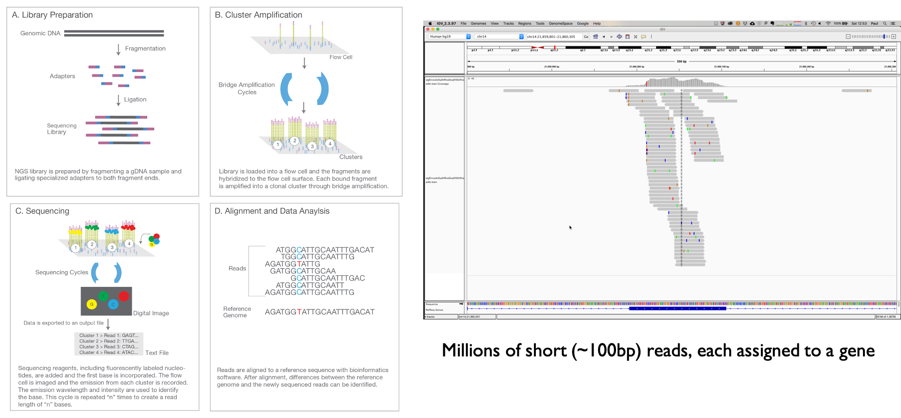
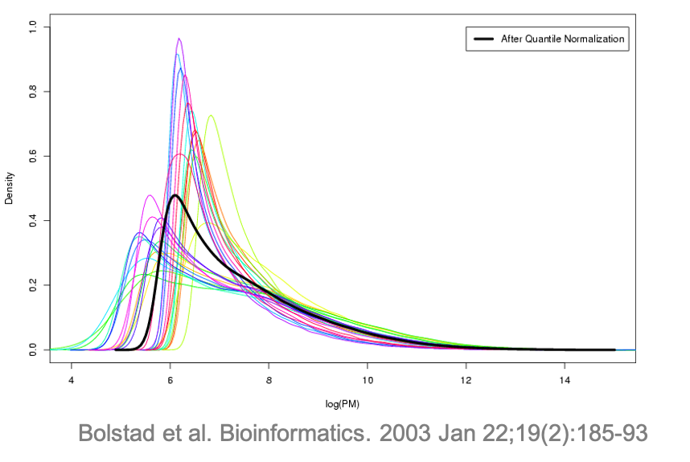

```{r, echo = FALSE}
knitr::opts_chunk$set(tidy = FALSE, tidy.opts=list(width.cutoff=80), fig.retina=3)
ggplot2::theme_set(ggplot2::theme_bw(base_size = 20))
ggplot2::update_geom_defaults("point", list(size = 3))

library(knitr)
hook_output = knit_hooks$get('output')
knit_hooks$set(output = function(x, options) {
  # this hook is used only when the linewidth option is not NULL
  if (!is.null(n <- options$linewidth)) {
    x = knitr:::split_lines(x)
    # any lines wider than n should be wrapped
    if (any(nchar(x) > n)) x = strwrap(x, width = n)
    x = paste(x, collapse = '\n')
  }
  
  lines <- options$output.lines
   if (is.null(lines)) {
     return(hook_output(x, options))  # pass to default hook
   }
   x <- unlist(strsplit(x, "\n"))
   if (length(lines)==1) {        # first n lines
     if (length(x) > lines) {
       # truncate the output
       x <- c(head(x, lines))
     }
   } else {
     x <- c(x[lines])
   }
   # paste these lines together
   x <- paste(c(x, ""), collapse = "\n")

  hook_output(x, options)
})

set.seed(47)
```

```{r xaringan-themer, include=FALSE, warning=FALSE}
library(xaringanthemer)
style_mono_accent(
  base_color = "#197aa0",
  header_font_google = google_font("Noto Sans"),
  text_font_google   = google_font("Nanum Gothic"),
  code_font_google   = google_font("Inconsolata"),
  base_font_size = "24px", 
  header_h1_font_size = "2rem",
  header_h2_font_size = "1.66rem",
  header_h3_font_size = "1.33rem",
  title_slide_background_image = "https://raw.githubusercontent.com/STAT540-UBC/stat540-ubc.github.io/main/images/stat540-logo-s.png",
  title_slide_background_size = "15%",
  title_slide_background_position = "95% 85%",
  link_color = "rgb(104, 27, 148)",
  link_decoration = "underline",
  extra_css = list(
    ".has-continuation" = list(
      "display" = "block !important"
    )
  )
)
```

```{css, echo = FALSE}
pre {
  white-space: pre-wrap;
}
.remark-code {
  background: #f8f8f8;
}
.remark-inline-code {
  background: "white";
}
.remark-code {
  font-size: 22px;
}
.huge .remark-code { /*Change made here*/
  font-size: 200% !important;
}
.tiny .remark-code { /*Change made here*/
  font-size: 60% !important;
}
.smaller .remark-code { /*Change made here*/
  font-size: 90% !important;
}
.smaller2 .remark-code { /*Change made here*/
  font-size: 80% !important;
}
.smaller3 .remark-code { /*Change made here*/
  font-size: 70% !important;
}
```

<style>
div.blue { background-color:#e8f2f6; border-radius: 5px; padding: 20px;}
</style>

# Learning objectives (next two lectures)

<big>

* Understand *why* and *when* between and within sample normalization are needed

* Apply common between and within sample normalization approaches to RNA-seq counts

* Understand why the *count nature* of RNA-seq data requires modification to the Differential Expression approaches applied to microarray data (e.g. `limma`)

* Apply models such as **limma-trend, limma-voom, `DESeq2` and `edgeR`** for inference of Differential Expression 

---

# Additional resources

<big>

* Companion notes for this lecture with greater detail can be found [here](https://github.com/STAT540-UBC/resources/blob/main/rnaseqdiffex-examples/examples-RNAseq.md)

* For all of the specific methods we discuss, refer to the Bioconductor pages (vignettes, reference manuals) for the most current and thorough details on implementation

---

## Recall the CHD8 RNA-seq experiment

- [Gompers et al. (Nature Neuroscience 2017)](https://www.ncbi.nlm.nih.gov/pmc/articles/PMC6008102/) analyzed 26 Chd8+/del5 and 18 WT littermates

  - Tested for differential expression across 11,936 genes accounting for sex, developmental stage and sequencing batch

- We'll use this dataset throughout this lecture to illustrate RNA-seq analysis 

```{r, echo=FALSE, out.width="28%", fig.show = 'hold', fig.cap = 'Figures from Gompers et al. (2017) paper', fig.align='center'}
knitr::include_graphics(c("img/GompersDesign.png", "img/GompersHeatmap.png"))
```

---

```{r prep & read in data, echo = FALSE, message = FALSE, warnings = FALSE}
library(tidyverse)
library(limma)
library(DESeq2)
library(edgeR)
library(pheatmap)
library(qvalue)
library(GGally)
library(UpSetR)
library(ComplexHeatmap)
library(TxDb.Mmusculus.UCSC.mm10.knownGene)
library(org.Mm.eg.db)
library(gridExtra)

bcols<-colorRampPalette(c("#000000" ,"#800000" ,"#FF8000" ,"#FFFF00", "#FFFFFF"))(20)
# Set some defaults for ggplot2.
theme_update(panel.grid.major = element_blank(), panel.grid.minor = element_blank())

m <- read.csv("data/nn.4592-S4.fixed.csv") %>%
   mutate(Sample = Sample.ID) %>%
   column_to_rownames(var = "Sample.ID") %>%
   dplyr::select(-Number)

m <- m %>% 
   dplyr::rename(DPC = `Stage..DPC.`,
                 Sex = `Sex..1.male.`,
                 Group = `Group..1.WT.`,
                 SeqRun = `SeqRun`,
                 MappedReads = `Mapped.Reads`,
                 FeatureCounts = `Feature.Counts`) %>%
   mutate(Sex = factor(Sex, labels = c("M", "F")),
          Group = factor(Group, labels = c("WT", "Mu")),
          SeqRun = factor(SeqRun),
          DPC = factor(DPC))


counts <- read.table("data/Gompers_NN_CountMatrix.txt", 
                     header = TRUE, row.names = 1) %>% 
  filter(rowSums(.) > 0)

sumexp <- SummarizedExperiment(assays = SimpleList(counts = as.matrix(counts)), 
                             colData = DataFrame(m))
```

# `SummarizedExperiment` object 

.pull-left[
Recall [`SummarizedExperiment`](https://bioconductor.org/packages/release/bioc/vignettes/SummarizedExperiment/inst/doc/SummarizedExperiment.html): A special object format that is designed to contain data & metadata

.smaller[
```{r}
sumexp
```
]

]
.pull-right[
```{r, echo=FALSE, out.width="110%", fig.cap = "Anatomy of a SummarizedExperiment object", fig.show = 'hold', fig.align = 'center'}
knitr::include_graphics(c("img/summarizedexperiment.png"))
```
]

---

# A look inside our `SummarizedExperiment` object

Peek at the first few rows/columns of the `counts` slot of our `SummarizedExperiment`:

.smaller[
```{r}
assays(sumexp)$counts[1:10, 1:4]
```
]

---

# Now we have **count** data

* In the exploratory data analysis lecture, we worked with transformed values (specifically "logRPKM" - more on this later) - these were **continuous**

* Now we will work with the raw RNA-seq **counts** (discrete)

* These counts represent the number of reads mapping to each feature (gene or transcript) - here we have gene counts

* Seminar 6 explores how to obtain read counts from alignment (BAM or SAM) files

---

# Recall where these counts came from


---

# Review what we learned from EDA

<big>

**Batch** (sequencing run) and **DPC** (days post conception) are confounded 

.small[
```{r}
table(colData(sumexp)$SeqRun, colData(sumexp)$DPC)
```
]

---


# Review what we learned from EDA

.pull-left[
* **Batch** (sequencing run) and **DPC** (days post conception) are also major sources of variation 

* One sample was a potential minor outlier

* Note that only RPKM values provided in [GEO](https://www.ncbi.nlm.nih.gov/geo/query/acc.cgi?acc=GSE99331); raw counts obtained directly from authors (see companion notes)

* Also found that sex was mislabeled for some samples 
]

.pull-right[
```{r, echo = FALSE, fig.width = 8, fig.height = 7, fig.align = 'center'}
corr <- data.frame(cor(log2(cpm(assays(sumexp)$counts+1))), 
                 row.names = colnames(sumexp)) %>% 
  as.matrix()

set.seed(12)
Heatmap(corr, col=bcols, 
        name = "corr",
        cluster_rows = FALSE, cluster_columns = FALSE, 
        top_annotation = HeatmapAnnotation(Group = m$Group,
                                           Batch = m$SeqRun, 
                                           DPC = factor(m$DPC)), 
        row_names_gp = gpar(fontsize = 8), 
        column_names_gp = gpar(fontsize = 8))
```
]

---

# Differential expression analysis on Chd8 data

* Main variable of interest: **Group** (Genotype: Chd8 mutant vs WT)

* We'd like to fit a model for each gene so we can test for Group effect, and adjust for:
  * **Sex** (M vs F, 2 level factor)
  * **DPC** (days post conception, 5 level factor)
  
--

* Using what we learned in previous lectures, we can formulate this model as

$$Y_{i} = \theta + \tau_{Mut} x_{i,Mut} + \tau_{F} x_{i,F} + \tau_{D14.5} x_{i,D14.5} + \tau_{D17.5} x_{i,D17.5} + \tau_{D21} x_{i,D21} + \tau_{D77} x_{i,D77} + \epsilon_i$$

--

<small>
<br />
$$x_{i,Mut} = \bigg\{\begin{array}{l} 
1\text{ if sample } i \text{ is Mutant} \\
0 \text{ otherwise}\\
\end{array}, \hspace{1em} x_{i,F} = \bigg\{\begin{array}{l} 
1\text{ if sample } i \text{ is Female} \\
0 \text{ otherwise}\\
\end{array}, \hspace{1em}x_{i,D\#} = \bigg\{\begin{array}{l} 
1\text{ if sample } i \text{ is DPC#} \\
0 \text{ otherwise}\\
\end{array}$$

where $D\# \in \{D14.5, D17.5, D21, D77\}$

---

# Differential expression analysis on Chd8 data

* Our model has no interaction term (though we could add one if we wish)

* $p=7$ parameters to estimate in our model: $\theta, \tau_{Mut}, \tau_{F}, \tau_{D14.5}, \tau_{D17.5}, \tau_{D21}, \text{ and } \tau_{D77}$

* $n=44$ samples total, so our model has $n-p=44-7=37$ degrees of freedom

* How can we test whether there is differential expression between Chd8 Mut and WT using our model?

--

* Recall that since this is an additive model, the parameters represent **main effects**

???

$H_0: \tau_{Mut}=0$


---

# Design matrix in R

```{r modelmatrix}
modm <- model.matrix(~ Sex + Group + DPC, data = colData(sumexp))
head(modm, 10)
```

---

# Are we ready to fit the model?

<big>

Might start with the `limma` approach on the raw counts, but...

--

**Not so fast** - we have to consider additional sources of variation!

---

## Library size (sequencing depth)

* **Library size**: Total number of read counts per sample

* Ideally this would be the same for all samples, but it isn't

* Number of reads per sample depends on factors like how many samples were multiplexed and how evenly, cluster density, RNA quality, etc. 

.pull-left[
```{r, echo = FALSE, fig.width = 5.5, fig.height = 4.25}
par(mar=c(5,3,2,2)+0.1)
hist(colSums(assays(sumexp)$counts)/1e6, main = NULL, xlab = "library size (million total counts)")
```
]
.pull-right[
```{r, echo = FALSE, fig.width = 7, fig.height = 8}
knitr::include_graphics(c("img/clusterdensity.png"))
```
]

---

# Why does library size matter?

* We want to compare gene counts **between** samples

* Intuition: if we sequence one group of samples twice as much, gene counts in that sample look roughly twice as large even if there's no DE!

--

* **Between samples** – higher sequencing depths leads to higher gene/transcript read counts

```{r, out.width = 550, fig.align='center', echo = FALSE}
knitr::include_graphics(c("img/seqdepth.png"))
```
--

* You may come across (older) papers in the literature where data was down-sampled to make library sizes the same (**not recommended**)

---

# Within-sample comparisons

* Other factors of variation come into play if we also want to compare counts between genes within sample (less common)

* At the same expression level, longer genes/transcripts have more read counts

```{r, out.width=550, fig.align='center', echo = FALSE}
knitr::include_graphics(c("img/genelength.png"))
```

---

## How can we make fair between- and within-sample comparisons?

* **Normalized expression units**: expression values adjusted for factors like library size, gene length

  * e.g.RPKM/FPKM, TPM, CPM
  * useful for visualization / clustering

* **Normalization factors**: scalar values representing relative library size of each sample

  * e.g. TMM, DESeq size factors 
  * useful to include in models of raw counts to adjust for library size

--

* For analysis (e.g. DE) it is ideal to start with **raw counts**

  * raw counts required for many methods
  * can always compute normalized values from raw counts (but not vice versa)

---

# Normalized expression units

<big>

* **RPKM/FPKM**: reads/fragments per kb of exon per million mapped reads

.pull-left[
```{r, fig.width=9, fig.align='center', echo = FALSE}
knitr::include_graphics(c("img/rpkm.png"))
```
]
.pull-right[
$R_{ij} = 28$ reads in gene $j$, sample $i$

$\Sigma_j R_{ij} = 11$ million reads in sample i

$RPKM_{ij} = \frac{R_{ij}}{\frac{L_j}{10^3}\frac{\Sigma_j R_{ij}}{10^6}} = \frac{28}{\frac{2000}{10^3}\frac{1.1\times10^7}{10^6}} = 1.27$

]

* RPKM is the more appropriate term for paired-end data

---

# Normalized expression units, continued

<big>

* **TPM**: Transcripts per million $$TPM_{ij} = \frac{R_{ij}}{L_j}\frac{10^6}{\Sigma_j R_{ij}/L_j} = \frac{FPKM_{ij}}{\Sigma_j FPKM_{ij}/10^6}$$

--

* **CPM**: Counts per million $$CPM_{ij} = \frac{R_{ij}}{\Sigma_j R_{ij}/10^6}$$

--

* See this useful [blog post](https://haroldpimentel.wordpress.com/2014/05/08/what-the-fpkm-a-review-rna-seq-expression-units/) on relationship between these units

* Which of these measures are between-sample normalization measures? Within-sample? Both?

---

# How much does "gene length" vary?

* Really we mean "total effective length of transcript used in assigning reads to genes"

* If all genes are same lengths, FPKM won't do anything interesting

* In mouse, "gene length" varies $>3$ orders of magnitude, but mostly ~2.5Kb - 4.3Kb

* Your organism may vary

```{r, echo = FALSE, fig.width = 7, fig.height= 4.5, fig.align='center'}
exns <- exonsBy(TxDb.Mmusculus.UCSC.mm10.knownGene, by = "gene")
z <- sapply(width(exns), sum)

plot(density(log10(z)), "Mouse gene lengths, unfiltered", xlab = "log10 gene length (bp)")
```
---

## How does gene length relate to counts?

*  If all genes were actually expressed at same level (RNA molecules per cell), we'd expect a perfect relation

* Of course genes are not all expressed at the same level, so we expect the effect of length to be less obvious

* Rank correlation between length and mean expression in our example data is ~0.59


```{r, message = FALSE, echo = FALSE, fig.width = 7, fig.height= 4.5, fig.align='center'}
mapping <- select(org.Mm.eg.db, keys = rownames(sumexp), columns = c("SYMBOL", "ENTREZID"), keytype="SYMBOL")
x <- match(mapping$ENTREZID, names(z))

lns <- z[x]

rowData(sumexp)$basepairs <- lns

data.frame(count = log10(rowMeans(assays(sumexp)$counts)),
           length = log10(lns)) %>%
  drop_na() %>%
  ggplot(aes(x = length, y = count)) +
  geom_point(alpha = 0.1) +
  ylab("log10(mean count)") +
  xlab("log10(gene length)")

# cor(log10(rowMeans(assays(sumexp)$counts)),  log10(lns), method = "spearman", use = "complete.obs")
```
---

# FPKM vs TPM

.left-column[
These metrics both enable comparison of expression levels of different genes within sample.<br>

Any doubt about "gene length" will be propagated to both measures.
]

.right-column[
```{r, echo = FALSE, fig.align='center', fig.height = 6}
data.frame(fpkm = log2(fpkm(DESeqDataSet(sumexp, ~1), robust = FALSE)[,1]+1)) %>% 
  mutate(tpm = log2(2^fpkm / sum(2^fpkm, na.rm = TRUE) * 10^6)) %>%
  drop_na() %>%
  ggplot(aes(x = fpkm, y = tpm)) +
  geom_point(alpha = 0.1) +
  ylab("log2(FPKM + 1)") +
  xlab("log2(TPM + 1)") +
  ggtitle("Sample 1") 
```
]

---

# FPKM vs CPM

.left-column[
If we're comparing samples to each other, there's no important difference between FPKM/TPM and CPM so long as we assume "effective gene length" is constant across samples
]

.right-column[
```{r, echo = FALSE, fig.align='center', fig.height = 6}
data.frame(fpkm = log2(fpkm(DESeqDataSet(sumexp, ~1), robust = FALSE)[,1]+1), 
           cpm = log2(cpm(counts, log = FALSE, normalized.lib.sizes = FALSE)[,1]+1)) %>%
  drop_na() %>%
  ggplot(aes(x = fpkm, y = cpm)) +
  geom_point(alpha = 0.1) +
  ylab("log2(FPKM + 1)") +
  xlab("log2(CPM + 1)") +
  ggtitle("Sample 1") +
  geom_abline(intercept = 0, slope = 1, linetype = "dashed")
```
]

---

# Between-sample normalization

<big>

* Computing FPKM, CPM or TPM largely corrects for differences in library size

* However, there is a complication: "Sequence space"
  * Finite number of reads implies that observing reads for one gene decreases ability to observe reads for other genes
  * This is a fundamental difference from microarrays, where each spot is essentially independent

* This isn't a major problem unless there are large differences in composition between samples, but should be inspected

  * Normalization factors are generally robust to this

---

# Effect of sequence space

```{r, fig.width = 15, fig.align='center', echo = FALSE}
knitr::include_graphics(c("img/seqspace.png"))
```

--

* By CPM or FPKM, red and blue gene appear be down-regulated in sample B (green gene really is diff ex)

* Adjusting expression levels in Sample B by a factor of 3 would be needed

<small>
See [Robinson and Oshlack (2010)](https://genomebiology.biomedcentral.com/articles/10.1186/gb-2010-11-3-r25)

---

# Sequence space in our example data

* One gene with $>100,000$ mean reads per sample $(>5\%$ of data in some samples): Rn45s

* Overall, 5% of the genes take up ~50% of the space in this data set, but this is reasonably consistent across the samples

* Side note: Rn45s is potentially a contaminant - a ribosomal RNA that should have been removed during sample prep, which involved poly-A selection

```{r, echo = FALSE, fig.width = 14, fig.height = 4.2}
soaker <- which.max(rowMeans(counts))
p1 <- data.frame(count = as.numeric(assays(sumexp)$counts[soaker,]),
           total = colSums(assays(sumexp)$counts)) %>%
  ggplot(aes(x = count, y = total)) +
    geom_point() + 
    xlab("Rn45s raw read count") +
    ylab("Total reads in sample")


cpgcum <- data.frame(apply(counts, 2, function(x) cumsum(sort(x))/sum(x)), 
                     index = (1:dim(counts)[1])/dim(counts)[1]) %>%
  pivot_longer(names_to = "Sample", values_to = "CumulativeFracCounts", 
               cols = -index)
p2 <- ggplot(cpgcum, aes(x = index, y = CumulativeFracCounts, group = Sample)) + 
  geom_hline(yintercept = 0.5, color="grey", linetype = "dashed") + 
  geom_vline(xintercept = c(0.95), color="grey", linetype = "dashed") + 
  geom_line(show.legend = FALSE, aes(color = Sample), alpha = 0.5) +
  xlab("Proportion of genes") +
  ylab("Cumulative proportion of total counts")

grid.arrange(p1, p2, nrow = 1)
```

??? 

This isn’t too bad – in some data sets one gene is 20% of the data...


---

## Normalization factors

.pull-left[
* Estimate effective library size, accounting for "sequence space"

* Not used as a direct data adjustment, but included in a statistical model

* Example: **TMM** – "trimmed means of M-values"
  * M-values: per-gene ratios of counts among samples
  * Trimmed: extreme values are ignored
  * Values adjusted to have product = 1
  * Assumes that no more than half of genes are DE
  * Calculate with `edgeR::calcNormFactors`

]

.pull-right[
```{r, echo = FALSE, fig.align = 'center'}
dge <- DGEList(assays(sumexp)$counts)
dge <- calcNormFactors(dge)
hist(dge$samples$norm.factors, breaks = 9, main = "", xlab = "TMM normalization factor")
```
]

---

# Alternative: Quantile normalization

.pull-left[
* Essentially: rank transformation

* Effect: Force all samples to have the same distribution of expression values

* Not typically applied in RNA-seq analyses unless there still exist large differences in distributions among samples after standard normalization procedures, and reason to believe they aren't biological

* Algorithm:
  * Rank transform (sample-by-sample)
  * Replace each rank with the mean (across samples) of the observed value at that rank
]

.pull-right[

]

---

## Preprocessing: filtering lowly expressed genes

* Common step which can be beneficial for a few reasons:

  * Genes with very low mean expression across samples may be uninteresting
  
  * Fitting models on a smaller number of genes can be faster
  
  * May obtain a more 'well-behaved' association between mean and variance, which might affect some methods (e.g. Voom)
  
* No universal threshold - depends on library size of dataset, and possibly mean-variance trend

* Original study: keep genes with $>2$ samples that have CPM greater $>10$

.smaller2[
```{r}
assays(sumexp)$cpm <- cpm(counts, log = FALSE, normalized.lib.sizes = FALSE)
keep <- which(rowSums(assays(sumexp)$cpm > 10) > 2)
length(keep)  

sumexp <- sumexp[keep,]
```
]

---

## Differential expression: Why we need new methods

<big>

* **Goal**: accurate p-values for our hypothesis tests

  * Accurate:  "Uniform under the null"
  
  * Properties relied upon for inference from $t$-statistics won't hold for count data

* Perhaps most important: **Heteroskedasticity** and **Overdispersion**
  
  * Strong mean-variance relationship expected with count data
  
  * Biological variance over and above binomial sampling variance
  
---

# Properties of expression data: counts

NOTE: We are focused on the distribution of expression values for a gene across technical or biological replicates - for this discussion we care less about comparing two genes within a sample

<big>

.pull-left[
**Microarray**
* Signal is fundamentally counts (deep down: photon detection)
* But values are averaged across pixels and counts are high
* Never really have zero: background
* "Continuous-like"
]
.pull-right[
**Sequencing**
* Unit of measurement is the read; no such thing as 0.2 read
* Counts of reads start at 0
* As counts get high, the distinction with microarrays should decrease
]


---

## Statistics of counts: Binomial


* Number of reads observed for gene $g$ in a given sample is a random variable

* Say RNA for gene $g$ is present "in the cell" at about 1 out of every 1,000,000 molecules 
  * Abundance $a_g=1/1,000,000 = 1\times10^{-6}$ ("probability of success")
  
* If we randomly pick $R_i = \Sigma_gR_{ig} = 1,000,000$ molecules ("reads" = "trials"), how many gene $g$ RNAs will we see? $E(R_{ig} | R_i) = \,\, ?$
--

* But could get 0, 2, 3, 4, ... etc just by chance: this is a **Binomial** distribution 

  * probability distribution of the number of successes in $n$ trials, each with probability of success $p$ is $(Binomial(n,p))$ 
  
  * mean = $np$
  
  * In our example $R_{ig} \sim Binomial(R_i, a_g)$ where $n=R_i$ and $p=a_g$

---

## Statistics of counts: Poisson

* Poisson distribution counts discrete occurrences along a continuous interval of time/space 
  * parameterized by a rate parameter $\lambda$
  * key difference from Binomial: number of events can be infinitely large

* For count data, the variance is a function of the mean (*very* different from a normal)
  * Binomial: mean $= np$, variance $=np(1-p)$
  * Poisson: mean = variance = $\lambda$

---

## Statistics of counts: approximations

* **Binomial approximation of Poisson**:  for large $n$ and small $np$ (rule of thumb: $n$ > 20 & $np$ < 5)
  * Approximately $R_{ig} \sim Poisson(R_ia_g)$
  
* **Binomial approximation of Normal**: For large $np$ (rule of thumb: $np$ & $n(1-p)$ > 5)
  * Approximately $R_{ig} \sim Normal(R_ia_g, \, R_ia_g(1-a_g))$
  
--
  
```{r, echo=FALSE, fig.align='center', fig.width = 12, fig.height=4}
par(mfrow=c(1,2))
set.seed(230)
hist(rbinom(1e5, 1e6, 1e-6), main = "10K draws from Binomial(1e6, 1e-6)", breaks = 10, xlab="")
set.seed(230)
hist(rpois(1e5, lambda = 1), main = "10K draws from Pois(1)", breaks = 10, xlab="")
```

---

# Overdispersion

Poisson OK for technical replicates, but **does not capture biological variability**

```{r, fig.align='center', echo = FALSE, out.width = 850}
knitr::include_graphics(c("img/overdisp.png"))
```

---

# Impact of heteroskedasticity 

.pull-left[
* OLS: assume all errors have the same variance (within gene)

* If not true, higher variance observations get more weight in minimization of error than they should (since less precise)

  * Standard errors of parameter estimates will be poor estimates
  
  * Recall: $t = \frac{\hat{\beta}}{\hat{se}(\hat{\beta})}$
  
  * ...So p-values will also be wrong - in case of positive relationship, too small
]

.pull-right[
```{r, echo = FALSE, fig.width = 7, fig.height = 6}
praw <- data.frame(mean = log10(rowMeans(as.matrix(counts)+1)),
           var = log10(rowVars(as.matrix(counts)+1))) %>%
  drop_na() %>%
  ggplot(aes(x = mean, y = var)) +
  geom_point(alpha = 0.1) +
  ylab("log10(mean)") +
  xlab("log10(var)") +
  geom_abline(intercept = 0, slope = 1, linetype = "dashed") +
  ggtitle("log-scale M-V (Unfiltered, raw)")
praw
```
]

---

# Options for DE analysis on counts

<big>

* **Summary of the problem**: Count data is expected to violate both normality and constant variance assumptions

* Even microarray data usually has some mean-variance relation!

* Possibilities for coping:

  * Use a non-parametric test  (e.g. SAMseq – based on Wilcoxon; will not discuss further – lower power)
  
  * Make adjustments and model as usual
  
  * Use a model specific for count data

---

# Transformation can help

* For microarray data, taking logs is often deemed sufficient to reduce M-V trends

* We'll use plots like this which are mean vs $\sqrt{sd}$ (quarter root variance) instead of mean vs variance (you'll see why later on)

* Behaviour of the "photoreceptor" microarray data set (raw on left, log-tranformed on right): 

```{r, fig.width = 22, fig.align='center', echo = FALSE, out.width = 700, fig.height = 4}
knitr::include_graphics(c("img/arraytransf.png"))
```

---

# Chd8 data & effect of log transform

```{r, echo = FALSE, fig.width=20, fig.align='center', message = FALSE}
pqrt <- data.frame(mean = (rowMeans(as.matrix(counts))),
           var = sqrt(sqrt(rowVars(as.matrix(counts))))) %>%
  drop_na() %>%
  ggplot(aes(x = mean, y = var)) +
  geom_point(alpha = 0.1) +
  xlab("mean") +
  ylab("sqrt(sd)") +
  geom_smooth(method = "loess", se = FALSE, span = 0.3) +
  ggtitle("M vs Quarter-root V (Unfiltered, raw)")

plqrt <- data.frame(mean = rowMeans(log2(as.matrix(counts)+1)),
           var = sqrt(sqrt(rowVars(log2(as.matrix(counts)+1))))) %>%
  drop_na() %>%
  ggplot(aes(x = mean, y = var)) +
  geom_point(alpha = 0.1) +
  geom_smooth(method = "loess", se = FALSE, span = 0.3) +
  xlab("mean") +
  ylab("sqrt(sd)") +
  ggtitle("M vs Quarter-root V (Unfiltered, log2)") 


grid.arrange(praw, pqrt, plqrt, nrow = 1)
```

--

**For RNA-seq data, log-transformation doesn't reliably improve the trends**

---

## Mean variance trends in various RNA-seq datasets

.pull-left[
```{r, echo = FALSE, fig.width=6, fig.height = 4.5, fig.align = 'center', message = FALSE}
plqrtf <- data.frame(mean = rowMeans(log2(assays(sumexp)$counts+1)),
           var = sqrt(sqrt(rowVars(log2(assays(sumexp)$counts+1))))) %>%
  drop_na() %>%
  ggplot(aes(x = mean, y = var)) +
  geom_point(alpha = 0.1) +
  xlab("mean") +
  ylab("sqrt(sd)") +
  geom_smooth(method = "loess", se = FALSE, span = 0.3) +
  ggtitle("M vs Quarter-root V (Filtered, log2)")
plqrtf
```

Chd8 dataset (Filtered to remove lowly expressed genes, log2-transformed)
]

.pull-right[
```{r, fig.align='center', echo = FALSE, out.width = 600}
knitr::include_graphics("https://www.ncbi.nlm.nih.gov/pmc/articles/PMC4053721/bin/gb-2014-15-2-r29-1.jpg")
```

Panels (a)-(e) represent datasets with increasing expected biological variability

Source: [Law et al. 2014](https://www.ncbi.nlm.nih.gov/pmc/articles/PMC4053721/)
]

---

class: middle

# Next time

## How do we handle these M-V relationships in our analysis?