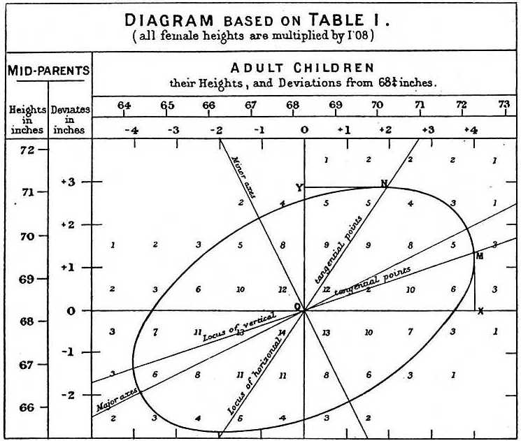

```{r setup, include=FALSE}
library(data.table)
library(tidyverse)
library(patchwork)
library(matrixTests)

source("Setup.R")
fig.dir <- "../Fig/gwas/"
dir.create(fig.dir, showWarnings=FALSE)
setup.env(fig.dir)
dir.create("../data", showWarnings=FALSE)

theme_set(theme_classic() + theme(title = element_text(size=10)))
```

## Roadmap of STAT/BIOF/GSAT540 2026

_data generation_ followed by _inference_ or validation

\vfill

\large

:::::: {.columns}
::: {.column width=.45}

3. Formulating biological questions

4. Hypothesis testing

5. RNA-seq data

6. Inference focusing on RNA-seq

7. Experimental design

:::
::: {.column width=.45}

8. Single-cell genomics

9. Matrix factorization

10. \textbf{\color{magenta} Genome-wide association studies} (Today)

11. Multiple hypothesis testing in Genomics

:::
::::::

\normalsize

## Learning objectives

\large

* Background knowledge of statistical genetics

* Biological and statistical intuitions

\normalsize

# Mapping disease-specific locations in Genome

## Genetics Recap: What is a gene?

\large

* Gene = a unit of heredity copied from a parent to an offspring

* Key discoveries: 

    * Gregor Mendel's pea experiments, 

	* Morgan's fruit fly work.

\normalsize

## A gene can take many forms...

:::::: {.columns}
::: {.column width=.45}
::: {.block}
### Allele

* A different form of a gene

* A Greek word "allos," $\alpha\lambda\lambda\omicron\varsigma$, meaning "other"

:::

:::
::: {.column width=.45}

::: {.block}
### Variant and locus

* A specific region of the genome differs across two or more genomes

* A result of mutation

* A locus: a location where many variants lie (plural: loci).

:::

:::
::::::

"We found *A* allele for this genetic variant as an effect allele."

"We found a hundred variants within the locus of *APOE*."

"We identified ten loci associated with cancer."

## Ploidy and bi-allelic variants

:::::: {.columns}
::: {.column width=.45}

::: {.block}
### Ploidy

* The number of copies of chromosomes within a cell/organism

* Haploid: one copy

* Diploid: two copies

:::

:::
::: {.column width=.45}

::: {.block}
### Biallelic variant

- bi + allelic

- Two forms for a variant

	- \textbf{Reference} (reference genome, usually more frequent)
	- \textbf{Alternative} (less frequent)

:::

:::
::::::

## Minor allele frequency

\large

* For a biallelic variant, the **minor allele** is the less frequent (alternative) allele in a population

* **Minor Allele Frequency (MAF)**: the proportion of haplotypes carrying the minor allele

$$\text{MAF} = \frac{\text{\# minor alleles}}{\text{\# total alleles (haplotypes)}}$$

* In a diploid genome with $n$ individuals: total alleles $= 2n$

* Common variant: MAF $\geq$ 1\%; rare variant: MAF $<$ 1\%

\normalsize


## Let's build up what we know...

\input{tikz-diploid-biallelic.tex}


## Single nucleotide polymorphism

:::::: {.columns}
::: {.column width=.45}

::: {.block}

### Polymorphism

- Poly + morph

- Occurrence of different forms

:::


:::
::: {.column width=.45}

::: {.block}
### SNP

- Single Nucleotide Polymorphism

- A place in the genome where people differ by a single base pair

:::

:::
::::::

\vfill

We pronounce SNP "snip" in North America.

## Homozygotes vs. Heterozygotes in diploid genome

:::::: {.columns}
::: {.column width=.45}

::: {.block}
### Zygote

- A fertilized egg cell

- Formed by the fusion of two gametes (sperm + egg)

- Contains two copies of each chromosome (diploid)

:::


:::
::: {.column width=.45}

::: {.block}
### Homo- vs. heterozygote

- Homozygote: same allele on both copies (e.g., A/A or G/G)

- Heterozygote: different alleles (e.g., A/G)

:::

:::
::::::


## Single nucleotide polymorphism (just 5' $\to$ 3')

\input{tikz-snp-genotypes.tex}

## 

\huge

\centering{Genetics is described in its own terminology.}

\normalsize


## How and why can we study human genetics?


:::::: {.columns}
::: {.column width=.2}

:::
::: {.column width=.4}


:::
::: {.column width=.45}

\large

We can study human genetics because humans share a 99% identical genome.

\normalsize

$${}$$

GWAS is only possible because:

* Although human DNA sequence $n \approx 3.2 \times 10^{9}$ bp,

* luckily \# SNPs $n \approx 4\text{--}5 \times 10^{6}$

:::
::::::

\flushright
@Scally2012-di

## International HapMap to identify "tag" SNPs

\begin{center}
\includegraphics[height=.7\textheight]{img/hapmap.pdf}
\end{center}

@International_HapMap_Consortium2003-di

## Human genetics data --- The 1000 Genomes Project

:::::: {.columns}
::: {.column width=.5}

\centerline{\includegraphics[width=.7\linewidth]{img/1KG.png}}

Let's download the 1KG data using `bigsnpr` library.

```{r eval=F, echo=T, size="large"}
library(bigsnpr)
download_1000G("../data/genotype/")
```

:::
::: {.column width=.5}

\Large

* International consortium

* Goal: find common genetic variants with frequencies of at least 1%

* The project planned to sequence each sample to 4x genomic coverage.

:::
::::::

https://www.internationalgenome.org/

```{r download_1000g_data}
dir.create("../data/genotype/", recursive=TRUE, showWarnings=FALSE)

library(bigsnpr)
.bed.file <- "../data/genotype/1000G_phase3_common_norel.bed"
if.needed(.bed.file, {
    download_1000G("../data/genotype/")
})

.bk.file <- "../data/genotype/1000G_phase3_common_norel.rds"
if.needed(.bk.file, {
    BED <- snp_readBed(.bed.file)
})
```

## A big matrix data set with row and column data

Normally, we have a set of three files (PLINK format):

1. `../data/genotype/1000G_phase3_common_norel.bed`

1. `../data/genotype/1000G_phase3_common_norel.bim`

1. `../data/genotype/1000G_phase3_common_norel.fam`

```{r include=F}
.fam.file <- "../data/genotype/1000G_phase3_common_norel.fam"
.bim.file <- "../data/genotype/1000G_phase3_common_norel.bim"
```

## What are the columns? genetic variants/SNPs

:::::: {.columns}
::: {.column width=.55}

```{r echo=T, size="normalsize"}
fread(.bim.file, nrow=8)
```

:::
::: {.column width=.45}

\normalsize

1. Chromosome code
2. Variant identifier
3. Position in morgans or centimorgans (dummy '0')
4. Base-pair coordinate (1-based; limited to $2^{31}$-2)
5. Allele 1 (corresponding to clear bits in .bed; usually minor)
6. Allele 2 (corresponding to set bits in .bed; usually major)

:::
::::::


\vfill
\tiny
https://www.cog-genomics.org/plink/1.9/formats


## What are the rows? samples/individuals/subjects

:::::: {.columns}
::: {.column width=.45}

```{r echo = T, size="normalsize"}
fread(.fam.file, nrows=7)
```

:::
::: {.column width=.55}

\normalsize

1. Family ID ('FID')
2. Within-family ID (**'IID'**; cannot be '0')
3. Within-family ID of father ('0' if father isn't in dataset)
4. Within-family ID of mother ('0' if mother isn't in dataset)
5. Sex code (1: male, 2: female, 0: unknown)
6. Phenotype value^[not much used] (1: control, 2: case, '-9': missing)

:::
::::::

\vfill
\tiny
https://www.cog-genomics.org/plink/1.9/formats

## A variant $\approx$ SNP (throughout the course)

::: {.block}
### example
```
1 rs12184325  0 754105  T  C
```
:::

\only<1>{
\begin{enumerate}
\item Chromosome
\item Variant
\item Morgan (ignore)
\item Base-pair coordinate
\item Allele 1
\item Allele 2
\end{enumerate} }

\only<2-5>{ \begin{enumerate}
\item<2-5> Chromosome: \textbf{1}
\item<3-5> Variant identifier: \textbf{rs12184325}, a unique ID used in \texttt{dbSNP}; can be anything unique; it can change depending on the \texttt{dbSNP} human genome build (don't rely on it).
\item<4-5> A unit for measuring genetic linkage (just put the dummy value "0")
\item<4-5> Genomic position (bp) within each chromosome
\item<5> \textbf{A1}: If this allele (haplotype) is \textit{T}, we use \textbf{\color{blue}0}
\item<5> \textbf{A2}: If this allele (haplotype) is \textit{C}, we use \textbf{\color{red}1}
\end{enumerate} }

\begin{itemize}
\item<6-> How many haplotypes? A conventional way to code "genotype" is to sum them up (additive effect); there are several other options (dominance, heterozygous).
\item<7-> How do you code "TT"? \only<8>{\color{blue}\bf 0}
\item<7-> How do you code "CC"? \only<8>{\color{red}\bf 2}
\item<7-> How do you code "CT"? \only<8>{\color{purple}\bf 1}
\end{itemize}

## Recap: Single nucleotide polymorphism (just 5' $\to$ 3')

\input{tikz-snp-genotypes.tex}


## Pop quiz: Statistical Genetics 101

\large

**Question 1**

In GWAS, genotypes are typically coded as 0, 1, or 2. What does a genotype value of "1" represent under the additive model?

A) Homozygous for the reference allele
B) Heterozygous
C) Homozygous for the alternative allele
D) Missing data

\normalsize

## Pop quiz: Statistical Genetics 101

\large

**Question 2**
In a standard genotype matrix with n individuals and p SNPs, what are the dimensions?

A) n rows (individuals) × p columns (SNPs)
B) p rows (SNPs) × n columns (individuals)
C) n rows (SNPs) × p columns (individuals)
D) The matrix must be square (n = p)

\normalsize

## Pop quiz: Statistical Genetics 101

**Question 3**
What is the Minor Allele Frequency (MAF)?

A) The frequency of the most common allele in the population
B) The frequency of the least common allele in the population
C) The frequency of heterozygous individuals
D) The frequency of missing genotypes


## How these genotypes are instantiated in 1KG data

By calling `snp_readBed(.bed.file)`, we can convert the "BED"-formatted data to an "RDS" file for faster access. Later, we need to "attach" that RDS.

```{r echo=T, size="normalsize"}
data <- snp_attach(.bk.file)
str(data, max.level=1, strict.width = "cut")
```

```{r include = F}
pop.info.file <- "../data/genotype/1000G_phase3_common_norel.fam2"
pop.info <- fread(pop.info.file)
```

## How these genotypes are instantiated in 1KG data

:::::: {.columns}
::: {.column width=.5}

```{r echo=T, size="large"}
dim(data$genotypes)
```

$${}$$

\Large

* How many rows and columns?

* What are the rows and columns?

:::
::: {.column width=.5}

```{r echo=T, size="large"}
dim(data$fam)
```

```{r echo=T, size="large"}
dim(data$map)
```

:::
::::::

## How these genotypes are instantiated in 1KG data

\Large

A genotype/dosage matrix:

```{r echo = T, size="large"}
data$genotypes[1:5, 1:10]
```

## A tiny fraction of the full genotype matrix

```{r fig.width=6, fig.height=3}
X <- data$genotypes[1:30, 1:60]
colnames(X) <- data$map$marker.ID[1:60]
rownames(X) <- data$fam$sample.ID[1:30]
.matshow(X, .axis.lab=4, .lab=2, .lw=.05)
```

## Just a bit more: Do you see any patterns?

```{r fig.width=6, fig.height=2.5}
X <- data$genotypes[1:400, 1:700]
.matshow(X)
```

We will get back to the structured patterns.

## Goal: mapping disease-specific locations in Genome

\large

::: {.block}
### GWAS

* Input: 

    - A genotype matrix $X$ ${(n{\times}p)}$, where $X_{ij} \in \{0, 1, 2\}$

    - A phenotype vector $\mathbf{y}$ ${(n{\times}1)}$

* Optimization:

	$$\mathbf{y} = \mathbf{x}_{j} \beta_{j} + \epsilon,\, \textsf{for each }j$$ 

* Output:

    - Estimate an effect size (coefficient) $\beta_{j}$ ${(j \in 1,\ldots, p)}$

:::


* Testing $H_{0}: \beta_{j} = 0$ vs. $H_{1}: \beta_{j} \neq 0$.


\normalsize

## Goal: mapping disease-specific locations in Genome

::: {.block}
### GWAS

* Input: 

    - A genotype matrix $X$ ${(n{\times}p)}$, where $X_{ij} \in \{0, 1, 2\}$

    - A phenotype vector $\mathbf{y}$ ${(n{\times}1)}$; it can be anything...

* Output:

    - Estimate a coefficient (effect size) $\beta_{j}$ ${(j \in 1,\ldots, p)}$

:::


* Testing $H_{0}: \beta_{j} = 0$ vs. $H_{1}: \beta_{j} \neq 0$.

* Report p-values

* Is it still straightforward after seeing the $X$ matrix---so direly structured?

## 

\vfill

\huge

What are the differences between DEG and GWAS?

\vfill

\large

\onslide<2->{ So many variants, much fewer samples/individuals }

\onslide<3>{ Expression $\sim$ phenotype vs. phenotype $\sim$ genetic variants }

\onslide<4>{ Goal: mapping a genetic variant $\to$ a phenotype }

\vfill


## One more concept: heritability

:::::: {.columns}
::: {.column width=.4}



\small
Sir Francis Galton's diagram

:::
::: {.column width=.55}

\large

* How do we know a certain trait is heritable?

* What fraction of the variance in the offspring can be explained by the parents?

\normalsize

:::
::::::

[https://en.wikipedia.org/wiki/Regression_toward_the_mean](https://en.wikipedia.org/wiki/Regression_toward_the_mean)

## A missing heritability problem

:::::: {.columns}
::: {.column width=.7}


:::
::: {.column width=.3}

$${}$$

\large

* We knew some traits are heritable...

* However, we could only explain very little by GWAS...

\normalsize

$${}$$

@Manolio2009-dq
:::
::::::

## How much of trait variation is genetic?

:::::: {.columns}
::: {.column width="50%"}

\vspace{1em}

* Not all traits are equally heritable
* Height: ~80% heritable
* BMI: ~40-70% heritable
* Complex diseases: varies widely

:::
::: {.column width="50%"}

\onslide<2->{
\textbf{GWAS perspective:}

\begin{itemize}
\item Low heritability $\to$ weak association signals
\item High heritability but few GWAS hits $\to$ ``missing heritability'' problem
\item Heritability estimates guide study design and power calculations
\end{itemize}
}

:::
::::::

## Broad-sense heritability for a certain trait

:::::: {.columns}
::: {.column width=.35}

\large

$$V_P = V_G + V_E$$

\normalsize

:::
::: {.column width=.65}

* $V_P$: Total phenotypic variance (what we observe)
* $V_G$: **Genetic variance** (all genetic effects)
* $V_E$: Environmental variance (everything else)

:::
::::::

::: {.block}
### Broad-sense heritability $H^2$

$$H^2 = \frac{V_G}{V_P} = \frac{V_G}{V_G + V_E}$$

Proportion of phenotypic variance due to **all** genetic factors.
:::


## Narrow-sense heritability

:::::: {.columns}
::: {.column width=.35}

\large

$$V_G = \underbrace{\color{magenta} V_A}_{\text{our interest}} + V_D + V_I$$

\normalsize

:::
::: {.column width=.65}

* $V_A$: **Additive** genetic variance (linearity)
* $V_D$: **Dominance** variance (non-linearity)
* $V_I$: **Epistatic** variance (interactions)

:::
::::::

::: {.block}
### Narrow-sense heritability $h^2$

$$h^2 = \frac{V_A}{V_P} = \frac{V_A}{V_G + V_E}$$

Proportion of variance due to **additive**/linear genetic effects only.
:::


## Most GWAS assume an additive model

:::::: {.columns}
::: {.column width=.45}

For each variant $j$:
$$y_i = \beta_0 + \beta_j x_{ij} + \epsilon_i$$

where $x_{ij} \in \{0, 1, 2\}$ counts alleles (genotypes).


:::
::: {.column width=.45}

\onslide<2->{
\textbf{Implications:}

\begin{itemize}
\item GWAS primarily captures the $V_A$ (additive variance) component
\item Narrow-sense heritability $h^2$ is the relevant measure for GWAS
\item $h^2$ sets an upper bound on GWAS explanatory power
\end{itemize}
}

:::
::::::

## Practical implications with respect to MAF

:::::: {.columns}
::: {.column width=.5}


@Manolio2009-dq

:::
::: {.column width=.45}

\large

* Low heritability $h^{2}$ per SNP generally implicates
  * high MAF (common)
  * low effect size
  * E.g., each SNP explains a very tiny fraction height.

* High heritability $h^{2}$ per SNP generally implicates
  * low MAF (rare)
  * high effect size
  * E.g., very small number of rare variants can explain cancer.

\normalsize

:::
::::::


## Heritability in our simulation

A typical simulation in `R`:

```{r eval=FALSE, echo=TRUE, size="normalsize"}
simulate.pgs <- function(X, W, h2, pve.w, n.causal, n.traits = 1) {
    # ... genetic effects ...
    y.obs <- y.true * sqrt(h2) + y.pop * sqrt(pve.w)
    y.obs <- y.obs + y.err * sqrt(1 - h2 - pve.w)
    # ...
}

.sim <- simulate.pgs(X, W, h2=.3, pve.w=0, n.causal=3)
```

\vspace{0.5em}

* `h2 = 0.3`: SNP heritability is 30% (3 causal SNPs contribute to genetic variance)
* `pve.w`: Proportion of variance from population structure (confounding)
* `1 - h2 - pve.w`: Residual environmental variance

\vspace{0.5em}

**This simulates a trait with moderate SNP heritability (30%).**

## A wrap-up quiz

\large

Why does GWAS primarily estimate narrow-sense heritability (h²) rather than broad-sense heritability (H²)?

A) GWAS uses additive genetic models for each SNP
B) Dominance effects are always negligible
C) Epistatic effects are easy to detect
D) H² is not a valid concept for complex traits

\normalsize

## A wrap-up quiz

\large

What is the relationship between broad-sense heritability (H²), narrow-sense heritability (h²), and SNP heritability (h²_SNP)?

A) $H^{2} \le h^{2} \le {h^{2}}_{\text{SNP}}$
B) $h^{2}_{\text{SNP}} \le h^{2} \le H^{2}$
C) $h^{2} \le H^{2} \le h^{2}_{\text{SNP}}$
D) They are all equal

\normalsize

# A toy example GWAS

## GWAS for "Obsessive `ggplot` Disorder"^[an illustration purpose]

```{r include=F}
## population structure
W <- 
    pop.info %>% 
    mutate(one = 1) %>%
    dcast(`sample.ID` ~ `Super Population`, value.var = "one", fill = 0) %>%
    (function(x) left_join(data$fam[, "sample.ID", drop = F], x)) %>% 
    column_to_rownames("sample.ID") %>%
    as.matrix()

## Take first 10000 variants
X <- data$genotypes[, 1:10000]
rownames(X) <- data$fam$sample.ID
colnames(X) <- data$map$physical.pos[1:10000]

#' @param X genotype matrix
#' @param W population structure
#' @param h2 heritability
#' @param pve.w population PVe
#' @param n.causal
#' @param n.traits
simulate.pgs <- function(X, W, h2, pve.w, n.causal, n.traits = 1) {
    .rnorm <- function(d1, d2) matrix(rnorm(d1*d2), d1, d2)
    causal.snp <- sample(ncol(X), n.causal)
    xx.causal <- apply(X[, causal.snp, drop=FALSE], 2, scale)
    xx.causal[is.na(xx.causal)] <- 0

    n.ind <- nrow(X)
    y.true <- apply(xx.causal %*% .rnorm(n.causal, n.traits), 2, scale)
    if(pve.w > 0){
        y.pop <- apply(W %*% .rnorm(ncol(W), n.traits), 2, scale)
    }else{
        y.pop <- 0
    }
    y.err <- apply(.rnorm(n.ind, n.traits), 2, scale)

    y.obs <- y.true * sqrt(h2) + y.pop * sqrt(pve.w)
    y.obs <- y.obs + y.err * sqrt(1 - h2 - pve.w)

    prop <- 1/(1+ exp(-y.obs))
    y.cc <- rbinom(length(prop), 1, prop)

    list(y.q = y.obs, y.cc = y.cc, x = X, w = W, causal = causal.snp)
}
```

```{r}
set.seed(1)
.sim <- simulate.pgs(X, W, h2=.3, pve.w=0, n.causal=3)
```

:::::: {.columns}
::: {.column width=.5}

A genotype matrix $X$ ($X_{ij} \in \{0,1,2\}$):

```{r fig.width=2.5, fig.height=2.5}
X <- .sim$x
.matshow(X[1:30,1:30], .lw=.1, .lab=2)
```

:::
::: {.column width=.5}

A vector of phenotypes $Y$ ($Y_{i} = 1$ if case vs. $Y_{i} = 0$ if control)

```{r}
Y <- .sim$y.cc
```

```{r echo=T, size="large"}
table(Y)
```

$${}$$

Goal: Find locations (columns of $X$) where a genotype $\mathbf{x}_{j}$ is associated with a phenotype $\mathbf{y}$

:::
::::::


## Let's do GWAS to find the disease-associated variants

A variant-by-variant association t-test for a variant $j$:

\centerline{$H_{0}:\, \mathbb{E}\!\left[X_{ij}|Y_{i}=1\right] = \mathbb{E}\!\left[X_{ij}|Y_{i}=0\right]\quad\textsf{vs.} \quad \mathbb{E}\!\left[X_{ij}|Y_{i}=1\right] \neq \mathbb{E}\!\left[X_{ij}|Y_{i}=0\right]$}

* The average genotype is the same between the case and control under the null.

```{r echo=T}
j <- 1
t.test(X[Y == 0, j], X[Y == 1, j])
```

## Can we calculate GWAS statistics more efficiently?

```{r echo=T, size="large"}
## library(matrixTests)
.gwas <- col_t_welch(X[Y == 0, ], X[Y == 1, ])
```

* For each pair of columns in the two matrices, the function performs t-test and summarize all the results into a list of vectors.

```{r echo=T}
names(.gwas)
```

## Manhattan plot: A quick summary of all the GWAS p-values

:::::: {.columns}
::: {.column width=.5}

```{r only.plot="1-2", fig.width=3, fig.height=2.5}
par(pch=19, col="gray40", cex=.25)
plot(colnames(X), .gwas$pvalue, xlab = "genomic location", ylab = "p-value")
```

```{r only.plot="3", fig.width=3, fig.height=2.5}
par(pch=19, col="gray40", cex=.25)
plot(colnames(X), .gwas$pvalue, xlab = "genomic location", ylab = "p-value")
points(colnames(X)[.sim$causal], .gwas$pvalue[.sim$causal], col=2, cex=1, lwd=2, pch=1)
```

\onslide<3->{Where are the variants significantly associated with OGD?}

:::
::: {.column width=.5}

```{r only.plot="1", fig.width=3, fig.height=2.5}
par(pch=19, col="gray40", cex=.5)
hist(.gwas$pvalue, 50, main="", xlab="p-value")
```

```{r only.plot="2", fig.width=3, fig.height=2.5}
par(pch=19, col="gray40", cex=.5)
plot(colnames(X), -log10(.gwas$pvalue), xlab = "genomic location", ylab = "-log10 p-value")
```

```{r only.plot="3", fig.width=3, fig.height=2.5}
par(pch=19, col="gray40", cex=.5)
plot(colnames(X), -log10(.gwas$pvalue), xlab = "genomic location", ylab = "-log10 p-value")
points(colnames(X)[.sim$causal], -log10(.gwas$pvalue)[.sim$causal], col=2, cex=1, lwd=2, pch=1)
legend("topleft", "causal variant", col=2, pch=1, lwd=1.5, lty=0, cex=2) 
```

\onslide<2->{Which one is more informative?}

:::
::::::

## Multiple hypothesis adjustment (next lecture)

We have many p-values, namely, $p_{1},p_{2},\ldots,p_{10000}$.

\begin{enumerate}
\item<1-> In GWAS, we usually take a very conservative stance. So, we adjust the nominal p-values by Bonferroni adjustment.
\item<2-> What will be the adjusted p-value for $p_{j}$?
\item<3-> $p^{\mathsf{adj}}_{j} \gets \min\{1, p_{j} \times 10000 \}$
\item<4> $p_{j} < \alpha / 10000$ where $10000$ is the total number of hypothesis tests
\end{enumerate}

```{r size="large", echo=T}
padj <- p.adjust(.gwas$pvalue)
sum(padj < .05)
```

## How many discovered vs. how many independent ones

```{r fig.width=6, fig.height=3, only.plot="1"}
par(pch=19, col="gray40", cex=.5)
plot(colnames(X), -log10(.gwas$pvalue), xlab = "genomic location", ylab = "-log10 p-value")
abline(h=-log10(0.05/ncol(X)), lty=2, col=2)
##points(colnames(X)[.sim$causal], -log10(.gwas$pvalue)[.sim$causal], col=2, cex=1, lwd=2, pch=1)
```

```{r fig.width=6, fig.height=3, only.plot="2"}
par(pch=19, col="gray40", cex=.5)
plot(colnames(X), -log10(.gwas$pvalue), xlab = "genomic location", ylab = "-log10 p-value")
abline(h=-log10(0.05/ncol(X)), lty=2, col=4)
points(colnames(X)[.sim$causal], -log10(.gwas$pvalue)[.sim$causal], col=2, cex=2, lwd=2, pch=1)
legend("top",
       c("causal variant","Bonferroni"),
       col=c(2, 4),
       pch=c(1, NA), lwd=1.5,
       lty=c(0, 2),
       cex=2)
```

## Adjusted p-value should control FWER only if...

```{r}
causal.variants <- .sim$causal
gwas.p <- .gwas$pvalue
```

```{r echo = T}
padj <- p.adjust(gwas.p, method="bonferroni")
false.discoveries <- setdiff(which(padj < .05), causal.variants)
empirical.FDR <- length(false.discoveries) / sum(padj < .05)
print(empirical.FDR)
```

```{r echo = T}
padj <- p.adjust(gwas.p, method="BH")
false.discoveries <- setdiff(which(padj < .05), causal.variants)
empirical.FDR <- length(false.discoveries) / sum(padj < .05)
print(empirical.FDR)
```

## ${}$

\Huge

What went wrong with GWAS?

\onslide<2>{ Actually, everything is perfectly expected. }


## What if we do IID variant association studies?

* Instead of using a real-world genotype matrix, we could do the same exercise with IID 0,1,2 matrix (sample permutation).

```{r}
set.seed(1)
X.iid <- apply(X, 2, sample)
set.seed(1)
.sim.iid <- simulate.pgs(X.iid, W, h2=.3, pve.w=0, n.causal=3)
.gwas.iid <- col_t_welch(X.iid[.sim.iid$y.cc == 0, ], X.iid[.sim.iid$y.cc == 1, ])
```

```{r fig.width=6, fig.height=3}
par(pch=19, col="gray40", cex=.5)
plot(colnames(X.iid), -log10(.gwas.iid$pvalue), xlab = "genomic location", ylab = "-log10 p-value")
abline(h=-log10(0.05/ncol(X.iid)), lty=2, col=4)
points(colnames(X)[.sim$causal], -log10(.gwas.iid$pvalue)[.sim$causal], col=2, cex=2, lwd=2, pch=1)
legend("top",
       c("causal variant","Bonferroni"),
       col=c(2, 4),
       pch=c(1, NA), lwd=1.5,
       lty=c(0, 2),
       cex=2)
```

# How GWAS can be interpreted wrongfully

## Exploratory Data Analysis of the 1KG data

In the 1KG data, we have `r nrow(data$genotypes)` rows/individuals and `r ncol(data$genotypes)` columns/variants. 

* We will use $n$ to refer to the number of samples and $p$ to the number of variants.

* Let's assume that we are mostly interested in biallelic (two alleles) variants/SNPs.

\begin{itemize}
\item<2-> \textit{Recall}: Each SNP/genotype comprises two numbers (haplotypes)--one from the maternal and the other from the paternal genome.
\item<3-> There are major (usually reference) and minor (usually alternative) alleles. In PLINK/\texttt{bigsnpr}, the genotype value (0, 1, 2) counts the number of A2 (major) alleles.
\item<4> So, each variant, we have a minor allele frequency (MAF), namely, $f_{j}$, for a variant $j$.
\end{itemize}

## If each variant follows Binomial distribution 

In Binomial distribution, with an allele frequency $f_{j}$ (of the counted allele), we have

\begin{itemize}
\item<1-> What will be a useful summary statistic for a variant $j$?
\onslide<2->{$$\hat{\mathbb{E}}\!\left[X_{j}\right] = 2 f_{j}$$}
\item<3-> What is the variance of this variant?
\onslide<4>{$$\hat{\mathbb{V}}\!\left[X_{j}\right] = 2 f_{j} (1 - f_{j})$$}
\end{itemize}

\vfill

\small

\textit{Remark}: Technically, the dosage (0,1,2) does not follow binomial distribution. Why? The underlying data generation process involves haplotypes (separating the maternal and paternal 0/1 counts) and dependency along the genomic axis.

## Variant-level MAF across individuals

We can easily calculate MAF using `bigsnpr`:

```{r echo=TRUE, size="large"}
maf <- snp_MAF(data$genotypes, ncores=8)
```

```{r fig.width=6, fig.height=2, onslide.plot="2"}
ggplot(data.table(MAF=maf), aes(MAF)) +
    geom_density(aes(y = ..count..), fill="gray")
```

* What are the x- and y-axis? Where is the peak?

## MAF distributions generally differ across ancestry groups (AG)

```{r}
.maf.file <- "../data/genotype/maf.txt.gz"
if.needed(.maf.file, {
    .hdr <- gsub(".rds","",.bk.file)
    .files <- c()
    pops <- unique(pop.info$`Super Population`)
    for(pp in pops){
        ii <- pop.info[`Super Population` == pp]$sample.ID
        .bk.p <- .hdr %&% "-" %&% pp
        if(!file.exists(.bk.p %&% ".rds")){
            . <- snp_subset(data, which(data$fam$sample.ID %in% ii),
                            backingfile = .bk.p)
        }
        .files <- c(.files, pp = .bk.p %&% ".rds")
    }
    names(.files) <- pops

    .dt.maf <- data.table()

    for(pp in pops){
        .temp <- snp_attach(.files[pp])
        .maf.pp <- snp_MAF(.temp$genotypes, ncores = 8)
        rm(.temp)
        .dt <-
            data.table(maf = .maf.pp, pop = pp) %>%
            mutate(j = 1:n())
        .dt.maf <- rbind(.dt.maf, .dt)
    }
    fwrite(.dt.maf, .maf.file)
})
.dt.maf <- fread(.maf.file)
```

```{r fig.width=6, fig.height=3}
ggplot(.dt.maf, aes(maf, fill = pop)) +
    theme(axis.text = element_text(size=2)) +
    geom_histogram(bins=50) +
    scale_x_continuous(trans="sqrt") +
    facet_wrap(~pop, nrow = 2, scales="free") +
    scale_fill_brewer(palette = "Set1", guide="none")
```


## The same variant could have vastly different MAF values across AG

```{r}
maf.mat <-
    dcast(.dt.maf, j ~ pop, value.var = "maf") %>%
    (function(x) { rownames(x) <- x$j; x[, j:=NULL]; x })
```

```{r echo = T, size="normalsize"}
head(maf.mat)
```

## Random 100 variants

```{r fig.width=6, fig.height=3}
pheatmap::pheatmap(t(maf.mat[sample(.N, 100), ]))
```

## The covariance matrices of $X$? -- between the variants

```{r}
xx <- data$genotypes[1:400, 1:700]
```

:::::: {.columns}
::: {.column width=.5}

```{r fig.width=2.8, fig.height=2.5}
.matshow(pmin(pmax(cov(xx), -.5), .5), .lab=0, .axis.lab=0, .lw=0)
```

\small

More discussions in the next lectures.

:::
::: {.column width=.5}

For a genotype matrix $X$ ${(n{\times}p)}$,

::: {.block}
### Linkage disequilibrium matrix

A ${p\times{p}}$ matrix:

$$\hat{R} = \frac{1}{n}X^{\top}X$$

given each column $\mathbf{x}_{j}$ standardized (mean 0, SD 1).

:::

* $n$: individuals

* $p$: variants/SNPs

\centerline{$R_{ij} = \frac{1}{n} \sum_{r=1}^{n} X_{ri} X_{rj}$}

:::
::::::

## The covariance matrices of $X$? -- between the individuals

```{r}
xx <- data$genotypes[1:500, 1:700]
```

:::::: {.columns}
::: {.column width=.5}

```{r fig.width=2.8, fig.height=2.5}
.matshow(pmin(cov(t(xx)), .7), .lab=0, .axis.lab=0, .lw=0)
```

:::
::: {.column width=.5}

For a genotype matrix $X$ ${(n{\times}p)}$

::: {.block}
### Kinship/genetic relatedness matrix

An ${n\times{n}}$ matrix:

$$\hat{K} = \frac{1}{p}XX^{\top}$$

given each row $\mathbf{x}_{i}$ standardized (mean 0, SD 1).

:::

* $n$: individuals

* $p$: variants/SNPs


\centerline{$K_{ij} = \frac{1}{p} \sum_{g=1}^{p} X_{ig} X_{jg}$}

:::
::::::


## What would happen if there were AG-specific biases?

\Large

$$g\left( \underset{\textsf{phenotype}}{Y} \right)
\sim \underbrace{\sum_{k \in \textsf{causal variants}} X_{k} \beta_{k}}_{\textsf{true genetic effect}} +
\underbrace{\sum_{g} \mathbf{U}_{g} \gamma_{g}}_{\textsf{ancestry group factors}} + \epsilon$$


```{r}
set.seed(1)
.sim.biased <- simulate.pgs(X, W, h2=.3, pve.w=.3, n.causal=3)
Y <- .sim.biased$y.cc
```

$${}$$

Do GWAS as usual by variant-by-variant t-test:

```{r echo=T, size="large"}
.gwas.biased <- col_t_welch(X[Y == 0, ], X[Y == 1, ])
```

## Do we have that many significant ones?

```{r fig.width=6, fig.height=3, only.plot="1"}
par(pch=19, col="gray40", cex=.5)
hist(.gwas.biased$pvalue, 50, main="", xlab="p-value")
```

```{r fig.width=6, fig.height=3, only.plot="2"}
par(pch=19, col="gray40", cex=.5)
plot(colnames(X), -log10(.gwas.biased$pvalue), xlab = "genomic location", ylab = "-log10 p-value")
abline(h=-log10(0.05/ncol(X)), lty=2, col=4, lwd=2)
points(colnames(X)[.sim.biased$causal], -log10(.gwas.biased$pvalue)[.sim.biased$causal], col=2, cex=2, lwd=2, pch=1)
legend("topleft",
       c("causal variant","Bonferroni"),
       col=c(2, 4),
       pch=c(1, NA), lwd=1.5,
       lty=c(0, 2),
       cex=2)
```

## How do we check group structures?

:::::: {.columns}
::: {.column width=.4}

::: {.block}
### Common assumption: 

- Only a small portion of variants are significantly associated. Why?

- A majority of p-values under the null will follow Uniform distribution.

:::

```{r echo=T, eval=F, size="large"}
nn <- length(.gwas$pvalue)
p.expected <- seq(1, nn)/(nn+1)
```


:::
::: {.column width=.6}

```{r}
nn <- length(.gwas$pvalue)
p.expected <- seq(1, nn)/(nn+1)
```

```{r fig.width=3, fig.height=2.25, onslide.plot="2"}
par(cex=.5)
hist(p.expected)
```

:::
::::::

## Quantile-quantile plot as a diagnostic tool (log-scale)

\large

Use `qqplot(pvalue1, pvalue2)`

```{r fig.width=4, fig.height=2.8, only.plot="1"}
par(cex=.5)
qqplot(-log10(p.expected), -log10(.gwas.iid$pvalue),
       main = "GWAS with IID variables",
       xlab = "-log10 P-value expected",
       ylab = "-log10 P-value estimated")
abline(a=0, b=1, col=2)
```

```{r fig.width=4, fig.height=2.8, only.plot="2"}
par(cex=.5)
qqplot(-log10(p.expected), -log10(.gwas$pvalue),
       xlab = "-log10 P-value expected",
       ylab = "-log10 P-value estimated",
       main = "GWAS with actual genotype")
abline(a=0, b=1, col=2)
```

```{r fig.width=4, fig.height=2.8, only.plot="3"}
par(cex=.5)
qqplot(-log10(p.expected), -log10(.gwas.biased$pvalue),
       xlab = "-log10 P-value expected",
       ylab = "-log10 P-value estimated",
       main = "GWAS with hidden pop structure")
abline(a=0, b=1, col=2)
```

## How can we ascertain ancestry group structures?

:::::: {.columns}
::: {.column width=.3}

```{r echo=T}
pca <- prcomp(t(X), rank=3) # rows
names(pca)
dim(pca$rotation)
```

:::
::: {.column width=.7}

```{r fig.width=4, fig.height=2.8, only.plot="2"}
.dt <- data.table(pca$rotation, pop.info)

ggplot(.dt[sample(.N)], aes(PC1, PC2, fill=`Super Population`)) +
    geom_point(stroke=.1, pch=21) +
    scale_fill_brewer("",palette = "Paired")
```

```{r fig.width=4, fig.height=2.8, only.plot="3"}
ggplot(.dt[sample(.N)], aes(PC2, PC3, fill=`Super Population`)) +
    geom_point(stroke=.1, pch=21) +
    scale_fill_brewer("",palette = "Paired")
```

:::
::::::

## Can we quickly fix this? A little bit...

```{r}
Y <- .sim.biased$y.cc
```

```{r echo = T, size = "Large"}
.svd <- rsvd::rsvd(X, 10)
Y.adj <- lm(Y ~ .svd$u)$residual
.gwas.adj <- col_cor_pearson(X, Y.adj)
```

$${}$$

\large

$$g\left( \underset{\textsf{phenotype}}{Y} \right)
\sim \underbrace{X_{k} \beta_{k}}_{\textsf{\color{teal} true genetic effect}} +
\underbrace{\sum_{g} \mathbf{U}_{g} \gamma_{g}}_{\textsf{\color{magenta} estimate this by SVD}} + \epsilon$$

## Recall: SVD captures principal components

\large
\onslide<1->{
$$X = U D V^{\top}$$
}

\onslide<2->{
What is this?
$$\frac{1}{n} X^{\top}X = \frac{1}{n} V D U^{\top} U D V^{\top} = 
\underset{\textsf{\color{magenta} variant x variant}}{\frac{1}{n} V D^{2} V^{\top}}$$
}

\onslide<3->{
What is this?
$$\frac{1}{n} XX^{\top} = \frac{1}{n} U D V^{\top} V D U^{\top} = 
\underset{\textsf{\color{teal} sample x sample}}{\frac{1}{n} U D^{2} U^{\top}}$$
}

## Regressing out AG PCs can reduce biases

```{r fig.width=6, fig.height=3, only.plot="1"}
par(pch=19, col="gray40", cex=.5)
plot(colnames(X), -log10(.gwas.biased$pvalue), xlab = "genomic location", ylab = "-log10 p-value", main = "before adjustement")
abline(h=-log10(0.05/ncol(X.iid)), lty=2, col=4)
points(colnames(X)[.sim.biased$causal], -log10(.gwas.biased$pvalue)[.sim.biased$causal], col=2, cex=2, lwd=2, pch=1)
legend("topleft",
       c("causal variant","Bonferroni"),
       col=c(2, 4),
       pch=c(1, NA), lwd=1.5,
       lty=c(0, 2),
       cex=2)
```

```{r fig.width=6, fig.height=3, only.plot="2"}
par(pch=19, col="gray40", cex=.5)
plot(colnames(X), -log10(.gwas.adj$pvalue), xlab = "genomic location", ylab = "-log10 p-value", main = "after adjustment")
abline(h=-log10(0.05/ncol(X.iid)), lty=2, col=4)
points(colnames(X)[.sim.biased$causal], -log10(.gwas.adj$pvalue)[.sim.biased$causal], col=2, cex=2, lwd=2, pch=1)
legend("topright",
       c("causal variant","Bonferroni"),
       col=c(2, 4),
       pch=c(1, NA), lwd=1.5,
       lty=c(0, 2),
       cex=2)
```

```{r fig.width=4, fig.height=2.8, only.plot="3"}
par(cex=.5)
qqplot(-log10(p.expected), -log10(.gwas.adj$pvalue),
       xlab = "-log10 P-value expected",
       ylab = "-log10 P-value estimated",
       main = "GWAS with actual genotype after adjustment")
abline(a=0, b=1, col=2)
```


# Combining evidence from multiple studies

## Suppose we have GWAS statistics within each AG

```{r message=F, warning=F, include=F}
Y <- .sim$y.cc
pops <- unique(pop.info$`Super Population`)
gwas.dt <- data.table()
for(pp in pops){
    .subset <- pop.info$`Super Population` == pp
    .gwas.p <- col_t_welch(X[which(Y == 0 & .subset), ],
                           X[which(Y == 1 & .subset), ])
    .gwas.dt.p <- setDT(.gwas.p)[, .(pvalue, mean.diff, stderr)] %>%
        mutate(physical.pos = as.integer(colnames(X)), pop = pp)
    gwas.dt <- rbind(gwas.dt, .gwas.dt.p)
}
```

```{r fig.width=6, fig.height=3, only.plot="1"}
ggplot(gwas.dt[pop == "EUR"], aes(physical.pos, -log10(pvalue))) +
    ggrastr::rasterise(geom_point(pch=19, size=.5, col="gray"), dpi=300) +
    geom_hline(yintercept = -log10(0.05/ncol(X)), col=2, lty=2) +
    xlab("genomic location") +
    ggtitle("GWAS in EUR (N=" %&% sum(pop.info$`Super Population`=="EUR") %&% ")")
```

```{r fig.width=6, fig.height=3, only.plot="2"}
ggplot(gwas.dt[sample(.N)],
       aes(physical.pos, -log10(pvalue), color=pop)) +
    ggrastr::rasterise(geom_point(pch=19, size=.5), dpi=300) +
    scale_color_brewer(palette = "Paired") +
    geom_hline(yintercept = -log10(0.05/ncol(X)), col=2, lty=2) +
    theme(legend.position = c(1,1)) +
    theme(legend.justification = c(1,1)) +
    theme(legend.title = element_blank()) +
    xlab("genomic location")
```

## Meta analysis: How can we combine multiple studies?

\large

For each population/study $k$:

* $\hat\beta_{jk}$: effect size for a variant $j$ on a study $k$

* $s_{jk} = \mathsf{SE}(\beta_{jk})$: standard error for  a variant $j$ on a study $k$

* $w_{jk} = 1/s_{jk}^{2}$: inverse variance

::: {.block}
### Meta analysis by inverse variance weighting

$$\hat\beta_{j} = 
\frac{\sum_{k} w_{k} \hat\beta_{jk}}
{\sum_{k} w_{k}},
\quad\quad
\mathsf{SE}(\hat\beta_{j}) = 
\frac{1}
{\sqrt{ \sum_{k} w_{k} }}$$

:::

## Meta analysis can boost statistical power

```{r echo = T, eval = F}
gwas.dt[, w := 1/(`stderr`^2 + 1e-16)]

meta.dt <-
    gwas.dt[!is.na(w),
            .(`mean` = sum(`mean.diff` * w)/sum(w),
              `se` = 1/sqrt(sum(w))),
            by = .(physical.pos)]

meta.dt[, `z` := `mean`/`se`]
meta.dt[, `pvalue` := 2*pnorm(abs(`z`), lower.tail=F)]
```

```{r}
do.meta <- function(.dt, var.min = 1e-16){
    .dt[, w := 1/(`stderr`^2 + var.min)]
    meta.dt <-
        .dt[!is.na(w),
                .(`mean` = sum(`mean.diff` * w)/sum(w),
                  `se` = 1/sqrt(sum(w))),
                by = .(physical.pos)]
    meta.dt[, `z` := `mean`/`se`]
    meta.dt[, `pvalue` := 2*pnorm(abs(`z`), lower.tail=F)]
    return(meta.dt)
}
```

##

```{r fig.width=6, fig.height=3, only.plot="1"}
.show.gwas.pop <- function(pp){
    meta.dt <- do.meta(gwas.dt[pop %in% pp])
    .causal <- meta.dt[physical.pos %in% colnames(X)[.sim$causal]]
    ggplot(meta.dt, aes(physical.pos, -log10(pvalue))) +
        ggrastr::rasterise(geom_point(pch=19, size=.5, color="gray40"), dpi=300) +
        geom_hline(yintercept = -log10(0.05/ncol(X)), col=2, lty=2) +
        ggtitle(paste0(pp, collapse = " + ")) +
        geom_point(data = .causal, pch=21, col=2, size=2)
}
.show.gwas.pop("EUR")
```

```{r fig.width=6, fig.height=3, only.plot="2"}
.show.gwas.pop(c("EUR", "EAS"))
```

```{r fig.width=6, fig.height=3, only.plot="3"}
.show.gwas.pop(c("EUR", "EAS", "AMR"))
```

```{r fig.width=6, fig.height=3, only.plot="4"}
.show.gwas.pop(c("EUR", "EAS", "AMR", "SAS"))
```

```{r fig.width=6, fig.height=3, only.plot="5"}
.show.gwas.pop(c("EUR", "EAS", "AMR", "SAS", "AFR"))
```

## Common pitfalls of GWAS meta analysis

\Large

* Multiple GWAS results on similar yet slightly different phenotypes

* Different reference human genome

* Different array platforms (could cover different variants)

* Shared individuals

    - Some individuals can be shared among different studies
	
	- In UK Biobank data, many non-cancer individuals can be also non-neuro-degenerative disorder individuals.

## Final pop quiz

\large

What is the key assumption required for Bonferroni correction to be valid?

A) All variants must have the same MAF
B) Tests must be independent or positively correlated
C) The sample size must be greater than 1000
D) All variants must be in Hardy-Weinberg equilibrium


## Final pop quiz

\large

What is the primary purpose of including principal components (PCs) as covariates in GWAS?

A) To increase the sample size
B) To correct for population stratification
C) To identify causal variants
D) To improve genotyping accuracy

## Final pop quiz

\large

What is the purpose of a QQ (quantile-quantile) plot in GWAS?

A) To identify which chromosome has the most associations
B) To compare observed vs. expected p-value distributions under the null
C) To visualize effect sizes
D) To show LD between variants


##

## Reference {.allowframebreaks}
