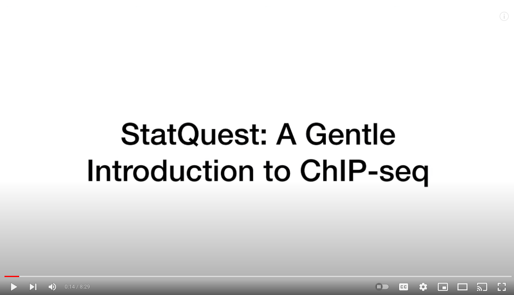

# Lecture 11 Pre-reading/watching:

* [This 8.5 minute video: "A Gentle Introduction to ChIP-seq"](https://www.youtube.com/embed/nkWGmaYRues) from the StatQuest YouTube channel:

<!-- 
 -->
<!--  -->
<!-- 
 -->

* [Chapter 33: DNA Methylation, from "Handbook of Statistical Genomics", by Hansen, Siegmund and Lin](https://go.exlibris.link/R1hjRtdV) - link to full text of the book, which is available online via UBC Library after CWL login
