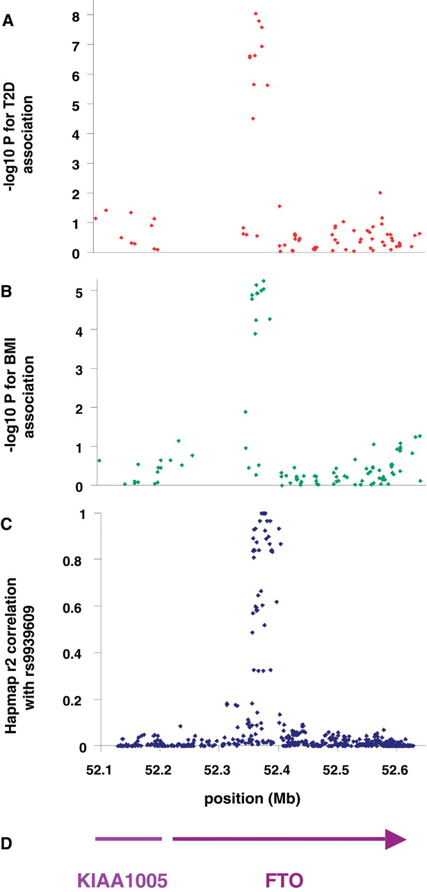
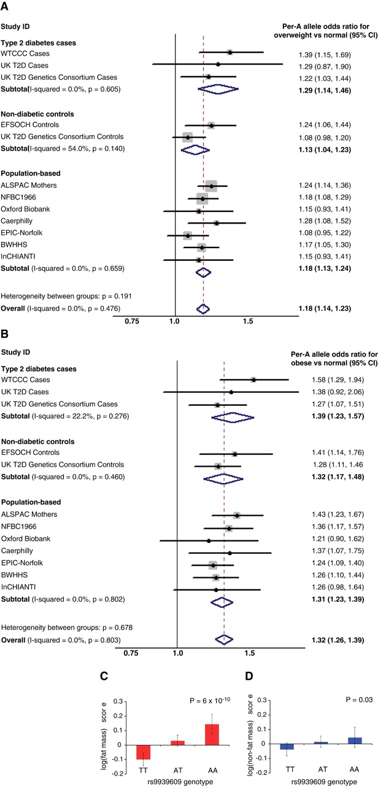

```{r setup, include=FALSE}
source("Setup.R")
fig.dir <- "../Fig/regression-classification/"
dir.create(fig.dir, showWarnings=FALSE)
setup.env(fig.dir)
dir.create("../data", showWarnings=FALSE)

library(data.table)
library(tidyverse)
library(patchwork)
library(matrixTests)

theme_set(theme_minimal())
```

## Learning objectives

By the end of this lecture, you will be able to:

\large

1. Apply regression methods to genomic data integration problems

2. Understand fine-mapping and variable selection in regulatory genomics

3. Integrate GWAS and regulatory data using TWAS and colocalization

## Roadmap: From biology to methodology

\large

:::::: {.columns}
::: {.column width=.48}

**Lecture 12 (Biology)**

* Regulatory genomics data types

* ChIP-seq, ATAC-seq, DNA methylation

* Biological interpretation

:::
::: {.column width=.48}

**Today (Methodology)**

* Polygenic score model

* eQTLs and chromatin accessibility

* Regression for genomic integration

* Integrative analysis methods

:::
::::::

## We will discuss multivariate linear regression


## Genetic data as an anchor variable

\large

$$\text{Genetic variants} \to \text{Molecular Phenotype} \to \text{Disease Phenotype}$$


\normalsize


## Using 1000 Genomes data via `bigsnpr`

```{r eval=F, echo=T, size="large"}
library(bigsnpr)
download_1000G("../data/genotype/")
```

\vfill

```{r download_1000g_data, echo=F}
dir.create("../data/genotype/", recursive=TRUE, showWarnings=FALSE)

library(bigsnpr)
.bed.file <- "../data/genotype/1000G_phase3_common_norel.bed"
if.needed(.bed.file, {
    download_1000G("../data/genotype/")
})

.bk.file <- "../data/genotype/1000G_phase3_common_norel.rds"
if.needed(.bk.file, {
    BED <- snp_readBed(.bed.file)
})
```

```{r echo=T}
data <- snp_attach(.bk.file)
str(data, max.level=1, strict.width = "cut")
```

```{r include = F}
pop.info.file <- "../data/genotype/1000G_phase3_common_norel.fam2"
pop.info <- fread(pop.info.file)
```

```{r include=F}
## population structure
W <-
    pop.info %>%
    mutate(one = 1) %>%
    dcast(`sample.ID` ~ `Super Population`, value.var = "one", fill = 0) %>%
    (function(x) left_join(data$fam[, "sample.ID", drop = F], x)) %>%
    column_to_rownames("sample.ID") %>%
    as.matrix()

## Take first 10000 variants
X <- data$genotypes[, 1:10000]
rownames(X) <- data$fam$sample.ID
colnames(X) <- data$map$physical.pos[1:10000]

#' @param X genotype matrix
#' @param W population structure
#' @param h2 heritability
#' @param pve.w population pve
#' @param n.causal
#' @param n.traits
simulate.pgs <- function(X, W, h2, pve.w, n.causal, n.traits = 1) {
    .rnorm <- function(d1, d2) matrix(rnorm(d1*d2), d1, d2)
    causal.snp <- sample(ncol(X), n.causal)
    xx.causal <- apply(X[, causal.snp, drop=FALSE], 2, scale)
    xx.causal[is.na(xx.causal)] <- 0

    n.ind <- nrow(X)
    y.true <- apply(xx.causal %*% .rnorm(n.causal, n.traits), 2, scale)
    if(pve.w > 0){
        y.pop <- apply(W %*% .rnorm(ncol(W), n.traits), 2, scale)
    }else{
        y.pop <- 0
    }
    y.err <- apply(.rnorm(n.ind, n.traits), 2, scale)

    y.obs <- y.true * sqrt(h2) + y.pop * sqrt(pve.w)
    y.obs <- y.obs + y.err * sqrt(1 - h2 - pve.w)

    prop <- 1/(1+ exp(-y.obs))
    y.cc <- rbinom(length(prop), 1, prop)

    list(y.q = y.obs, y.cc = y.cc, x = X, w = W, causal = causal.snp)
}
```


```{r}
set.seed(1)
.sim <- simulate.pgs(X, W, h2=.3, pve.w=0, n.causal=3)
```

```{r}
Y <- .sim$y.cc
```


# Polygenic risk prediction (G $\to$ phenotype)

## Recap: Notations

\large

* $X$: ${n} \times {p}$ genotype matrix of ${n}$ samples/individuals and ${p}$ variants

* $Y$: ${n} \times {1}$ phenotype vector of ${n}$ samples/individuals

## Let's do GWAS to find the disease-associated variants

A variant-by-variant association t-test for a variant $j$:

\begin{eqnarray*}
H_{0}:
&\,& 
\mathbb{E}\!\left[X_{ij}|Y_{i}=1\right] = \mathbb{E}\!\left[X_{ij}|Y_{i}=0\right] \\
& & \textsf{vs.} \\
\, H_{1}:&\,& \mathbb{E}\!\left[X_{ij}|Y_{i}=1\right] \neq \mathbb{E}\!\left[X_{ij}|Y_{i}=0\right]
\end{eqnarray*}

* The average genotype is the same between the case and control under the null.

<!-- ## For one variant's test -->
<!-- ```{r echo=T, size="large"} -->
<!-- j <- 1 -->
<!-- t.test(X[Y == 0, j], X[Y == 1, j]) -->
<!-- ``` -->

## GWAS statistics over all the variants

```{r echo=T, size="large"}
## library(matrixTests)
.gwas <- col_t_welch(X[Y == 0, ], X[Y == 1, ])
```

* For each pair of columns in the two matrices, the function performs a t-test and summarizes all the results into a list of vectors.

```{r echo=T}
names(.gwas)
```


## Human genetic variation recap

\centerline{\includegraphics[height=.7\textheight]{img/altshuler_daly_lander_GWAS.pdf}}

\vfill

[@Altshuler2008-wr]

## Human genetic variation recap

\centerline{\includegraphics[height=.8\textheight]{img/altshuler_daly_lander_LD.pdf}\vspace{-16pt}}

[@Altshuler2008-wr]

## Manhattan plot: a summary of all the GWAS p-values

```{r fig.width=5, fig.height=3}
par(pch=19, col="gray40", cex=.5)
plot(colnames(X), -log10(.gwas$pvalue), xlab = "genomic location", ylab = "-log10 p-value")
```


## The covariance of $X$ between the variants (columns)

```{r}
xx <- data$genotypes[1:400, 1:700]
```

:::::: {.columns}
::: {.column width=.5}

```{r fig.width=2.8, fig.height=2.5}
.matshow(pmin(pmax(cov(xx), -.5), .5), .lab=0, .axis.lab=0, .lw=0)
```

:::
::: {.column width=.5}


For a genotype matrix $X$ ${(n{\times}p)}$,


::: {.block}
### Linkage disequilibrium matrix

A ${p\times{p}}$ matrix:

$$\hat{R} = \frac{1}{n}X^{\top}X$$

column $\mathbf{x}_{j}$ standardized (mean 0, SD 1).

:::

\centerline{$R_{ij} = \frac{1}{n} \sum_{r=1}^{n} X_{ri} X_{rj}$}

:::
::::::

## The covariance of $X$ between the individuals (rows)

```{r}
xx <- data$genotypes[1:500, 1:700]
```

:::::: {.columns}
::: {.column width=.5}

```{r fig.width=2.8, fig.height=2.5}
.matshow(pmin(cov(t(xx)), .7), .lab=0, .axis.lab=0, .lw=0)
```

:::
::: {.column width=.5}

For a genotype matrix $X$ ${(n{\times}p)}$


::: {.block}
### Genetic relatedness matrix

An ${n\times{n}}$ matrix:

$$\hat{K} = \frac{1}{p}XX^{\top}$$

each row $\mathbf{x}_{i}$ standardized (mean 0, SD 1).

:::

\centerline{$K_{ij} = \frac{1}{p} \sum_{g=1}^{p} X_{ig} X_{jg}$}

:::
::::::


## What's next after GWAS?

\Large

- GWAS until 2010s: heavy focuses on **mapping**

    - GWAS map: genetic variants $\to$ a phenotype

    - Stringent genome-wide p-value cutoff

    - Study design, meta analysis

- NHGRI-EBI GWAS Catalog: [`https://www.ebi.ac.uk/gwas/`](https://www.ebi.ac.uk/gwas/)

##

\huge

Let's take a look at the GWAS Catalog:

[`https://www.ebi.ac.uk/gwas/`](https://www.ebi.ac.uk/gwas/)


## What's next after GWAS?

\Large

- GWAS since 2010s: more emphasis on **prediction**

	- Can we turn GWAS results to a prediction model?

	- Can we understand the mechanisms?

    - Machine learning, data integration, causal inference


## Polygenic score models predict disease prevalence based on genome

- Poly + genic = many genes (units of hereditary components)

\vfill

::: {.block}
### A (linear) polygenic score (PGS)

$$Y_{i} = \sum_{j} X_{ij} \beta_{j}$$

for an individual $i$.

:::

\onslide<2>{Knowing $\beta$'s, we can predict:
$${\color{teal}Y^{\star}}_{i} \gets \sum_{j} {\color{magenta} X_{ij}^{\star}} \hat{\boldsymbol{\beta}}_{j}$$}


## Example: PGS for breast cancer occurrence

:::::: {.columns}
::: {.column width=.7}

\includegraphics[width=\linewidth]{img/PGS_Yang_Pharoah_NR_Cancer_2023_BRCA.pdf}

:::
::: {.column width=.3}

\normalsize

* Strong heritability (proportion of disease risk variation explained by genetics): 35% - 80%

* Prediction is more accurate than lifestyle and other environmental factors

* More powerful if combined with rare risk factors

:::
::::::

\vfill

\tiny

[@Yang2023-id]

## Example: Coronary artery disorder $\to$ prevention

\centerline{\includegraphics[width=.8\linewidth]{img/PGS_Khera_Kathiresan_NatGen_2018_CAD.pdf}}

* Top .5% of PGS values $\to$ five fold increase of CAD

\vfill

\tiny

[@Khera2018-cad]

## Example: PGS stratifies individuals' disease onset

\centerline{\includegraphics[width=.8\linewidth]{img/PGS_Mars_Ripatti_Nature_Medicine_2020_1.pdf}}

\vfill

* PRS $\approx$ PGS.

* We can partition cohorts based on PGS profiles.

\tiny

[@Mars2020-vw]


## GWAS for "Obsessive `ggplot` Disorder"^[just for illustration purposes]

```{r include=F}
#' @param X genotype matrix
#' @param W population structure
#' @param h2 heritability
#' @param pve.w population pve
#' @param n.causal
#' @param n.traits
simulate.pgs <- function(X, W, h2, pve.w, n.causal, n.traits = 1) {
    .rnorm <- function(d1, d2) matrix(rnorm(d1*d2), d1, d2)
    causal.snp <- sample(ncol(X), n.causal)
    xx.causal <- apply(X[, causal.snp, drop=FALSE], 2, scale)
    xx.causal[is.na(xx.causal)] <- 0

    n.ind <- nrow(X)
    y.true <- apply(xx.causal %*% .rnorm(n.causal, n.traits), 2, scale)

    if(pve.w > 0){
        y.pop <- apply(W %*% .rnorm(ncol(W), n.traits), 2, scale)
    }else{
        y.pop <- 0
    }
    y.err <- apply(.rnorm(n.ind, n.traits), 2, scale)

    y.obs <- y.true * sqrt(h2) + y.pop * sqrt(pve.w)
    y.obs <- y.obs + y.err * sqrt(1 - h2 - pve.w)

    prop <- 1/(1+ exp(-y.obs))
    y.cc <- rbinom(length(prop), 1, prop)

    list(y.q = y.obs, y.cc = y.cc, pgs = y.true,
         x = X, w = W, causal = causal.snp)
}
```

```{r}
## Take first chromosome
chr1 <- which(data$map$chromosome==1)
X.tot <- data$genotypes[, chr1]
rownames(X.tot) <- data$fam$sample.ID
colnames(X.tot) <- data$map$physical.pos[chr1]

## population structure
W.tot <-
    pop.info %>%
    mutate(one = 1) %>%
    dcast(`sample.ID` ~ `Super Population`, value.var = "one", fill = 0) %>%
    (function(x) left_join(data$fam[, "sample.ID", drop = F], x)) %>%
    column_to_rownames("sample.ID") %>%
    as.matrix()
```

```{r}
set.seed(1)
.sim <- simulate.pgs(X.tot, W.tot, h2=.3, pve.w=0, n.causal=7)
.train <- sample(nrow(X.tot), 1500)
Y <- .sim$y.cc[.train]
X <- .sim$x[.train, , drop = F]
```

A genotype matrix $X$ ($X_{ij} \in \{0,1,2\}$):

```{r fig.width=6, fig.height=2.3}
.matshow(X[1:30, 1:80], .lw=.01, .lab=1.5)
```

## In GWAS, we can have case vs. control phenotype

\large

$Y_{i} = 1$ if case vs. $Y_{i} = 0$ if control

For our *OGD* GWAS:

```{r}
y <- .sim$y.cc[.train]
```

:::::: {.columns}
::: {.column width=.2}

:::
::: {.column width=.8}


```{r echo=T, size="large"}
table(y)
```

:::
::::::


- E.g., Cancer vs. non-cancer, schizophrenia vs. no mental disorder

- The fundamental question is, "Which individuals/subjects can be truly labelled control/wild type?"

## Under the hood, there are quantitative "risk" scores

```{r fig.width=5, fig.height=2}
ggplot(data.table(y=as.vector(.sim$y.q)), aes(y)) +
    geom_histogram() +
    xlab("phenotypic variation")
```

- E.g., height, BMI, parents' age of death, how many packs of cigarettes, etc.

## Side note: Almost all complex traits are polygenic

Polygenic effects of common SNPs $\to$ polymorphism in phenotypes

\vfill

> A polygenic trait is a characteristic, such as height or skin color, that is influenced by two or more genes. **Because multiple genes are involved, polygenic traits do not follow the patterns of Mendelian inheritance.** Many polygenic traits are also influenced by the environment and are called multifactorial.

\vfill

https://www.genome.gov/genetics-glossary/Polygenic-Trait


## A polygenic score to predict disease prevalence

```{r}
.dt <- data.table(y = as.vector(.sim$y.q),
                  disease = factor(.sim$y.cc, c(0, 1), c("without OGD","with OGD")))
```

```{r fig.width=5.5, fig.height=2.5, only.plot="1"}
ggplot(.dt[disease == "without OGD"], aes(y)) +
    xlab("polygenic risk score (log)") +
    geom_density(alpha = .35, fill = "#000099") +
    geom_vline(xintercept = 0, lty = 2, col = 1) +
    ggtitle("polygenic score of healthy individuals")
```

```{r fig.width=5.5, fig.height=2.5, only.plot="2"}
ggplot(.dt[disease == "with OGD"], aes(y)) +
    xlab("polygenic risk score (log)") +
    geom_density(alpha = .35, fill = "red") +
    geom_vline(xintercept = 0, lty = 2, col = 1) +
    ggtitle("polygenic score of OGD individuals")
```

```{r fig.width=5.5, fig.height=2.8, only.plot="3"}
ggplot(.dt, aes(y, fill = disease, group = disease)) +
    xlab("polygenic risk score (log)") +
    geom_density(alpha = .35) +
    geom_vline(xintercept = 0, lty = 2, col = 1) +
    theme(legend.position = c(0,1),
          legend.justification = c(0,1)) +
    scale_fill_brewer(palette="Set1", direction=-1)
```

## Polygenic score $\propto$ the odds of the case vs. control

Log-odds ratio:

$$g(y) = \log\frac{p(\textsf{disease}|Y > y)}{p(\textsf{no disease}|Y > y)}$$

\vfill

```{r fig.width=5, fig.height=1.5, onslide.plot="2"}
count.cc <- function(.tab, .cutoff){
    .tab[y > .cutoff,
        .(.N),
        by = .(disease)] %>%
        mutate(y = .cutoff)
}

n.tot <-
    .dt[, .(ntot = .N), by = .(disease)]

n.cc <-
    lapply(seq(-1.5, 1.5, by = .25), count.cc, .tab = .dt) %>%
    do.call(what = rbind) %>%
    left_join(n.tot) %>%
    mutate(pr = `N`/`ntot`) %>%
    dcast(y ~ disease, value.var = "pr")

.aes <- aes(y, log10(`with OGD`) - log10(`without OGD`))
ggplot(n.cc, .aes) +
    geom_line() +
    geom_point(pch=21, fill = "white") +
    xlab("polygenic score cutoff")+
    scale_y_continuous("odds ratio \nOGD vs. no-OGD",
                       labels = function(x)round(10^x, 2))
```

## A PGS model to explain disease prevalence

Log-odds ratio:

$$g(y) = \log\frac{p(\textsf{disease}|Y > y)}{p(\textsf{no disease}|Y > y)}$$

\vfill

**Goal**: Estimate a function to predict this log-odds ratio.

\only<1>{$$g(y_{i}) \sim \beta_{1} X_{i1} + \beta_{2} X_{i2} \cdots + \epsilon$$}

\only<2>{$$g(y_{i}) \sim \underbrace{\beta_{1} X_{i1} + \beta_{2} X_{i2} \cdots }_{\textsf{\color{teal}\bf genetic effects}} + \epsilon$$}


## PGS estimation is a linear modelling with ${p \gg n}$

\only<1>{$$Y_{i} \sim X_{i1} \beta_{1} + X_{i2} \beta_{2} + \cdots$$}

\only<2>{$$\left(
\begin{array}{l}
Y_{1}\\
Y_{2}\\
\vdots\\
Y_{n}
\end{array}
\right)
\sim
\left(
\begin{array}{l}
X_{11}\\
X_{21}\\
\vdots\\
X_{n1}
\end{array}
\right)
\beta_{1} +
\left(
\begin{array}{l}
X_{12}\\
X_{22}\\
\vdots\\
X_{n2}
\end{array}
\right)
\beta_{2} +
\cdots$$}

\onslide<3-5>{$$\left(
\begin{array}{l}
Y_{1}\\
Y_{2}\\
\vdots\\
Y_{n}
\end{array}
\right)
\sim
\left(
\begin{array}{l}
X_{11}\\
X_{21}\\
\vdots\\
X_{n1}
\end{array}
\right)
\beta_{1} +
\left(
\begin{array}{l}
X_{12}\\
X_{22}\\
\vdots\\
X_{n2}
\end{array}
\right)
\beta_{2} +
\cdots +
\left(
\begin{array}{l}
X_{1p}\\
X_{2p}\\
\vdots\\
X_{np}
\end{array}
\right)
\beta_{p}
$$
}

\onslide<4-5>{
$$\mathbf{y} \sim \mathbf{x}_{1} \beta_{1} + \mathbf{x}_{2} \beta_{2} + \cdots + \mathbf{x}_{p} \beta_{p}$$

$$p \gg n$$
}

\only<5>{\large
$n \approx 10^{4}$
but
$p \approx 10^{6}$ for many large-scale GWAS}

## $p \gg n$: Why can't we just fit a model?

```{r echo = T, eval = F, size = "large"}
## lm.out <- lm(Y ~ X)
```

\large

\begin{itemize}[<+-|alert@+>]
\item $p \gg n$: need to estimate $\beta_{1},\ldots,\beta_{p}$
\item How many samples? How many unknowns?
\item Is it computationally feasible?
\end{itemize}

## $p \gg n$: Variant-by-variant GWAS is not a bad idea

```{r echo=T, size="large"}
.gwas <- col_t_welch(X[Y == 0, ], X[Y == 1, ]) # univar.
```

```{r onslide.plot="2", fig.width=6, fig.height=2.2}
par(pch=19, col="gray40", cex=.5)
.df <- data.table(x=colnames(X), y=-log10(.gwas$pvalue))
.df.c <- .df[.sim$causal]
ggplot(.df, aes(as.integer(x),y)) +
    ggrastr::rasterise(geom_point(stroke=0, color="gray"),dpi=300) +
    geom_point(data=.df.c, col=2, pch=21, stroke=1.5, size=2) +
    geom_hline(yintercept = -log10(0.05/ncol(X)), lty=2, col=2) +
    theme(legend.position = c(0,1)) +
    theme(legend.justification = c(0,1)) +
    xlab("genomic locations (chromosome 1)") +
    ylab("-log10 p-value")
```

## A linear model including only these "GWAS" variants

:::::: {.columns}
::: {.column width=.45}

```{r echo = T}
X.gwas <- X[, p.adjust(.gwas$pvalue) < .05]
head(X.gwas, 3)
```

:::
::: {.column width=.45}

```{r}
Y <- .sim$y.q[.train]
```

```{r echo = T}
lm.out <- lm(Y ~ X.gwas)
```

:::
::::::

:::::: {.columns}
::: {.column width=.2}

:::
::: {.column width=.8}

```{r echo=T}
anova(lm.out)
```

:::
::::::

##

:::::: {.columns}
::: {.column width=.5}

```{r fig.width=3, fig.height=2.8, onslide.plot="1-2"}
.df <- data.frame(y.hat = lm.out$fitted.values, y = Y)
ggplot(.df, aes(y.hat, y)) +
    geom_jitter(stroke=0, color="gray") +
    ggpubr::stat_regline_equation(size=4) +
    ggtitle("Train (N = " %&% nrow(X) %&% ")") +
    geom_smooth(method="lm", se=F, col=2)
```
:::
::: {.column width=.5}

```{r fig.width=3, fig.height=2.8, onslide.plot="2"}
x.test <- cbind(1, .sim$x[- .train, p.adjust(.gwas$pvalue) < .05])
y.test <- .sim$y.q[- .train]
y.hat.test <- x.test %*% as.matrix(coefficients(lm.out), ncol=1)

.df <- data.frame(y.hat = y.hat.test, y = y.test)
ggplot(.df, aes(y.hat, y)) +
    geom_jitter(stroke=0, color="gray") +
    ggpubr::stat_regline_equation(size=4) +
    ggtitle("Test (N = " %&% nrow(x.test) %&% ")") +
    geom_smooth(method="lm", se=F, col=2)
```

:::
::::::


## Do we need all of these GWAS variants?

```{r fig.width=5.5, fig.height=2.5}
.dt <-
    data.table(X.gwas, Y) %>%
    melt(id.vars = "Y")

ggplot(.dt, aes(factor(value, c(0,1,2)), Y, fill=as.factor(value))) +
    xlab("genotype") + ylab("logit phenotype") +
    facet_grid(.~variable) +
    geom_boxplot(show.legend = F) +
    scale_fill_brewer("",palette = "Paired")
```

## Just one of the GWAS variants works fine

```{r}
lm.out <- lm(Y ~ X.gwas[,1])
```

:::::: {.columns}
::: {.column width=.5}

```{r fig.width=3, fig.height=2.5}
.df <- data.frame(y.hat = lm.out$fitted.values, y = Y)
ggplot(.df, aes(y.hat, y)) +
    xlab("prediction") + ylab("training data") +
    geom_jitter(stroke=0, size=1, color="gray") +
    ggpubr::stat_regline_equation(size=4) +
    ggtitle("Train (N = " %&% nrow(X) %&% ")") +
    geom_smooth(method="lm", se=F, col=2)
```
:::
::: {.column width=.5}

```{r fig.width=3, fig.height=3}
x.test <- cbind(1, .sim$x[- .train, p.adjust(.gwas$pvalue) < .05][, 1])
y.test <- .sim$y.q[- .train]
y.hat.test <- x.test %*% as.matrix(coefficients(lm.out), ncol=1)

.df <- data.frame(y.hat = y.hat.test, y = y.test)
ggplot(.df, aes(y.hat, y)) +
    xlab("prediction") + ylab("testing data") +
    geom_jitter(stroke=0, size=1, color="gray") +
    ggpubr::stat_regline_equation(size=4) +
    ggtitle("Test (N = " %&% nrow(x.test) %&% ")") +
    geom_smooth(method="lm", se=F, col=2)
```

:::
::::::

## Simply add more variables?

```{r}
.dt.gwas <-
    data.table(pv = .gwas$pvalue, beta = -.gwas$mean.diff) %>%
    mutate(j = 1:n()) %>%
    mutate(x = as.integer(colnames(.sim$x))) %>% 
    arrange(pv)

pred.gwas <- function(ntop){
    xx <- .sim$x[- .train, .dt.gwas[1:ntop, ]$j, drop = F]
    data.table(y.hat = as.vector(xx %*% .dt.gwas[1:ntop, ]$beta),
               y = .sim$y.cc[- .train],
               y.q = .sim$y.q[- .train])
}

plot.pgs.gwas <- function(ntop){
    .df <- pred.gwas(ntop)
    ggplot(.df, aes(y.hat, y.q)) +
        xlab("prediction") + ylab("testing data") +
        geom_jitter(stroke=0, size=1, color="gray") +
        ggpubr::stat_cor(size=4) +
        ggtitle("Top " %&% ntop %&% ifelse(ntop>1," variants"," variant")) +
        geom_smooth(method="lm", se=F, col=2)
}

cor.pgs.gwas <- function(ntop){
    .df <- pred.gwas(ntop)
    return(cor(.df$y.q, .df$y.hat, method = "spearman"))
}
```

Let's do some experiments:

\large

1. Pick top *K* variants (ordering by GWAS, $p_{(1)} < p_{(2)} < \ldots$)

2. Take GWAS effect sizes $\beta$ (the mean difference between case vs. control)

3. Predict by a linear combination of these effects:

$$\sum_{j=1}^{K} X_{i(j)} \beta_{(j)}$$

## PGS is a variable selection problem

:::::: {.columns}
::: {.column width=.5}

```{r fig.width=3, fig.height=2.5, only.plot="1"}
plot.pgs.gwas(1)
```
```{r fig.width=3, fig.height=2.5, only.plot="2"}
plot.pgs.gwas(10)
```
```{r fig.width=3, fig.height=2.5, only.plot="3"}
plot.pgs.gwas(20)
```
```{r fig.width=3, fig.height=2.5, only.plot="4"}
plot.pgs.gwas(30)
```
```{r fig.width=3, fig.height=2.5, only.plot="5"}
plot.pgs.gwas(50)
```

:::
::: {.column width=.5}

```{r fig.width=3, fig.height=2.5, onslide.plot="5-"}
nn.vec <- c(1:75)
.dt <- data.table(p = nn.vec,
                  r = sapply(nn.vec, cor.pgs.gwas))

ggplot(.dt, aes(`p`, `r`)) +
    geom_line() +
    ylab("Spearman correlation") +
    xlab("Number of variables in PGS")
```

:::
::::::


# Fundamental challenges in PGS (regression)

## GWAS statistics only roughly tag causal variants

\centerline{\includegraphics[width=.8\linewidth]{img/direct_indirect_associations.pdf}}

\vfill

\tiny

[@Balding2006-bn]

## Covariance between variants obfuscates GWAS interpretation

:::::: {.columns}
::: {.column width=.3}

* Linkage disequilibrium (LD) block

* The result of recombination events throughout generations

:::
::: {.column width=.7}

\includegraphics[height=.7\textheight]{img/altshuler_daly_lander_LD.pdf}

:::
::::::


## A typical setting of PGS training

::: {.block}
### PGS training

* Input:

    1. GWAS summary statistics (p-values, univariate effect sizes)

	2. $n \times p$ genotype matrix $X$, where $X_{ij}\in\{0,1,2\}$

	3. $n \times 1$ phenotype vector $\mathbf{y}$

* Output:

    - *Polygenic* effect sizes $\hat{\beta}_{1},\ldots,\hat{\beta}_{p}$

* Objective:

    - We want to predict unseen $Y^{\star}_{i}$ by $f(X^{\star}; \hat{\beta})$ as accurately as possible

	- We want $\beta_{j} = 0$ as many as possible; only some $\beta_{j}{\neq}0$.

:::


## Common strategies to deal with LD structures

:::::: {.columns}
::: {.column width=.3}

Strategy 1. Just use them all

:::
::: {.column width=.3}

Strategy 2. Pruning/clumping

:::
::: {.column width=.3}

Strategy 3. **Fine-mapping**

:::
::::::

\vfill

:::::: {.columns}
::: {.column width=.3}
\includegraphics[width=\linewidth]{img/GWAS_LD_strategy_useall.pdf}
:::
::: {.column width=.3}
\includegraphics[width=\linewidth]{img/GWAS_LD_strategy_pruning.pdf}
:::
::: {.column width=.3}
\includegraphics[width=\linewidth]{img/GWAS_LD_strategy_fm.pdf}
:::
::::::


## Causal variables explain a large fraction of var.

```{r echo = TRUE}
.lm <- lm(.sim$y.q ~ .sim$x[, .sim$causal, drop = FALSE] - 1)
```

```{r fig.width = 4, fig.height = 2.8}
.dt <- data.table(y = as.numeric(.sim$y.q), y.hat = fitted(.lm))
.aes <- aes(label =  paste(after_stat(eq.label), after_stat(adj.rr.label), sep = "~~~~"))
ggplot(.dt, aes(y.hat, y)) +
    geom_point(color = "gray45", stroke=0, size=1) +
    geom_abline(slope = 1, color = 2, lty = 2) +
    ggpubr::stat_regline_equation(.aes, size=4) +
    xlab("predicted by causal variants") +
    ylab("true polygenic score")
```

## A general workflow of PGS estimation

\only<1>{\centerline{\includegraphics[height=.7\textheight]{img/PGS_Choi_Protocol_1.pdf}}}

\only<2>{\centerline{\includegraphics[height=.7\textheight]{img/PGS_Choi_Protocol_2.pdf}}}

\vfill

\small

[@Choi2020-rn]


## A proposed workflow of PGS estimation

\large

1. Take GWAS summary statistics and target population genotype $X$

2. Run SuSiE^[SuSiE can run with summary statistics only] chromosome by chromosome to select variables

3. Predict PGS per chromosome and aggregate them

## PGS Catalog: No need to train from scratch

\large

`https://www.pgscatalog.org/`

\vfill

\centerline{\includegraphics[height=.6\textheight]{img/PGS_catalog.png}}


# Expression Quantitative Trait Loci (G $\to$ Expr.)


## Transcriptome-wide association study (TWAS)

Using eQTL, we can understand GWAS mechanisms... [@Gamazon2015-pc]

\centerline{\includegraphics[width=\textwidth]{img/GWAS_blackbox_TWAS.pdf}}

\vfill

$$\mathbf{m}_{g} \sim X \boldsymbol{\alpha}_{g} + \boldsymbol{\epsilon}_{g} \quad \implies \quad \mathbf{y}_{\textsf{GWAS}} = \sum_{g \in \textsf{causal genes}} \mathbf{m}_{g} \beta_{g} + \boldsymbol{\epsilon}_{y}$$

## eQTL mapping as a linear regression problem

A variant-by-variant association test for a variant $j$:

\begin{eqnarray*}
H_{0}:
&\,&
\mathbb{E}\!\left[Y_{i}|X_{ij}\right] = \mu \\
& & \textsf{vs.} \\
\, H_{1}:&\,& \mathbb{E}\!\left[Y_{i}|X_{ij}\right] = \mu + X_{ij}\beta_{j}
\end{eqnarray*}

* For gene expression $Y$, test association with each variant $X_j$

* Model: $Y_{i} = X_{ij}\beta_{j} + \epsilon$

* Repeat for all gene-variant pairs in cis window (e.g., $\pm$ 1Mb)

## The high-dimensional challenge: $p \gg n$

Predicting expression from genotypes is a high-dimensional problem:

$$Y_{i} = \sum_{j=1}^{p} X_{ij} \theta_{j} + \epsilon$$

\large

\begin{itemize}[<+-|alert@+>]
\item $p \gg n$: need to estimate $\theta_{1},\ldots,\theta_{p}$
\item How many samples? How many unknowns?
\item Is it computationally feasible?
\item Standard linear regression fails!
\end{itemize}

```{r include=F}
## Setup for MR and co-localization: simulate traits with shared causal variants
chr19 <- which(data$map$chromosome == 19)
X.chr19 <- data$genotypes[, chr19]
rownames(X.chr19) <- data$fam$sample.ID
colnames(X.chr19) <- data$map$physical.pos[chr19]

.rnorm <- function(d1, d2) matrix(rnorm(d1*d2), d1, d2)

set.seed(13)
## Select causal variants explicitly
n.causal.total <- 10
causal.ptrs <- sample(ncol(X.chr19), n.causal.total)

## PTRS: all 10 causal variants
xx.ptrs <- apply(X.chr19[, causal.ptrs], 2, scale)
xx.ptrs[is.na(xx.ptrs)] <- 0
Y <- scale(xx.ptrs %*% .rnorm(n.causal.total, 1))

set.seed(1)
## OGD: shares 2 causal variants with PTRS (co-localized) + 3 unique
n.shared <- 2
n.unique.ogd <- 3
causal.ogd.shared <- causal.ptrs[1:n.shared]
causal.ogd.unique <- sample(setdiff(1:ncol(X.chr19), causal.ptrs), n.unique.ogd)
causal.ogd <- c(causal.ogd.shared, causal.ogd.unique)

xx.ogd <- apply(X.chr19[, causal.ogd], 2, scale)
xx.ogd[is.na(xx.ogd)] <- 0
Y1 <- scale(xx.ogd %*% .rnorm(length(causal.ogd), 1)) * sqrt(0.3) +
      .rnorm(nrow(Y), 1) * sqrt(0.7)
Y1.cc <- rbinom(nrow(Y1), 1, 1/(1 + exp(-Y1)))

## CIS: completely independent causal variants (no co-localization)
n.causal.cis <- 5
causal.cis <- sample(setdiff(1:ncol(X.chr19), c(causal.ptrs, causal.ogd.unique)), n.causal.cis)
xx.cis <- apply(X.chr19[, causal.cis], 2, scale)
xx.cis[is.na(xx.cis)] <- 0
Y0 <- scale(xx.cis %*% .rnorm(n.causal.cis, 1)) * sqrt(0.3) +
      .rnorm(nrow(Y), 1) * sqrt(0.7)
Y0.cc <- rbinom(nrow(Y0), 1, 1/(1 + exp(-Y0)))

## Create PTRS case/control for MR
Y.ptrs.cc <- rbinom(nrow(Y), 1, 1/(1 + exp(-Y)))

## Store for later use
.sim.mr <- list(
    y.q = Y,
    y.cc = Y.ptrs.cc,
    x = X.chr19,
    causal = causal.ptrs,
    causal.ogd = causal.ogd,
    causal.ogd.shared = causal.ogd.shared,
    causal.cis = causal.cis
)
```

```{r include=F}
.file.mr <- "../data/sumstat_mr.csv.gz"

if.needed(.file.mr, {
    .gwas.mr <- col_t_welch(X.chr19[Y.ptrs.cc == 1, ],
                             X.chr19[Y.ptrs.cc == 0, ])
    .gwas.1  <- col_t_welch(X.chr19[Y1.cc == 1, ],
                             X.chr19[Y1.cc == 0, ])
    .gwas.0  <- col_t_welch(X.chr19[Y0.cc == 1, ],
                             X.chr19[Y0.cc == 0, ])

    sumstat.dt <- cbind(data$map[chr19, ],
                        data.table(beta  = as.numeric(.gwas.mr$mean.diff),
                                   beta1 = as.numeric(.gwas.1$mean.diff),
                                   beta0 = as.numeric(.gwas.0$mean.diff),
                                   se    = as.numeric(.gwas.mr$mean.diff / .gwas.mr$statistic),
                                   se1   = as.numeric(.gwas.1$mean.diff / .gwas.1$statistic),
                                   se0   = as.numeric(.gwas.0$mean.diff / .gwas.0$statistic),
                                   pv    = .gwas.mr$pvalue,
                                   pv.1  = .gwas.1$pvalue,
                                   pv.0  = .gwas.0$pvalue)) %>%
        as.data.table()

    fwrite(sumstat.dt, .file.mr)
})
sumstat.dt <- fread(.file.mr)
```

## Penalized regression: Motivation

\large

* Many predictors (variants), few samples

* Need to select relevant variants

* Avoid overfitting

* Two main approaches:
  - Ridge (L2): shrinkage without variable selection
  - LASSO (L1): shrinkage + sparse selection
  - Elastic Net: combination of both

## Application: PrediXcan framework

\Large

**Goal**: Predict gene expression from genotypes to understand GWAS

\normalsize

**Two-stage approach**:

1. **Training stage**: Build expression prediction model
   $$\hat{E}_g = \sum_{j} X_{j} \beta_{j}^{(g)}$$
   using LASSO/Elastic Net on eQTL reference panel

2. **Association stage**: Test predicted expression with trait
   $$Y \sim \hat{E}_g + \textsf{covariates}$$

\vfill

**Why penalized regression?** Need to select causal eQTL variants from many correlated candidates

\vfill

\tiny
Gamazon et al. (2015) Nature Genetics

## Lasso, a linear regression with Laplace prior (L1)

Prior distribution
$$
p(\boldsymbol{\theta}) = \textsf{Laplace}(\boldsymbol{\theta}| \lambda) \propto \exp\left(-\lambda\|\boldsymbol{\theta}\|_{1}\right)
$$
where
\large
$$\|\boldsymbol{\theta}\|_{1} = \sum_{j=1}^{p} |\theta_{j}|,\,\textsf{\color{blue}L1-norm}.$$

\normalsize
Maximize
$$
\ln p(\mathbf{y}|X,\boldsymbol{\theta}) + \ln p(\boldsymbol{\theta}|\lambda)
= - \frac{1}{2\sigma^{2}} \sum_{i=1}^{n} (y_{i} - \mathbf{x}_{i} \boldsymbol{\theta})^{2}
- \lambda \|\boldsymbol{\theta}\|_{1}
$$

Minimize $L_{1}$-regularized error
$$
\sum_{i=1}^{n} (y_{i} - \mathbf{x}_{i} \boldsymbol{\theta})^{2}
+ \lambda \|\boldsymbol{\theta}\|_{1}
$$

\vfill

(Tibshirani, 1996)

## `glmnet` solves this regularized optimization problem

Goal (by variable-by-variable updates):\centerline{$\min_{\boldsymbol{\beta}} \quad
\overbrace{(\mathbf{y} - X\boldsymbol{\beta})^{\top}(\mathbf{y} - X\boldsymbol{\beta})}^{\textsf{\color{blue} RSS}} + \underbrace{\lambda \alpha \|\boldsymbol{\beta}\|_{1}}_{\textsf{\color{red} variable selection}} + \underbrace{\lambda (1 - \alpha) \|\boldsymbol{\beta}\|_{2}}_{\textsf{\color{magenta} shrinkage}}$}

\onslide<2->{
For each $\beta_{j}$,
}

\only<2>{$$
\hat{\beta}_{j}^{\textsf{glmnet}} \gets
\frac{S\left(
\sum_{i=1}^{n} X_{ij} (y_{i} - \hat{y}_{i}^{(-j)}),
\lambda\alpha
\right)}
{ \sum_{i=1}^{n} X_{ij}^{2} +\lambda (1- \alpha) }
$$
\tiny
Friedman {\it et al.}, Regularization Paths for Generalized Linear Models via Coordinate Descent (2010)
}

\only<3>{$$
\hat{\beta}_{j} \gets
\frac{\overset{\textsf{\color{red} threshold}}{S}
\left(
\sum_{i=1}^{n} X_{ij} \overbrace{(y_{i} - y_{i}^{(-j)})}^{\textsf{\color{red} residual w/o the variable } \beta_{j} },
\lambda\alpha
\right)}
{ \sum_{i=1}^{n} X_{ij}^{2} + \underbrace{\lambda (1- \alpha)}_{\textsf{\color{magenta} shrinkage}}}
$$
where $S(z, \tau)$ will set it to zero if $|z| < \tau$.
}

## Sum of Single Effect (SuSiE) regression

```{r run_susie, size="large", echo = T}
library(susieR)
Y.train <- .sim$y.q[.train]
susie.out <- susie(X, Y.train)
```

\vfill

\large
$$\mathbf{y} = \sum_{l=1}^{L} \underbrace{ \sum_{j} \mathbf{x}_{j}
    \overset{\textsf{\color{magenta}probabilistic selection}}{\alpha_{j}^{(l)}}
	\overset{\textsf{\color{teal} single variant effect}}{\beta_{j}^{(l)}} }_{\textsf{layer-by-layer}}  + \boldsymbol{\epsilon}$$

\normalsize
where $\sum_{j=1}^{p} \alpha_{j}^{(l)} = 1$ for each layer $l$.

\vfill

\small

Wang .. Stephens, _Journal of the Royal Statistical Society_ (2020)

## Ideas behind SuSiE

\large

1. Estimating univariate effects is easy (GWAS)

2. Many variants can show similar effects (LD)

3. Let's weight variants probabilistically

4. Regress out the probabilistically reweighted effects

5. Repeat 1-4.

## SuSiE identifies top causal variants

```{r echo = FALSE}
susie.dt <-
    data.table(pip = susie_get_pip(susie.out)) %>%
    mutate(j = 1:n()) %>%
    left_join(data.table(pv = .gwas$pvalue, j = 1:length(.gwas$pvalue))) %>%
    mutate(l = as.integer(j %in% .sim$causal)) %>%
    arrange(desc(pip)) %>%
    mutate(susie = 1:n())
```

```{r fig.width=3, fig.height=2.8, echo = FALSE}
ggplot(susie.dt, aes(susie, pip, fill=as.factor(l))) +
    theme(legend.position = c(1,1)) +
    theme(legend.justification = c(1,1)) +
    xlab("variables (ranked by SuSiE)") +
    ylab("posterior probability") +
    geom_point(data=head(susie.dt, 100), pch=21) +
    geom_hline(yintercept = 0, color="black") +
    scale_x_sqrt() +
    scale_fill_manual("causal", values=c("gray", "red"))
```

## SuSiE provides credible sets

```{r fig.width=6, fig.height=3.5, echo = FALSE}
susie_plot(susie.out, y = "PIP", add_bar = TRUE, add_legend = TRUE)
```

**Credible sets**: Groups of variants that contain the causal variant with high probability (e.g., 95%)

Each color represents one independent signal (one "layer" in the model)


## Mendelian Randomization

```{r out.height=".5\\textheight", results="asis", onslide.plot="1-"}
knitr::include_graphics("img/MR_DAG.pdf")
```

\vfill

\only<1>{
We will use a genetic variable $G$ to mimic an RCT
}

\only<2>{
If a genetic variable $G$ is a valid instrumental variable...
}


## MR in modern epidemiology studies

:::::: {.columns}
::: {.column width=.5}

\Large
\begin{itemize}
\item G: genotype
\item X: APOE protein
\item Y: cancer
\end{itemize}

$$G \to X \to Y$$

```{r out.height=".2\\textheight", results="asis", onslide.plot="2"}
knitr::include_graphics("img/MR_GDS.pdf")
```

:::
::: {.column width=.5}

```{r out.height=".5\\textheight", results="asis", onslide.plot="1-"}
knitr::include_graphics("img/MR_APOE.pdf")
```

:::
::::::


## MR in action: *FTO* $\to$ fat mass $\to$ obesity, diabetes

:::::: {.columns}
::: {.column width=.25}

```{r out.width="\\linewidth", results="asis", onslide.plot="1-"}

```

:::
::: {.column width=.25}

```{r out.width="\\linewidth", results="asis", onslide.plot="2-"}

```

:::
::: {.column width=.45}

$${}$$

Using genotype as an instrumental variable, we test causality between
other exposure variables and downstream phenotypes.

$${}$$

\begin{itemize}[<+-| alert@+>]
\item Genotype in \textit{FTO} locus $\to$ T2D
\item \textit{FTO} locus $\to$ fat mass
\item Using \textit{FTO} as "instrumental variable", we can ask other MR questions
\end{itemize}

:::
::::::

\tiny

[@Frayling2007-gc]

## Why use Mendelian Randomization?

:::::: {.columns}
::: {.column width=.6}

```{r out.width="\\linewidth", results="asis"}
knitr::include_graphics("img/MR_DAG.pdf")
```

:::
::: {.column width=.4}

\Large

1. We do not have enough knowledge about $U$

2. We do not have a way to intervene on $X$, i.e., $do(X=x)$

:::
::::::

\vfill

> "Genotypes are beautifully randomized" [@Fisher1952-fn]

## How can we learn causality between genetic disorders?

Three disorders (just for demonstration)

* OGD: Obsessive `ggplot` disorder

* PTRS: Post-traumatic `R` session stress syndrome

* CIS: Chronic indentation syndrome (as a result of `Python` coding)

## How can we learn causality between genetic traits?

In previous longitudinal studies, we found the following relationships.

```{r fig.width=5.5, fig.height=2}
.dt <- data.table(OGD=as.numeric(Y1),
                  CIS=as.numeric(Y0),
                  PTRS=as.numeric(Y))

p1 <-
    ggplot(.dt, aes(CIS, PTRS)) +
    geom_point(stroke=0, col="gray") +
    geom_smooth(method="lm", se=F, col=2, linewidth=1)

p2 <-
    ggplot(.dt, aes(OGD, PTRS)) +
    geom_point(stroke=0, col="gray") +
    geom_smooth(method="lm", se=F, col=2, linewidth=1)

p3 <-
    ggplot(.dt, aes(CIS, OGD)) +
    geom_point(stroke=0, col="gray") +
    geom_smooth(method="lm", se=F, col=2, linewidth=1)

p1 | p2 | p3
```

## Can we recover such relationships from GWAS data?

```{r fig.width=5.5, fig.height=2.8, only.plot="1"}
ggplot(sumstat.dt, aes(physical.pos, -log10(pmax(pv, 1e-20)))) +
    ggrastr::rasterise(geom_point(stroke = 0, color="gray40"), dpi=300) +
    xlab("genomic position (chr19)") +
    ylab("-log10 p-value for PTRS")
```

```{r fig.width=5.5, fig.height=2.8, only.plot="2"}
ggplot(sumstat.dt, aes(physical.pos, -log10(pmax(pv.1, 1e-20)))) +
    ggrastr::rasterise(geom_point(stroke = 0, color="gray40"), dpi=300) +
    xlab("genomic position (chr19)") +
    ylab("-log10 p-value for OGD")
```

```{r fig.width=5.5, fig.height=2.8, only.plot="3"}
ggplot(sumstat.dt, aes(physical.pos, -log10(pmax(pv.0, 1e-20)))) +
    ggrastr::rasterise(geom_point(stroke = 0, color="gray40"), dpi=300) +
    xlab("genomic position (chr19)") +
    ylab("-log10 p-value for CIS")
```

## MR measures mediation effects of $X$ to $Y$

\textsf{\color{teal} Given that $G$ is a valid instrumental variable...}

:::::: {.columns}
::: {.column width=.48}

\small

*Example*: 

- $X$: gene expression

- $Y$: disease phenotype

Suppose we have estimated

\onslide<1->{
\begin{eqnarray*}
G &\overset{\alpha}{\to}& X \\
X &=& G \hat{\color{teal}\boldsymbol{\alpha}} + \epsilon_{X}
\end{eqnarray*}
}
\onslide<2->{
and
\begin{eqnarray*}
G &\overset{\gamma}{\to}& Y \\
Y &=& G \hat{\color{magenta}\boldsymbol{\gamma}} + \epsilon_{Y}
\end{eqnarray*}
}

:::
::: {.column width=.48}

\onslide<3->{
\textbf{Goal}: What is the causal effect $\beta$ in $X \overset{\beta}{\to} Y$?
}

\begin{eqnarray*}
\onslide<3->{
Y &=& X \beta + \epsilon' \\
}
\onslide<4->{
G \hat{\color{magenta}\boldsymbol{\gamma}} + \epsilon_{Y} 
&=& 
(G \hat{\color{teal}\boldsymbol{\alpha}} + \epsilon_{X}) \beta + \epsilon' \\
}
\onslide<5->{
G \hat{\color{magenta}\boldsymbol{\gamma}}
&=& 
G \hat{\color{teal}\boldsymbol{\alpha}} {\color{red} \boldsymbol{\beta}} + \cdots
}
\end{eqnarray*}

\onslide<6>{
The answer is as simple as
\begin{eqnarray*}
\mathbb{E}\!\left[{\color{red} \beta}\right] &=& 
\frac{{\color{magenta}\boldsymbol{\gamma}}}
{{\color{teal}\boldsymbol{\alpha}}}
\end{eqnarray*}

We will revisit this problem in the GWAS lectures
}
:::
::::::

## Will any genetic variable work for MR analysis?

Goal: Is PTRS $\to$ OGD or PTRS $\to$ CIS?

```{r}
set.seed(1331)
.dt <- sumstat.dt[sample(.N, 10)]
.pos <- match(.dt$physical.pos, colnames(X.chr19))
xx <- apply(X.chr19[, .pos, drop = F], 2, scale)
R <- cor(xx)
```

```{r fig.width=5, fig.height=2.3}
p1 <-
    ggplot(.dt) +
    geom_vline(xintercept = 0, col = "gray") +
    geom_hline(yintercept = 0, col = "gray") +
    xlab("association with PTRS") +
    ylab("association with OGD") +
    geom_linerange(aes(beta,ymin=beta1- se1,ymax=beta1+ se1)) +
    geom_segment(aes(x=beta- se, xend=beta+ se,y=beta1,yend=beta1)) +
    geom_point(aes(beta, beta1))

p0 <-
    ggplot(.dt) +
    geom_vline(xintercept = 0, col = "gray") +
    geom_hline(yintercept = 0, col = "gray") +
    xlab("association with PTRS") +
    ylab("association with CIS") +
    geom_linerange(aes(beta, ymin=beta0- se0,ymax=beta0+ se0), col=2) +
    geom_segment(aes(x=beta- se, xend=beta+ se,y=beta0,yend=beta0), col=2) +
    geom_point(aes(beta, beta0), col=2)

p1 | p0
```

## Select causal variants of exposure (PTRS)?

Goal: Is PTRS $\to$ OGD or PTRS $\to$ CIS?

```{r}
.dt <- sumstat.dt[physical.pos %in% as.integer(colnames(.sim.mr$x)[.sim.mr$causal])]
.pos <- match(.dt$physical.pos, colnames(X.chr19))
xx <- apply(X.chr19[, .pos, drop = F], 2, scale)
R <- cor(xx)
```

```{r fig.width=5, fig.height=2.3}
p1 <-
    ggplot(.dt) +
    geom_vline(xintercept = 0, col = "gray") +
    geom_hline(yintercept = 0, col = "gray") +
    xlab("association with PTRS") +
    ylab("association with OGD") +
    geom_linerange(aes(beta,ymin=beta1- se1,ymax=beta1 + se1)) +
    geom_segment(aes(x=beta- se, xend=beta+ se,y=beta1,yend=beta1)) +
    geom_point(aes(beta, beta1))

p0 <-
    ggplot(.dt) +
    geom_vline(xintercept = 0, col = "gray") +
    geom_hline(yintercept = 0, col = "gray") +
    xlab("association with PTRS") +
    ylab("association with CIS") +
    geom_linerange(aes(beta, ymin=beta0- se0,ymax=beta0+ se0), col=2) +
    geom_segment(aes(x=beta- se, xend=beta+ se,y=beta0,yend=beta0), col=2) +
    geom_point(aes(beta, beta0), col=2)

p1 | p0
```

## Definition of instrumental variable in MR study

:::::: {.columns}
::: {.column width=.55}

```{r out.width=".8\\linewidth", results="asis", onslide.plot="1-"}
knitr::include_graphics("img/MR_DAG_IV.pdf")
```

:::
::: {.column width=.45}

\begin{itemize}
\item<1-> IV1: The genetic variant $G$ is independent of the potential confounder variable $U$
\item<2-> IV2: The genetic variant is associated with the exposure $X$
\item<3-> IV3: The genetic variant is independent of the outcome $Y$ conditioning on $X$
\end{itemize}

:::
::::::

\vfill

[@Bowden2015-ex]

# Co-localization in genomics

## What is co-localization?

\Large

**Co-localization**: Two traits share the same causal variant(s) in a genomic region

\vfill

* If two GWAS signals co-localize, they likely share a causal variant

* Important for: MR validation, functional follow-up, understanding pleiotropy

\vfill

**Our simulation**:

* PTRS and OGD share 2 causal variants (co-localized)
* PTRS and CIS have independent causal variants (not co-localized)


## Fine-mapping with SuSiE


```{r include=F}
library(susieR)
library(coloc)

.file.coloc <- "../data/coloc_susie.rds"

if.needed(.file.coloc, {
    ## Focus on a broader region around the strongest signal
    .pos.range <- sumstat.dt[pv < 1e-3, ]$physical.pos
    .pos.idx <- which(sumstat.dt$physical.pos %in% .pos.range)

    ## If region is too small, expand it
    if(length(.pos.idx) < 100) {
        .top.pos <- sumstat.dt[which.min(pv), ]$physical.pos
        .window <- 5e5  ## 500kb window
        .pos.idx <- which(abs(sumstat.dt$physical.pos - .top.pos) < .window)
    }

    X.ld <- apply(X.chr19[, .pos.idx], 2, scale)
    X.ld[is.na(X.ld)] <- 0
    R.ld <- cor(X.ld)

    ## Summary stats for the region
    .ss <- sumstat.dt[.pos.idx, ]

    ## Run SuSiE for PTRS
    susie.ptrs <- susie_rss(
        z = .ss$beta / .ss$se,
        R = R.ld,
        n = nrow(X.chr19),
        L = 5
    )

    ## Run SuSiE for OGD (mediated by PTRS)
    susie.ogd <- susie_rss(
        z = .ss$beta1 / .ss$se1,
        R = R.ld,
        n = nrow(X.chr19),
        L = 5
    )

    ## Run SuSiE for CIS (independent of PTRS)
    susie.cis <- susie_rss(
        z = .ss$beta0 / .ss$se0,
        R = R.ld,
        n = nrow(X.chr19),
        L = 5
    )

    ## Run coloc with SuSiE
    coloc.ptrs.ogd <- coloc.susie(susie.ptrs, susie.ogd)
    coloc.ptrs.cis <- coloc.susie(susie.ptrs, susie.cis)

    ## Extract PIPs
    .ss$pip.ptrs <- susie.ptrs$pip
    .ss$pip.ogd <- susie.ogd$pip
    .ss$pip.cis <- susie.cis$pip

    ## Identify co-localized positions (high PIP in both, lower threshold)
    .ss$colocalized <- (.ss$pip.ptrs > 0.3) & (.ss$pip.ogd > 0.3)

    saveRDS(list(ss = .ss,
                 coloc.ptrs.ogd = coloc.ptrs.ogd,
                 coloc.ptrs.cis = coloc.ptrs.cis), .file.coloc)
})

.coloc.res <- readRDS(.file.coloc)
.ss <- .coloc.res$ss
coloc.ptrs.ogd <- .coloc.res$coloc.ptrs.ogd
coloc.ptrs.cis <- .coloc.res$coloc.ptrs.cis
```

\large

* SuSiE (Sum of Single Effects) identifies causal variants

* Outputs PIP (Posterior Inclusion Probability) for each variant

* High PIP = likely to be causal

## Co-localization: PTRS and OGD (mediated)

```{r fig.width=5.5, fig.height=2.8}
## Identify positions to highlight
coloc.pos <- .ss[colocalized == TRUE, ]$physical.pos

p1 <- ggplot(.ss, aes(physical.pos, pip.ptrs)) +
    geom_vline(xintercept=coloc.pos, color="red", alpha=0.2, linewidth=2) +
    geom_point(aes(color=colocalized, size=colocalized), alpha=0.7) +
    scale_color_manual(values=c("steelblue", "red")) +
    scale_size_manual(values=c(1, 2.5)) +
    scale_y_sqrt() +
    xlab("") +
    ylab("PIP (PTRS)") +
    ggtitle("Fine-mapping: PTRS and OGD") +
    theme(legend.position="none")

p2 <- ggplot(.ss, aes(physical.pos, pip.ogd)) +
    geom_vline(xintercept=coloc.pos, color="red", alpha=0.2, linewidth=2) +
    geom_point(aes(color=colocalized, size=colocalized), alpha=0.7) +
    scale_color_manual(values=c("darkorange", "red")) +
    scale_size_manual(values=c(1, 2.5)) +
    scale_y_sqrt(trans="reverse") +
    xlab("genomic position (chr19)") +
    ylab("PIP (OGD)") +
    theme(legend.position="none")

p1 / p2
```

## No co-localization: PTRS and CIS (independent)

```{r fig.width=5.5, fig.height=2.8}
p1 <- ggplot(.ss, aes(physical.pos, pip.ptrs)) +
    geom_point(color="steelblue", size=1.5, alpha=0.7) +
    scale_y_sqrt() +
    xlab("") +
    ylab("PIP (PTRS)") +
    ggtitle("Fine-mapping: PTRS and CIS have different causal variants")

p2 <- ggplot(.ss, aes(physical.pos, pip.cis)) +
    geom_point(color="purple", size=1.5, alpha=0.7) +
    scale_y_sqrt(trans="reverse") +
    xlab("genomic position (chr19)") +
    ylab("PIP (CIS)")

p1 / p2
```

## Statistical test: coloc with SuSiE

Using coloc.susie [@Wallace2021-xd] to test for co-localization:

```{r echo=T}
## PTRS vs OGD (should co-localize)
coloc.ptrs.ogd$summary
```

```{r echo=T}
## PTRS vs CIS (should NOT co-localize)
coloc.ptrs.cis$summary
```

## Interpreting coloc results

\large

**Posterior probabilities (PP)** [@Wallace2021-xd]:

* **PP.H0**: No association in either trait
* **PP.H1**: Association with trait 1 only
* **PP.H2**: Association with trait 2 only
* **PP.H3**: Both associated, different causal variants
* **PP.H4**: Both associated, **shared causal variant** (co-localization)

\vfill

**Rule of thumb**: PP.H4 > 0.8 suggests strong evidence for co-localization

\vfill

\small
coloc.susie allows for multiple causal variants per trait

## Summary: Visual + Statistical evidence

\Large

**Co-localized (PTRS-OGD)**:

* High PIPs at same positions (mirror image)
* High PP.H4 from coloc.susie
* Suggests shared causal variant

\vfill

**Not co-localized (PTRS-CIS)**:

* High PIPs at different positions
* Low PP.H4, higher PP.H3
* Independent causal variants

## Working with GWAS summary statistics

Often we only have access to GWAS summary statistics, not individual-level data:

* $\hat{\beta}_{j}$: effect size for variant $j$

* $\textsf{SE}(\hat{\beta}_{j})$: standard error

* $Z_{j} = \hat{\beta}_{j} / \textsf{SE}(\hat{\beta}_{j})$: z-score

* $\chi^2_{j} = Z_{j}^2$: chi-square statistic

\vfill

**Question**: Can we infer biological mechanisms from summary statistics alone?

## From univariate to multivariate effects

Underlying assumption: traits are polygenic

\Large

$$Y_{i} = \sum_{j=1}^{p} X_{ij} \theta_{j} + \epsilon$$

\normalsize

**Problem**: Univariate GWAS gives us $\hat{\beta}_j$ for each variant $j$ separately

**Goal**: Understand the true multivariate effects $\theta_j$ from summary statistics

**Challenge**: LD structure confounds the relationship between $\hat{\beta}_j$ and $\theta_j$

## LD-score: Relating $\chi^2$ statistics to heritability

What is a generative model for $\chi_{j}^{2}$ statistics?

\only<1>{
We can show that the univariate z-score relates to multivariate effects:

$$Z_{j} = \frac{\sqrt{n}}{\sigma} \sum_{k} R_{jk} \theta_{k}  + \epsilon_{j}$$

where $R$ is the LD matrix and $\epsilon \sim \mathcal{N}\!\left(0,1\right)$.
}

\onslide<2->{
$$\mathbb{E}\!\left[\chi_{j}^{2}\right] = \mathbb{E}\!\left[Z_{j}^{2}\right] = \mathbb{E} \left( \sqrt{n} \sum_{k} R_{jk} \theta_{k} + \epsilon_{j} \right)^{2}$$
}

\only<3>{
If the effects are independent, i.e., $\mathbb{E}\!\left[\theta_{k}\theta_{j}\right] = 0$ for all $k \neq j$,

$$\mathbb{E}\!\left[\chi^{2}_{j}\right] = n \underbrace{\sum_{k} R_{jk}^{2}}_{\textsf{\color{blue} LD-score}} \mathbb{E}\!\left[ \theta_{k}^{2} \right] + 1$$
}

\vfill
\tiny

Bulik-Sullivan \emph{et al.}, \emph{Nature Genetics} (2014)

## Baseline LD-score to measure polygenic heritability

:::::: {.columns}
::: {.column width=.48}

Assuming that all the variants equally contribute,

$$\mathbb{E}\!\left[\theta_{k}^{2}\right] = \tau / p,$$

where $p$ is the total number of SNPs.

:::
::: {.column width=.48}

Defining an LD score for a variant/SNP $j$ as
$$l_{j} \overset{\textsf{def}}{=} \sum_{k} R^{2}_{jk},$$

:::
::::::

\vfill

We get

$$\mathbb{E}\!\left[\chi^{2}_{j}\right] = \underset{\textsf{\color{teal} sample size}}{n} \underset{\textsf{\color{blue} LD score}}{l_{j}} \underset{\textsf{\color{magenta}per SNP heritability}}{\frac{\tau}{p}} + 1$$

**Regression model**: Regress observed $\chi^2_j$ on LD scores $l_j$ to estimate $\tau$ (heritability)

\vfill
\tiny
Bulik-Sullivan *et al.*, \emph{Nature Genetics} (2014)

## Stratified LD-score regression (S-LDSC)

**Question**: Which genomic annotations explain GWAS heritability?

\vfill

**Method**: Stratified LD score regression [@Finucane2015-qr]

* Partition genome by annotations (enhancers, promoters, histone marks)
* Test which annotations are enriched for heritability
* Uses summary statistics + LD information

\vfill

**Tool**: [`ldsc` Python package](https://github.com/bulik/ldsc) from Broad Institute

## Take-home messages

\Large

1. Summary statistics enable powerful analyses without individual-level data

2. LD score regression connects GWAS signals to heritability

3. Methods like SuSiE, coloc, and TWAS integrate multiple data types

4. Regression is fundamental to understanding genetic architecture


## Reference {.allowframebreaks}
