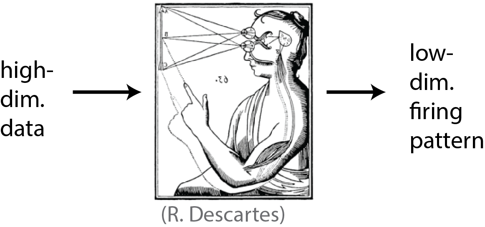
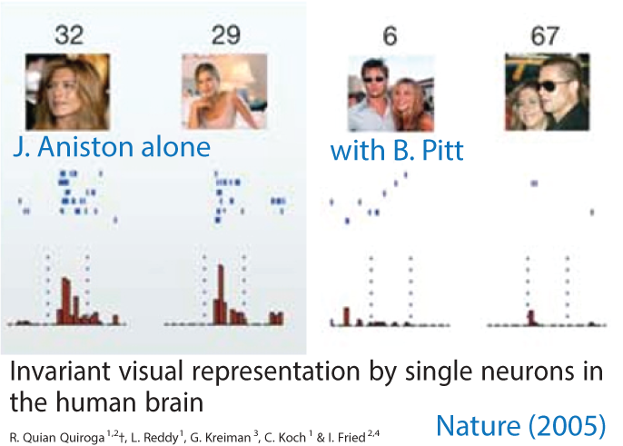
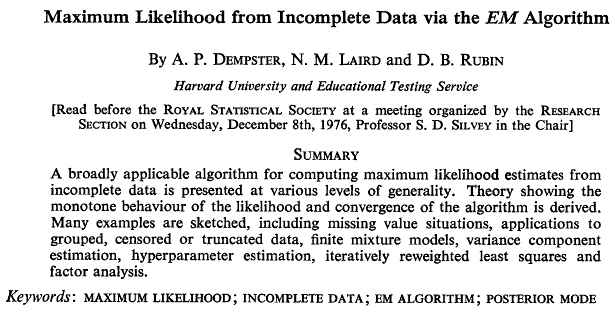

```{r setup, include=FALSE}
library(tidyverse)
library(data.table)
library(patchwork)
source("Util.R")
source("Setup.R")
fig.dir <- "Fig/unsupervised/"
setup.env(fig.dir)
dir.create("Data", showWarnings=FALSE)
run.if.needed <- function(.file, .code) {
    if(!file.exists(.file)) { .code }
    stopifnot(file.exists(.file))
}
```

```{r include=FALSE}
set.seed(1447)
```

## Little update on the lecture format

* Minimized the lines of codes exposed ...

* However, the `Rmd` file for this lecture is available in the github repo: 

```
https://github.com/STAT540-UBC/lectures
```

* You can check out `R` and `torch` codes to run them yourself.

* "I do not understand what I cannot create" - Richard Feynman

# General discussions on unsupervised learning

## What is Unsupervised Learning?

:::::: {.columns}
::: {.column width=.45}
::: {.block}

### Supervised learning

* Input: data $\mathcal{X} = \{\mathbf{x}_{i},\ldots\}$

* Input 2: label $\mathcal{Y} = \{y_{i},\ldots\}$

* Goal: learn $f: \mathcal{X} \to \mathcal{Y}$

:::

X: gene expression samples; Y: disease labels

:::
::: {.column width=.45}

::: {.block}
### Unsupervised learning

* Input: data $\mathcal{X} = \{\mathbf{x}_{i},\ldots\}$

* Goal 1: learn $f: \mathcal{Z} \to \mathcal{X}$

* Goal 2: hidden/latent states, $\mathcal{Z} = \{\mathbf{z}_{i},\ldots\}$

:::

X: gene expression matrices

:::
::::::

## The goal of unsupervised learning: Find a good representation of high-dimensional data

What is a **good representation** of high-dimensional biology data **to our purpose**?

1. What are the properties of high-dimensional data? 

    * Continuous vs. discrete? Count vs. intensity?

2. What do we mean by a "good" representation?

3. What is our purpose of unsupervised learning?

## Why unsupervised learning?


## Human brain is very good at learning meaningful representations

```{r results="asis", out.width=".7\\linewidth", echo = FALSE}

```

## (Digression) Human brain is very good at learning representations

:::::: {.columns}
::: {.column width=.65}

```{r results="asis", out.width="\\linewidth", echo = FALSE}

```

:::
::: {.column width=.3}

* *Warning: just an example of some people's brain*

* *The authors also claimed that they found other very specific neurons (Halle Berry, Sydney Opera House).*

:::
::::::

## Can you teach a computer to find useful patterns?

```{r results="asis", out.width=".35\\linewidth", echo = FALSE}
knitr::include_graphics("Vis/unsupervised/machine_learning.png")
```

\tiny
From XKCD

## Two strategies to learn a "good" representation

:::::: {.columns}
::: {.column width=.45}

::: {.block}

### Feature engineering

Construct useful combinations of variables, feature engineering

- Principal component analysis (matrix factorization)

- Pattern recognition

- Clustering (average patterns $\approx$ combined features/data)

::: 

:::
::: {.column width=.45}

::: {.block}

### Manifold learning

Change the manifold (a coordinate system) of data

- Probabilistic topic models: word frequency $\to$ simplex
	
- Angular space $\to$ Euclidean space

- Observed high-dim. $\to$ interpretable ones

:::

:::
::::::


We use both strategies in practice.


## Feature engineering combines multiple vars. to a "factor" var.

:::::: {.columns}
::: {.column width=.5}

```{r echo=FALSE}
.rnorm <- function(d1,d2) matrix(rnorm(d1*d2),d1,d2)
```

```{r echo=FALSE}
U <- .rnorm(100, 2); V <- .rnorm(100, 2)
X <- U %*% t(V) + .rnorm(100, 100)
```

$$\mathbf{x}_{i} = \mathbf{u}_{i} V^{\top} + \mathcal{N}\!\left(\mathbf{0},I\right)$$

```{r echo=FALSE}
X <- .sort.matrix(X)
```

```{r echo=FALSE, fig.width=2.5, fig.height=2, onslide.plot="1-"}
.matshow(X, .lab=0, .size=0)
```

:::
::: {.column width=.5}

```{r echo=FALSE}
.svd <- svd(X, nu=2, nv=2)
u.hat <- sweep(.svd$u, 2, .svd$d[1:2], `*`)
```

```{r echo=FALSE, fig.width=2.7, fig.height=2.3, only.plot="2"}
p1 <- .matshow(u.hat, .lab=0, .size=0) +
    ggtitle("features")
p.times <- ggplot() + theme_void() +
    geom_text(aes(0,0,label="X"), size=5)
p2 <- wrap_plots(.matshow(t(.svd$v), .lab=0, .size=0),
                 ggplot() + theme_void(),
                 ncol=1, heights=c(1,9)) +
    ggtitle("feature loading")
wrap_plots(list(p1, p.times, p2), nrow=1, widths=c(1,2,8))
```

:::
::::::

## Feature engineering 

:::::: {.columns}
::: {.column width=.5}

$$\mathbf{x}_{i} = \mathbf{u}_{i} V^{\top} + \mathcal{N}\!\left(\mathbf{0},I\right)$$

* We call each column of U and $V$ a factor (row/column)

* One factor corresponds to the activities/patterns/expressions of 100 genes/samples

* We will discuss further later.

:::
::: {.column width=.5}

```{r echo=FALSE, fig.width=2.7, fig.height=2.1}
p1 <- .matshow(u.hat, .lab=0, .size=0)
p.times <- ggplot() + theme_void() +
    geom_text(aes(0,0,label="X"), size=5)
p2 <- wrap_plots(.matshow(t(.svd$v), .lab=0, .size=0),
                 ggplot() + theme_void(),
                 ncol=1, heights=c(1,9))
wrap_plots(list(p1, p.times, p2), nrow=1, widths=c(1,2,8))
```

:::
::::::

## Manifold learning transforms the coordinate system of data

:::::: {.columns}
::: {.column width=.5}

```{r echo=FALSE}
.dt <- fread("Data/worldcities.csv.gz")
xx <- sphereplot::sph2car(.dt$lng, .dt$lat)
```

```{r echo=FALSE, fig.width=2.5, fig.height=2.3, only.plot=1}
.gg.plot(as.data.table(xx), aes(x, y)) +
    geom_point(stroke=0, size=.5, alpha=.5, colour="gray40") +
    ggtitle("x and y coordinates")
```

```{r echo=FALSE, fig.width=2.5, fig.height=2.3, onslide.plot="2-"}
.gg.plot(as.data.table(xx), aes(x, z)) +
    geom_point(stroke=0, size=.5, alpha=.5, colour="gray40") +
    ggtitle("x and z coordinates")
```

* $x^{2} + y^{2} + z^{2} = 1$

\tiny

* Data from [https://simplemaps.com/data/world-cities](https://simplemaps.com/data/world-cities)

:::
::: {.column width=.5}

```{r echo=FALSE}
.svd <- svd(xx)
```

```{r echo=FALSE, fig.width=2.5, fig.height=2.5, only.plot=3}
.gg.plot(as.data.table(.svd$u), aes(V1, V2)) +
    geom_point(stroke=0, size=.5, alpha=.5, colour="gray40") +
    ggtitle("PC1 and PC2") +
    xlab("PC 1") + ylab("PC 2")
```

```{r echo=FALSE, fig.width=2.5, fig.height=2.5, only.plot=4}
.gg.plot(as.data.table(.svd$u), aes(V2, V3)) +
    geom_point(stroke=0, size=.5, alpha=.5, colour="gray40") +
    ggtitle("PC2 and PC3") +
    xlab("PC 2") + ylab("PC 3")
```

```{r echo=FALSE, fig.width=3, fig.height=2.5, only.plot=5}
yy <- sphereplot::car2sph(xx) %>% as.data.table
.gg.plot(yy, aes(`long`, `lat`)) +
    geom_point(stroke=0, size=.5, alpha=.5, colour="gray40") +
    ggtitle("(x,y,z) to (long, lat)") +
    xlab("longitude") + ylab("latitude")
```

:::
::::::


## Representation learning

:::::: {.columns}
::: {.column width=.45}

### Feature engineering

* Combine samples based on similarity to learn common features

* Combine features/genes/proteins to create a new factor

* Matrix factorization to capture factors that explain large variation 

:::
::: {.column width=.45}

### Manifold learning

* Change the coordinate system

* What's not separable in one space can be spread out in another one

* Apply non-linear functions to a set of features

:::
::::::


# Principal Component Analysis


## Working example: the photoreceptor data (GSE4051)

```{r include=FALSE}
eset.file <- fig.dir %&% "/GSE4051.rds"
run.if.needed(eset.file,{
    eset <- GEOquery::getGEO("GSE4051", getGPL=TRUE)[[1]]
    saveRDS(eset, file=eset.file)
})
eset <- readRDS(eset.file)
X <- Biobase::exprs(eset)
## X.sorted <- .sort.matrix(t(X))
```

First 100 probes in the data matrix:

:::::: {.columns}
::: {.column width=.25}

```{r fig.width=1, fig.height=2.5, only.plot="1"}
x.sub <- X[1:100, , drop = FALSE]
.matshow(x.sub, .scale=TRUE, .lab=0, .size=0)
```

```{r fig.width=1, fig.height=2.5, only.plot="2"}
x.sub <- t(scale(t(log(1 + X[1:100, , drop = FALSE]))))
.matshow(x.sub, .scale=TRUE, .lab=0, .size=0)
```

:::
::: {.column width=.65}

* We will call such a high-dimensional matrix $X$ ($m \times n$)

* X has $m$=`r num.int(nrow(X))` rows (probes/transcripts/genes/features)

* X has $n$=`r num.int(ncol(X))` columns (samples/#data points)

* The rows were log-transformed and scaled by `scale()` for visualization

* Each sample is a `r num.int(nrow(X))`-dimensional vector!

* Each gene is a `r num.int(ncol(X))`-dimensional vector...

:::
::::::


## 1-dimensional representations

:::::: {.columns}
::: {.column width=.25}

First 100 probes:

```{r fig.width=1, fig.height=2.5}
x.sub <- X[1:100, , drop = FALSE]
.matshow(x.sub, .scale=TRUE, .lab=0, .size=0)
```

:::
::: {.column width=.65}

```{r fig.width=3.5, fig.height=1.5, onslide.plot="1-"}
.gg.plot(as.data.table(x.sub[1,]),
         aes(x=colnames(x.sub), y=V1)) +
    ggtitle("Each probe (row):") +
    ylab("expression") +
    xlab("samples") +
    theme(axis.text.x = element_text(angle=90, vjust=0, hjust=0)) +
    geom_point(pch=21)
```

```{r fig.width=3.5, fig.height=1.5, onslide.plot="2"}
.gg.plot(as.data.table(X[,1]),
         aes(x=1:nrow(X), y=V1)) +
    ggtitle("Each sample (column):") +
    ylab("expression") +
    xlab("probes") +
    geom_point(pch=21, size=.2, alpha=.5)
```

:::
::::::


## Can you see some common patterns?

:::::: {.columns}
::: {.column width=.45}

```{r fig.width=2, fig.height=2.5, onslide.plot="1-"}
x.sub <- t(scale(t(log(1 + X[1:100, , drop = FALSE]))))
.matshow(x.sub, .scale=TRUE, .lab=0, .size=0) +
    ggtitle("first 100 probes")
```

:::
::: {.column width=.45}

```{r fig.width=2, fig.height=2.5, onslide.plot="2"}
x.sorted <- .sort.matrix(x.sub)
.matshow(x.sorted, .scale=TRUE, .lab=0, .size=0) +
    ggtitle("Rearrange them...")
```

:::
::::::

## PCA: How do we recover "common" patterns from data?

Principal Component Analysis

:::::: {.columns}
::: {.column width=.45}

::: {.block}

### (Pearson 1901)

* Projection [of the original data] that minimizes the projection cost between the original and projected

* The cost = mean squared distance

:::

:::
::: {.column width=.45}

::: {.block}

### (Hotelling 1933)

* Orthogonal projection of data into a lower-dimensional **[principal]** sub-space,

* such that the total **variation of the projected** is maximized

:::

:::
::::::

## What do we mean by projection to a low-dimensional space?

```{r}
x.sub <- t(scale(t(log(1 + X[1:100, , drop = FALSE]))))
x.sub <- .sort.matrix(x.sub)
```

**Recap:** We learned that a multivariate linear regression projects a data vector $\mathbf{y}$ onto the column space of the design matrix $U$:

$$\left(\begin{array}{l}
X_{1}\\
X_{2}\\
\vdots \\
X_{m}\\
\end{array}
\right) = 
\left(
\begin{array}{l l l}
U_{11} & \ldots & U_{1k}\\
U_{21} & \ldots & U_{2k}\\
\vdots & \vdots & \vdots \\
U_{m1} & \ldots & U_{mk}\\
\end{array} 
\right)
\left(
\begin{array}{l}
W_{1}\\
\vdots\\
W_{k}
\end{array}
\right)
+ 
\left(
\begin{array}{l}
\epsilon_{1}\\
\epsilon_{2}\\
\vdots\\
\epsilon_{m}
\end{array}
\right)$$

or

$\mathbf{x} = U \mathbf{w} + \epsilon$, for many columns, $X = U W + E$.

* If we **knew** $U$, we would be able to solve weights $W$. If $k = 2$, it would result in a projection to the 2D space.

* Unlike regression, we need ask: How do we know this unknown $U$ matrix?

## What is a projection matrix?

The purpose of a multivariate regression-based prediction:

$$\mathbf{x} \to \hat{\mathbf{x}} = U \mathbf{w}$$

The least-square solution for the $W$:

$$\hat{\mathbf{w}} = (U^{\top}U)^{-1} U^{\top}\mathbf{x}$$

Then we have

$$\hat{\mathbf{x}} = \underbrace{U (U^{\top}U)^{-1} U^{\top}}_{\textsf{\color{red} projection matrix}} \mathbf{x}$$

You can think of "projection" as **"prediction" in the linear space** defined by the columns of a design matrix.

## What will be a good "feature" (the $U$ matrix) to regress on?

:::::: {.columns}
::: {.column width=.35}

```{r fig.width=2, fig.height=2.5, only.plot="1"}
.matshow(x.sub, .scale=TRUE, .lab=0, .size=0) +
    ggtitle("first 100 probes")
```

```{r}
U <- matrix(1, nrow(x.sub), 1)
.lm <- lm(x.sub ~ U -1)
```

```{r fig.width=2, fig.height=2.5, only.plot="2"}
.matshow(.lm$fitted.values, .lab=0, .size=0) +
    ggtitle("one proj.")
```

```{r fig.width=2, fig.height=2.5, only.plot="3"}
.matshow(x.sub, .scale=TRUE, .lab=0, .size=0) +
    ggtitle("first 100 probes")
```

:::
::: {.column width=.65}

```{r fig.width=3.2, fig.height=2.7, only.plot="2"}
p0 <- ggplot() + theme_void()
p.eq <- ggplot() + theme_void() + geom_text(aes(0,0,label="="), size=10)
p.prod <- ggplot() + theme_void() + geom_text(aes(0,0,label="x"), size=10)
p1 <- .matshow(U, .lab=0, .size=0, .scale=FALSE) +
    ggtitle("1's")
p2 <- .matshow(matrix(.lm$coefficients, nrow=1),
               .lab=0, .size=0, .scale=TRUE) +
    ggtitle("how much contribute?")
p2 <- wrap_plots(p2, p0, ncol=1, heights = c(1,13))
wrap_plots(p.eq, p0, p1, p0, p.prod, p2, nrow=1, widths=c(1, 1, 1, 1, 1, 11))
```

```{r fig.width=2, fig.height=2.5, only.plot="3"}
var.exp <- mean(apply(.lm$fitted, 2, var) / apply(x.sub, 2, var))
.matshow(.lm$fitted.values, .lab=0, .size=0) +
    ggtitle(round(var.exp*100) %&% "% var. explained")
```

:::
::::::


## How about an average vector?

:::::: {.columns}
::: {.column width=.35}

```{r fig.width=2, fig.height=2.5, only.plot="1"}
.matshow(x.sub, .scale=TRUE, .lab=0, .size=0) +
    ggtitle("first 100 probes")
```

```{r}
set.seed(11)
U <- matrix(apply(x.sub, 1, mean), ncol=1)
.lm <- lm(x.sub ~ U -1)
```

```{r fig.width=2, fig.height=2.5, only.plot="2"}
.matshow(.lm$fitted.values, .lab=0, .size=0) +
    ggtitle("avg. proj.")
```

```{r fig.width=2, fig.height=2.5, only.plot="3"}
.matshow(x.sub, .scale=TRUE, .lab=0, .size=0) +
    ggtitle("first 100 probes")
```

:::
::: {.column width=.65}

```{r fig.width=3.2, fig.height=2.7, only.plot="2"}
p0 <- ggplot() + theme_void()
p.eq <- ggplot() + theme_void() + geom_text(aes(0,0,label="="), size=10)
p.prod <- ggplot() + theme_void() + geom_text(aes(0,0,label="x"), size=10)
p1 <- .matshow(U, .lab=0, .size=0, .scale=TRUE) +
    ggtitle("avg")
p2 <- .matshow(matrix(.lm$coefficients, nrow=1),
               .lab=0, .size=0, .scale=TRUE) +
    ggtitle("how much contribute?")
p2 <- wrap_plots(p2, p0, ncol=1, heights = c(1,13))
wrap_plots(p.eq, p0, p1, p0, p.prod, p2, nrow=1, widths=c(1, 1, 1, 1, 1, 11))
```

```{r fig.width=2, fig.height=2.5, only.plot="3"}
var.exp <- mean(apply(.lm$fitted, 2, var) / apply(x.sub, 2, var))
.matshow(.lm$fitted.values, .lab=0, .size=0) +
    ggtitle(round(var.exp*100) %&% "%")
```

:::
::::::

## Let's try out random projection

:::::: {.columns}
::: {.column width=.35}

```{r fig.width=2, fig.height=2.5, only.plot="1"}
.matshow(x.sub, .scale=TRUE, .lab=0, .size=0) +
    ggtitle("first 100 probes")
```

```{r}
set.seed(11)
U <- matrix(rnorm(nrow(x.sub)*2), nrow(x.sub), 2)
.lm <- lm(x.sub ~ U - 1)
```

```{r fig.width=2, fig.height=2.5, only.plot="2"}
.matshow(.lm$fitted.values, .lab=0, .size=0) +
    ggtitle("random proj.")
```

```{r fig.width=2, fig.height=2.5, only.plot="3"}
.matshow(x.sub, .scale=TRUE, .lab=0, .size=0) +
    ggtitle("first 100 probes")
```

:::
::: {.column width=.65}

```{r fig.width=3.2, fig.height=2.7, only.plot="2"}
p0 <- ggplot() + theme_void()
p.eq <- ggplot() + theme_void() + geom_text(aes(0,0,label="="), size=10)
p.prod <- ggplot() + theme_void() + geom_text(aes(0,0,label="x"), size=10)
p1 <- .matshow(U, .lab=0, .size=0, .scale=TRUE) +
    ggtitle("rand")
p2 <- .matshow(as.matrix(.lm$coefficients),
               .lab=0, .size=0, .scale=TRUE) +
    ggtitle("how much contribute?")
p2 <- wrap_plots(p2, p0, ncol=1, heights = c(1,13))
wrap_plots(p.eq, p0, p1, p0, p.prod, p2, nrow=1, widths=c(1, 1, 1, 1, 1, 11))
```

```{r fig.width=2, fig.height=2.5, only.plot="3"}
var.exp <- mean(apply(.lm$fitted, 2, var) / apply(x.sub, 2, var))
.matshow(.lm$fitted.values, .lab=0, .size=0) +
    ggtitle(round(var.exp*100) %&% "%")
```

:::
::::::


## Can we find a set of "good" vectors to maximize the explained variability?

::: {.block}
### Recap: Sample covariance matrix

* Sample mean: $\bar{X}_{i} = \sum_{j=1}^{m} X_{ji} / m$

* Sample variance: $\sum_{j=1}^{m} (X_{ji} - \bar{X}_{i})^{2} / (m-1)$

* Sample covariance between $i$ and $k$: 
$$\frac{1}{m-1}\sum_{j=1}^{m} (X_{ji} - \bar{X}_{i}) (X_{jk} - \bar{X}_{k})$$

:::

If all the column vectors $\mathbf{x}_{i}$ are standardized, the column-by-column covariance $X^{\top}X / (m-1)$.

If all the row vectors $\mathbf{x}_{d}$ are standardized, the row-by-row covariance $X X^{\top} / (n-1)$.

## Total variance of the projected data

:::::: {.columns}
::: {.column width=.45}

::: {.block}

### Total variance

Given the projected, $\hat{X} = \mathbf{u}_{1} \cdot (W_{11},\ldots,W_{1n})$, 
our goal is

$$\max \mathbb{V}\!\left[\hat{X}\right]$$

:::

* We have two unknown variables $U$ and $W$

* There are an infinite number of solutions.

:::
::: {.column width=.45}

::: {.block}

### Constrained total variance

Given the projected, $\hat{X} = \mathbf{u}_{1} \mathbf{w}$, 
and a unit vector, namely $\|\mathbf{u}_{1}\|=1$, 
our goal is equivalent to

$$\max \mathbf{u}^{\top} X X^{\top} \mathbf{u}$$

:::

Because each $\hat{W}_{i}$ is the solution to the least-square problem:
$$\hat{W}_{i} = \arg\min \|\mathbf{x}_{i} - \mathbf{u} W_{i}\|$$
by solving the least square:
$$\hat{W}_{i} = \mathbf{x}_{i}^{\top}\mathbf{u} / \mathbf{u}^{\top}\mathbf{u},\,\forall i$$

:::
::::::


## Principal Component Analysis as an eigen value problem

:::::: {.columns}
::: {.column width=.45}

::: {.block}
### PCA

Letting the feature-by-feature sample covariance matrix $\hat{\Sigma} = XX^{\top}/(n-1)$, we want to find a unit vector $\mathbf{u}$ by 

$$\max \mathbf{u}^{\top} \hat{\Sigma}\mathbf{u}$$

subject to $\mathbf{u}^{\top}\mathbf{u} = 1$.

:::

:::
::: {.column width=.45}

::: {.block}
### Eigen value problem

Given the covariance matrix $\hat{\Sigma}$, we can resolve an eigen-value $\lambda$ and the corresponding eigen-vector $\mathbf{u}$ such that

$$\hat{\Sigma}\mathbf{u} = \lambda \mathbf{u}$$

("eigen" mean "own" in German).
:::


:::
::::::

*Why are they equivalent?* Solving the PCA problem is ...

$$\iff \max \underbrace{\mathbf{u}^{\top}\hat{\Sigma}\mathbf{u}}_{\textsf{total variation}} + \underbrace{\lambda\left(1 - \mathbf{u}^{\top}\mathbf{u}\right)}_{\textsf{constraint}},\,\lambda >0\,\quad\textsf{a.k.a. Lagrangian}$$

Taking the derivative with respect to $\mathbf{u}$ and setting it to zero, we get the eigen-value problem.


## Let's see how much the first eigenvector can explain

:::::: {.columns}
::: {.column width=.35}

```{r fig.width=2, fig.height=2.5, only.plot="1"}
.matshow(x.sub, .scale=TRUE, .lab=0, .size=0) +
    ggtitle("first 100 probes")
```

```{r}
.eigen <- eigen(x.sub %*% t(x.sub))
U <- .eigen$vector[,1,drop=FALSE]
.lm <- lm(x.sub ~ U -1)
```

```{r fig.width=2, fig.height=2.5, only.plot="2"}
.matshow(.lm$fitted.values, .lab=0, .size=0) +
    ggtitle("eigen proj.")
```

```{r fig.width=2, fig.height=2.5, only.plot="3"}
.matshow(x.sub, .scale=TRUE, .lab=0, .size=0) +
    ggtitle("first 100 probes")
```

:::
::: {.column width=.65}

```{r fig.width=3.2, fig.height=2.7, only.plot="2"}
p0 <- ggplot() + theme_void()
p.eq <- ggplot() + theme_void() + geom_text(aes(0,0,label="="), size=10)
p.prod <- ggplot() + theme_void() + geom_text(aes(0,0,label="x"), size=10)
p1 <- .matshow(U, .lab=0, .size=0, .scale=TRUE) +
    ggtitle("e-vec")
p2 <- .matshow(matrix(.lm$coefficients, nrow=1),
               .lab=0, .size=0, .scale=TRUE) +
    ggtitle("loading")
p2 <- wrap_plots(p2, p0, ncol=1, heights = c(1,13))
wrap_plots(p.eq, p0, p1, p0, p.prod, p2, nrow=1, widths=c(1, 1, 1, 1, 1, 11))
```

```{r fig.width=2, fig.height=2.5, only.plot="3"}
var.exp <- mean(apply(.lm$fitted, 2, var) / apply(x.sub, 2, var))
.matshow(.lm$fitted.values, .lab=0, .size=0) +
    ggtitle(round(var.exp*100) %&% "%")
```

:::
::::::


## Top two eigen-vectors

:::::: {.columns}
::: {.column width=.35}

```{r fig.width=2, fig.height=2.5, only.plot="1"}
.matshow(x.sub, .scale=TRUE, .lab=0, .size=0) +
    ggtitle("first 100 probes")
```

```{r}
U <- .eigen$vector[,1:2,drop=FALSE]
.lm <- lm(x.sub ~ U -1)
```

```{r fig.width=2, fig.height=2.5, only.plot="2"}
.matshow(.lm$fitted.values, .lab=0, .size=0) +
    ggtitle("eigen proj.")
```

```{r fig.width=2, fig.height=2.5, only.plot="3"}
.matshow(x.sub, .scale=TRUE, .lab=0, .size=0) +
    ggtitle("first 100 probes")
```

:::
::: {.column width=.65}

```{r fig.width=3.2, fig.height=2.7, only.plot="2"}
p0 <- ggplot() + theme_void()
p.eq <- ggplot() + theme_void() + geom_text(aes(0,0,label="="), size=10)
p.prod <- ggplot() + theme_void() + geom_text(aes(0,0,label="x"), size=10)
p1 <- .matshow(U, .lab=0, .size=0, .scale=TRUE) +
    ggtitle("e-vec")
p2 <- .matshow(as.matrix(.lm$coefficients),
               .lab=0, .size=0, .scale=TRUE) +
    ggtitle("loading")
p2 <- wrap_plots(p2, p0, ncol=1, heights = c(1,13))
wrap_plots(p.eq, p0, p1, p0, p.prod, p2, nrow=1, widths=c(1, 1, 1, 1, 1, 11))
```

```{r fig.width=2, fig.height=2.5, only.plot="3"}
var.exp <- mean(apply(.lm$fitted, 2, var) / apply(x.sub, 2, var))
.matshow(.lm$fitted.values, .lab=0, .size=0) +
    ggtitle(round(var.exp*100) %&% "%")
```

:::
::::::


## Top three eigen-vectors

:::::: {.columns}
::: {.column width=.35}

```{r fig.width=2, fig.height=2.5, only.plot="1"}
.matshow(x.sub, .scale=TRUE, .lab=0, .size=0) +
    ggtitle("first 100 probes")
```

```{r}
U <- .eigen$vector[,1:3,drop=FALSE]
.lm <- lm(x.sub ~ U -1)
```

```{r fig.width=2, fig.height=2.5, only.plot="2"}
.matshow(.lm$fitted.values, .lab=0, .size=0) +
    ggtitle("eigen proj.")
```

```{r fig.width=2, fig.height=2.5, only.plot="3"}
.matshow(x.sub, .scale=TRUE, .lab=0, .size=0) +
    ggtitle("first 100 probes")
```

:::
::: {.column width=.65}

```{r fig.width=3.2, fig.height=2.7, only.plot="2"}
p0 <- ggplot() + theme_void()
p.eq <- ggplot() + theme_void() + geom_text(aes(0,0,label="="), size=10)
p.prod <- ggplot() + theme_void() + geom_text(aes(0,0,label="x"), size=10)
p1 <- .matshow(U, .lab=0, .size=0, .scale=TRUE) +
    ggtitle("e-vec")
p2 <- .matshow(as.matrix(.lm$coefficients),
               .lab=0, .size=0, .scale=TRUE) +
    ggtitle("loading")
p2 <- wrap_plots(p2, p0, ncol=1, heights = c(1,13))
wrap_plots(p.eq, p0, p1, p0, p.prod, p2, nrow=1, widths=c(1, 1, 1, 1, 1, 11))
```

```{r fig.width=2, fig.height=2.5, only.plot="3"}
var.exp <- mean(apply(.lm$fitted, 2, var) / apply(x.sub, 2, var))
.matshow(.lm$fitted.values, .lab=0, .size=0) +
    ggtitle(round(var.exp*100) %&% "%")
```

:::
::::::


## SVD: another equivalent method for PCA

:::::: {.columns}
::: {.column width=.45}

::: {.block}
### Singular Value Decomposition

SVD identifies three matrices of $X$:

$$X = U D V^{\top}$$

where both $U$ and $V$ vectors are orthonormal,
namely, 

- $U^{\top}U = I$, $\mathbf{u}_{k}^{\top}\mathbf{u}_{k}=1$ for all $k$,

- $V^{\top}V = I$, $\mathbf{v}_{k}^{\top}\mathbf{v}_{k} = 1$ for all $k$.

:::

:::
::: {.column width=.45}

::: {.block}
### Covariance by SVD

Covariance across the columns (samples)

$$X^{\top}X/(m-1) = V D^{2} V^{\top}/(m-1)$$

Covariance across the rows (genes)

$$XX^{\top}/(n-1) = U D^{2} U^{\top}/(n-1)$$

:::

*Remark*: standardized matrix

:::
::::::

## SVD: another equivalent method for PCA

We can confirm the equivalent relations by multiplying singular vectors to the covariance matrix:

\begin{eqnarray*}
\onslide<1->{
	\underbrace{\left( \frac{1}{m-1} X^{\top}X \right)}_{\textsf{\color{blue} sample covariance}} \mathbf{v}_{1}
	&=& 
	\frac{1}{m-1} \left(\mathbf{v}_{1}, \mathbf{v}_{2},\ldots, \mathbf{v}_{k}\right)
      \left(
      \begin{array}{l l l l}
        D_{1}^{2} & 0 & \ldots & \ldots \\
        0 & D_{2}^{2} & 0 & \ldots \\
        0 & \ldots & \ddots & 0 \\
        0 & \ldots & 0 & D_{k}^{2} \\
      \end{array} \right)
  \left(
  \begin{array}{l}
    \mathbf{v}_{1}^{\top}\\
    \mathbf{v}_{2}^{\top}\\
    \vdots\\
    \mathbf{v}_{k}^{\top}
  \end{array}
  \right)
  \mathbf{v}_{1} \\
	}
	\onslide<2->{
  &=&
      \frac{1}{m-1} \left(\mathbf{v}_{1}, \mathbf{v}_{2},\ldots, \mathbf{v}_{k}\right)
      \left(
      \begin{array}{l l l l}
        D_{1}^{2} & 0 & \ldots & \ldots \\
        0 & D_{2}^{2} & 0 & \ldots \\
        0 & \ldots & \ddots & 0 \\
        0 & \ldots & 0 & D_{k}^{2} \\
      \end{array} \right)
  \left(
  \begin{array}{l}
    1 \\
    0 \\
    \vdots\\
    0
  \end{array}
  \right) \\
  }
\onslide<3->{
  &=&
      \frac{1}{m-1} \left(\mathbf{v}_{1}, \mathbf{v}_{2},\ldots, \mathbf{v}_{k}\right)
      \left(
      \begin{array}{l}
        D_{1}^{2} \\
        0 \\
        0 \\
        0 \\
      \end{array} \right)}
	  \onslide<4>{
	  =
  \underbrace{\frac{D_{1}^{2}}{m-1}}_{\textsf{\color{red}eigenvalue}}
  \underbrace{\mathbf{v}_{1}}_{\textsf{\color{red}eigenvector}}
  }
\end{eqnarray*}


## Run SVD to find many principal components 

```{r echo=TRUE, size="large"}
svd.out <- svd(x.sub, nu = 5, nv = 5)
U <- svd.out$u; D <- diag(svd.out$d[1:5]); V <- svd.out$v
```

:::::: {.columns}
::: {.column width=.25}

```{r fig.width=2, fig.height=2}
.matshow(x.sub, .scale=TRUE, .lab=0, .size=0) +
    ggtitle("data matrix")
```

:::
::: {.column width=.65}

```{r fig.width=3.2, fig.height=2.7}
p0 <- ggplot() + theme_void()

p1 <- .matshow(U, .lab=0, .size=.1, .scale=TRUE) +
    ggtitle("U")

p.D <- .matshow(D, .lab=0, .size=.2, .scale=TRUE) +
    ggtitle("D")

p.V <- .matshow(t(V), .lab=0, .size=.1, .scale=TRUE) +
    ggtitle("t(V)")

p.eq <- ggplot() + theme_void() + geom_text(aes(0,0,label="="), size=6)
p.prod <- ggplot() + theme_void() + geom_text(aes(0,0,label="x"), size=10)
p.prod <- wrap_plots(p.prod, p0, ncol=1, heights=c(1,8))

p2 <- wrap_plots(p.D, p0, ncol=1, heights=c(1,8))
p3 <- wrap_plots(p.V, p0, ncol=1, heights=c(1,8))

wrap_plots(p.eq, p0, p1, p.prod, p2, p.prod, p3,
     nrow=1,
     widths=c(1, .1,  1,      1,  1, 1, 8))
```

:::
::::::


## (Co-)Variance decomposition

$$\hat{\Sigma} = X^{\top}X/(m-1)$$

```{r fig.width=2.5, fig.height=2.5}
.matshow(cov(x.sub), .lab = 0) + ggtitle("sample x sample covariance")
```

## (Co-)Variance decomposition

```{r}
p.eq <- ggplot() + theme_void() + geom_text(aes(0,0,label="="), size=10)

eigen.values <- svd.out$d^2 / (nrow(x.sub) - 1)
.show.cov.pc <- function(j) {
    p0 <- ggplot() + theme_void() + geom_text(aes(0,0,label="+"),size=5)
    .title <- "k " %&% j %&%
        ",\nlambda: " %&% round(eigen.values[j], 2)
    p <- .matshow(V[,j,drop=FALSE] %*% t(V[,j,drop=FALSE]), .lab = 0) +
        ggtitle(.title)
    wrap_plots(p, p0, nrow=1, widths=c(8,2))
}

v.prod <- lapply(1:ncol(V), .show.cov.pc)
```

$$\hat{\Sigma} = \frac{X^{\top}X}{m-1} = V \frac{D^{2}}{m-1} V^{\top} = \sum_{k=1} \lambda_{k} \mathbf{v}_{k} \mathbf{v}_{k}^{\top},\quad \lambda_{k}=\frac{D_{k}^{2}}{m-1}$$

:::::: {.columns}
::: {.column width=.28}

```{r fig.width=1.25, fig.height=1.75}
.matshow(cov(x.sub), .lab = 0) + ggtitle("sample x\nsample")
```

:::
::: {.column width=.75}

```{r fig.width=4.3, fig.height=1.9}
wrap_plots(v.prod[1:3], nrow = 1)
```

* How much variance is explained by each component?

:::
::::::

## Eigenvectors decompose total covariance

```{r fig.width=5, fig.height=3, only.plot="1"}
.dt <- data.table(eigen.values) %>% mutate(k=1:n()) %>% as.data.table
vtot <- sum(.dt$eigen.values)
.dt[, pr := eigen.values / vtot]
.dt[, cpr := cumsum(pr)]
.gg.plot(.dt, aes(k, eigen.values, fill=eigen.values)) +
    geom_line() +
    ylab("eigenvalues (lambda)") +
    xlab("independent components") +
    geom_point(pch=21) +
    scale_fill_distiller(palette = "RdPu", direction=1, guide="none")
```

```{r fig.width=5, fig.height=3, only.plot="2"}
.gg.plot(.dt, aes(x=k, fill=eigen.values)) +
    geom_line(aes(y=pr)) +
    geom_text_repel(aes(y=pr, label=round(100*pr) %&% "%"),
                    data = .dt[1:10, ],
                    size = 3, nudge_x = 5, nudge_y = .1,
                    segment.size = .2,
                    segment.color = "red",
                    vjust=0, hjust=0, colour="red") +
    geom_text_repel(aes(y=cpr, label=round(100*cpr) %&% "%"),
                    data = .dt[2:5,],
                    size = 3, nudge_x = 7, nudge_y = 0,
                    segment.size = .2,
                    segment.color = "gray20",
                    vjust=0, hjust=0, colour="gray40") +
    geom_line(aes(y=cpr), lty = 2) +
    geom_point(aes(y=pr), pch=21) +
    ylab("% var. explained\n(lambda/sum(lambda))") +
    xlab("independent components") +
    scale_fill_distiller(palette = "RdPu", direction=1, guide="none")
```

# Clustering to uncover common features and hidden groups

```{r}
library(torch)
torch_set_num_threads(8)
```

## The goal of this clustering section 

* Model-based unsupervised learning

    - Latent variable model

* Expectation Maximization

* Hands-on experience with clustering algorithm

```{r}
#' @param nn sample size
#' @param D dimensionality
#' @param K number of clusters
simulate.data <- function(nn, D, K, sig = .2) {
  require(torch)
  torch_manual_seed(1447)
 .mu <- torch_randn(K, D) * 2
  kk <- torch_tensor(sample(K,nn,TRUE),
                     dtype=torch_long())
 .z <- nnf_one_hot(kk)$to(dtype=torch_float())
 .eps <- torch_randn(nn, D)
 list(x = torch_mm(.z, .mu) + .eps * sig,
      k = as.integer(kk), z = .z, mu = .mu)
}
``` 

## What clustering can do: Find common patterns across rows and columns

```{r echo=FALSE, fig.width=4.5, fig.height=2.5, only.plot="1"}
sim.out <- simulate.data(30, 50, 3, sig = 1)
oo <- order(sim.out$k)
xx <- sim.out$x %r% oo
.matshow(xx, .size=0, .lab=0) + ggtitle("sample x gene")
```

```{r echo=FALSE, fig.width=4.5, fig.height=2.5, only.plot="2-"}
xx <- .sort.matrix(sim.out$x)
.matshow(xx, .size=0, .lab=0) + ggtitle("sample x gene")
```

## Model-based clustering (if you were a Bayesian statistician...)

:::::: {.columns}
::: {.column width=.45}
::: {.block}
### Simulation/data generation
*Given a data generating process, what are the properties of the outcomes?*

:::

:::
::: {.column width=.45}
::: {.block}
### Model inference
*Given the outcomes, what can we say about the process that generated the data?*

:::

:::
::::::

```{r results="asis", out.width=".7\\linewidth", echo = FALSE}
knitr::include_graphics("./Vis/unsupervised/model_based_inference.pdf")
```

\tiny
Wassermann, _All of Statistics_ (2004)


```{r echo = FALSE}
sim.out <- simulate.data(300, 2, 3)
```

## What do we want to know from data?

```{r fig.width=3, fig.height=2.5, echo = FALSE}
X <- sim.out$x

.dt <- as.dt(X) %>%
    cbind(group = as.factor(sim.out$k))

.dt.mu <- as.dt(sim.out$mu)

plt.data <- 
    .gg.plot(.dt, aes(V1, V2, colour=group)) +
    geom_point(stroke=0, size=.7) +
    geom_point(data = .dt.mu, colour = "red", size=5, pch = "+") +
    scale_colour_brewer(palette="Paired") +
    theme(axis.title = element_blank())
print(plt.data)
```

**Two goals**: recover (1) group membership and (2) the centroids (red marks)


## A chicken-and-egg problem: guessing latent membership vs. parametric inference

* If we knew the membership of all the points, we can simply estimate the centre (e.g., taking sample mean within each cluster)

* If we knew the centre coordinates, we would be able to assign points to most probable groups easily based on distance from the centre points.

* Statistical answer: Solve the underlying inference problem.

* To a parameter estimator, the membership assignments are *hidden* (latent).

<!-- Make your dimensions right... -->
<!-- * $D$: each data point's dimension -->
<!-- * $K$: desired number of clusters (can be relaxed or tuned) -->

```{r}
N <- nrow(X)
D <- ncol(X)
K <- 3
```

<!-- Random initialization of model parameters: -->
<!-- * $\mu_{k} \sim \mathcal{N}\!\left(0, 1/10 I\right)$ -->
<!-- * $\log\sigma_{k} \gets 0$ for all $k$ -->
<!-- Alternatively, we can start with random assignment of samples to the clusters. -->

```{r}
set.seed(3)
.mu <- scale(matrix(rnorm(K*D), K, D)) * .1
mu <- torch_tensor(.mu, requires_grad = TRUE)
ln.sig <- torch_zeros(K, D, requires_grad=TRUE)
```

## Let's think about the data-generating process to "reverse" it

:::::: {.columns}
::: {.column width=.5}

```{r fig.width=2.5, fig.height=2}
print(plt.data)
```

:::
::: {.column width=.45}

::: {.block}

### Latent Variable Model

What could have been done to generate observe data?

* Latent membership: $Z_{ik}$

* Model parameters: $\mu_{k}$ and $\sigma_{k}$

:::

:::
::::::

## Gaussian Mixture Model (k-means)

:::::: {.columns}
::: {.column width=.4}

```{r results="asis", out.width=".7\\linewidth"}
knitr::include_graphics("./Vis/unsupervised/GMM_graphical_model.pdf")
```

:::
::: {.column width=.5}
::: {.block}
### GMM data generating process

1. Initialize $\mu_{k}$ (the centre of each group) and $\sigma_{k}$ (the spread within each group)

2. Randomly assign group membership, $Z_{ik} = 1$ iff a point $i$ belongs to a group $k$.

3. Generate: $\mathbf{x}_{i} | Z_{ik} = 1, \boldsymbol{\mu}_{k} \sim \mathcal{N}\!\left(\boldsymbol{\mu}_{k}, \sigma^{2}I\right)$

:::

:::
::::::

How do we infer $Z$ and $\mu,\sigma$?

## 



## Expectation Maximization for GMM MLE

\begin{eqnarray*}
\onslide<1->{
	J &\equiv& \log \prod_{i=1}^{n} p(\mathbf{x}_{i}|\mu,\sigma) \\
}
\onslide<2>{
	&=& \log \prod_{i=1}^{n} \sum_{Z} p(\mathbf{x}_{i}|Z,\mu,\sigma)p(Z)
}
\end{eqnarray*}

\onslide<2>{
* It might be difficult to enumerate all the $Z$'s... so let's introduce some other distributions that will help our "guessing" work, which we call it $q(Z)$
}

## EM algorithm: What is the best way to guess latent variables?

\begin{eqnarray*}
\onslide<1->{
  \sum_{i} \log p(\mathbf{x}_{i}|\mu,\sigma)
  &=& \sum_{i=1}^{n} {\color{blue} \log} \sum_{Z_{i}} {\color{red} \frac{q(Z_{i})}{q(Z_{i})} } p(\mathbf{x}_{i}|Z_{i},\mu,\sigma)p(Z_{i}) \\
  }
\onslide<2->{
  &\underset{\textsf{\color{blue} Jensen}}{\ge}&
   \sum_{i=1}^{n} \sum_{Z_{i}} q(Z_{i}) {\color{blue}\log} \frac{p(\mathbf{x}_{i}|Z_{i},\mu,\sigma)p(Z_{i})}{q(Z_{i})} \\ }
\end{eqnarray*}

\onslide<3->{ What is the best $q(Z)$? }

## EM algorithm: optimal E-step is to take the posterior probability

\onslide<1->{ If $q(Z)=p(Z|\mathbf{x}_{i},\mu,\sigma)$ (by Bayes rule),  }

\begin{eqnarray*}
\onslide<1->{
  &=&
      \sum_{i}^{n}\sum_{Z_{i}} p(Z_{i}|\mathbf{x}_{i},\mu,\sigma)
	\log \frac{p(\mathbf{x}_{i}|Z_{i},\mu,\sigma)p(Z_{i})}{p(Z_{i}|\mathbf{x}_{i}\mu,\sigma)}\\
}
\onslide<2->{
  &=&
\sum_{i}^{n}\sum_{Z_{i}} p(Z_{i}|\mathbf{x}_{i},\mu,\sigma)
\log \frac{p(\mathbf{x}_{i},Z_{i}|\mu,\sigma) p(\mathbf{x}_{i}|\mu,\sigma)}{p(\mathbf{x}_{i}, Z_{i}|\mu,\sigma)} \\
}
\onslide<3>{
&=&
    \sum_{i=1}^{n} \underbrace{\left[ \sum_{Z_{i}} p(Z_{i}|\mathbf{x}_{i},\mu,\sigma) \right]}_{\color{red} = 1} \log p(\mathbf{x}_{i}|\mu,\sigma) 
  \\
  }
  \onslide<3>{
  &=& \sum_{i} \log p(\mathbf{x}_{i}|\mu,\sigma)
      }
\end{eqnarray*}

\onslide<3>{The inequality becomes equality.}

## Expectation Maximization algorithm = expected MLE

**The goal**: 

\begin{eqnarray}
  \log p(X|\mu,\sigma) &=& \log \sum_{Z} p(X,Z|\mu,\sigma) \\
  &\underset{\textsf{\color{blue} Jensen}}{\ge}&
  \sum_{Z} \underbrace{p(Z|X,\mu,\sigma)}_{\color{red}\textsf{E-step}} \underbrace{\log p(X|Z,\mu,\sigma)}_{\color{red}\textsf{M-step}} \\  
 &=& \underbrace{\mathbb{E}_{p(Z|X,\mu,\sigma)}}_{\color{red}\textsf{E-step}} \left[ \underbrace{\log p(X|Z,\mu,\sigma)}_{\color{red}\textsf{M-step}} \right]
\end{eqnarray}

($Z$ is discrete, e.g., a membership indicator)

**Solution**: **Maximize** the lower bound by taking **the expectation** over the posterior probability.

## EM algorithm of GMM: E-step

Log-likelihood under some group ($\mu_{k}$ and $\sigma_{k}$):

$\log p(\mathbf{x}_{i}|\mu_{k}, \sigma_{k}) = \log \mathcal{N}\!\left(\mathbf{x}_{i}|\mu_{k},\sigma_{k}\right)$

```{r}
#' @param X data (n x D)
#' @param .mu centre parameters (K x D)
#' @param .ln.sig log standard dev (K x D)
log.lik <- function(X, .mu, .ln.sig){
    .ln.sig <- torch_clamp(.ln.sig,
                           log(0.01),
                           log(100.))

    .rs <- torch_square(X - .mu)
    .sig <- torch_exp(.ln.sig)
    llik <- - .rs/.sig/2.0 - .ln.sig/2.0

    torch_sum(llik, dim=2) # sum over dim
}
```

How to estimate the posterior?

$$p(Z_{ik}| \mathbf{x}_{i}, \mu, \sigma)
= \frac{\exp\{\log p(\mathbf{x}_{i}|\mu_{k},\sigma_{k})\}}{\sum_{k'} \exp\{\log p(\mathbf{x}_{i}|\mu_{k'},\sigma_{k'})\}}$$

```{r}
#' sample latent Z ~ the posterior
take.estep <- function() {
    llik.mat <- torch_zeros(nrow(X), K)
    for(k in 1:K){
        mu.k <- mu[k, , drop = FALSE]
        ln.sig.k <- ln.sig[k, , drop = FALSE]
        llik.mat[, k] <- log.lik(X, mu.k, ln.sig.k)
    }
    zz <- distr_categorical(logits = llik.mat)
    zz$sample()
}
```

*Remark*: We can stochastically sample $Z_{ik}=1$ with the posterior probability.

## EM algorithm of GMM: M-step

Maximization step to optimize model parameters

Let this expected lower-bound (ELBO)

$$\mathcal{L}(\mathbf{x}_{i}; \{\mu_{k}\}, \{\sigma_{k}\})
=
\sum_{i=1}^{n}\sum_{k=1}^{K} Z_{ik} \log p(\mathbf{x}_{i}| Z_{ik}, \mu_{k}, \sigma_{k})$$

Given $Z$, what are the unknown? We can take gradient steps (e.g., `torch`)

$$\mu_{k}^{(t)} \gets \mu_{k}^{(t-1)} + \rho \nabla_{\mu_{k}} \sum_{i} \mathcal{L}(\mathbf{x}_{i})$$

$$\sigma_{k}^{(t)} \gets \sigma_{k}^{(t-1)} + \rho \nabla_{\sigma_{k}} \sum_{i} \mathcal{L}(\mathbf{x}_{i})$$

```{r}
## `torch` implementation
opt <- optim_adam(list(mu, ln.sig), lr=.25)
take.mstep <- function(Z){
  opt$zero_grad()
  llik.1 <- log.lik(X, mu[1, , drop= FALSE],
                    ln.sig[1, , drop=FALSE])
  llik <- llik.1 * Z[, 1]
  for(k in 2:ncol(Z)){
      llik.k <- log.lik(X, mu[k, , drop=FALSE],
                        ln.sig[k, , drop=FALSE])
      llik <- llik + llik.k * Z[, k]
  }
  loss <- torch_mean(- llik)
  loss$backward()
  . <- opt$step()
  return(torch_sum(llik)$item())
}
```

*Remark*: We have an analytical solution for $\mu$ and $\sigma$ in this example.

```{r echo = FALSE}
##################################
## actually taking the EM steps ##
##################################

llik.trace <- c()
Z.trace <- data.table()

.grad <- torch_zeros_like(mu)
mu.trace <- cbind(as.dt(mu),
                  grad=as.dt(.grad),
                  k = 1:nrow(mu),
                  t=0)

.grad <- torch_zeros_like(ln.sig)
ln.sig.trace <- cbind(as.dt(ln.sig),
                      grad=as.dt(.grad),
                      k = 1:nrow(mu),
                      t=0)

for(tt in 1:100){
    rand.idx <- take.estep()
    z <- nnf_one_hot(rand.idx)
    llik <- take.mstep(z)

    z.dt <- data.table(k=as.integer(rand.idx), i=1:nrow(X), t=tt)

    Z.trace <- rbind(Z.trace, z.dt)
    llik.trace <- c(llik.trace, llik)

    mu.dt <- cbind(as.dt(mu),
                   grad=as.dt(mu$grad),
                   k=1:nrow(mu),
                   t=tt)
    mu.trace <- rbind(mu.trace, mu.dt)

    ln.sig.dt <- cbind(as.dt(ln.sig),
                       grad=as.dt(ln.sig$grad),
                       k=1:nrow(mu),
                       t=tt)
    ln.sig.trace <- rbind(ln.sig.trace, ln.sig.dt)
}
```

## Alternate E- and M-step until convergence

:::::: {.columns}
::: {.column width=.5}

```{r echo=TRUE, eval=FALSE, size="large"}
for(tt in 1:100){
    rand.idx <- take.estep()
    z <- nnf_one_hot(rand.idx)
    llik <- take.mstep(z)
}
```

Find the details here:

```
https://github.com/STAT540-UBC/lectures
```

:::
::: {.column width=.5}

```{r echo = FALSE, fig.width=2.2, fig.height=1.5}
.dt <- as.dt(llik.trace, "llik") %>%
    mutate(iter = 1:n())

.gg.plot(.dt, aes(iter, llik)) +
    ylab("log-likelihood") +
    geom_smooth(se=FALSE, colour = "red", lty = 2, size=.5) +
    geom_point(pch=21, stroke = .5, size = .5, fill = "white")

```

:::
::::::

## 

```{r echo = FALSE}
show.mu.trace <- function(.mu, t.max, show.k=1:K){

    ret <- .gg.plot(as.dt(X), aes(V1, V2)) +
        geom_point(colour="gray", alpha=.8, size=.5) +
        theme(axis.title = element_blank())

    .mu <- .mu[t <= t.max & k %in% show.k]

    .dt <- .mu %>%
        mutate(k = factor(k, 1:K))

    .aes <- aes(V1, V2,
                fill=k,
                alpha = `t`)

    .dt.2 <- .dt[`t` == t.max] %>%
        mutate(k = factor(k, 1:K))

    .aes.2 <- aes(V1, V2,
                  colour=k,
                  xend = V1 - sign(grad.V1) * pmin(1, abs(10 * grad.V1)),
                  yend = V2 - sign(grad.V2) * pmin(1, abs(10 * grad.V2)))

    .arr <- arrow(length=unit(".2", "lines"))

    ret +        
        ggtitle(str_c("M-step Iter = ", t.max)) +
        geom_point(.aes, data=.dt, stroke = 0, pch=21, size=2) +
        geom_segment(.aes.2, size=.5, data=.dt.2, arrow=.arr) +
        scale_alpha_continuous(range=c(0, 1), guide="none") +
        scale_fill_brewer(palette = "Dark2", guide="none") +
        scale_colour_brewer(palette = "Dark2", guide="none")
}

show.z.trace <- function(.trace, t.max) {

    .dt <-
        .trace[`t` == t.max] %>%
        left_join(cbind(as.dt(X), i=1:nrow(X)), by="i") %>%
        mutate(`k`=factor(`k`, 1:K))

    .gg.plot(.dt, aes(V1, V2, fill=k)) +
        ggtitle(str_c("E-step Iter = ", t.max)) +
        geom_point(pch=21, alpha=.8, stroke=.2) +
        theme(axis.title = element_blank())+
        scale_fill_brewer(palette = "Dark2", guide = "none")
}
```

```{r fig.width = 5, fig.height = 2, only.plot = 1}
tt <- 1
show.z.trace(Z.trace, tt) | show.mu.trace(mu.trace, tt)
```

```{r fig.width = 5, fig.height = 2, only.plot = 2}
tt <- 2
show.z.trace(Z.trace, tt) | show.mu.trace(mu.trace, tt)
```

```{r fig.width = 5, fig.height = 2, only.plot = 3}
tt <- 3
show.z.trace(Z.trace, tt) | show.mu.trace(mu.trace, tt)
```

```{r fig.width = 5, fig.height = 2, only.plot = 4}
tt <- 4
show.z.trace(Z.trace, tt) | show.mu.trace(mu.trace, tt)
```

```{r fig.width = 5, fig.height = 2, only.plot = 5}
tt <- 5
show.z.trace(Z.trace, tt) | show.mu.trace(mu.trace, tt)
```

```{r fig.width = 5, fig.height = 2, only.plot = 6}
tt <- 10
show.z.trace(Z.trace, tt) | show.mu.trace(mu.trace, tt)
```

```{r fig.width = 5, fig.height = 2, only.plot = 7}
tt <- 20
show.z.trace(Z.trace, tt) | show.mu.trace(mu.trace, tt)
```

```{r fig.width = 5, fig.height = 2, only.plot = 8}
tt <- 25
show.z.trace(Z.trace, tt) | show.mu.trace(mu.trace, tt)
```

```{r fig.width = 5, fig.height = 2, only.plot = 9}
tt <- 30
show.z.trace(Z.trace, tt) | show.mu.trace(mu.trace, tt)
```

```{r fig.width = 5, fig.height = 2, only.plot = 10}
tt <- 40
show.z.trace(Z.trace, tt) | show.mu.trace(mu.trace, tt)
```

```{r fig.width = 5, fig.height = 2, only.plot = 11}
tt <- 100
show.z.trace(Z.trace, tt) | show.mu.trace(mu.trace, tt)
```

* Arrows: stochastic gradient $\nabla \mu$

* Colour: latent membership


## Discussion on (stochastic) k-means clustering algorithm

* What if we initialize to "poor" centre points?

* How do we know the number of clusters?

* Random seeding the latent membership vs. random centre coordinates?

* What does the alternating EM algorithm guarantee?

* Why numerical optimization, rather than setting the gradient zero?

# Advanced model-based clustering

## How many clusters? What is the distribution?

```{r}
#' @param nn sample size
#' @param K number of clusters
simulate.regression.data <- function(nn, K, sig = 1) {
    .beta <-
        list(torch_zeros(1,1), 2 * torch_randn(1, K-1)) %>% 
        torch_cat(dim=2)
    kk <- torch_randint(1,K+1,nn)$to(dtype=torch_long())
    .z <- nnf_one_hot(kk)$to(dtype=torch_float())
    .eps <- torch_randn(nn, 1)
    xx <- torch_randn(nn, 1)
    y.k <- (torch_mm(xx, .beta) + .eps * sig) * .z
    yy <- torch_sum(y.k, dim = 2, keepdim = TRUE)
    list(x = xx,
         y = yy,
         k = as.integer(kk),
         beta = .beta)
}
```

```{r}
torch_manual_seed(47)
sim.out <- simulate.regression.data(1500, 3)
```

```{r fig.width=4, fig.height=3}
.dt <- data.frame(x = as.numeric(sim.out$x),
                  y = as.numeric(sim.out$y),
                  k = as.factor(sim.out$k))

.gg.plot(.dt, aes(x, y)) +
    geom_point(colour="gray40", stroke = 0)
```

## Modelling a mixture of regression models

```{r fig.width=4, fig.height=3}
.gg.plot(.dt, aes(x, y, colour=k, group=k)) +
    scale_colour_brewer(palette = "Set2") +
    geom_point(stroke = 0, alpha = .5) +
    geom_smooth(method = "lm", se=FALSE) +
    ggpubr::stat_regline_equation(colour="black")
```

## What is the data generation process?

:::::: {.columns}
::: {.column width=.4}

```{r results="asis", out.width=".7\\linewidth"}
knitr::include_graphics("./Vis/unsupervised/MoR_graphical_model.pdf")
```

:::
::: {.column width=.5}
::: {.block}
### Mix. of Regression data generation

1. Initialize $\beta_{k}$ (the slope of each model) and $\sigma_{k}$ (the spread within each model)

2. Randomly assign group membership, $Z_{ik} = 1$ iff a point $i$ belongs to a group $k$.

3. Generate: $Y_{i} | X_{i}, Z_{ik} = 1, \boldsymbol{\mu}_{k} \sim \mathcal{N}\!\left(X_{i}\boldsymbol{\beta}_{k}, \sigma_{k}^{2}\right)$

:::

:::
::::::


## What is the expected log-likelihood?

```{r}
log.lik.reg <- function(X, Y, .beta, .ln.sig){
    Y.hat <- torch_mm(X, .beta)
    .rs <- torch_square(Y - Y.hat)
    .sig <- torch_exp(.ln.sig)
    llik <- - .rs/.sig/2.0 - .ln.sig/2.0
}
```

Expected log-likelihood (to maximize):

$$\mathcal{L} = \sum_{i=1}^{n} \sum_{k=1}^{K} p(Z_{ik}|Y_{i}, X_{i}, \beta_{k}, \sigma_{k}) \log p(Y_{i}|X_{i}, \beta_{k}, \sigma_{k})$$

where

$$\log p(Y_{i}|X_{i}, \beta_{k}, \sigma_{k}) 
= \log \mathcal{N}\!\left(Y_{i}|X_{i}\beta_{k},\sigma_{k}^{2}\right)
= 
-\frac{1}{2\sigma_{k}^{2}}(Y_{i} - X_{i} \beta_{k})^{2}
-\frac{1}{2}\log \sigma_{k}^{2}$$

So, it's equivalent to finding weighted least square estimates (if $\sigma_{k}=1$):

$$\min \sum_{k=1}^{K} \sum_{i=1}^{n} \underbrace{\mathbb{E}\!\left[Z_{ik}\right]}_{\textsf{\color{red} E-step}} \underbrace{(Y_{i} - X_{i} \beta_{k})^{2}}_{\textsf{\color{blue} M-step}}$$

## E-step: What is the posterior probability of assigning each data point?

```{r regression_initialization}
torch_manual_seed(17)
X <- sim.out$x
Y <- sim.out$y
K <- 3
reg.beta <- torch_zeros(1, K, requires_grad = TRUE)
reg.ln.var <- torch_ones(1, K, requires_grad = TRUE)
```

```{r}
take.estep <- function() {
    llik.mat <- log.lik.reg(X, Y, reg.beta, reg.ln.var)
    zz <- distr_categorical(logits = llik.mat)
    zz$sample()
}
```

Given $\beta_{k}$ and $\sigma_{k}$:

$$p(Z_{ik}|X_{i}, Y_{i}, \beta_{k}, \sigma_{k}) = 
\frac{
\exp\left( - \frac{1}{2\sigma_{k}^{2}} \left(Y_{i} - 
\only<1>{ \overbrace{X_{i} \beta_{k}}^{\textsf{\color{red} prediction}} } 
\only<2>{ X_{i} \beta_{k} }
\right)^{2} - \log \sigma_{k}\right)
}{
\sum_{k'} \exp\left( - \frac{1}{2\sigma_{k'}^{2}} \left(Y_{i} - 
\only<1>{ \underbrace{X_{i} \beta_{k'}}_{\textsf{\color{red} prediction}} } 
\only<2>{ X_{i} \beta_{k'} }
\right)^{2} - \log \sigma_{k'}\right)
}$$

* Intuition: For the observed $(X_{i}, Y_{i})$, we ask, "how far is the predicted $X_{i}\beta_{k}$ from the observed $Y_{i}$?" 

* Sample inversely proportional to the distance from different $X_{i}\beta_{k}$

* More rigorously: We need to introduce a Lagrangian multiplier to enforce the "sum to 1" constraint, $\sum_{k} Z_{ik} = 1$.

## M-step: Maximize regression model parameters

```{r}
opt <- optim_adam(list(reg.beta, reg.ln.var), lr=.1)
take.mstep <- function(z) {
    opt$zero_grad()
    Z <- nnf_one_hot(z, num_classes = K)
    llik <- log.lik.reg(X, Y, reg.beta, reg.ln.var) * Z
    loss <- torch_mean(torch_sum(-llik, dim=2))
    loss$backward()
    opt$step();
    return(torch_sum(llik)$item())
}
```

For each regression model $k$, we can optimize the parameters $\beta_{k}$ and $\sigma_{k}$. 

For example, 

$$\nabla_{\beta_{k}, \sigma_{k}} \mathcal{L} = 
\overbrace{\sum_{i=1}^{n}}^{\textsf{\color{blue} could be a minibatch}}
\underbrace{\mathbb{E}\!\left[Z_{ik}\right]}_{\textsf{from the E-step}} 
\underbrace{\nabla_{\beta_{k}, \sigma_{k}} \log p(Y_{i}|X_{i}, \beta_{k}, \sigma_{k})}_{\textsf{\color{red} local gradients}}$$

we can simply take stochastic gradient steps:

$$\beta_{k} \gets \beta_{k} + \rho \nabla_{\beta_{k}} \mathcal{L}$$

$$\sigma_{k} \gets \sigma_{k} + \rho \nabla_{\sigma_{k}} \mathcal{L}$$


```{r run_em_regresssion_mixture}
llik.trace <- c()
Z.trace <- data.table()

.grad <- torch_zeros_like(reg.beta$t())
beta.trace <- data.table(beta=as.numeric(reg.beta$t()),
                         grad=as.numeric(.grad),
                         k = 1:ncol(reg.beta),
                         t=0)

for(tt in 1:100){
    rand.idx <- take.estep()
    llik <- take.mstep(rand.idx)
    
    z.dt <- data.table(k=as.integer(rand.idx), i=1:nrow(X), t=tt)
    Z.trace <- rbind(Z.trace, z.dt)
    llik.trace <- c(llik.trace, llik)

    beta.dt <- data.table(beta=as.numeric(reg.beta$t()),
                          grad=as.numeric(reg.beta$grad$t()),
                          k=1:ncol(reg.beta),
                          t=tt)
    
    beta.trace <- rbind(beta.trace, beta.dt)
}
```

## EM algorithm for a mixture of regression models

```{r fig.width=4, fig.height=3}
.dt <- as.dt(llik.trace, "llik") %>%
    mutate(iter = 1:n())

.gg.plot(.dt, aes(iter, llik)) +
    ylab("log-likelihood") +
    geom_smooth(se=FALSE, colour = "red", lty = 2, size=.5) +
    geom_point(pch=21, stroke = .5, size = .5, fill = "white")
```

## EM algorithm for a mixture of regression models

```{r}
show.reg.trace <- function(t.max){

    .dt <- data.frame(x = as.numeric(X),
                      y = as.numeric(Y),
                      Z.trace[`t` == t.max])

    .beta <- beta.trace[`t` == t.max, ]

    .aes <- aes(slope=`beta`- sign(`grad`)*pmin(10*abs(`grad`),1),
                intercept=0)

    .gg.plot(.dt, aes(x, y, fill=as.factor(k))) +
        facet_grid(.~as.factor(k)) +
        ggtitle(str_c("EM Iter = ", t.max)) +
        geom_point(pch=21, alpha=.75, stroke=.2) +
        geom_abline(aes(slope=`beta`, intercept=0),
                    data=.beta, size=.5, colour="gray") +
        geom_abline(.aes, data=.beta, size=.5, lty=2, colour="red") +
        theme(axis.title = element_blank()) +
        scale_colour_brewer("", palette = "Paired", guide = "none") +
        scale_fill_brewer("", palette = "Paired", guide = "none")
}
```

```{r fig.width=6, fig.height=3, only.plot=1}
show.reg.trace(1)
```

```{r fig.width=6, fig.height=3, only.plot=2}
show.reg.trace(5)
```

```{r fig.width=6, fig.height=3, only.plot=3}
show.reg.trace(10)
```

```{r fig.width=6, fig.height=3, only.plot=4}
show.reg.trace(15)
```

```{r fig.width=6, fig.height=3, only.plot=5}
show.reg.trace(20)
```

```{r fig.width=6, fig.height=3, only.plot=6}
show.reg.trace(50)
```

## Discussions: a Mixture of Regression models

- What will be a potential application of this approach?

- Can we apply the same inference algorithm for non-linear regression models?

- What is the benefit of modelling a mixture of regressions models, as opposed to modelling a mixture of densities?

# Advanced latent variable modelling

## Representation learning: How do we take advantage of both aspects?

:::::: {.columns}
::: {.column width=.45}

### Feature engineering

* Combine samples based on similarity to learn common features

* Combine features/genes/proteins to create a new factor

* Matrix factorization to capture factors that explain large variation 

:::
::: {.column width=.45}

### Manifold learning

* Change the coordinate system

* What's not separable in one space can be spread out in another one

* Apply non-linear functions to a set of features

:::
::::::

## Variational Autoencoder

:::::: {.columns}
::: {.column width=.45}

VAE

```{r results="asis", out.width=".5\\linewidth"}
knitr::include_graphics("./Vis/unsupervised/VAE_graphical_model.pdf")
```

:::
::: {.column width=.45}

GMM

```{r results="asis", out.width=".45\\linewidth"}
knitr::include_graphics("./Vis/unsupervised/GMM_graphical_model.pdf")
```

* Unlike traditional latent variable models, variational autoencoder models have the encoding layers to facilitate the latent variable inference.

:::
::::::

## Variational Autoencoder Model

Non-linear matrix factorization:

$$\mathbb{E}\!\left[\mathbf{x}_{i} | \mathbf{z}_{i}, \Theta\right] = \overset{\textsf{non-linear function}}{f}
\left(\overset{\textsf{\color{blue} latent variable}}{\mathbf{z}_{i}} 
\underset{\textsf{\color{red} model parameter}}{\Theta} + \epsilon
\right)$$
where
$\mathbf{x}_{i} \in \mathbb{R}^{V}$ and $\mathbf{z}_{i} \in \mathbb{R}^{K}$

We can solve the maximum likelihood:

$$\log \sum_{i} \int p(\mathbf{x} | \mathbf{z}) p(\mathbf{z}) d \mathbf{z} 
\ge \sum_{i} \mathbb{E}\!\left[\mathbf{z}_{i}|\cdot\right] \log p(\mathbf{x}_{i}| \Theta)$$

by Expectation Maximization updates

* E-step: sample or approximate $p(\mathbf{z}_{i}|\mathbf{x}_{i},\Theta)$ **Usually, very hard**

* M-step: $\underset{\Theta}{\arg\max} \sum_{i} \mathbb{E}\!\left[\mathbf{z}_{i}\right] p(\mathbf{x}_{i}| \mathbf{z}_{i}, \Theta)$


## Learning latent structures from non-negative counting data

Non-linear counting data:

$$X_{ij} \gets f\left( \sum_{k=1}^{3} Z_{ik} W_{kj} \right)$$

where $f(x) = \lceil \max\{x, 0\} \rceil$, and $Z_{ik},W_{kj} \sim \mathcal{N}\!\left(0,1\right)$.

```{r}
#' @param D sample size
#' @param K true # latent factors
#' @param V dim. of visible variables
.toyfile <- str_c(fig.dir, "/toy_data.torch")
.toydata <- function(D=30, K=2, V=100, .file=.toyfile) {
    if(file.exists(.file)) return(torch_load(.file))
    left <- .rnorm(V, K)
    right <- .rnorm(D, K)
    X <- .sort.matrix(left %*% t(right))
    xx <- torch_ceil(torch_relu(torch_tensor(t(X))))
    torch_save(xx, .file)
    return(xx)
}
torch_manual_seed(177)
xx <- .toydata()
```

```{r fig.height=1.8, fig.width=5}
.matshow(as.matrix(xx)) + ggtitle("sample x dimension")
```

## (a side note) How do we generate random numbers from a certain distribution?

:::::: {.columns}
::: {.column width=.5}

::: {.block}
### Using CDF

* Cumulative Density Function: $F(z; \theta)$

* $\epsilon \sim U(0, 1)$

* $F^{-1}: \epsilon \to z$

:::


:::
::: {.column width=.5}

::: {.block}

### One-liner functions

* Exponential $z \sim \mathsf{Exp}(z|\lambda)$: $\epsilon \sim U(0, 1)$ $z = - \ln (\epsilon) / \lambda$

* Univariate Gaussian $\mathcal{N}\!\left(z|\mu,\sigma^{2}\right)$: $\epsilon \sim \mathcal{N}\!\left(0,1\right)$, $z = \mu + \sigma \epsilon$

* Multivariate Gaussian $\mathcal{N}\!\left(\mathbf{z}|\boldsymbol{\mu}, RR^{\top}\right)$: $\boldsymbol{\epsilon} \sim \mathcal{N}\!\left(0, I\right)$, $\mathbf{z} = \boldsymbol{\mu} + R \boldsymbol{\epsilon}$

:::

:::
::::::


```{r}
normal.stoch <- function(.mean, .lnvar) {
    .eps <- torch_randn_like(.lnvar)
    .sig <- torch_exp(.lnvar / 2.)
    .mean + .eps * .sig
}
```

## Encoder (E-step): How do we approximate the posterior prob. of latent variables?

Let's directly model $p(\mathbf{z}_{i}|\mathbf{x}_{i}) \approx q(\mathbf{z}_{i}|\mathbf{x}_{i})$ **a neural network** model!

For each latent variable $k$: 

$$q(z_{ik}|\mathbf{x}) \sim \mathcal{N}\!\left(\mu_{ik}(\mathbf{x}_{i}), \exp(\ln\sigma_{ik}^{2}(\mathbf{x}_{i})) \right)$$
where
$$\mu_{ik}(\mathbf{x}_{i}) \gets g_{\mu}(\mathbf{x}_{i})$$
$$\ln\sigma^{2}_{ik}(\mathbf{x}_{i}) \gets g_{\sigma}(\mathbf{x}_{i})$$

```{r}
K <- n.latent <- 3
enc.mean <- nn_linear(ncol(xx), n.latent)
enc.lnvar <- nn_linear(ncol(xx), n.latent)
z.mean <- enc.mean(xx)
z.lnvar <- enc.lnvar(xx)
z <- normal.stoch(z.mean, z.lnvar)
```

## Initially the encoder model will generate something random

```{r fig.width = 5, fig.height = 3}
p0 <- ggplot() + theme_void()
wrap_plots(.matshow(z.mean) + ggtitle(latex2exp::TeX("\\mu (x)")),
           p0,
           .matshow(z.lnvar) + ggtitle(latex2exp::TeX("\\log\\sigma^2 (x)")),
           p0,
           .matshow(z) + ggtitle(latex2exp::TeX("z \\sim N\\left(\\mu;\\sigma^2\\right)")),
           nrow = 1)
```


## Decoder (M-step): Modeling data-generating process

```{r}
dec.x <- nn_sequential(nn_linear(K, ncol(xx)), nn_softplus())
x.hat <- dec.x(z)
```

:::::: {.columns}
::: {.column width=.5}

Model $X$ as Poisson with the mean parameter:

$\mathbb{E}\!\left[X_{ij} | \mathbf{z}_{i} \right] = \ln\left( 1 + \exp\left( \sum_{k} Z_{ik} W_{kj} \right) \right)$

:::
::: {.column width=.25}
Given latent state: $Z$= 

:::
::: {.column width=.25}

```{r fig.width=.5, fig.height=.5}
.matshow(head(z, 5))
```

:::
::::::

Estimate mean $\lambda_{ij} \equiv \mathbb{E}\!\left[X_{ij}|Z_{i}\right]$
```{r fig.width=6, fig.height=.3}
.matshow(head(x.hat, 5), .lab = .7)
```
Observed data $X$
```{r fig.width=6, fig.height=.3}
.matshow(head(xx, 5), .lab = 1)
```


## Variational Autoencoder

:::::: {.columns}
::: {.column width=.45}

VAE

```{r results="asis", out.width=".5\\linewidth"}
knitr::include_graphics("./Vis/unsupervised/VAE_graphical_model.pdf")
```

:::
::: {.column width=.45}

In practice:

* Define relationships between variables (auto generative process)

* Usually, the decoder side captures our scientific hypothesis

* We can use an "auto-diff" algorithm (e.g., Facebook `torch` or Google `tensorflow`) to calculate gradients for the model parameters to optimize.

:::
::::::


```{r}
#' Torch `nn_module` is a module generator
#' @param xx observed data
#' @return x.in    : original data
#' @return x.out   : reconstructed data (lambda)
#' @return z.mean  : mean of the latent Z
#' @return z.lnvar : log variance of the  Z
build.vae.model <- nn_module(classname =  "vae",
 ## Register model parameters
 initialize = function(n.in, n.out, K) {
     self$enc.mean <- nn_linear(n.in, K)
     self$enc.lnvar <- nn_linear(n.in, K)
     self$dec <- nn_sequential(nn_linear(K, n.out), nn_softplus())
 },
 ## Define data flow
 forward = function(xx) {
     mm <- self$enc.mean(xx); lv <- self$enc.lnvar(xx)
     z <- normal.stoch(mm, lv); x.hat <- self$dec(z)
     list(x.in = xx, x.out = x.hat, z.mean= mm, z.lnvar = lv)
 })
```


```{r}
init.training <- function(D, V, max.iter = 500, interv = 20) {
    torch_manual_seed(177)
    .nrec <- floor(max.iter/interv) + 1
    .nelem <- D * V
    .training <- list(llik = rep(NA, max.iter),
                      x.hat = matrix(NA,
                                     nrow = .nelem,
                                     ncol = .nrec),
                      nrec = .nrec,
                      interv = interv,
                      max.iter = max.iter)
}

save.training <- function(tt, out, llik, .training) {
    it <- floor(tt/.training$interv) + 1
    .interv <- .training$interv
    if(tt %% .interv == 1 && it <= .training$nrec) {
        .training$x.hat[, it] <- as.numeric(out$x.out)
    }
    .training$llik[tt + 1] <- sum(as.matrix(llik))
    return(.training)
}
```

```{r}
kl.loss <- function(.mean, .lnvar) {
    -0.5 * torch_sum(1. + .lnvar - torch_pow(.mean, 2.) - torch_exp(.lnvar), dim = -1);
}
```

```{r}
.vae.model.file <- str_c(fig.dir, "/toy_model.torch")
.vae.train.file <- str_c(fig.dir, "/toy_train.Rd")
train.vae <- function(K = 3, .model.file = .vae.model.file, .train.file = .vae.train.file){
    if(all(file.exists(c(.train.file,.model.file)))) {
        return(list(vae = torch_load(.model.file), train = readRDS(.train.file)))
    }
    vae <- build.vae.model(ncol(xx), ncol(xx), K)                    # call a model generator
    .training <- init.training(nrow(xx), ncol(xx))                   # keep track of training status
    adam <- optim_adam(vae$parameters, lr = 1e-2)                    # Initialize optimizer feeding parameters ##

    for(tt in seq(0, .training$max.iter - 1)) {

        adam$zero_grad()                                             # Let's calculate gradient afresh
        out <- vae(xx)                                               # Take a forward step

        lam <- torch_clamp(out$x.out, min = 1e-2)                    # reconstruction (the Poisson parameters)
        llik <- torch_sum((out$x.in * torch_log(lam) - lam), dim=-1) # negative log-likelihood
        .training <- save.training(tt, out, llik, .training)
        
        z.kl <- kl.loss(out$z.mean, out$z.lnvar)                     # compute KL loss
        loss <- torch_mean(z.kl - llik)                              # composite loss function
        loss$backward()                                              # take gradients by chain rule (autodiff)
        . <- adam$step()                                             # update by stochastic gradient
    }

    saveRDS(.training, .train.file)
    torch_save(vae, .model.file)
    list(vae = torch_load(.model.file), train = readRDS(.train.file))
}
```

```{r}
vae.results <- train.vae(K = 3)
```

## From the VAE parameters, we can extract a "dictionary" matrix and latent group structure

:::::: {.columns}
::: {.column width=.8}

```{r fig.width = 6, fig.height = 1, onslide.plot="2-"}
W <- t(as.matrix(vae.results$vae$dec[["0"]]$weight))
.matshow(W) + ggtitle("model parameters")
```

:::
::: {.column width=.15}


:::
::::::


:::::: {.columns}
::: {.column width=.8}

```{r fig.width = 6, fig.height = 2.5, onslide.plot="1-"}
.matshow(xx) + ggtitle("data")
```

:::
::: {.column width=.15}

```{r fig.width = .5, fig.height = 1.8, onslide.plot="3"}
.enc <- vae.results$vae(xx)
.matshow(.enc$z.mean) + ggtitle("Z")
```

:::
::::::

## Other latent variable models that we did not cover

(We will cover some of them in the genetics and single-cell lectures)

:::::: {.columns}
::: {.column width=.45}

::: {.block}
### Specialized latent variable models

* Hidden Markov Model / linear dynamic system

* Spatially-constrained linear models / fused lasso

* Admixture models (genetics) / document model

* Embedded Topic Models (single cell)

:::

:::
::: {.column width=.45}

::: {.block}
### Distance-based learning/embedding

* t-Stochastic Neighbourhood Embedding (aka tSNE)

* Uniform Manifold Approximation \& Projection (aka UMAP)

* Hierarchical agglomerative clustering

:::

:::
::::::

# Summary

## Discussions

## 


