```{r, echo = FALSE}
knitr::opts_chunk$set(tidy = FALSE, tidy.opts=list(width.cutoff=80), fig.retina=3)
ggplot2::theme_set(ggplot2::theme_bw(base_size = 20))
ggplot2::update_geom_defaults("point", list(size = 3))

library(knitr)
hook_output = knit_hooks$get('output')
knit_hooks$set(output = function(x, options) {
  # this hook is used only when the linewidth option is not NULL
  if (!is.null(n <- options$linewidth)) {
    x = knitr:::split_lines(x)
    # any lines wider than n should be wrapped
    if (any(nchar(x) > n)) x = strwrap(x, width = n)
    x = paste(x, collapse = '\n')
  }
  
  lines <- options$output.lines
   if (is.null(lines)) {
     return(hook_output(x, options))  # pass to default hook
   }
   x <- unlist(strsplit(x, "\n"))
   if (length(lines)==1) {        # first n lines
     if (length(x) > lines) {
       # truncate the output
       x <- c(head(x, lines))
     }
   } else {
     x <- c(x[lines])
   }
   # paste these lines together
   x <- paste(c(x, ""), collapse = "\n")

  hook_output(x, options)
})

set.seed(47)
```

```{r xaringan-themer, include=FALSE, warning=FALSE}
library(xaringanthemer)
style_mono_accent(
  base_color = "#197aa0",
  header_font_google = google_font("Noto Sans"),
  text_font_google   = google_font("Nanum Gothic"),
  code_font_google   = google_font("Inconsolata"),
  base_font_size = "24px", 
  header_h1_font_size = "2rem",
  header_h2_font_size = "1.66rem",
  header_h3_font_size = "1.33rem",
  title_slide_background_image = "https://raw.githubusercontent.com/STAT540-UBC/stat540-ubc.github.io/main/images/stat540-logo-s.png",
  title_slide_background_size = "15%",
  title_slide_background_position = "95% 85%",
  link_color = "rgb(104, 27, 148)",
  link_decoration = "underline",
  extra_css = list(
    ".has-continuation" = list(
      "display" = "block !important"
    )
  )
)
```

```{css, echo = FALSE}
pre {
  white-space: pre-wrap;
}
.remark-code {
  background: #f8f8f8;
}
.remark-inline-code {
  background: "white";
}
.remark-code {
  font-size: 22px;
}
.huge .remark-code { /*Change made here*/
  font-size: 200% !important;
}
.tiny .remark-code { /*Change made here*/
  font-size: 60% !important;
}
.smaller .remark-code { /*Change made here*/
  font-size: 90% !important;
}
.smaller2 .remark-code { /*Change made here*/
  font-size: 80% !important;
}
.smaller3 .remark-code { /*Change made here*/
  font-size: 70% !important;
}
```

<style>
div.blue { background-color:#e8f2f6; border-radius: 5px; padding: 20px;}
</style>

# Learning objectives for today

* Be familiar with the types of epigenetic measurements that involve **"peak-calling"**, and what a peak represents in each

* Understand the main statistical test performed by the widely used peak-caller MACS2

* Explain the similarities and differences (and understand their implications) between analysis of **differential expression** and **differential methylation**, with regard to:

  * continuous models of microarray data vs count models of sequencing data (similarity)
  
  * methylation level represents a proportion, expression level unbounded (difference)
  
  * grouping of sites into differentially methylated regions (difference)

* We won't have time to cover preprocessing / normalization steps

---

# Epigenetics

```{r, out.width = "1000", show=TRUE, fig.align="center", echo=FALSE}
knitr::include_graphics("https://i1.abocdn.com/ca9b7843e0579ece3b87bf220d1672f202b00ac9/resources/images/blog/epigenetics-schema.jpeg")
```

<small>[Image source](https://www.antibodies-online.com/areas/epigenetics/)

Recall basics of DNA-binding and DNA methylation assays from [lecture 2](https://github.com/STAT540-UBC/lectures/raw/main/lect02-methods.pdf)

---

# Open chromatin & nucleosome positioning

```{r, out.width = "800", show=TRUE, fig.align="center", echo=FALSE}
knitr::include_graphics("img/atac.jpeg")
```

<small>[Image source](https://rockefelleruniversity.github.io/RU_ATAC_Workshop.html)

---

# Peak calling 

* Sequencing after one of these selection/digestion techniques (IP, DNase, MNase, transposase) generally requires a peak-finding analysis

* One of the most widely used methods is [MACS2](https://genomebiology.biomedcentral.com/articles/10.1186/gb-2008-9-9-r137):

```{r, out.width = "600", show=TRUE, fig.align="center", echo=FALSE}
knitr::include_graphics("img/macs.png")
```

---

# MACS2 overview

.pull-left[
* Shift reads to remove strand asymmetry: estimate $d$ from 1,000 regions
```{r, out.width = "700", show=TRUE, fig.align="center", echo=FALSE}
knitr::include_graphics("https://hbctraining.github.io/Intro-to-ChIPseq/img/plos_chipseq_arrow.png")
```
]
.pull-right[
* Let $\lambda_{BG}$ be the expected number of reads in each window
* Let $\lambda_{local} = max(\lambda_{BG}, \lambda_{1K}, \lambda_{5K}, \lambda_{10K})$ be the expected number of reads in a window
* P-value for $k$ observed reads = $e^{-\lambda_{local}} \sum_{i=0}^k \frac{\lambda_{local}^i}{i!}$  
```{r, out.width = "450", show=TRUE, fig.align="center", echo=FALSE}
knitr::include_graphics("https://hbctraining.github.io/Intro-to-ChIPseq/img/lambda.png")
```
]

---

# DNA Methylation (5mC) 

- chemical modification to an individual DNA base (C = Cytosine), referred to as 5mC (5-methylcytosine)
- doesn't change coding sequence
- modification can happen at any C, but in mammals occurs almost* exclusively at CpGs 

```{r, out.width = "375px", show=TRUE, fig.align="center", echo=FALSE}
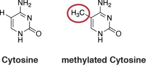
```

<small>
image source: https://www.epigentek.com
<p>
*other contexts observed in neuronal cells

---

# DNA Methylation at CpGs

```{r, out.width = "750px", show=TRUE, fig.align="center", echo=FALSE}
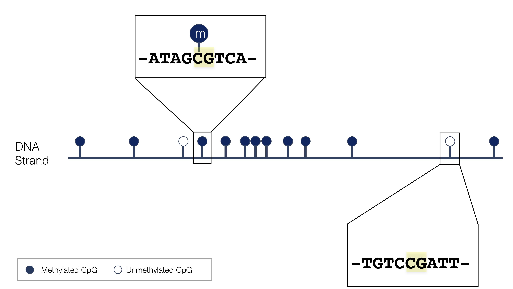
```

~30 Million CpGs in human

---

# The 5th base?

* heritable upon cell division 
     - 5mC added to complementary strand by methyltransferases
* dynamic
     - changes during development and with age
     - can be altered by environmental exposure

```{r, out.width = "725px", show=TRUE, fig.align="center", echo=FALSE}
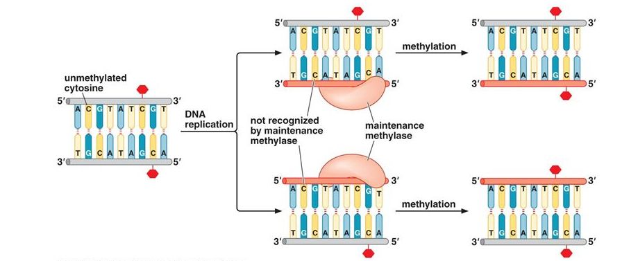
```

<small><small>
image source: https://slideplayer.com/slide/10719924/

---

# Role in gene regulation 

```{r, out.width = "720px", show=TRUE, fig.align="center", echo=FALSE}
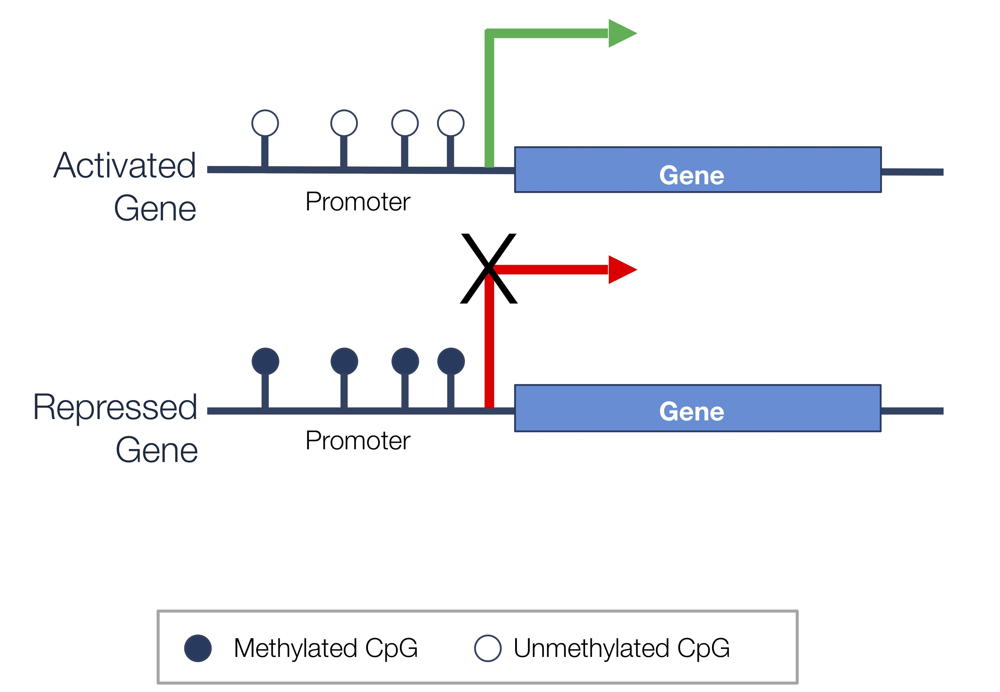
```

---

# Evolution of methylation assays

```{r, out.width = "670px", show=TRUE, fig.align="center", echo=FALSE}
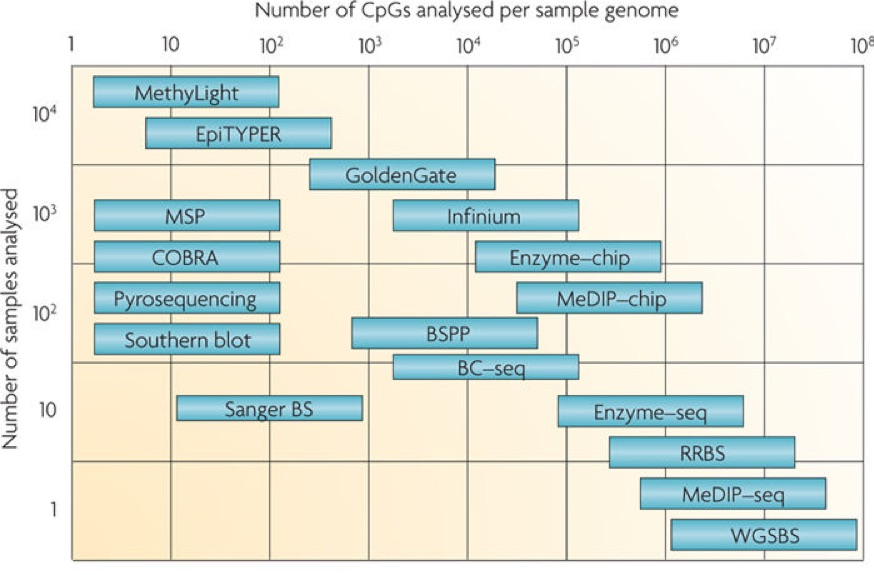
```

<small>
Laird 2010 (https://doi.org/10.1038/nrg2732)

---

## Distinguishing methylated and unmethylated sites

.pull-left[
#### 1. Methylated DNA immunoprecipitation (MeDIP)
* treat fragmented DNA with antibody targeting 5mC
* wash away unbound DNA
* measure extent to which each cytosine is still present (methylated) with **microarray or sequencing**

<small> image source: https://en.wikipedia.org/wiki/Methylated_DNA_immunoprecipitation
]
.pull-right[
```{r, out.width = "300px", show=TRUE, fig.align="center", echo=FALSE}
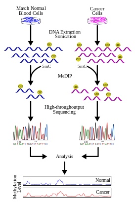
```
]

---

## Distinguishing methylated and unmethylated sites

.pull-left[
#### 2. Bisulfite conversion
* 5mC $\rightarrow$ stays 5mC
* C (not methylated) $\rightarrow$ converted to U
* Sequencing:
    * 5mC read as C
    * C read as T 
* For each C measure fraction of signal corresponding to C vs T with **microarray or sequencing** 
* *Note that can't distinguish between C $\rightarrow$ T mutation and unmethylated C*
]
.pull-right[
```{r, out.width = "450px", show=TRUE, fig.align="center", echo=FALSE}
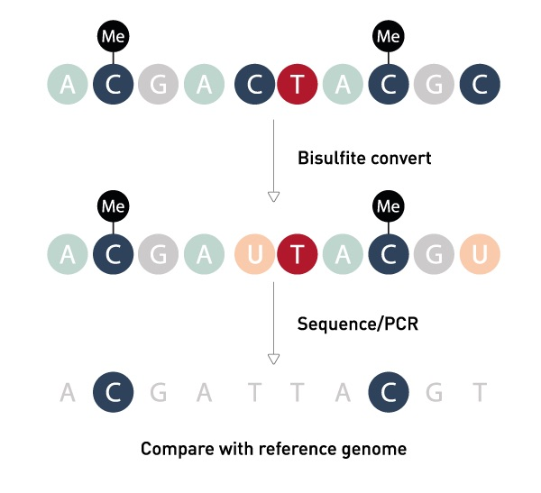
```

<small> image: [https://www.diagenode.com](https://www.diagenode.com/en/categories/bisulfite-conversion)
]

---

## Analysis of MeDIP

.pull-left[
* MeDIP targets **only** methylated DNA
* **MeDIP-chip**: much like gene expression microarrays
* **MeDIP-seq**: differential abundance of counts (similar to RNA-seq)
  * Complication: instead of genes or transcripts, need to define genomic "bins" to count reads over 
  * One option is to use sliding windows: [MEDIPS R package](http://bioconductor.org/packages/MEDIPS/) performs preprocessing and implements `edgeR` to test for differential abundance of each window

<br>
<small>
image source: https://en.wikipedia.org/wiki/Methylated_DNA_immunoprecipitation
]

.pull-right[
```{r, out.width = "300px", show=TRUE, fig.align="center", echo=FALSE}

```
]

---

## Bisulfite conversion arrays (e.g. Infinum 450K, Epic 850K)

.pull-left[
* Most commonly used human methylation arrays use bisulfite conversion
  * 450K / 850K refer to the number of sites probed
* Analysis has similarities to expression microarray analysis
  * Signal is **continuous** (intensity)
  * Moderate throughput: 1-16 samples per array
* Difference: focus on **relative** intensity of methylated vs unmethylated binding affinity
]

.pull-right[

```{r, out.width = "450px", show=TRUE, fig.align="center", echo=FALSE}
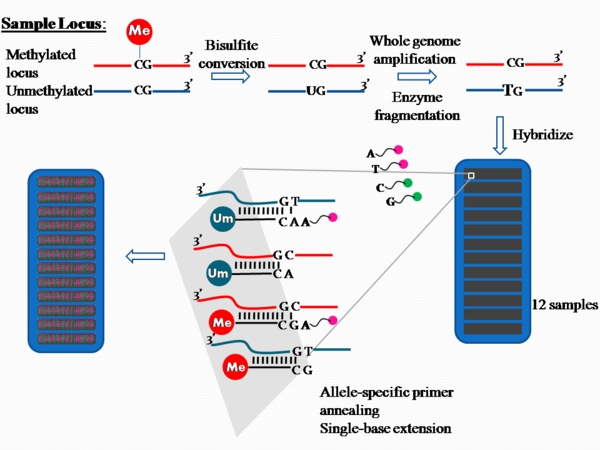
```

<small>
image: https://en.wikipedia.org/wiki/Illumina_Methylation_Assay
]
    
---

class: middle

## Beta values and M values

Need some way to summarize the two relative measures for each probe:
1. methylated intensity
2. unmethylated intensity

---

## Beta $(\beta)$ values 

* Combine two measurements for each probe, and measure level of methylation: $$\beta = \frac{\text{methylated intensity}}{(\text{methylated intensity} + \text{unmeth intensity})}$$
* Range from 0 to 1
* Easily interpretable as a methylation proportion
* Best used for visualization

---

## M-values

* Transformed $\beta$ values: $$M= log_2\big(\frac{\text{methylated intensity}}{\text{unmethylated intensity}}\big) = log_2(\beta/(1-\beta))$$
* This type of transformation is referred to as the *logit*
  * maps a proportion onto real line
* alleviate heteroscedasticity of $\beta$ values (recall that Binomial(n,p) variance = np(1-p))
   
```{r, out.width = "650px", show=TRUE, fig.align="center", echo=FALSE}
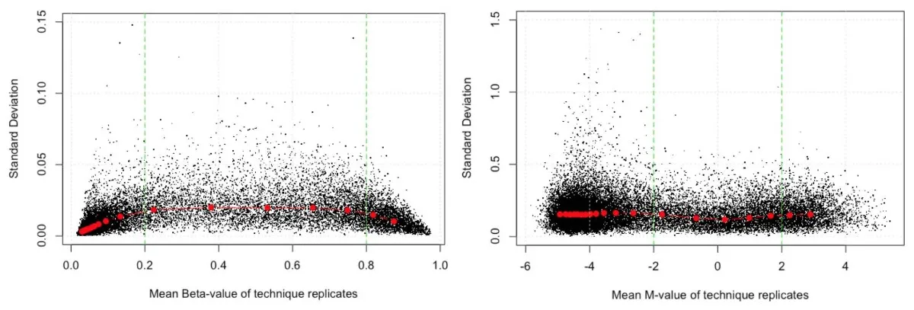
```

<small>
[Du et al. (2010)](https://bmcbioinformatics.biomedcentral.com/articles/10.1186/1471-2105-11-587)
    
---

# Methylation array analysis

* Analysis strategy: linear regression on M-values 
* R Packages: 
   * [minfi](http://bioconductor.org/packages/minfi/) for preprocessing and normalization
   * [limma](http://bioconductor.org/packages/limma/) for individual cytosine analysis
   * [bumphunter](http://bioconductor.org/packages/bumphunter/) for region-level analysis
   * Workflow that combines these: [methylationArrayAnalysis]( 	https://bioconductor.org/packages/methylationArrayAnalysis/) - explore in Seminar 10
    
---

## Example - DNA Methylation in sorted T cells

Data from [Zhang et al. (2013)](https://www.ncbi.nlm.nih.gov/pubmed/23974203)

```{r, echo=FALSE, show=FALSE, message=FALSE, warning=FALSE}
library(minfi)
library(limma)
library(RColorBrewer)
mSet <- readRDS("data/mSet.rds")
targets <- readRDS("data/targets.rds")
```
.smaller[
```{r}
mSet
```
]
---

## Meta data values

```{r}
head(targets[c(1:5)])
table(targets$Sample_Label)
```

---

## Beta values

```{r}
bVals <- getBeta(mSet)
dim(bVals)
head(bVals[,1:5])
```

---

## M values

```{r}
mVals <- getM(mSet)
dim(mVals)
head(mVals[,1:5])
```

---

## Comparing beta and M values

```{r, echo = FALSE,include=TRUE, fig.width=15, fig.height=7}
pal <- brewer.pal(8,"Dark2")
par(mfrow=c(1,2))
densityPlot(bVals, sampGroups=targets$Sample_Group, main="Beta values", 
            legend=FALSE, xlab="Beta values")
legend("top", legend = levels(factor(targets$Sample_Group)), 
       text.col=brewer.pal(8,"Dark2"))
densityPlot(mVals, sampGroups=targets$Sample_Group, main="M-values", 
            legend=FALSE, xlab="M values")
legend("topleft", legend = levels(factor(targets$Sample_Group)), 
       text.col=brewer.pal(8,"Dark2"))

```
---

## Comparing beta and M values

```{r, echo = FALSE,include=TRUE, fig.width=5, fig.height=5, fig.align="center"}
b <- seq(0,1, by=0.0001)
m <- log2(b/(1-b))
plot(b, m, type="l")
```

--

#### Why do we have beta values far from 0 or 1 if methylation is either present or not at each CpG?

---

## Differentially methylated cytosines (DMC)

#### Which cytosines/probes are differentially methylated between naive & activated naive T cells?

.pull-left[
.tiny[
```{r}
# this is the factor of interest
cellType <- factor(targets$Sample_Group)
# this is the individual effect that we need to account for
individual <- factor(targets$Sample_Source) 

# use the above to create a design matrix
design <- model.matrix(~cellType+individual, 
                       data=targets)
colnames(design) <- c(levels(cellType),
                      levels(individual)[-1])
```
]]
.pull-right[
.tiny[
```{r}
design
```
]]

---

## Differential methylation: limma on M-values

Here, the reference is `act_naive` cells

```{r} 
# fit the linear model (one for each probe)
mfit <- lmFit(mVals, design)
cfit <- eBayes(mfit)

# look at top DM CpGs between naive and ref (act_naive)
topTable(cfit, coef="naive")
```

---

## Summary for all coefficients 

Significant tests (BH-adjusted p-value less than 0.05) of the null hypotheses: each coefficient equal to zero

```{r}
# look at the numbers of DM CpGs at FDR < 0.05
summary(decideTests(cfit))
```

Note that the first column tests whether the reference group (`act_naive`) has an M value of zero (not usually of interest)

---

## Interpretation of parameters and effect sizes

* Our previous model gives parameter estimates for differences in M values $\alpha$
* To interpret on the scale of methylation proportions, need to back-transform:
  * Recall: $M= log_2\big(\frac{\text{methylated intensity}}{\text{unmethylated intensity}}\big) = log_2(\beta/(1-\beta))$
 * Solving for beta gives $\beta = \frac{2^M}{(1+2^M)}$


```{r}
(M <- cfit$coefficients["cg15459165", "naive"])
2^M/(1+2^M)
```
---

## Summary of array DMC analysis

  
* **Just like for limma analysis of gene expression microarray**: Can use additive models, models with interactions, continuous and categorical variables

  * **interpretation of hypothesis tests, contrasts** with `makeContrasts` (for other comparisons not represented by coefficients in our design matrix): follows as before
  
  * **interpretation of parameters/effect sizes**: keep in mind that M-values are *transformed* proportions

--

* Annotation packages (e.g. `IlluminaHumanMethylation450kanno.ilmn12.hg19`) allow for adding information about each CpG 
  * chromosome and position
  * strand
  * whether in CpG Island

---

## Bisulfite sequencing

* Sequencing of bisulfite-converted DNA

* **WGBS** = whole-genome bisulfite sequencing

* **RRBS** = reduced representation bisulfite sequening (targets similar regions to methylation arrays e.g. islands)

* Pros: base-pair resolution; WGBS measures all CpGs

* Con: expensive (WGBS cost is on the order of whole genome DNA sequencing)

 
---

## Bisulfite sequencing

```{r, out.width = "1000px", show=TRUE, fig.align="center", echo=FALSE}
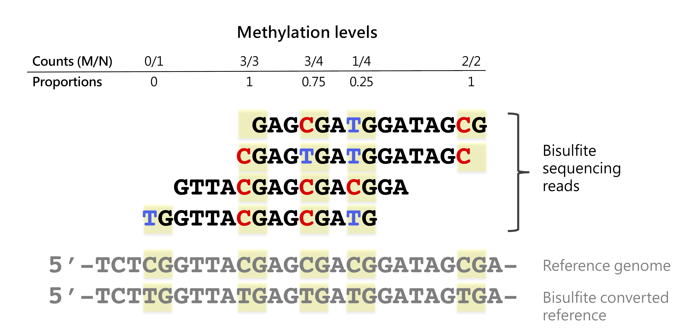
```

---

## Analysis of bisulfite sequencing

.pull-left[
* BS assays (e.g. WGBS, RRBS) yield base-level counts of methylated $(M \text{counts})$ and ununmethylated $(U \text{counts})$ reads

* Differential methylation analysis quantifies significance of differences in proportion of methylated reads $(\frac{M}{M+U})$

* R Packages: 
    * [bsseq](http://bioconductor.org/packages/bsseq/): "BSmooth" - smoothed t-test
    * [dss](http://bioconductor.org/packages/dss/): approximate beta-binomial regression
    * [dmrseq](http://bioconductor.org/packages/dmrseq/): approximate beta-binomial regression over regions
]
.pull-right[
```{r, out.width = "200px", show=TRUE, fig.align="center", echo=FALSE,fig.show='hold'}
knitr::include_graphics(c("./img/bsseq.jpg", "./img/dmrseqhex.jpg"))
```
]
---

## BSmooth: t-test on smoothed methylation proportions

* **Key idea:** methylation levels of nearby CpGs are correlated

  * use locally weighted polynomial regression values (lowess) to obtain smoothed estimate of methylation difference 
  
  * similarly, obtain smoothed location-dependent standard deviation  
  
* Compute t-test using smoothed quantities


```{r, out.width = "900px", show=TRUE, fig.align="center", echo=FALSE,fig.show='hold'}
knitr::include_graphics("img/bsmooth.jpg")
```
<small>[Hansen, et al. 2012](https://genomebiology.biomedcentral.com/articles/10.1186/gb-2012-13-10-r83#Sec8)
  - Red line: 35x coverage
  - Black line: subsampled to 5x coverage

---

## Modeling count nature of bisulfite reads 

* For cytosine $i$ and sample $j$ in condition $s$, we have:

  * $M_{ij}$ reads corresponding to methylation

  * $N_{ij}$ total reads 

* Let $p_s$ be the methylation probability in condition $s$

--

* Let $M_{ij} \sim Binom(N_{ij}, p_{s})$ for $j \in s$

--

* How to test whether $p_1 = p_2$ (and optionally adjust for covariates)?

---

## Binomial (Logisitic) regression

- Generalized linear model for probability of success $p$: $$logit(p)=log\Big(\frac{p}{1-p}\Big) = \boldsymbol{X\beta}$$
--

- Link function $g(p) = log\big(\frac{p}{1-p}\big)$ describes relationship between mean parameter of response and linear predictor

--

- No closed form; fit with iterative ML estimation

--

- Interpret coefficients on original scale with inverse link function $g^{-1}$: $$ p = \frac{e^{\boldsymbol{X\beta}}}{1+e^{\boldsymbol{X\beta}}} $$

--


- In R: `glm(cbind(successes, failures) ~ x, family="binomial")`

---

## Other link functions for GLM

```{r, out.width = "300px", fig.align="center", echo=FALSE}
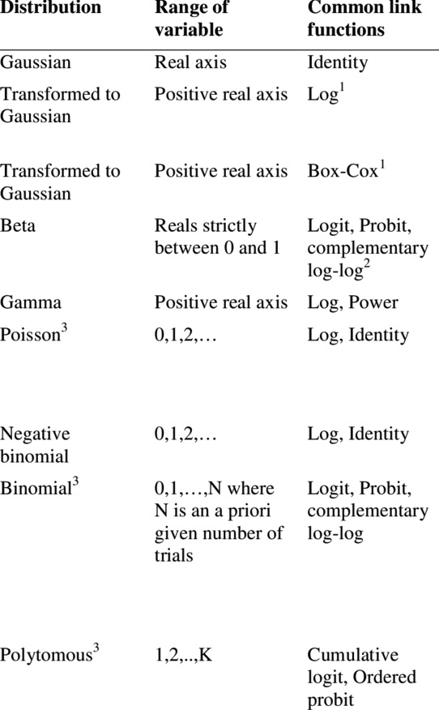
```
Thiele & Markussen 2012 (https://doi.org/10.1079/PAVSNNR20127016)

---

## Why logit transformation?

```{r, fig.width = 4.5, fig.height=4.5, show=TRUE, fig.align="center", echo =FALSE}
p <- sort(c(seq(0,0.01, by=1e-5), seq(0,1,by=0.01), seq(0.99,1, by=1e-5)))
plot(p, log(p/(1-p)), type = "l", ylab = "transformed", ylim=c(-5,5))
```

* Same idea as M-value (though M-value uses log base 2 instead of natural log by convention):
    * Transforms methylation proportions to the real line
    * Mitigate heteroscedasticity

---

## Binomial regression with overdispersion

- In ordinary logistic regression, $p$ is assumed to be constant for all samples with in group

--

- To model *overdispersion* (additional biological variability), allow this quantity to vary

--

- For example, let $$p \sim Beta(\alpha, \beta)$$ $$M \sim Binom(N, p)$$

--

- This is the **Beta-Binomial** distribution

  - Mean of M $= \frac{n\alpha}{\alpha + \beta} = n\pi$
  
  - Variance of M $= \pi(1-\pi)(1 + (N - 1)\phi)$ 

  - where $\phi$ is the overdispersion parameter: $\phi = \frac{1}{\alpha + \beta + 1}$

--

- In R: `aod::betabin(cbind(successes,failures) ~ x, ~ x)`
 
---


## Pitfalls of binomial regression 

- What happens to logit link function $log\big(\frac{p}{1-p}\big)$ if $p=0$ or $1$?

--
    - binomial regression unstable for fully methylated or unmethylated cytosines
    
--

- Computationally intensive to fit model at every cytosine

--

- DSS: Park & Wu 2016 (https://doi.org/10.1093/bioinformatics/btw026)
    - Differential methylation under general experimental design
    - Alternate link function: $arcsine(2p-1)$
    - Approximate fitting with Generalized Least Squares (GLS) 

---


## Generalized Least Squares (GLS) in a nutshell

- Hybrid of **linear regression** and **generalized linear model**

- **Pro**: stable & closed form estimates (fast)

- **Con**: approximate

- **Key idea**: flexible covariance structure allows for specification of approximate beta-binomial error

---

## DMCs vs DMRs

* Depending on the biological question, it might not make sense to only test *individual* CpGs (DMCs)

* If instead differences occur across groups of nearby CpGs, we call them differentially methylated regions (DMRs)

  * Methylation of nearby CpGs is correlated
  
  * Individual CpGs are not thought to act independently (e.g. are regulated in tandem)

---


## Individual cytosine differences

```{r, out.width = "900px", show=TRUE, echo=FALSE}
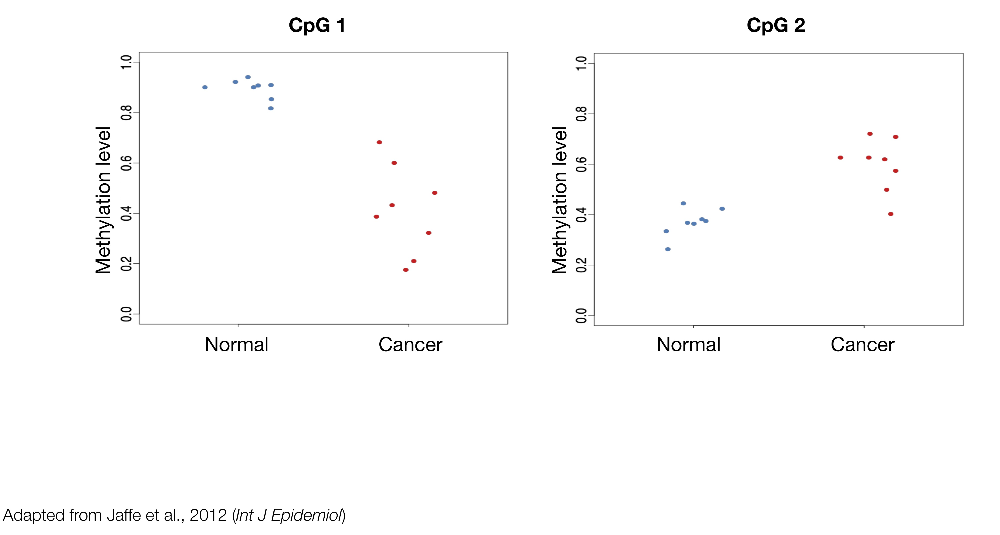
```

---


## CpG 1 

```{r, out.width = "800px", show=TRUE, echo=FALSE}
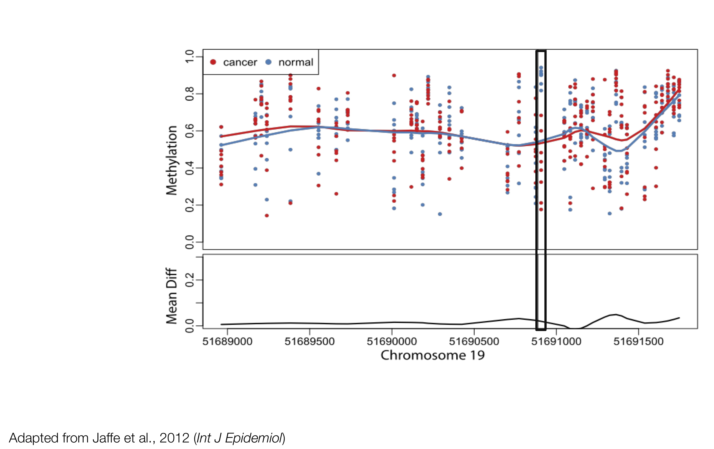
```

---


## CpG 2 

```{r, out.width = "800px", show=TRUE, echo=FALSE}
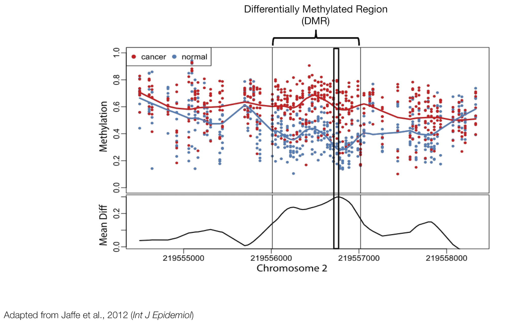
```

---

## Previous approaches: grouping significant CpGs

```{r, out.width = "900px", show=TRUE, fig.align="center", echo=FALSE}
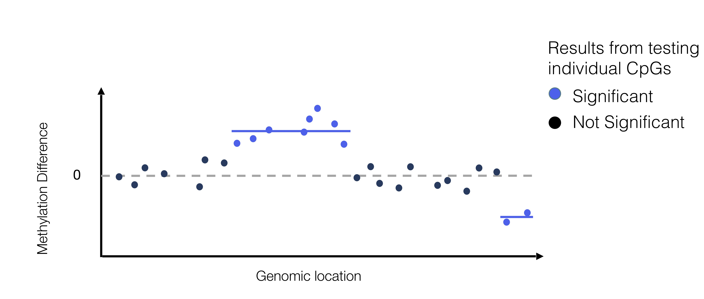
```

Examples: BSmooth ([Hansen et al. 2012](https://doi.org/10.1186/gb-2012-13-10-r83)), DSS ([Park et al. 2016](https://doi.org/10.1093/bioinformatics/btw026))

---


## FDR at the region level

```{r, out.width = "900px", show=TRUE, fig.align="center", echo=FALSE}
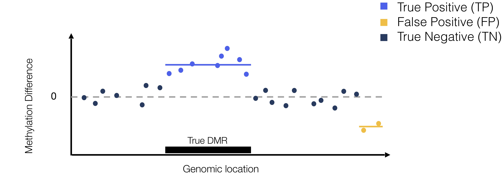
```

$$ \text{False Discovery Rate (FDR)} = E\Big[\frac{FP}{FP + TP}\Big]$$
--

- $FDR_{CpG} = 2/10 = 0.20$
--

- $FDR_{DMR} = 1/2 = 0.50$

---


## Accurate inference of DMRs

- Korthauer et al. 2019 (https://doi.org/10.1093/biostatistics/kxy007)

- Key ideas: 
    - model methylation signal over region to account for correlated signal
    - permutation to acheive accurate FDR control
    
- Implemented in the [dmrseq](http://bioconductor.org/packages/dmrseq/) Bioconductor package
    
```{r, out.width = "200px", show=TRUE, fig.align="center", echo=FALSE}

```

---

## dmrseq: 2-stage approach

```{r, out.width = "800px", show=TRUE, fig.align="center", echo=FALSE}
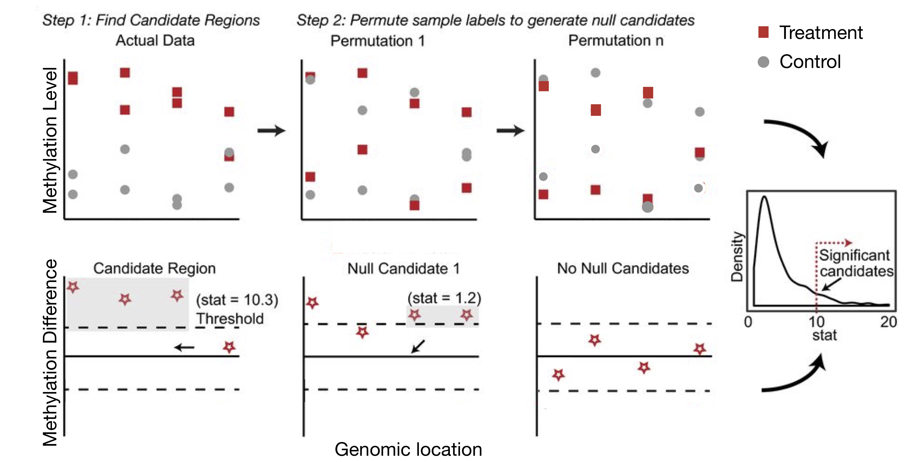
```

---

## dmrseq output

```{r, out.width = "800px", show=TRUE, fig.align="center", echo=FALSE}
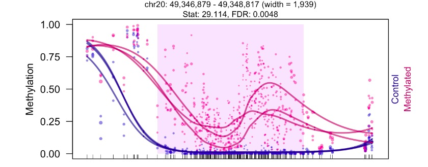
```

- *de novo* regions with FDR estimate
- ranked by effect size of methylation difference
- can adjust for covariates 

---

## What's changing: methylation or cell type composition?

```{r, out.width = "750px", show=TRUE, echo=FALSE, fig.align="center"}
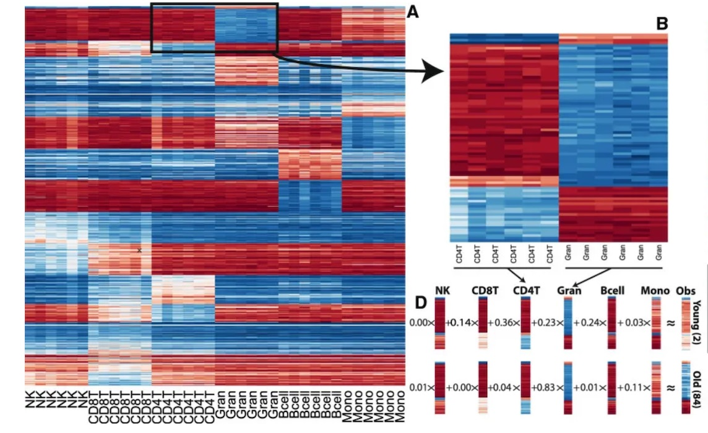
```

<small> image: [Jaffe & Irizarry 2014](https://genomebiology.biomedcentral.com/articles/10.1186/gb-2014-15-2-r31)

---

## Cell type composition confounding

```{r, out.width = "600px", show=TRUE, echo=FALSE, fig.align="center"}
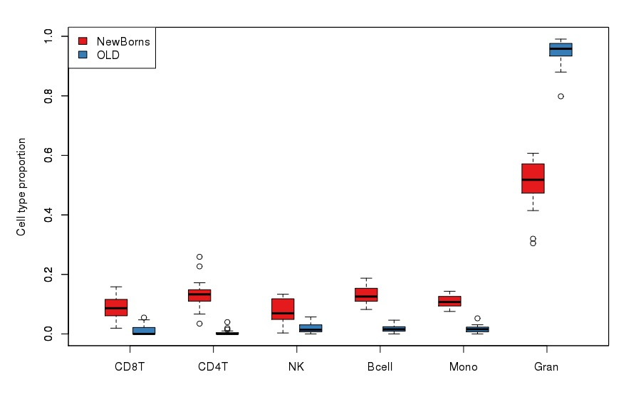
```

<small> image: [methylationArrayAnalysis](https://bioconductor.org/packages/methylationArrayAnalysis/)

Can estimate cell type composition with models built on purified cell type methylation data (not always available)
